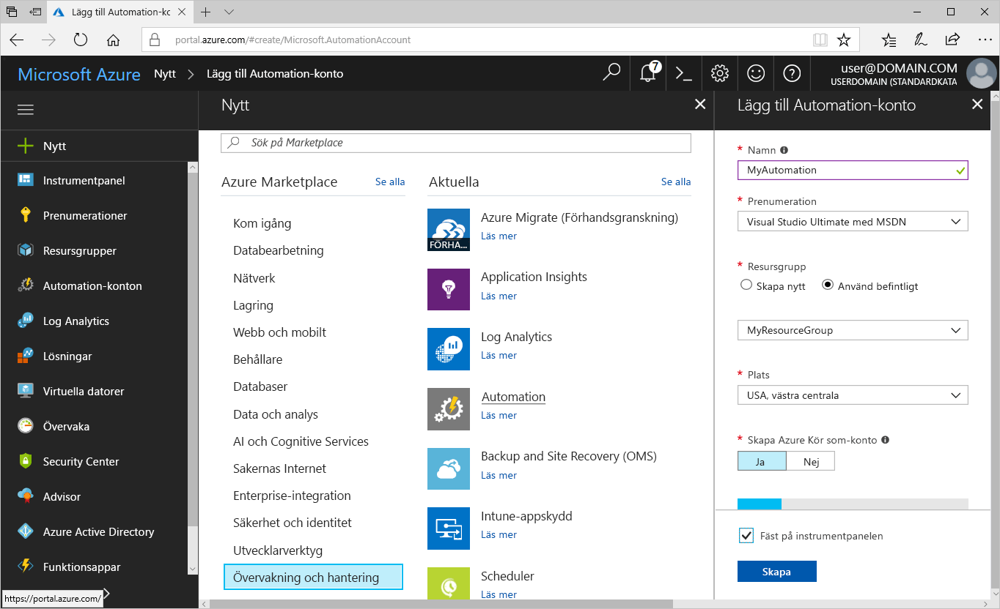
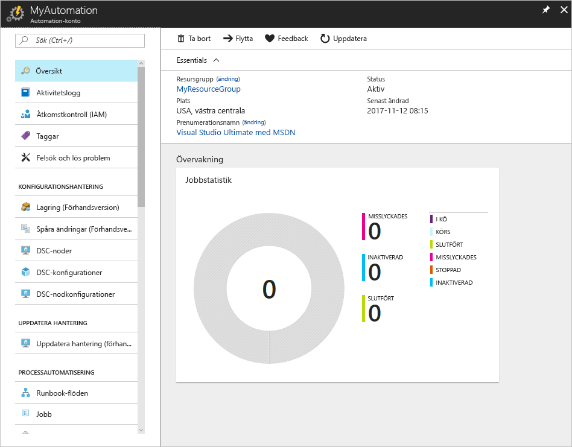
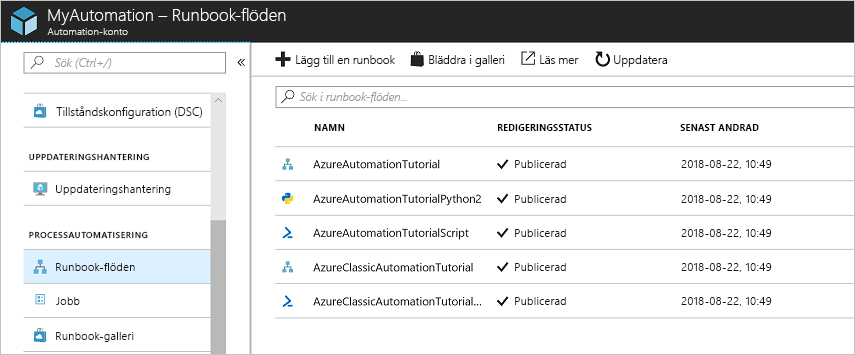
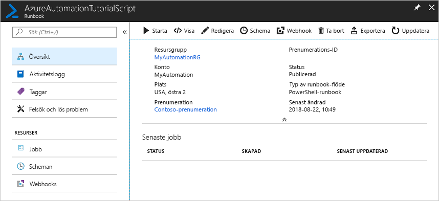
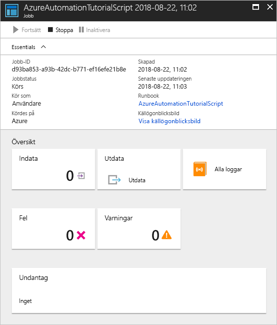

# Skapa ett Azure Automation-konto

Azure Automation-konton kan skapas via Azure. Den här metoden ger ett webbläsarbaserat användargränssnitt för att skapa och konfigurera Automation-konton och relaterade resurser. Den här snabbstarten går igenom hur du skapar ett Automation-konto och kör en runbook i kontot.

Om du inte har en Azure-prenumeration kan du skapa ett [kostnadsfritt Azure-konto](https://azure.microsoft.com/free/?WT.mc_id=A261C142F) innan du börjar.

## Logga in på Azure

Logga in till Azure på https://portal.azure.com

## Skapa ett Automation-konto

1. Klicka på knappen **Skapa en resurs** längst upp till vänster i Azure.

1. Välj **Övervakning + Hantering** och sedan **Automation**.

1. Ange kontoinformation. För **Skapa Kör som-konto i Azure**, väljer du **Ja** så att artefakterna för att förenkla autentisering till Azure aktiveras automatiskt. När du är färdig klickar du på **Skapa** för att starta distributionen av Automation-kontot.

      

1. Automation-kontot fästs på Azure-instrumentpanelen. När distributionen är klar öppnas översikten över Automation-kontot automatiskt.

    

## Kör en runbook

Kör en självstudierunbook.

1. Klicka på **Runbooks** under **PROCESSAUTOMATISERING**. En lista med runbooks visas. Som standard är flera självstudierunbooks aktiverade i kontot.

    

1. Välj följande runbook: **AzureAutomationTutorialScript**. Den här åtgärden öppnar sidan för runbook-översikt.

    

1. Klicka på **Starta** och på sidan **Starta Runbook** klickar du på **OK** för att starta en runbook.

    

1. Efter **Jobbstatus** ändrats till **Körs** klickar du på **Utdata** eller **Alla loggar** för att se utdata för runbook-jobbet. För denna självstudierunbook är utdata en lista över dina Azure-resurser.

## Rensa resurser

Ta bort resursgruppen, Automation-kontot och alla relaterade resurser när de inte längre behövs. Om du vill göra det väljer du resursgruppen för det Automation-kontot och klickar på **Ta bort**.

## Nästa steg

I den här snabbstarten har du distribuerat ett Automation-konto, startat ett runbook-jobb och sett jobbresultaten. Om du vill veta mer om Azure Automation kan du fortsätta att använda snabbstarten för att skapa din första runbook.

> [!div class="nextstepaction"]
> [Snabbstart för Automation – Skapa Runbook](./automation-quickstart-create-runbook.md)
