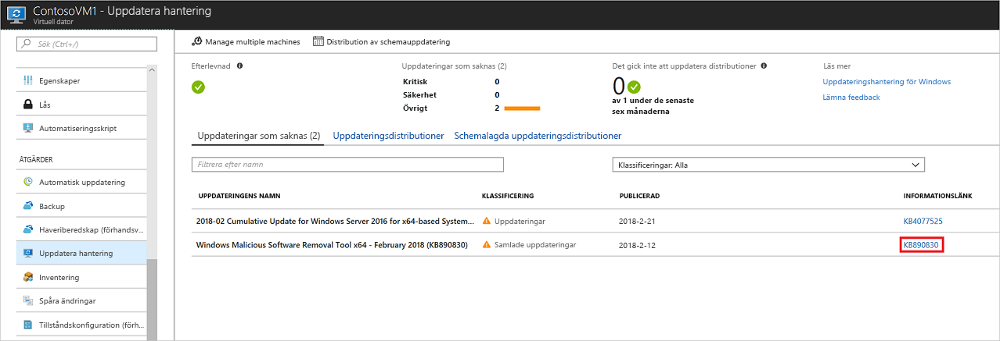
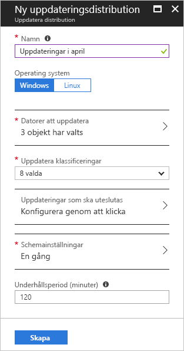
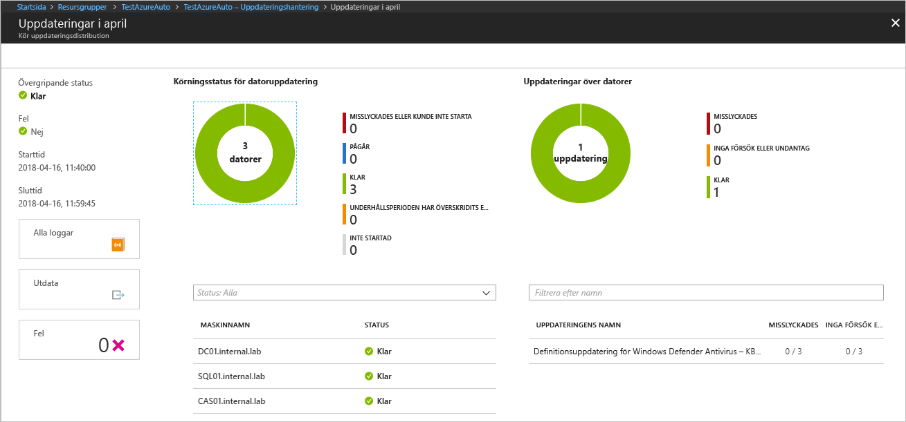

# <a name="manage-windows-updates-with-azure-automation"></a>Hantera Windows-uppdateringar med Azure Automation

Med Uppdateringshantering kan du hantera uppdateringar och korrigeringar för dina virtuella datorer.
I den här självstudien får du lära dig hur du utvärderar statusen för tillgängliga uppdateringar snabbt, planerar installation av uppdateringar som krävs, granskar distributionsresultat och skapar en avisering för att verifiera uppdateringar.

Prisinformation finns i [Automation-priser för uppdateringshantering](https://azure.microsoft.com/pricing/details/automation/)

I den här guiden får du lära dig att:

> [!div class="checklist"]
> * Publicera en virtuell dator för hantering av uppdateringar
> * Visa en uppdateringsbedömning
> * Konfigurera aviseringar
> * Schemalägga en uppdateringsdistribution
> * Visa resultatet av en distribution

## <a name="prerequisites"></a>Nödvändiga komponenter

För att slutföra den här kursen behöver du:

* En Azure-prenumeration. Om du inte redan har ett konto kan du [aktivera dina månatliga Azure-krediter för Visual Studio-prenumeranter ](https://azure.microsoft.com/pricing/member-offers/msdn-benefits-details/) eller registrera dig för ett [kostnadsfritt konto](https://azure.microsoft.com/free/?WT.mc_id=A261C142F).
* Ett [Automation-konto](automation-offering-get-started.md) för bevakaren och åtgärdsrunbooks och bevakaraktiviteten.
* En [virtuell dator](../virtual-machines/windows/quick-create-portal.md) som du vill publicera.

## <a name="log-in-to-azure"></a>Logga in på Azure

Logga in på Azure Portal på https://portal.azure.com.

## <a name="enable-update-management"></a>Aktivera uppdateringshantering

Först måste du aktivera uppdateringshantering på din virtuella datorn för att kunna genomföra den här självstudien.

1. Från Azure Portal, på menyn till vänster, väljer du **Virtuella datorer** och väljer en virtuell dator från listan
2. Från VM-sidan klickar du på **Uppdateringshantering** under avsnittet **Åtgärder**. Sidan **Aktivera hantering av uppdateringar** öppnas.

Verifieringen utförs för att fastställa om uppdateringshantering är aktiverat för den här virtuella datorn. Verifieringen söker efter en Log Analytics-arbetsyta och ett länkat Automation-konto, och om lösningen för uppdateringshantering är i arbetsytan.

En [Log Analytics](../log-analytics/log-analytics-overview.md?toc=%2fazure%2fautomation%2ftoc.json)-arbetsyta används för att samla in data som genereras av funktioner och tjänster som uppdateringshantering. Arbetsytan tillhandahåller en enda plats för att granska och analysera data från flera källor.

Verifieringsprocessen kontrollerar också om den virtuella datorn har etablerats med MMA och Automation Hybrid Runbook Worker.
Den här agenten används för att kommunicera med Azure Automation och hämta information om uppdateringsstatus. Agenten kräver att port 443 till öppnas för att kommunicera med Azure Automation-tjänsten och för att ladda ner uppdateringar.

Om några av följande krav saknades under publiceringen läggs de till automatiskt:

* [Log Analytics](../log-analytics/log-analytics-overview.md?toc=%2fazure%2fautomation%2ftoc.json)-arbetsyta
* [Automation-konto](./automation-offering-get-started.md)
* En [Hybrid runbook worker](./automation-hybrid-runbook-worker.md) aktiveras på den virtuella datorn

Skärmen **Uppdateringshantering** öppnas. Konfigurera platsen, Log Analytics-arbetsytan och Automation-kontot som ska användas och klicka på **Aktivera**. Om fälten är nedtonade betyder det att någon annan automatiseringslösning är aktiverad för den virtuella datorn, och samma arbetsyta och Automation-konto måste användas.


Det kan ta några minuter att aktivera lösningen. Under tiden ska du inte stänga webbläsaren.
När lösningen har aktiverats flödar information om saknade uppdateringar på den virtuella datorn till Log Analytics.
Det kan ta mellan 30 minuter och 6 timmar innan data blir tillgängliga för analys.

## <a name="view-update-assessment"></a>Visa kontroll av uppdateringar

När **uppdateringshantering** är aktiverat visas skärmen **Hantering av uppdateringar**.
Om några uppdateringar saknar ser du en lista med uppdateringar som saknas på fliken  **Uppdateringar som saknas**.

Välj **INFORMATIONSLÄNKEN** för uppdateringen för att öppna supportartikeln för uppdateringen i ett nytt fönster. Här kan du få viktig information om uppdateringen.



Om du klickar någon annanstans i uppdateringen öppnas fönstret **Loggsökning** för den valda uppdateringen. Frågan för loggsökningen är fördefinierad för den specifika uppdateringen. Du kan ändra den här frågan eller skapa en egen fråga om du vill visa detaljerad information om uppdateringarna som har distribuerats eller som saknas i din miljö.


## <a name="configure-alerting"></a>Konfigurera aviseringar

I det här steget konfigurerar du en avisering för att meddela när uppdateringar har distribuerats. Aviseringen som du skapar baseras på en Log Analytics-fråga. En anpassad fråga kan skrivas för ytterligare aviseringar och omfattar många olika scenarier. I Azure Portal går du till **Övervaka** och klickar på **Skapa avisering**. Då öppnas sidan **Skapa regel**.

Under **1. Definiera aviseringstillstånd** , klicka på **+ Välj mål**. Under **Filtrera efter resurstyp** väljer du **Log Analytics**. Välj Log Analytics-arbetsytan och klicka på **Klar**.


Klicka på knappen **+ Lägg till kriterier** för att öppna sidan **Konfigurera signallogiken**. Välj **Anpassad loggsökning** i tabellen. Ange sedan följande fråga i textrutan **Sökfråga**. Den här frågan returnerar datorer och uppdateringens körnamn som slutförts under den tidsperiod som angetts.

```loganalytics
UpdateRunProgress
| where InstallationStatus == 'Succeeded'
| where TimeGenerated > now(-10m)
| summarize by UpdateRunName, Computer
```

Ange **1** som **Tröskelvärde** för aviseringslogiken. Klicka på **Klar** när du är klar.


Under **2. Definiera aviseringsinformation**, ge aviseringen ett eget namn och en beskrivning. Ange **Allvarlighetsgrad** till **Informational(Sev 2)** eftersom aviseringen är en lyckad körning.


Under **3. Definiera åtgärdsgrupp**, klicka på **+ Ny åtgärdsgrupp**. En åtgärdsgrupp är en grupp av åtgärder som kan användas i flera aviseringar. Dessa kan inkludera, men är inte begränsade till, e-postmeddelanden, runbooks, webhooks och mycket mer. Läs mer om åtgärdsgrupper i [Skapa och hantera åtgärdsgrupper](../monitoring-and-diagnostics/monitoring-action-groups.md)

I rutan **Åtgärdsgruppnamn** ge ett eget namn och ett kort namn. Det korta namnet används i stället för ett fullständigt åtgärdsgruppnamn när meddelanden skickas med den här gruppen.

Under **Åtgärder**, ge åtgärden ett eget namn som **e-postmeddelanden** under **ÅTGÄRDSTYP** välj **e-post/SMS/Push/röst**. Under **INFORMATION** väljer du **Redigera detaljer**.

På sidan **e-post/SMS/Push/röst**, ge den ett namn. Markera kryssrutan **e-post** och ange en giltig e-postadress som ska användas.


Klicka på **OK** på sidan **e-post/SMS/Push/röst** för att stänga den och klicka på **OK** att stänga sidan **Lägg till åtgärdsgrupp**.

Du kan anpassa ämnet för e-postmeddelandet som skickats genom att klicka på **e-postmeddelandets ämne** under **Anpassa åtgärder** på sidan **Skapa regel**. Klicka på **Skapa aviseringsregel** när du är klar. Detta skapar en regel som aviserar när en distribution lyckas och vilka datorer som var en del av denna uppdaterade distributionskörning.

## <a name="schedule-an-update-deployment"></a>Schemalägga en uppdateringsdistribution

Nu när aviseringen är konfigurerad, schemalägger du en distribution som passar ditt schema och servicefönster för att installera uppdateringar.
Du kan välja vilka uppdateringstyper som ska tas med i distributionen.
Du kan till exempel ta med kritiska uppdateringar eller säkerhetsuppdateringar och exkludera samlade uppdateringar.

> [!WARNING]
> När uppdateringar kräver en omstart startas den virtuella datorn om automatiskt.

Schemalägg en ny uppdateringsdistribution för den virtuella datorn genom att gå tillbaka till **Uppdateringshantering** och välj **Distribution av schemauppdatering** längst upp på skärmen.

På skärmen **Ny uppdateringsdistribution** anger du följande information:

* **Namn** – Ange ett unikt namn på uppdateringsdistributionen.

* **Operativsystem** – Välj operativsystem som mål för uppdateringsdistributionen.

* **Uppdatera klassificering** – Välj vilka typer av programvara som ska tas med i uppdateringsdistributionen. Låt alla typer vara markerade för den här självstudien.

  Klassificeringstyper:

   |Operativsystem  |Typ  |
   |---------|---------|
   |Windows     | Kritiska uppdateringar</br>Säkerhetsuppdateringar</br>Samlade uppdateringar</br>Funktionspaket</br>Service pack</br>Definitionsuppdateringar</br>Verktyg</br>Uppdateringar        |
   |Linux     | Kritiska uppdateringar och säkerhetsuppdateringar</br>Övriga uppdateringar       |

   En beskrivning av klassificeringstyper finns i [uppdatera klassificeringar](automation-update-management.md#update-classifications).

* **Schemainställningar** – Öppnar sidan Schemainställningar. Starttiden är som standard 30 minuter efter den aktuella tiden. Det kan ställas in till vad som helst från 10 minuter i framtiden.

   Du kan också ange om distributionen ska ske en gång eller ange ett schema med återkommande tider.
   Välj **När** under **Återkommande**. Låt standardvärdet stå kvar på 1 och klicka på **OK**. Då ställs ett återkommande schema in.

* **Underhållsperiod (minuter)** – Låt standardvärdet stå kvar. Du kan ange den tidsperiod som uppdateringsdistributionen ska utföras inom. Den här inställningen hjälper till att säkerställa att ändringarna utförs inom ditt definierade servicefönster.



När du har slutfört konfigurationen av schemat klickar du på knappen **Skapa**. Du kommer tillbaka till statusinstrumentpanelen. Välj **Schemalagda uppdateringsdistributioner** om du vill visa distributionsschemat du har skapat.

## <a name="view-results-of-an-update-deployment"></a>Visa resultat för en uppdateringsdistribution

När den schemalagda distributionen startar kan du se status för distributionen på fliken **Uppdateringsdistributioner** på skärmen **Uppdateringshantering**.
Om distributionen körs visas status **Pågår**.
När distributionen har slutförts ändras status till **Lyckades**.
Om det uppstod några fel med en eller flera uppdateringar i distributionen visas status **Misslyckades delvis**.
Klicka på den slutförda uppdateringsdistributionen för att visa instrumentpanelen för distributionen.



På panelen för **uppdateringsresultat** visas en sammanfattning av det totala antalet uppdateringar och distributionsresultat för den virtuella datorn.
Tabellen till höger visar detaljer för varje uppdatering och installationsresultaten.
I följande lista visas tillgängliga värden:

* **Inget försök har gjorts** – Uppdateringen installerades inte eftersom det inte fanns tillräckligt med tid utifrån det underhållsfönster som definierats.
* **Lyckades** – Uppdateringen lyckades
* **Misslyckades** – Uppdateringen misslyckades

Klicka på **Alla loggar** om du vill se alla loggposter som har skapats för distributionen.

Klicka på panelen **Utdata** om du vill se jobbströmmen för den runbook som ansvarar för att hantera uppdateringsdistributionen på den virtuella måldatorn.

Klicka på **Fel** om du vill se detaljerad information om fel som uppstått vid distributionen.

När uppdateringsdistributionen av är klar skickas e-post som liknar följande bild för att visa resultatet av distributionen.


## <a name="next-steps"></a>Nästa steg

I den här självstudiekursen lärde du dig att:

> [!div class="checklist"]
> * Publicera en virtuell dator för hantering av uppdateringar
> * Visa en uppdateringsbedömning
> * Konfigurera aviseringar
> * Schemalägga en uppdateringsdistribution
> * Visa resultatet av en distribution

Fortsätt till översikten för uppdateringshanteringslösningen.

> [!div class="nextstepaction"]
> [Uppdateringshanteringslösning](../operations-management-suite/oms-solution-update-management.md?toc=%2fazure%2fautomation%2ftoc.json)
