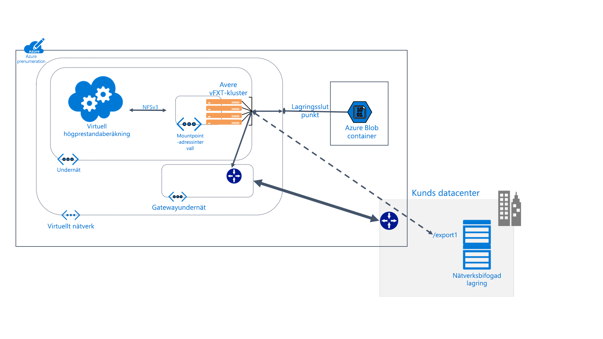

# Vad är Avere vFXT för Azure?

Avere vFXT för Azure är cachelagringslösning för filsystem för dataintensiva HPC-uppgifter (databehandling med höga prestanda). Du kan dra nytta av molnets skalbarhet för att göra dina data tillgängliga vid den tid och på den plats de behövs – även för data som lagras på din lokala maskinvara.

Avere vFXT stöder följande vanliga databehandlingsscenarier:

* Hybrid moln arkitektur – aver vFXT för Azure kan arbeta med ett maskin varu lagrings system, vilket ger fördelarna med molnbaserad data behandling utan att behöva flytta filer.

* Cloud bursting – aver vFXT för Azure kan hjälpa dig att flytta dina data till molnet för ett enskilt projekt eller "lyft och Shift" hela arbets flödet permanent.

Aver vFXT for Azure passar bäst för följande situationer:

* Läsintensiva åtgärder för HPC-arbetsbelastningar
* Program som använder vanligt NFS-protokoll
* Servergrupper med 1 000 till 40 000 CPU-kärnor
* Integrering med lokal maskinvaru-NAS, Azure Blob Storage eller båda

Mer information finns på <https://azure.microsoft.com/services/storage/avere-vfxt/>

## Vilka använder Avere vFXT för Azure?

Avere vFXT kan hjälpa till med alla typer av läsintensiva databehandlingsuppgifter:

### Rendering av visuella effekter

Inom media och underhållning kan Avere vFXT-klustret påskynda dataåtkomsten för tidskritiska renderingsprojekt. Eftersom du kan lägga till mer cacheutrymme och fler beräkningsnoder i Azure har du flexibiliteten att hantera stora projekt effektivt.

### Biovetenskap

Aver vFXT gör det möjligt för forskare att köra sekundära analys arbets flöden i Azure Compute och få åtkomst till genomiks data oavsett var de befinner sig.

I farmaceutiska forsknings-och vFXT-kluster kan du påskynda identifiering av narkotika genom att hjälpa forskare förutsäga interaktioner mellan läkemedel och analysera forsknings data.

### Analyser för ekonomiska tjänster

Ett Avere vFXT-kluster kan hjälpa till med snabbare beräkningar för kvantitativa analyser, vilket ger finansföretag bättre information för att fatta strategiska beslut.

## Funktioner och specifikationer

Avere vFXT-systemet utgörs av minst tre virtuella Edge Filer-noder, konfigurerade i ett kluster. Det kan finnas nära klientdatorerna, som monterar klustret istället för att montera lagringsutrymmet direkt.

Avere vFXT-klustret cachelagrar filerna när de begärs. Upprepade begäranden kan hanteras från cachen i drygt 80 procent av gångerna.

### Kompatibilitet

* Kompatibelt med NAS-maskinvarusystem från NetApp eller Dell EMC Isilon
* Kompatibelt med Azure Blob
* Använder NFSv3- eller SMB2-protokoll

AVERT vFXT för Azure använder följande Azure-resurser:

|Azure-komponent| Resurs |
|----------|-----------|
|Virtuella datorer|3 eller flera E32s_v3|
|Premium SSD-lagring|200 GB OS-utrymme plus 1 TB till 4 TB cacheutrymme per nod |
|Lagringskonto (valfritt) |v2|
|Data backend-lagring (valfritt) | En tom LRS Blob-container |

## Nästa steg

Läs de här artiklarna för att planera och skapa en egen aver-vFXT för Azure-distribution.

* [Planera systemet](avere-vfxt-deploy-plan.md)
* [Distributionsöversikt](avere-vfxt-deploy-overview.md)
* [Skapa vFXT](avere-vfxt-deploy.md)
