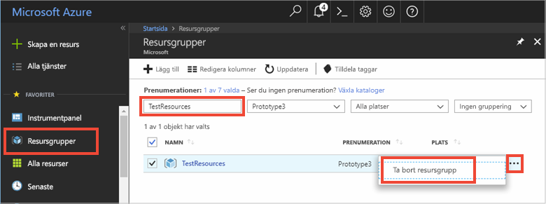

# <a name="quickstart-use-azure-cache-for-redis-in-net-framework"></a>Snabb start: Använd Azure cache för Redis i .NET Framework

I den här snabb starten införlivar du Azure cache för Redis i en .NET Framework-app för att få åtkomst till en säker, dedikerad cache som är tillgänglig från alla program i Azure. Du använder särskilt [stackexchange. Redis](https://github.com/StackExchange/StackExchange.Redis) -klienten med C#-kod i en .net-konsol app.

## <a name="prerequisites"></a>Förutsättningar

- Azure-prenumeration – [skapa en kostnads fritt](https://azure.microsoft.com/free/)
- [Visual Studio 2019](https://www.visualstudio.com/downloads/)
- [.NET Framework 4 eller högre](https://www.microsoft.com/net/download/dotnet-framework-runtime), vilket krävs av klienten stackexchange. Redis.

## <a name="create-a-cache"></a>Skapa en cache
[!INCLUDE [redis-cache-create](../../includes/redis-cache-create.md)]

[!INCLUDE [redis-cache-access-keys](../../includes/redis-cache-access-keys.md)]

Skapa en fil på datorn med namnet *CacheSecrets.config* och placera den på en plats där den inte checkas in med källkoden för exempelappen. För den här snabbstarten finns filen *CacheSecrets.config* här: *C:\AppSecrets\CacheSecrets.config* .

Redigera filen *CacheSecrets.config* och lägg till följande innehåll:

```xml
<appSettings>
    <add key="CacheConnection" value="<cache-name>.redis.cache.windows.net,abortConnect=false,ssl=true,allowAdmin=true,password=<access-key>"/>
</appSettings>
```

Ersätt `<cache-name>` med din cachens värdnamn.

Ersätt `<access-key>` med primärnyckeln för cachen.


## <a name="create-a-console-app"></a>Skapa en konsolapp

I Visual Studio klickar du på **fil**  >  **nytt**  >  **projekt** .

Välj **konsol program (.NET Framework)** och **bredvid** Konfigurera appen. Ange ett **projekt namn** och klicka på **skapa** för att skapa ett nytt konsol program.

<a name="configure-the-cache-clients"></a>

## <a name="configure-the-cache-client"></a>Konfigurera cacheklienten

I det här avsnittet konfigurerar du konsolprogrammet att använda [StackExchange.Redis](https://github.com/StackExchange/StackExchange.Redis)-klienten för .NET.

I Visual Studio klickar du på **verktyg**  >  **NuGet Package Manager**  >  **Package Manager-konsolen** och kör följande kommando från fönstret Package Manager-konsol.

```powershell
Install-Package StackExchange.Redis
```

När installationen är klar är *StackExchange.Redis* -cacheklienten tillgänglig för användning med ditt projekt.


## <a name="connect-to-the-cache"></a>Ansluta till cachen

Öppna din *App.config* -fil i Visual Studio och uppdatera den så att den inlkuderar ett `appSettings` `file`-attribut som refererar till filen *CacheSecrets.config* .

```xml
<?xml version="1.0" encoding="utf-8" ?>
<configuration>
    <startup> 
        <supportedRuntime version="v4.0" sku=".NETFramework,Version=v4.7.1" />
    </startup>

    <appSettings file="C:\AppSecrets\CacheSecrets.config"></appSettings>
</configuration>
```

I Solution Explorer högerklickar du på **referenser** och klickar på **Lägg till en referens** . Lägg till en referens i sammansättningen **System.Configuration** .

Lägg till följande `using`-instruktioner i *Program.cs* :

```csharp
using StackExchange.Redis;
using System.Configuration;
```

Anslutningen till Azure Cache for Redis hanteras av `ConnectionMultiplexer`-klassen. Den här klassen delas och återanvändas i hela klientprogrammet. Skapa inte en ny anslutning för varje åtgärd. 

Lagra aldrig autentiseringsuppgifterna i källkoden. Om du vill hålla det här exemplet enkelt använder jag endast en config-fil för externa hemligheter. En bättre metod är att använda [Azure Key Vault med certifikat](/rest/api/keyvault/certificate-scenarios).

I *Program.cs* , lägger du till följande medlemmar i `Program`-klassen för ditt konsolprogram:

```csharp
private static Lazy<ConnectionMultiplexer> lazyConnection = new Lazy<ConnectionMultiplexer>(() =>
{
    string cacheConnection = ConfigurationManager.AppSettings["CacheConnection"].ToString();
    return ConnectionMultiplexer.Connect(cacheConnection);
});

public static ConnectionMultiplexer Connection
{
    get
    {
        return lazyConnection.Value;
    }
}
```


Den här metoden för att dela en `ConnectionMultiplexer`-instans i ditt program använder en statisk egenskap som returnerar en ansluten instans. Koden ger ett trådsäkert sätt att endast initiera en enda ansluten `ConnectionMultiplexer`-instans. `abortConnect` är inställt på falskt, vilket innebär att anropet lyckas även om en anslutning till Azure Cache for Redis inte har etablerats. En viktig egenskap i `ConnectionMultiplexer` är att anslutningen till cachen återställs automatiskt när nätverksproblemet eller andra fel har åtgärdats.

Värdet för appinställningen *CacheConnection* används för att referera till cache-anslutningssträngen från Azure-portalen som lösenordsparameter.

## <a name="executing-cache-commands"></a>Kör cachekommandon

Lägg till följande kod för procedur `Main` för klass `Program` för ditt konsolprogram:

```csharp
static void Main(string[] args)
{
    // Connection refers to a property that returns a ConnectionMultiplexer
    // as shown in the previous example.
    IDatabase cache = Connection.GetDatabase();

    // Perform cache operations using the cache object...

    // Simple PING command
    string cacheCommand = "PING";
    Console.WriteLine("\nCache command  : " + cacheCommand);
    Console.WriteLine("Cache response : " + cache.Execute(cacheCommand).ToString());

    // Simple get and put of integral data types into the cache
    cacheCommand = "GET Message";
    Console.WriteLine("\nCache command  : " + cacheCommand + " or StringGet()");
    Console.WriteLine("Cache response : " + cache.StringGet("Message").ToString());

    cacheCommand = "SET Message \"Hello! The cache is working from a .NET console app!\"";
    Console.WriteLine("\nCache command  : " + cacheCommand + " or StringSet()");
    Console.WriteLine("Cache response : " + cache.StringSet("Message", "Hello! The cache is working from a .NET console app!").ToString());

    // Demonstrate "SET Message" executed as expected...
    cacheCommand = "GET Message";
    Console.WriteLine("\nCache command  : " + cacheCommand + " or StringGet()");
    Console.WriteLine("Cache response : " + cache.StringGet("Message").ToString());

    // Get the client list, useful to see if connection list is growing...
    // Note that this requires the allowAdmin=true
    cacheCommand = "CLIENT LIST";
    Console.WriteLine("\nCache command  : " + cacheCommand);
    var endpoint = (System.Net.DnsEndPoint) Connection.GetEndPoints()[0];
    var server = Connection.GetServer(endpoint.Host, endpoint.Port);

    var clients = server.ClientList(); 
    Console.WriteLine("Cache response :");
    foreach (var client in clients)
    {
        Console.WriteLine(client.Raw);
    }

    lazyConnection.Value.Dispose();
}
```

Azure Cache for Redis har ett konfigurerbart antal databaser (16 är standard) som kan användas för att logiskt separera data i ett Azure Cache for Redis. Koden ansluter till standarddatabasen DB 0. Mer information finns i [What are Redis databases?](cache-development-faq.md#what-are-redis-databases) (Vad är Redis-databaser?) och [Default Redis server configuration](cache-configure.md#default-redis-server-configuration) (Standardkonfiguration av Redis-server).

Cacheobjekt kan lagras och hämtas med hjälp av metoderna `StringSet` och `StringGet`.

Redis lagrar de flesta data som Redis-strängar, men dessa strängar kan innehålla flera typer av data, inklusive serialiserade binära data som kan användas när .NET-objekt lagras i cacheminnet.

Tryck på **Ctrl+F5** för att skapa och köra konsolprogrammet.

I exemplet nedan ser du att `Message`-nyckeln tidigare hade ett cachelagrat värde som angavs med Redis-konsolen i Azure Portal. Appen uppdatera det cachelagrade värdet. Appen körde även kommandona `PING` och `CLIENT LIST`.


## <a name="work-with-net-objects-in-the-cache"></a>Arbeta med .NET-objekt i cachen

Azure Cache for Redis kan cachelagra både .NET-objekt och basdatatyper, men .NET-objekt måste serialiseras innan de kan cachelagras. Den här .NET-objektserialiseringen är programutvecklarens ansvar och ger utvecklaren flexibilitet i valet av serialiserare.

Ett enkelt sätt att serialisera objekt är att använda `JsonConvert`-serialiseringsmetoderna i [Newtonsoft.Json](https://www.nuget.org/packages/Newtonsoft.Json/) och serialisera till och från JSON. I det här avsnittet ska du lägga till ett .NET-objekt till cachen.

I Visual Studio klickar du på **verktyg**  >  **NuGet Package Manager**  >  **Package Manager-konsolen** och kör följande kommando från fönstret Package Manager-konsol.

```powershell
Install-Package Newtonsoft.Json
```

Lägg till följande `using`-uttryck högst upp i *Program.cs* :

```csharp
using Newtonsoft.Json;
```

Lägg till följande `Employee`-klassdefinition i *Program.cs* :

```csharp
class Employee
{
    public string Id { get; set; }
    public string Name { get; set; }
    public int Age { get; set; }

    public Employee(string EmployeeId, string Name, int Age)
    {
        this.Id = EmployeeId;
        this.Name = Name;
        this.Age = Age;
    }
}
```

Längst ned i `Main()`-procedur i *Program.cs* , och innan anropet till `Dispose()`, lägger du till följande rader med kod i cachen och hämtar ett serialiserat .NET-objekt:

```csharp
    // Store .NET object to cache
    Employee e007 = new Employee("007", "Davide Columbo", 100);
    Console.WriteLine("Cache response from storing Employee .NET object : " + 
    cache.StringSet("e007", JsonConvert.SerializeObject(e007)));

    // Retrieve .NET object from cache
    Employee e007FromCache = JsonConvert.DeserializeObject<Employee>(cache.StringGet("e007"));
    Console.WriteLine("Deserialized Employee .NET object :\n");
    Console.WriteLine("\tEmployee.Name : " + e007FromCache.Name);
    Console.WriteLine("\tEmployee.Id   : " + e007FromCache.Id);
    Console.WriteLine("\tEmployee.Age  : " + e007FromCache.Age + "\n");
```

Tryck på **Ctrl + F5** att skapa och köra konsolappen om du vill testa serialisering av .NET-objekt. 


## <a name="clean-up-resources"></a>Rensa resurser

Om du ska fortsätta till nästa självstudie kan du behålla resurserna som du har skapat i den här självstudien och använda dem igen.

Om du är klar med exempelappen för snabbstart kan du ta bort Azure-resurserna som du skapade i snabbstarten för att undvika kostnader. 

> [!IMPORTANT]
> Det går inte att ångra borttagningen av en resursgrupp och att resursgruppen och alla resurser i den tas bort permanent. Kontrollera att du inte av misstag tar bort fel resursgrupp eller resurser. Om du har skapat resurserna som värd för det här exemplet i en befintlig resursgrupp som innehåller resurser som du vill behålla, kan du ta bort varje resurs separat från deras respektive blad istället för att ta bort resursgruppen.
>

Logga in på [Azure Portal](https://portal.azure.com) och klicka på **Resursgrupper** .

Skriv namnet på din resursgrupp i textrutan **Filter by name...** (Filtrera efter namn...). Anvisningarna för den här artikeln använde en resursgrupp med namnet *TestResources* . På din resursgrupp i resultatlistan klickar du på **...** och därefter **Ta bort resursgrupp** .



Du blir ombedd att bekräfta borttagningen av resursgruppen. Skriv namnet på din resursgrupp för att bekräfta och klicka på **Ta bort** .

Efter en liten stund tas resursgruppen och resurser som finns i den bort.


<a name="next-steps"></a>

## <a name="next-steps"></a>Nästa steg

I den här snabbstarten du har lärt dig hur du använder Azure Cache for Redis från ett .NET-program. Fortsätt till nästa snabbstart om du vill använda Azure Cache for Redis med en ASP.NET-webbapp.

> [!div class="nextstepaction"]
> [Skapa en ASP.NET-webbapp som använder en Azure Cache for Redis.](./cache-web-app-howto.md)

Vill du optimera och Spara på dina moln utgifter?

> [!div class="nextstepaction"]
> [Börja analysera kostnaderna med Cost Management](../cost-management-billing/costs/quick-acm-cost-analysis.md?WT.mc_id=costmanagementcontent_docsacmhorizontal_-inproduct-learn)