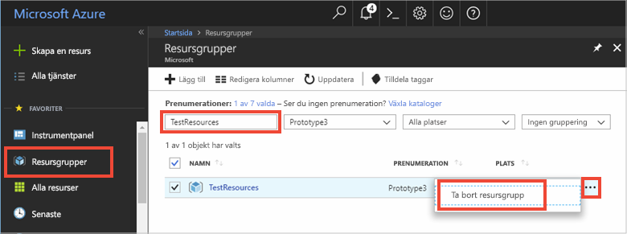

# <a name="quickstart-how-to-use-azure-cache-for-redis-with-nodejs"></a>Snabbstart: Så här använder du Azure Cache for Redis med Node.js


Med Azure Cache for Redis får du ett säkert, dedikerat Azure Cache for Redis som hanteras av Microsoft. Din cache är tillgänglig från alla program i Microsoft Azure.

I det här avsnittet visar vi hur du kommer igång med Azure Cache for Redis med Node.js. 

Du kan använda valfritt kodredigeringsprogram för att slutföra stegen i den här snabbstarten. [Visual Studio Code](https://code.visualstudio.com/) är dock ett utmärkt alternativ som är tillgängligt på Windows-, macOS- och Linux-plattformar.


[!INCLUDE [quickstarts-free-trial-note](../../includes/quickstarts-free-trial-note.md)]


## <a name="prerequisites"></a>Nödvändiga komponenter
Installera [node_redis](https://github.com/mranney/node_redis):

    npm install redis

Den här självstudien använder [node_redis](https://github.com/mranney/node_redis). Exempel på användning av andra Node.js-klienter finns i dokumentationen till enskilda Node.js-klienter som anges i [Node.js Redis-klienter](http://redis.io/clients#nodejs).


## <a name="create-a-cache"></a>Skapa en cache
[!INCLUDE [redis-cache-create](../../includes/redis-cache-create.md)]

[!INCLUDE [redis-cache-access-keys](../../includes/redis-cache-access-keys.md)]


Lägg till miljövariabler för **HOST NAME** och **primär** åtkomstnyckel. Du använder dessa variabler från din kod i stället för att inkludera den känsliga informationen direkt i koden.

```
set REDISCACHEHOSTNAME=contosoCache.redis.cache.windows.net
set REDISCACHEKEY=XXXXXXXXXXXXXXXXXXXXXXXXXXXXXXXXXXXXXXXXXXXX
```


## <a name="connect-to-the-cache"></a>Ansluta till cachen

De senaste build-versionerna av [node_redis](https://github.com/mranney/node_redis) innehåller stöd för att ansluta till Azure Cache for Redis med hjälp av SSL. I följande exempel visas hur du ansluter till Azure Cache for Redis med hjälp av SSL-slutpunkten 6380. 

```js
var redis = require("redis");

// Add your cache name and access key.
var client = redis.createClient(6380, process.env.REDISCACHEHOSTNAME,
    {auth_pass: process.env.REDISCACHEKEY, tls: {servername: process.env.REDISCACHEHOSTNAME}});
```

Skapa inte nya anslutningar för alla åtgärder i koden. Återanvänd istället anslutningar så mycket som möjligt. 

## <a name="create-a-new-nodejs-app"></a>Skapa en ny Node.js-app

Skapa en ny skriptfil med namnet *redistest.js*.

Lägg till följande JavaScript-exempel i filen. Den här koden visar hur du ansluter till en Azure Cache for Redis-instans med hjälp av cache-värdnamnet och viktiga miljövariabler. Koden lagrar och hämtar även ett strängvärde i cacheminnet. Kommandona `PING` och `CLIENT LIST` körs också. Fler exempel på hur du använder Redis med [node_redis](https://github.com/mranney/node_redis)-klienten finns på [http://redis.js.org/](http://redis.js.org/).

```js
var redis = require("redis");
var bluebird = require("bluebird");

bluebird.promisifyAll(redis.RedisClient.prototype);
bluebird.promisifyAll(redis.Multi.prototype);

async function testCache() {

    // Connect to the Azure Cache for Redis over the SSL port using the key.
    var cacheConnection = redis.createClient(6380, process.env.REDISCACHEHOSTNAME, 
        {auth_pass: process.env.REDISCACHEKEY, tls: {servername: process.env.REDISCACHEHOSTNAME}});
        
    // Perform cache operations using the cache connection object...

    // Simple PING command
    console.log("\nCache command: PING");
    console.log("Cache response : " + await cacheConnection.pingAsync());

    // Simple get and put of integral data types into the cache
    console.log("\nCache command: GET Message");
    console.log("Cache response : " + await cacheConnection.getAsync("Message"));    

    console.log("\nCache command: SET Message");
    console.log("Cache response : " + await cacheConnection.setAsync("Message",
        "Hello! The cache is working from Node.js!"));    

    // Demostrate "SET Message" executed as expected...
    console.log("\nCache command: GET Message");
    console.log("Cache response : " + await cacheConnection.getAsync("Message"));    

    // Get the client list, useful to see if connection list is growing...
    console.log("\nCache command: CLIENT LIST");
    console.log("Cache response : " + await cacheConnection.clientAsync("LIST"));    
}

testCache();
```

Kör skriptet med Node.js.

```
node redistest.js
```

I exemplet nedan ser du att `Message`-nyckeln tidigare hade ett cachelagrat värde som angavs med Redis-konsolen i Azure-portalen. Appen uppdatera det cachelagrade värdet. Appen körde även kommandona `PING` och `CLIENT LIST`.


## <a name="clean-up-resources"></a>Rensa resurser

Om du ska fortsätta till nästa självstudie kan du behålla resurserna som du har skapat i den här självstudien och använda dem igen.

Om du är klar med exempelappen för snabbstart kan du ta bort Azure-resurserna som du skapade i snabbstarten för att undvika kostnader. 

> [!IMPORTANT]
> Det går inte att ångra borttagningen av en resursgrupp och resursgruppen och alla resurser i den tas bort permanent. Kontrollera att du inte av misstag tar bort fel resursgrupp eller resurser. Om du har skapat resurserna som värd för det här exemplet i en befintlig resursgrupp som innehåller resurser som du vill behålla, kan du ta bort varje resurs separat från deras respektive blad istället för att ta bort resursgruppen.
>

Logga in på [Azure Portal](https://portal.azure.com) och klicka på **Resursgrupper**.

Skriv namnet på din resursgrupp i textrutan **Filtrera efter namn...**. Anvisningarna för den här artikeln använde en resursgrupp med namnet *TestResources*. På din resursgrupp i resultatlistan klickar du på **...** och därefter **Ta bort resursgrupp**.



Du blir ombedd att bekräfta borttagningen av resursgruppen. Skriv namnet på din resursgrupp för att bekräfta och klicka på **Ta bort**.

Efter en liten stund tas resursgruppen och resurser som finns i den bort.


## <a name="next-steps"></a>Nästa steg

I den här snabbstarten har du lärt dig att använda Azure Cache for Redis från ett Node.js-program. Fortsätt till nästa snabbstart om du vill använda Azure Cache for Redis med en ASP.NET-webbapp.

> [!div class="nextstepaction"]
> [Skapa en ASP.NET-webbapp som använder en Azure Cache for Redis.](./cache-web-app-howto.md)


