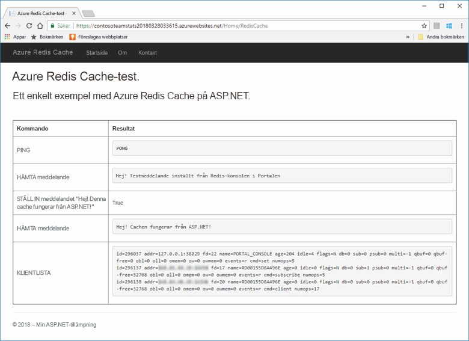
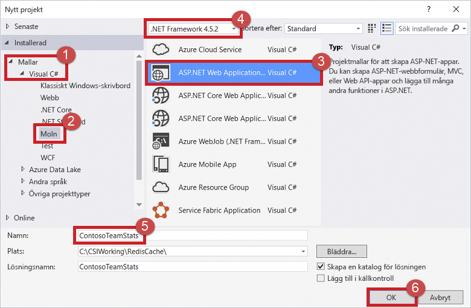
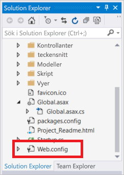
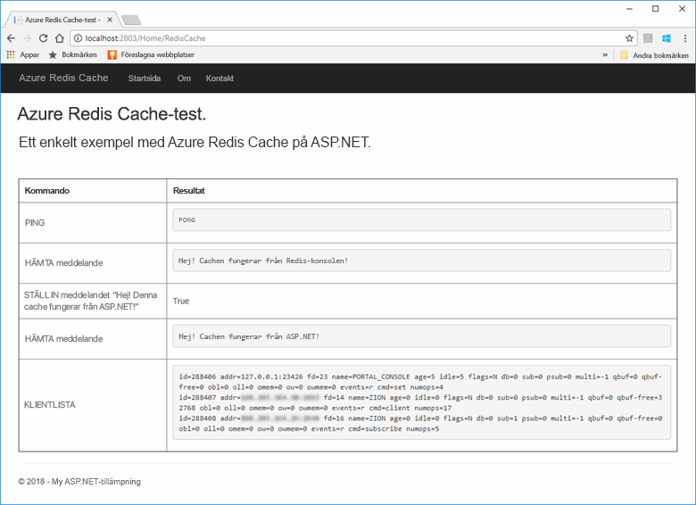
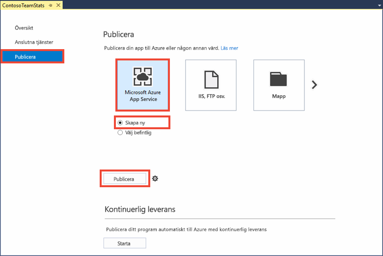
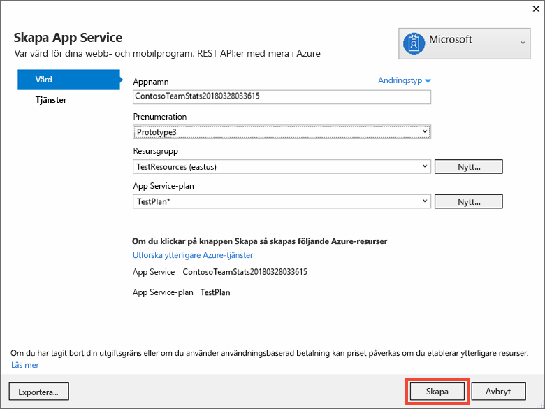
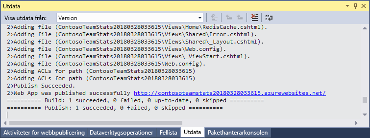
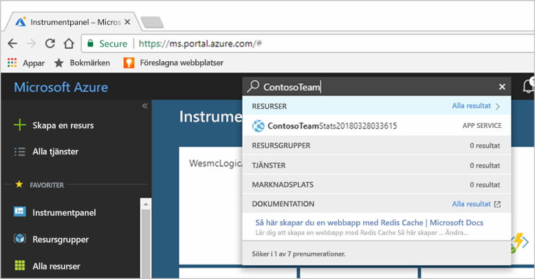
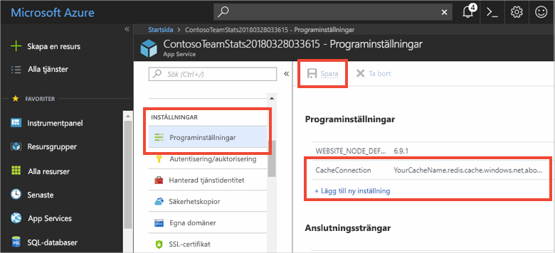

# <a name="quickstart-create-an-aspnet-web-app"></a>Snabbstart: Skapa en ASP.NET-webbapp 

## <a name="introduction"></a>Introduktion

I den här snabbstarten får du veta hur du skapar och distribuerar en ASP.NET-webbapp till Azure App Service med hjälp av Visual Studio 2017. Exempelprogrammet ansluter till Azure Cache for Redis när du ska lagra och hämta data från cachen. När du är klar med snabbstarten har du en fungerande webbapp, som finns i Azure och som läser och skriver till Azure Cache for Redis.



[!INCLUDE [quickstarts-free-trial-note](../../includes/quickstarts-free-trial-note.md)]

## <a name="prerequisites"></a>Nödvändiga komponenter

För att kunna utföra den här snabbstarten måste du installera [Visual Studio 2017](https://www.visualstudio.com/downloads/) med följande miljöer:
* ASP.NET och webbutveckling
* Azure Development

## <a name="create-the-visual-studio-project"></a>Skapa Visual Studio-projektet

1. Öppna Visual Studio och välj sedan **Arkiv** >**Nytt** > **Projekt**.

2. Gör följande i dialogrutan **Nytt projekt**:

    

    a. Expandera noden **Visual C#** i listan **Mallar**.

    b. Välj **Moln**.

    c. Välj **ASP.NET-webbapp**.

    d. Kontrollera att **.NET Framework 4.5.2** eller senare har valts.

    e. Ge projektet ett namn i rutan **Namn**. I det här exemplet använde vi **ContosoTeamStats**.

    f. Välj **OK**.
   
3. Välj **MVC** som projekttyp.

4. Kontrollera att **Ingen autentisering** är angivet i **autentiseringsinställningarna**. Beroende på din version av Visual Studio kan det vara en annan standardinställning för **Autentisering**. För att ändra detta väljer du **Ändra autentisering** och sedan **Ingen autentisering**.

5. Klicka på **OK** för att skapa projektet.

## <a name="create-a-cache"></a>Skapa en cache

Nu ska skapa du cachen för appen.

[!INCLUDE [redis-cache-create](../../includes/redis-cache-create.md)]

[!INCLUDE [redis-cache-access-keys](../../includes/redis-cache-access-keys.md)]

#### <a name="to-edit-the-cachesecretsconfig-file"></a>Redigera filen *CacheSecrets.config*

1. Skapa en fil med namnet *CacheSecrets.config* på datorn. Placera den på en plats där den inte checkas in med källkoden för exempelprogrammet. För den här snabbstarten finns filen *CacheSecrets.config* i *C:\AppSecrets\CacheSecrets.config*.

1. Redigera filen *CacheSecrets.config*. Lägg sedan till följande innehåll:

    ```xml
    <appSettings>
        <add key="CacheConnection" value="<cache-name>.redis.cache.windows.net,abortConnect=false,ssl=true,password=<access-key>"/>
    </appSettings>
    ```

1. Ersätt `<cache-name>` med din cachens värdnamn.

1. Ersätt `<access-key>` med primärnyckeln för cachen.

    > [!TIP]
    > Du kan använda den sekundära åtkomstnyckeln under nyckelrotation som en alternativ nyckel medan du återskapar den primära åtkomstnyckeln.
   >
1. Spara filen.

## <a name="update-the-mvc-application"></a>Uppdatera MVC-appen

I det här avsnittet uppdaterar du programet så att det stöder en ny vy som visar ett enkelt test mot Azure Cache for Redis.

* [Uppdatera web.config-filen med en appinställning för cachen](#update-the-webconfig-file-with-an-app-setting-for-the-cache)
* Konfigurera appen till att använda StackExchange.Redis-klienten
* Uppdatera HomeController och layout
* Lägga till en ny RedisCache-vy

### <a name="update-the-webconfig-file-with-an-app-setting-for-the-cache"></a>Uppdatera web.config-filen med en appinställning för cachen

När du kör appen lokalt används informationen i *CacheSecrets.config* för att ansluta till Azure Cache for Redis-instansen. Du kommer senare att distribuera appen till Azure. Då konfigurerar du en appinställning i Azure som appen kommer att använda för att hämta cachens anslutningsinformation i stället för den här filen. 

Eftersom *CacheSecrets.config* inte har distribuerats till Azure med din app använder du den bara när du testar appen lokalt. Var noga med att skydda informationen så att inte obehöriga kan komma åt cachelagrade data.

#### <a name="to-update-the-webconfig-file"></a>Uppdatera filen *web.config*
1. I **Solution Explorer** dubbelklickar du på *web.config* för att öppna den.

    

2. Leta reda på elementet `<appSetting>` i filen *web.config*. Lägg sedan till följande `file`-attribut. Om du använder ett annat namn eller en annan plats, byter du ut dessa värden mot de som visas i exemplet.

* Innan: `<appSettings>`
* När du har:  `<appSettings file="C:\AppSecrets\CacheSecrets.config">`

ASP.NET-körningsmiljön sammanfogar innehållet i den externa filen med markeringen i `<appSettings>`-elementet. Vid körningen ignoreras filattributet om det inte går att hitta den angivna filen. Din hemliga information (anslutningssträngen till cachen) ingår inte i källkoden för programmet. När du distribuerar din webbapp till Azure så distribueras inte filen *CacheSecrets.config*.

### <a name="to-configure-the-application-to-use-stackexchangeredis"></a>Konfigurera appen till att använda StackExchange.Redis

1. Konfigurera appen att använda NuGet-paketet i [StackExchange.Redis](https://github.com/StackExchange/StackExchange.Redis) för Visual Studio genom att välja **Verktyg > NuGet Package Manager > Package Manager-konsolen**.

2. Kör följande kommando från fönstret `Package Manager Console`:

    ```powershell
    Install-Package StackExchange.Redis
    ```

3. NuGet-paketet hämtar och lägger till de nödvändiga sammansättningsreferenserna för klientprogrammet för att få åtkomst till Azure Cache for Redis med cacheklienten StackExchange.Azure Cache for Redis. Om du vill använda en starkt krypterad version av `StackExchange.Redis` klientbiblioteket ska du installera paketet `StackExchange.Redis.StrongName`.

### <a name="to-update-the-homecontroller-and-layout"></a>Uppdatera HomeController och layout

1. I **Solution Explorer** expanderar du mappen **Controllers** och öppnar filen *HomeController.cs*.

2. Lägg till följande två `using`-instruktioner överst i filen för att stödja cacheklienten och appinställningarna.

    ```csharp
    using System.Configuration;
    using StackExchange.Redis;
    ```

3. Lägg till följande metod i klassen `HomeController` så att du kan använda en ny `RedisCache`-åtgärd som kör vissa kommandon mot den nya cachen.

    ```csharp
        public ActionResult RedisCache()
        {
            ViewBag.Message = "A simple example with Azure Cache for Redis on ASP.NET.";

            var lazyConnection = new Lazy<ConnectionMultiplexer>(() =>
            {
                string cacheConnection = ConfigurationManager.AppSettings["CacheConnection"].ToString();
                return ConnectionMultiplexer.Connect(cacheConnection);
            });

            // Connection refers to a property that returns a ConnectionMultiplexer
            // as shown in the previous example.
            IDatabase cache = lazyConnection.Value.GetDatabase();

            // Perform cache operations using the cache object...

            // Simple PING command
            ViewBag.command1 = "PING";
            ViewBag.command1Result = cache.Execute(ViewBag.command1).ToString();

            // Simple get and put of integral data types into the cache
            ViewBag.command2 = "GET Message";
            ViewBag.command2Result = cache.StringGet("Message").ToString();

            ViewBag.command3 = "SET Message \"Hello! The cache is working from ASP.NET!\"";
            ViewBag.command3Result = cache.StringSet("Message", "Hello! The cache is working from ASP.NET!").ToString();

            // Demonstrate "SET Message" executed as expected...
            ViewBag.command4 = "GET Message";
            ViewBag.command4Result = cache.StringGet("Message").ToString();

            // Get the client list, useful to see if connection list is growing...
            ViewBag.command5 = "CLIENT LIST";
            ViewBag.command5Result = cache.Execute("CLIENT", "LIST").ToString().Replace(" id=", "\rid=");

            lazyConnection.Value.Dispose();

            return View();
        }
    ```

4. I **Solution Explorer** expanderar du mappen **Vyer** > **Delad**. Öppna sedan filen *_Layout.cshtml*.

    Ersätt:
    
    ```csharp
    @Html.ActionLink("Application name", "Index", "Home", new { area = "" }, new { @class = "navbar-brand" })
    ```

    med:

    ```csharp
    @Html.ActionLink("Azure Cache for Redis Test", "RedisCache", "Home", new { area = "" }, new { @class = "navbar-brand" })
    ```

### <a name="to-add-a-new-rediscache-view"></a>Lägga till en ny RedisCache-vy

1. I **Solution Explorer** expanderar du mappen **Vyer** och högerklickar sedan på mappen **Start**. Välj **Lägg till** > **Vy...** .

2. Ange **RedisCache** som vynamn i dialogrutan **Lägg till vy**. Välj sedan **Lägg till**.

3. Ersätt koden i filen *RedisCache.cshtml* med följande kod:

    ```csharp
    @{
        ViewBag.Title = "Azure Cache for Redis Test";
    }

    <h2>@ViewBag.Title.</h2>
    <h3>@ViewBag.Message</h3>
    <br /><br />
    <table border="1" cellpadding="10">
        <tr>
            <th>Command</th>
            <th>Result</th>
        </tr>
        <tr>
            <td>@ViewBag.command1</td>
            <td><pre>@ViewBag.command1Result</pre></td>
        </tr>
        <tr>
            <td>@ViewBag.command2</td>
            <td><pre>@ViewBag.command2Result</pre></td>
        </tr>
        <tr>
            <td>@ViewBag.command3</td>
            <td><pre>@ViewBag.command3Result</pre></td>
        </tr>
        <tr>
            <td>@ViewBag.command4</td>
            <td><pre>@ViewBag.command4Result</pre></td>
        </tr>
        <tr>
            <td>@ViewBag.command5</td>
            <td><pre>@ViewBag.command5Result</pre></td>
        </tr>
    </table>
    ```

## <a name="run-the-app-locally"></a>Köra appen lokalt

Som standard konfigureras projektet som värd för appen lokalt i [IIS Express](https://docs.microsoft.com/iis/extensions/introduction-to-iis-express/iis-express-overview) för testning och felsökning.

### <a name="to-run-the-app-locally"></a>Köra appen lokalt
1. I Visual Studio väljer du **Felsök** > **Börja felsöka** för att skapa och starta appen lokalt för testning och felsökning.

2. Välj **Azure Redis Cache for Redis-test** i webbläsarens navigeringsfält.

3. I exemplet nedan ser du att `Message`-nyckeln tidigare hade ett cachelagrat värde som angavs med Azure Cache for Redis-konsolen i portalen. Appen uppdatera det cachelagrade värdet. Appen körde även kommandona `PING` och `CLIENT LIST`.

    

## <a name="publish-and-run-in-azure"></a>Publicera och köra i Azure

När du har testat appen lokalt distribuerar du den till Azure och kör den i molnet.

### <a name="to-publish-the-app-to-azure"></a>Publicera appen i Azure

1. Högerklicka på projektnoden i Solution Explorer i Visual Studio. Välj sedan **Publicera**.

    

2. Välj **Microsoft Azure App Service**, välj **Skapa ny** och välj sedan **Publicera**.

    

3. Gör följande ändringar i dialogrutan **Skapa App Service**:

    | Inställning | Rekommenderat värde | Beskrivning |
    | ------- | :---------------: | ----------- |
    | **Appens namn** | Använd standardvärdet. | Appnamnet blir värdnamnet för appen när den har distribuerats till Azure. Namnet kan ha ett tidsstämpelsuffix som lagts till för att göra det unikt, om det behövs. |
    | **Prenumeration** | Välj din Azure-prenumeration. | Den här prenumerationen debiteras för eventuella relaterade värdkostnader. Om du har flera Azure-prenumerationer kontrollerar du att den önskade prenumerationen har valts.|
    | **Resursgrupp** | Använd den resursgrupp som du skapade cachen i (till exempel *TestResourceGroup*). | Resursgruppen hjälper dig att hantera alla resurser som en grupp. Senare när du vill ta bort appen är det bara att ta bort gruppen. |
    | **App Service-plan** | Välj **Nytt** och skapa en ny App Service-Plan med namnet *TestingPlan*. <br />Använd samma **plats** du använde när du skapade cachen. <br />Välj **Ledigt** som storlek. | En App Service-plan definierar en uppsättning beräkningsresurser för en webbapp att köra med. |

    

4. Välj **Skapa** när du har konfigurerat App Service-värdinställningarna.

5. I fönstret **Utdata** i Visual Studio kan du se publiceringsstatus. När appen har publicerats loggas URL:en för appen:

    

### <a name="add-the-app-setting-for-the-cache"></a>Lägga till appinställningen för cachen

Lägg till en ny appinställning när den nya appen har publicerats. Den här inställningen används för att lagra cacheanslutningsinformationen. 

#### <a name="to-add-the-app-setting"></a>Lägga till appinställningen 

1. Skriv appnamnet i sökfältet längst upp i Azure-portalen för att söka efter den nya appen som du skapade.

    

2. Lägg till en ny appinställning med namnet **CacheConnection** som appen ska använda för att ansluta till cachen. Använd samma värde som du har konfigurerat för `CacheConnection` i filen *CacheSecrets.config*. Värdet innehåller cachens värdnamn och åtkomstnyckel.

    

### <a name="run-the-app-in-azure"></a>Köra appen i Azure

Gå till URL:en för appen i webbläsaren. URL:en visas i resultatet av publiceringsåtgärden i utdatafönstret i Visual Studio. Den finns också i Azure-portalen på översiktssidan för appen du skapade.

Testa cacheåtkomsten genom att välja **Azure Cache for Redis-test** i navigeringsfältet.


## <a name="clean-up-resources"></a>Rensa resurser

Om du tänker fortsätta till nästa självstudie kan du behålla resurserna som du har skapat i den här självstudien och använda dem igen.

Om du är klar med exempelappen i snabbstarten kan du ta bort Azure-resurserna som du skapade i snabbstarten för att undvika kostnader. 

> [!IMPORTANT]
> Att ta bort en resursgrupp kan inte ångras. När du tar bort en resursgrupp tas alla resurser som ingår i den bort permanent. Kontrollera att du inte av misstag tar bort fel resursgrupp eller resurser. Om du har skapat resurserna som värd för det här exemplet i en befintlig resursgrupp som innehåller resurser som du vill behålla, kan du ta bort varje resurs separat från deras respektive blad istället för att ta bort resursgruppen.

### <a name="to-delete-a-resource-group"></a>Ta bort en resursgrupp

1. Logga in på [Azure-portalen](https://portal.azure.com) och välj **Resursgrupper**.

2. Skriv namnet på din resursgrupp i rutan **Filtrera efter namn...**. Anvisningarna för den här artikeln använde en resursgrupp med namnet *TestResources*. På din resursgrupp i resultatlistan väljer du **...** och sedan **Ta bort resursgrupp**.

    

Du blir ombedd att bekräfta borttagningen av resursgruppen. Skriv namnet på din resursgrupp för att bekräfta och välj sedan **Ta bort**.

Efter en liten stund tas resursgruppen och de resurser som finns i den bort.

## <a name="next-steps"></a>Nästa steg

I nästa kurs får du använda Azure Cache for Redis i ett mer realistiskt scenario så att du kan förbättra prestandan för en app. Du uppdaterar appen på cachens resultattavla med hjälp av cache-aside-mönstret med ASP.NET och en databas.

> [!div class="nextstepaction"]
> [Skapa en cache-aside-esultattavla för ASP.NET](cache-web-app-cache-aside-leaderboard.md)
