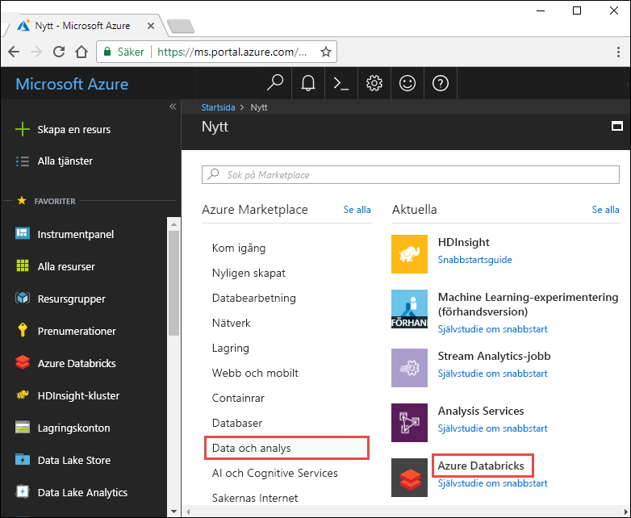
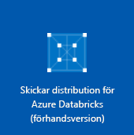
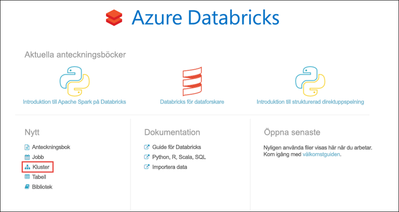
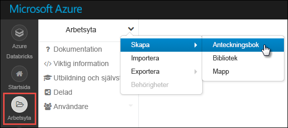
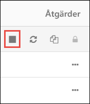

# <a name="tutorial-stream-data-into-azure-databricks-using-event-hubs"></a>Självstudier: Strömma data i Azure Databricks med Event Hubs

I den här självstudien ansluter du ett datainmatningssystem med Azure Databricks för att strömma data till ett Apache Spark-kluster i nästan realtid. Du konfigurerar datainmatningssystemet med Azure Event Hubs och ansluter det sedan till Azure Databricks så att de meddelanden som skickas kan bearbetas. Om du vill få åtkomst till en dataström använder du Twitter-API:er till att mata in tweets i Event Hubs. När du har datan i Azure Databricks kan du köra analysjobb och analysera datan ytterligare. 

I slutet av den här självstudien har du strömmat tweets från Twitter som innehåller termen ”Azure” och läst tweetsen i Azure Databricks.

Följande bild visar programflödet:


Den här självstudien omfattar följande uppgifter:

> [!div class="checklist"]
> * Skapa en Azure Databricks-arbetsyta
> * Skapa ett Spark-kluster i Azure Databricks
> * Skapa en Twitter-app om du vill ha tillgång strömmande data
> * Skapa anteckningsböcker i Azure Databricks
> * Bifoga bibliotek för Event Hubs och Twitter-API
> * Skicka tweets till Event Hubs
> * Läsa tweets från Event Hubs

Om du inte har en Azure-prenumeration kan du [skapa ett kostnadsfritt konto ](https://azure.microsoft.com/free/) innan du börjar.

## <a name="prerequisites"></a>Nödvändiga komponenter

Innan du börjar med den här självstudien måste du uppfylla följande krav:
- Ett Event Hubs-namnområde.
- En händelsehubb i namnområdet.
- Anslutningssträng för åtkomst till Event Hubs-namnområdet. Anslutningssträngen måste ha ett format som liknar `Endpoint=sb://<namespace>.servicebus.windows.net/;SharedAccessKeyName=<key name>;SharedAccessKey=<key value>`.
- Namn på princip för delad åtkomst och principnyckel för Event Hubs.

Du kan uppfylla dessa krav genom att slutföra stegen i artikeln [Skapa ett Azure Event Hubs-namnområde och en händelsehubb](../event-hubs/event-hubs-create.md).

## <a name="log-in-to-the-azure-portal"></a>Logga in på Azure-portalen

Logga in på [Azure-portalen](https://portal.azure.com/).

## <a name="create-an-azure-databricks-workspace"></a>Skapa en Azure Databricks-arbetsyta

I det här avsnittet skapar du en Azure Databricks-arbetsyta med Azure-portalen.

1. Välj **Skapa en resurs** > **Data och analys** > **Azure Databricks** i Azure-portalen.

    

3. Under **Azure Databricks-tjänst** anger du värden för att skapa en Databricks-arbetsyta.

    

    Ange följande värden:

    |Egenskap  |Beskrivning  |
    |---------|---------|
    |**Namn på arbetsyta**     | Ange ett namn för Databricks-arbetsytan        |
    |**Prenumeration**     | I listrutan väljer du din Azure-prenumeration.        |
    |**Resursgrupp**     | Ange om du vill skapa en ny resursgrupp eller använda en befintlig. En resursgrupp är en container som innehåller relaterade resurser för en Azure-lösning. Mer information finns i [översikten över Azure-resursgrupper](../azure-resource-manager/resource-group-overview.md). |
    |**Plats**     | Välj **USA, östra 2**. För andra tillgängliga regioner läser du informationen om [Azure-tjänsttillgänglighet per region](https://azure.microsoft.com/regions/services/).        |
    |**Prisnivå**     |  Välj mellan **Standard** och **Premium**. Mer information om de här nivåerna finns på [prissättningssidan för Databricks](https://azure.microsoft.com/pricing/details/databricks/).       |

    Välj **Fäst på instrumentpanelen** och välj sedan **Skapa**.

4. Det tar några minuter att skapa kontot. När kontot skapas i portalen visas panelen för att **skicka distribution för Azure Databricks** på höger sida. Du kan behöva rulla åt höger på instrumentpanelen för att se panelen. En förloppsindikator visas även längst upp på skärmen. Båda dessa områden visar förloppet.

    

## <a name="create-a-spark-cluster-in-databricks"></a>Skapa ett Spark-kluster i Databricks

1. I Azure-portalen går du till Databricks-arbetsytan som du skapade. Välj sedan **Starta arbetsyta**.

2. Du omdirigeras till Azure Databricks-portalen. I portalen väljer du **Kluster**.

    

3. På sidan **Nytt kluster** anger du värdena för att skapa ett kluster.

    

    Godkänn alla övriga standardvärden, förutom följande:

    * Ange ett namn för klustret.
    * För den här artikeln skapar du ett kluster med körningen **4.0**.
    * Se till att markera kryssrutan **Avsluta efter \_\_ minuters inaktivitet**. Ange en varaktighet (i minuter) för att avsluta klustret om klustret inte används.

    Välj **Skapa kluster**. När klustret körs kan du ansluta anteckningsböcker till klustret och köra Spark-jobb.

## <a name="create-a-twitter-application"></a>Skapa ett Twitter-program

Om du vill få en dataström med tweets skapar du ett program i Twitter. Följ anvisningarna för att skapa ett Twitter-program och registrera de värden som du behöver för självstudien.

1. Från en webbläsare går du till [Twitter Application Management](https://apps.twitter.com/) (Twitter-programhantering) och väljer **Skapa ny app**.

    

2. På sidan **Skapa ett program** anger du information om den nya appen. Välj sedan **Create your Twitter application** (Skapa ditt Twitter-program).

    

3. På programsidan väljer du fliken med **nycklar och åtkomsttoken** och kopierar värdena för den **använda nyckeln** och **konsumenthemligheten**. Välj också **Skapa min åtkomsttoken** för att generera åtkomsttoken. Kopiera värdena för **åtkomsttoken** och **åtkomsttokenhemligheten**.

    

Spara de värden som du hämtade för Twitter-programmet. Du behöver dem senare i självstudien.

## <a name="attach-libraries-to-spark-cluster"></a>Bifoga bibliotek till Spark-kluster

I den här självstudien använder du Twitter-API:er för att skicka tweets till Event Hubs. Du använder också [Apache Spark Event Hubs-anslutningsprogram](https://github.com/Azure/azure-event-hubs-spark) för att läsa och skriva data till Azure Event Hubs. Använd dessa API:er som en del av klustret, lägg till dem som bibliotek i Azure Databricks och koppla dem sedan till ditt Spark-kluster. Följande anvisningar visar hur du lägger till biblioteket i mappen **Delade** på arbetsytan.

1.  I Azure Databricks-arbetsytan väljer du **Arbetsyta** och högerklickar sedan på **Delade**. I snabbmenyn väljer du **Skapa** > **Bibliotek**.

    

2. På sidan Nytt bibliotek väljer du som **Källa** **Maven-koordinat**. I **Koordinat** anger du koordinaten för det paket som du vill lägga till. Här är Maven-koordinaterna för de bibliotek som används i självstudien:

    * Spark Event Hubs-anslutningsprogram – `com.microsoft.azure:azure-eventhubs-spark_2.11:2.3.1`
    * Twitter-API – `org.twitter4j:twitter4j-core:4.0.6`

    

3. Välj **Skapa bibliotek**.

4. Välj den mapp där du lade till biblioteket och välj sedan biblioteksnamnet.

    

5. På bibliotekssidan väljer du klustret där du vill använda biblioteket. När biblioteket har associerats med klustret ändras status direkt till **Bifogat**.

    

6. Upprepa dessa steg för Twitter-paketet `twitter4j-core:4.0.6`.

## <a name="create-notebooks-in-databricks"></a>Skapa anteckningsböcker i Databricks

I det här avsnittet skapar du två anteckningsböcker i Databricks-arbetsytan med följande namn:

- **SendTweetsToEventHub** – En producentanteckningsbok som du använder för att få tweets från Twitter och strömma dem till Event Hubs.
- **ReadTweetsFromEventHub** – En konsumentanteckningsbok som du använder för att läsa dessa tweets från Event Hubs.

1. Välj **Arbetsyta** i det vänstra fönstret. I listrutan **Arbetsyta** väljer du **Skapa** > **Anteckningsbok**.

    

2. I dialogrutan **Skapa anteckningsbok** anger du **SendTweetsToEventHub**, väljer **Scala** som språk och väljer det Spark-kluster som du skapade tidigare.

    

    Välj **Skapa**.

3. Upprepa stegen för att skapa anteckningsboken **ReadTweetsFromEventHub**.

## <a name="send-tweets-to-event-hubs"></a>Skicka tweets till Event Hubs

I anteckningsboken **SendTweetsToEventHub** klistrar du in följande kod och ersätter platshållarna med värden för Event Hubs-namnrymden och det Twitter-program som du skapade tidigare. Anteckningsboken strömmar tweets med nyckelordet ”Azure” till Event Hubs i realtid.

```scala
    import java.util._
    import scala.collection.JavaConverters._
    import com.microsoft.azure.eventhubs._
    import java.util.concurrent._

    val namespaceName = "<EVENT HUBS NAMESPACE>"
    val eventHubName = "<EVENT HUB NAME>"
    val sasKeyName = "<POLICY NAME>"
    val sasKey = "<POLICY KEY>"
    val connStr = new ConnectionStringBuilder()
                .setNamespaceName(namespaceName)
                .setEventHubName(eventHubName)
                .setSasKeyName(sasKeyName)
                .setSasKey(sasKey)

    val pool = Executors.newFixedThreadPool(1)
    val eventHubClient = EventHubClient.create(connStr.toString(), pool)

    def sendEvent(message: String) = {
      val messageData = EventData.create(message.getBytes("UTF-8"))
      eventHubClient.get().send(messageData)
      System.out.println("Sent event: " + message + "\n")
    }

    import twitter4j._
    import twitter4j.TwitterFactory
    import twitter4j.Twitter
    import twitter4j.conf.ConfigurationBuilder

    // Twitter configuration!
    // Replace values below with yours

    val twitterConsumerKey = "<CONSUMER KEY>"
    val twitterConsumerSecret = "<CONSUMER SECRET>"
    val twitterOauthAccessToken = "<ACCESS TOKEN>"
    val twitterOauthTokenSecret = "<TOKEN SECRET>"

    val cb = new ConfigurationBuilder()
      cb.setDebugEnabled(true)
      .setOAuthConsumerKey(twitterConsumerKey)
      .setOAuthConsumerSecret(twitterConsumerSecret)
      .setOAuthAccessToken(twitterOauthAccessToken)
      .setOAuthAccessTokenSecret(twitterOauthTokenSecret)

    val twitterFactory = new TwitterFactory(cb.build())
    val twitter = twitterFactory.getInstance()

    // Getting tweets with keyword "Azure" and sending them to the Event Hub in realtime!

    val query = new Query(" #Azure ")
    query.setCount(100)
    query.lang("en")
    var finished = false
    while (!finished) {
      val result = twitter.search(query)
      val statuses = result.getTweets()
      var lowestStatusId = Long.MaxValue
      for (status <- statuses.asScala) {
        if(!status.isRetweet()){
          sendEvent(status.getText())
        }
        lowestStatusId = Math.min(status.getId(), lowestStatusId)
        Thread.sleep(2000)
      }
      query.setMaxId(lowestStatusId - 1)
    }

    // Closing connection to the Event Hub
    eventHubClient.get().close()
```

Om du vill köra anteckningsboken trycker du på **SKIFT + RETUR**. Utdata som liknar kodfragmentet nedan visas. Varje utdatahändelse är en tweet med termen ”Azure” som matas in i Event Hubs.

    Sent event: @Microsoft and @Esri launch Geospatial AI on Azure https://t.co/VmLUCiPm6q via @geoworldmedia #geoai #azure #gis #ArtificialIntelligence

    Sent event: Public preview of Java on App Service, built-in support for Tomcat and OpenJDK
    https://t.co/7vs7cKtvah
    #cloudcomputing #Azure

    Sent event: 4 Killer #Azure Features for #Data #Performance https://t.co/kpIb7hFO2j by @RedPixie

    Sent event: Migrate your databases to a fully managed service with Azure SQL Database Managed Instance | #Azure | #Cloud https://t.co/sJHXN4trDk

    Sent event: Top 10 Tricks to #Save Money with #Azure Virtual Machines https://t.co/F2wshBXdoz #Cloud

    ...
    ...

## <a name="read-tweets-from-event-hubs"></a>Läsa tweets från Event Hubs

I anteckningsboken **ReadTweetsFromEventHub** klistrar du in följande kod och ersätter platshållarna med värdena för den Azure Event Hubs som du skapade tidigare. Den här anteckningsboken läser de tweets som du tidigare strömmade till Event Hubs med hjälp av anteckningsboken **SendTweetsToEventHub**.

```scala
    import org.apache.spark.eventhubs._

    // Build connection string with the above information
    val connectionString = ConnectionStringBuilder("<EVENT HUBS CONNECTION STRING>")
      .setEventHubName("<EVENT HUB NAME>")
      .build

    val customEventhubParameters =
      EventHubsConf(connectionString)
      .setMaxEventsPerTrigger(5)

    val incomingStream = spark.readStream.format("eventhubs").options(customEventhubParameters.toMap).load()

    incomingStream.printSchema

    // Sending the incoming stream into the console.
    // Data comes in batches!
    incomingStream.writeStream.outputMode("append").format("console").option("truncate", false).start().awaitTermination()
```

Du får följande utdata:


    root
     |-- body: binary (nullable = true)
     |-- offset: long (nullable = true)
     |-- seqNumber: long (nullable = true)
     |-- enqueuedTime: long (nullable = true)
     |-- publisher: string (nullable = true)
     |-- partitionKey: string (nullable = true)

    -------------------------------------------
    Batch: 0
    -------------------------------------------
    +------+------+--------------+---------------+---------+------------+
    |body  |offset|sequenceNumber|enqueuedTime   |publisher|partitionKey|
    +------+------+--------------+---------------+---------+------------+
    |[50 75 62 6C 69 63 20 70 72 65 76 69 65 77 20 6F 66 20 4A 61 76 61 20 6F 6E 20 41 70 70 20 53 65 72 76 69 63 65 2C 20 62 75 69 6C 74 2D 69 6E 20 73 75 70 70 6F 72 74 20 66 6F 72 20 54 6F 6D 63 61 74 20 61 6E 64 20 4F 70 65 6E 4A 44 4B 0A 68 74 74 70 73 3A 2F 2F 74 2E 63 6F 2F 37 76 73 37 63 4B 74 76 61 68 20 0A 23 63 6C 6F 75 64 63 6F 6D 70 75 74 69 6E 67 20 23 41 7A 75 72 65]                              |0     |0             |2018-03-09 05:49:08.86 |null     |null        |
    |[4D 69 67 72 61 74 65 20 79 6F 75 72 20 64 61 74 61 62 61 73 65 73 20 74 6F 20 61 20 66 75 6C 6C 79 20 6D 61 6E 61 67 65 64 20 73 65 72 76 69 63 65 20 77 69 74 68 20 41 7A 75 72 65 20 53 51 4C 20 44 61 74 61 62 61 73 65 20 4D 61 6E 61 67 65 64 20 49 6E 73 74 61 6E 63 65 20 7C 20 23 41 7A 75 72 65 20 7C 20 23 43 6C 6F 75 64 20 68 74 74 70 73 3A 2F 2F 74 2E 63 6F 2F 73 4A 48 58 4E 34 74 72 44 6B]            |168   |1             |2018-03-09 05:49:24.752|null     |null        |
    +------+------+--------------+---------------+---------+------------+

    -------------------------------------------
    Batch: 1
    -------------------------------------------
    ...
    ...

Eftersom utdatan är i ett binärt läge använder du följande kodfragment för att konvertera den till en sträng.

```scala
    import org.apache.spark.sql.types._
    import org.apache.spark.sql.functions._

    // Event Hub message format is JSON and contains "body" field
    // Body is binary, so we cast it to string to see the actual content of the message
    val messages =
      incomingStream
      .withColumn("Offset", $"offset".cast(LongType))
      .withColumn("Time (readable)", $"enqueuedTime".cast(TimestampType))
      .withColumn("Timestamp", $"enqueuedTime".cast(LongType))
      .withColumn("Body", $"body".cast(StringType))
      .select("Offset", "Time (readable)", "Timestamp", "Body")

    messages.printSchema

    messages.writeStream.outputMode("append").format("console").option("truncate", false).start().awaitTermination()
```

Utdatan liknar nu följande kodfragment:

    root
     |-- Offset: long (nullable = true)
     |-- Time (readable): timestamp (nullable = true)
     |-- Timestamp: long (nullable = true)
     |-- Body: string (nullable = true)

    -------------------------------------------
    Batch: 0
    -------------------------------------------
    +------+-----------------+----------+-------+
    |Offset|Time (readable)  |Timestamp |Body
    +------+-----------------+----------+-------+
    |0     |2018-03-09 05:49:08.86 |1520574548|Public preview of Java on App Service, built-in support for Tomcat and OpenJDK
    https://t.co/7vs7cKtvah
    #cloudcomputing #Azure          |
    |168   |2018-03-09 05:49:24.752|1520574564|Migrate your databases to a fully managed service with Azure SQL Database Managed Instance | #Azure | #Cloud https://t.co/sJHXN4trDk    |
    |0     |2018-03-09 05:49:02.936|1520574542|@Microsoft and @Esri launch Geospatial AI on Azure https://t.co/VmLUCiPm6q via @geoworldmedia #geoai #azure #gis #ArtificialIntelligence|
    |176   |2018-03-09 05:49:20.801|1520574560|4 Killer #Azure Features for #Data #Performance https://t.co/kpIb7hFO2j by @RedPixie                                                    |
    +------+-----------------+----------+-------+
    -------------------------------------------
    Batch: 1
    -------------------------------------------
    ...
    ...

Klart! Med Azure Databricks har du nu strömmat data till Azure Event Hubs nästan i realtid. Du har sedan använt dataströmmen med Event Hubs-anslutningsprogrammet för Apache Spark. Mer information om hur du använder Event Hubs-anslutningsprogrammet för Apache Spark finns i [dokumentationen till anslutningsprogrammet](https://github.com/Azure/azure-event-hubs-spark/tree/master/docs).

## <a name="clean-up-resources"></a>Rensa resurser

När du är klar med självstudien kan du avsluta klustret. Detta gör du genom att välja **Kluster** i det vänstra fönstret i Azure Databricks-arbetsytan. Gå till klustret som du vill avsluta och rör markören över de tre punkterna under kolumnen **Åtgärder**. Välj sedan ikonen **Avsluta**.



Om du inte manuellt avslutar klustret kommer det att stoppas automatiskt, förutsatt att du har markerat kryssrutan **Avsluta efter \_\_ minuters inaktivitet** när klustret skapades. I dessa fall stoppas klustret automatiskt om det har varit inaktivt under den angivna tiden.

## <a name="next-steps"></a>Nästa steg
I den här självstudien lärde du dig att:

> [!div class="checklist"]
> * Skapa en Azure Databricks-arbetsyta
> * Skapa ett Spark-kluster i Azure Databricks
> * Skapa en Twitter-app för att generera strömmande data
> * Skapa anteckningsböcker i Azure Databricks
> * Bifoga bibliotek för Event Hubs och Twitter-API
> * Skicka tweets till Event Hubs
> * Läsa tweets från Event Hubs

Gå till nästa självstudie för att lära dig om att utföra attitydanalyser på strömmade data med Azure Databricks och [Microsoft Cognitive Services-API](../cognitive-services/text-analytics/overview.md).

> [!div class="nextstepaction"]
>[Sentimentanalys på strömmade data med hjälp av Azure Databricks ](databricks-sentiment-analysis-cognitive-services.md)
