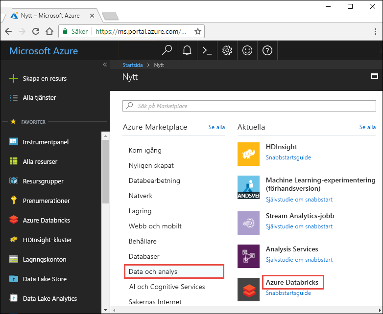
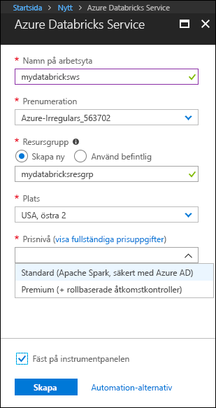
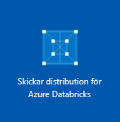
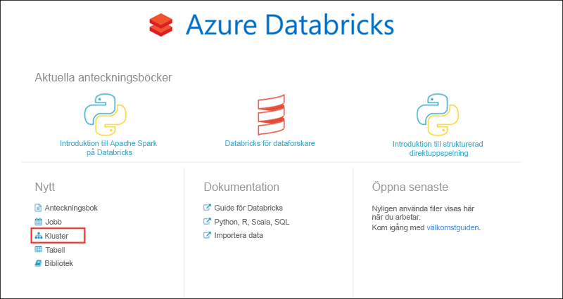
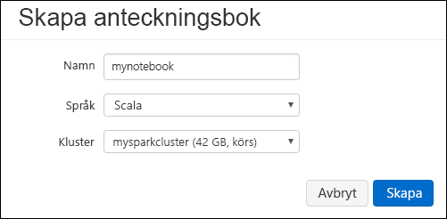
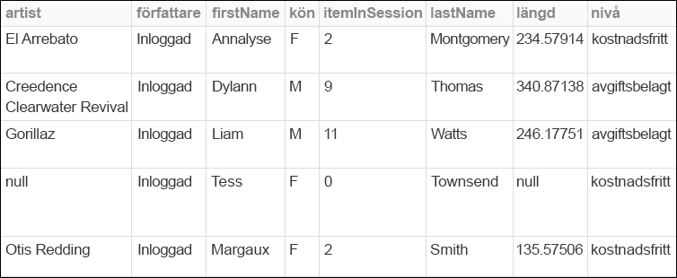
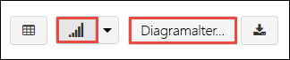
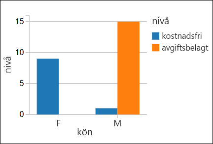

# <a name="quickstart-run-a-spark-job-on-azure-databricks-using-the-azure-portal"></a>Snabbstart: Köra ett Spark-jobb på Azure Databricks med Azure Portal

Den här snabbstarten visar hur du skapar en arbetsyta för Azure Databricks och ett Apache Spark-kluster i den arbetsytan. Dessutom får du lära dig hur du kör ett Spark-jobb på Databricks-klustret. Mer information om Azure Databricks finns i [Vad är Azure Databricks?](what-is-azure-databricks.md)

I den här snabbstarten analyserar du, som en del av Spark-jobbet, prenumerationsdata för en radiokanal, så att du får insikter om kostnadsfri/betald användning baserat på demografiska data. 

Om du inte har en Azure-prenumeration kan du [skapa ett kostnadsfritt konto ](https://azure.microsoft.com/free/) innan du börjar.

## <a name="log-in-to-the-azure-portal"></a>Logga in på Azure Portal

Logga in på [Azure Portal](https://portal.azure.com).

## <a name="create-an-azure-databricks-workspace"></a>Skapa en Azure Databricks-arbetsyta

I det här avsnittet skapar du en Azure Databricks-arbetsyta med Azure-portalen. 

1. Välj **Skapa en resurs** > **Data och analys** > **Azure Databricks** i Azure Portal. 

    

3. Under **Azure Databricks-tjänst** anger du värden för att skapa en Databricks-arbetsyta.

    

    Ange följande värden: 
     
    |Egenskap  |Beskrivning  |
    |---------|---------|
    |**Namn på arbetsyta**     | Ange ett namn för Databricks-arbetsytan        |
    |**Prenumeration**     | I listrutan väljer du din Azure-prenumeration.        |
    |**Resursgrupp**     | Ange om du vill skapa en ny resursgrupp eller använda en befintlig. En resursgrupp är en behållare som innehåller relaterade resurser för en Azure-lösning. Mer information finns i [översikten över Azure-resursgrupper](../azure-resource-manager/resource-group-overview.md). |
    |**Plats**     | Välj **USA, östra 2**. För andra tillgängliga regioner läser du informationen om [Azure-tjänsttillgänglighet per region](https://azure.microsoft.com/regions/services/).        |
    |**Prisnivå**     |  Välj mellan **Standard** och **Premium**. Mer information om de här nivåerna finns på [prissättningssidan för Databricks](https://azure.microsoft.com/pricing/details/databricks/).       |

    Markera **Fäst på instrumentpanelen** och klicka sedan på **Skapa**.

4. Det tar några minuter att skapa arbetsytan. När arbetsytan skapas i portalen visas panelen för att **skicka distribution för Azure Databricks** på höger sida. Du kan behöva rulla åt höger på instrumentpanelen för att se panelen. En förloppsindikator visas även längst upp på skärmen. Båda dessa områden visar förloppet.

    

## <a name="create-a-spark-cluster-in-databricks"></a>Skapa ett Spark-kluster i Databricks

1. I Azure Portal går du till arbetsytan Databricks som du skapade och klickar sedan på **Starta arbetsyta**.

2. Du omdirigeras till Azure Databricks-portalen. Från portalen klickar du på **Kluster**.

    

3. På sidan **Nytt kluster** anger du värdena för att skapa ett kluster.

    

    Godkänn alla övriga standardvärden, förutom följande:

    * Ange ett namn för klustret.
    * För den här artikeln skapar du ett kluster med körningen **4.0**. 
    * Se till att markera kryssrutan **Avsluta efter ___ minuters inaktivitet**. Ange en varaktighet (i minuter) för att avsluta klustret om klustret inte används.
    
    Välj **Skapa kluster**. När klustret körs kan du ansluta anteckningsböcker till klustret och köra Spark-jobb. 

Mer information om att skapa kluster finns i [Skapa ett Spark-kluster i Azure Databricks](https://docs.azuredatabricks.net/user-guide/clusters/create.html).

## <a name="run-a-spark-sql-job"></a>Köra ett Spark SQL-jobb

Innan du börjar med det här avsnittet måste du slutföra följande krav:

* [Skapa ett Azure Blob Storage-konto](../storage/common/storage-create-storage-account.md#create-a-storage-account). 
* Ladda ned en exempel-JSON-fil [från Github](https://github.com/Azure/usql/blob/master/Examples/Samples/Data/json/radiowebsite/small_radio_json.json). 
* Ladda upp JSON-exempelfilen till det Azure Blob Storage-konto som du har skapat. Du kan använda [Microsoft Azure Storage Explorer](../vs-azure-tools-storage-manage-with-storage-explorer.md) för att ladda upp filer.

Utför följande uppgifter för att skapa en anteckningsbok i Databricks, konfigurera den för att läsa data från ett Azure Blob Storage-konto och kör ett Spark SQL-jobb på data.

1. Klicka på **Arbetsyta** i det vänstra fönstret. Från listrutan **Arbetsyta** klickar du på **Skapa** och sedan på **Anteckningsbok**.

    

2. I dialogrutan **Skapa anteckningsbok** anger du ett namn, väljer **Scala** som språk och väljer det Spark-kluster som du skapade tidigare.

    

    Klicka på **Skapa**.

3. I det här steget associerar du Azure Storage-kontot med Databricks Spark-klustret. Det finns två sätt att genomföra associationen. Antingen monterar du Azure Storage-kontot till DBFS (Databricks Filesystem) eller så skapar du en direkt åtkomst till Azure Storage-kontot från programmet.  

    > [!IMPORTANT]
    >I den här artikeln används **metoden att montera lagringen med DBFS**. Den här metoden innebär att den monterade lagringen hämtar sådant som är associerat med själva filsystemet i klustret. Därför kommer även alla program som har åtkomst till klustret kunna använda den associerade lagringen. Metoden för direkt åtkomst är begränsad till det program som du konfigurerar åtkomsten från.
    >
    > Om du vill använda monteringsmetoden måste du skapa ett Spark-kluster med Databricks körningsversion **4.0**, vilket är vad du väljer i den här artikeln.

    I följande kodfragment ersätter du `{YOUR CONTAINER NAME}`, `{YOUR STORAGE ACCOUNT NAME}` och `{YOUR STORAGE ACCOUNT ACCESS KEY}` med lämpliga värden för ditt Azure Storage-konto. Klistra in följande kodfragment i en tom cell och tryck sedan på SKIFT+RETUR för att köra kodcellen.

    * **Montera lagringskontot med DBFS (rekommenderas)**. I det här kodfragmentet monteras sökvägen för Azure Storage-kontot till `/mnt/mypath`. Det innebär att när du framöver får åtkomst till Azure Storage-kontot behöver du inte ange den fullständiga sökvägen. Det räcker med att du använder `/mnt/mypath`.

          dbutils.fs.mount(
            source = "wasbs://{YOUR CONTAINER NAME}@{YOUR STORAGE ACCOUNT NAME}.blob.core.windows.net/",
            mountPoint = "/mnt/mypath",
            extraConfigs = Map("fs.azure.account.key.{YOUR STORAGE ACCOUNT NAME}.blob.core.windows.net" -> "{YOUR STORAGE ACCOUNT ACCESS KEY}"))

    * **Direkt åtkomst till lagringskontot**

          spark.conf.set("fs.azure.account.key.{YOUR STORAGE ACCOUNT NAME}.blob.core.windows.net", "{YOUR STORAGE ACCOUNT ACCESS KEY}")

    Anvisningar om hur du hämtar nyckeln för lagringskontot finns i [Hantera dina lagringsåtkomstnycklar](../storage/common/storage-create-storage-account.md#manage-your-storage-account).

    > [!NOTE]
    > Du kan även använda Azure Data Lake Store med ett Spark-kluster på Azure Databricks. Instruktioner finns i [Använda Data Lake Store med Azure Databricks](https://go.microsoft.com/fwlink/?linkid=864084).

4. Kör en SQL-instruktion för att skapa en temporär tabell med data från exempel-JSON-datafilen **small_radio_json.json**. I följande kodfragment ersätter du platshållarens värden med din behållares namn och namnet på ditt lagringskonto. Klistra in följande kodfragment i en kodcell och tryck sedan på SKIFT+RETUR. I kodfragmentet anger `path` platsen för exempel-JSON-filen som du laddade upp till ditt Azure Storage-konto.

    ```sql
    %sql 
    DROP TABLE IF EXISTS radio_sample_data;
    CREATE TABLE radio_sample_data
    USING json
    OPTIONS (
     path "/mnt/mypath/small_radio_json.json"
    )
    ```

    När kommandot har slutförts har du alla data från JSON-filen som en tabell i Databricks-klustret.

    Med det magiska språkkommandot `%sql` kan du köra en SQL-kod från anteckningsboken även om anteckningsboken är av en annan typ. Mer information finns i [Mixing languages in a notebook](https://docs.azuredatabricks.net/user-guide/notebooks/index.html#mixing-languages-in-a-notebook) (Blanda språk i en anteckningsbok).

5. Nu ska vi titta på en ögonblicksbild av JSON-exempeldata för att bättre förstå den fråga som körs. Klistra in följande kodfragment i kodcellen och tryck på **SKIFT + RETUR**.

    ```sql
    %sql 
    SELECT * from radio_sample_data
    ```

6. Du ser en tabellvy som i följande skärmbild (endast vissa kolumner visas):

    

    Bland annat fångar exempeldata in könet på en radiokanals målgrupp (kolumnnamn, **kön**)  och om deras prenumeration är kostnadsfri eller om den betalas (kolumnnamn, **nivå**).

7. Nu skapar du en visuell representation av dessa data för att visa hur många användare av varje kön som har kostnadsfria konton och hur många som är betalande prenumeranter. Längst ned i tabellvyn klickar du på ikonen **Stapeldiagram** och sedan på **Ritalternativ**.

    

8. I **Anpassa ritning** drar och släpper du värden enligt skärmbilden.

    

    * Ställ in **Nycklar** på **kön**.
    * Ställ in **Seriegrupperingar** på **nivå**.
    * Ställ in **Värden** på **nivå**.
    * Ställ in **Sammansättning** på **COUNT** (Antal).

    Klicka på **Använd**.

9. Utdata visar den visuella representationen som visas i följande skärmbild:

     

## <a name="clean-up-resources"></a>Rensa resurser

När du är klar med artikeln kan du avsluta klustret. Det gör du genom att välja **Kluster** i det vänstra fönstret i Azure Databricks-arbetsytan. Gå till klustret som du vill avsluta och rör markören över de tre punkterna under kolumnen **Åtgärder**. Välj sedan ikonen **Avsluta**.


Om du inte manuellt avslutar klustret kommer det att stoppas automatiskt, förutsatt att du har markerat kryssrutan **Avsluta efter ___ minuters inaktivitet** när klustret skapades. I sådant fall stoppas klustret automatiskt om det har varit inaktivt under den angivna tiden.

## <a name="next-steps"></a>Nästa steg

I den här artikeln skapade du ett Spark-kluster i Azure Databricks och körde ett Spark-jobb med data i Azure Storage. Du kan också titta på [Spark-datakällor](https://docs.azuredatabricks.net/spark/latest/data-sources/index.html) för att lära dig att importera data från andra datakällor till Azure Databricks. Gå till nästa artikel om du vill lära dig hur du utför en ETL-åtgärd (extrahera, transformera och läsa in data) med Azure Databricks.

> [!div class="nextstepaction"]
>[Extrahera, transformera och läsa in data med Azure Databricks](databricks-extract-load-sql-data-warehouse.md)
