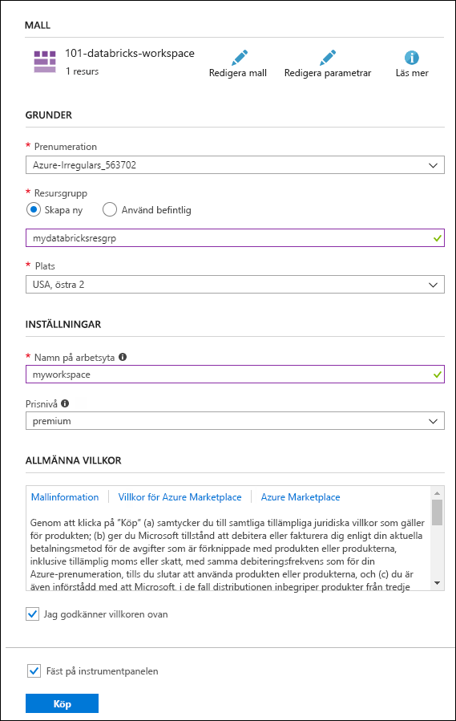

# <a name="quickstart-create-an-azure-databricks-workspace-by-using-the-azure-resource-manager-template"></a>Snabb start: skapa en Azure Databricks-arbetsyta med hjälp av Azure Resource Manager-mallen

I den här snabb starten använder du en Azure Resource Manager-mall för att skapa en Azure Databricks arbets yta. När arbets ytan har skapats verifierar du distributionen.

[!INCLUDE [About Azure Resource Manager](../../includes/resource-manager-quickstart-introduction.md)]

## <a name="prerequisites"></a>Förutsättningar

För att slutföra den här artikeln måste du:

* Ha en Azure-prenumeration – [skapa en kostnads fritt](https://azure.microsoft.com/free/)

## <a name="create-an-azure-databricks-workspace"></a>Skapa en Azure Databricks-arbetsyta

### <a name="review-the-template"></a>Granska mallen

Mallen som används i den här snabb starten är från [Azure snabb starts-mallar](https://github.com/Azure/azure-quickstart-templates/tree/master/101-databricks-workspace).

:::code language="json" source="~/quickstart-templates/101-databricks-workspace/azuredeploy.json" range="1-53":::

Den Azure-resurs som definierats i mallen är Microsoft. Databricks/arbetsytes: skapa en arbets yta för Azure Databricks. 

## <a name="deploy-the-template"></a>Distribuera mallen

I det här avsnittet skapar du en Azure Databricks-arbetsyta med Azure Resource Manager-mallen.

1. Välj följande bild för att logga in på Azure och öppna en mall. Mallen skapar en Azure Databricks-arbetsyta.

   [](https://portal.azure.com/#create/Microsoft.Template/uri/https%3A%2F%2Fraw.githubusercontent.com%2FAzure%2Fazure-quickstart-templates%2Fmaster%2F101-databricks-workspace%2Fazuredeploy.json)

2. Skapa Azure Databricks-arbetsytan genom att ange nödvändiga värden

   

   Ange följande värden:

   |Egenskap  |Beskrivning  |
   |---------|---------|
   |**Prenumeration**     | I listrutan väljer du din Azure-prenumeration.        |
   |**Resursgrupp**     | Ange om du vill skapa en ny resursgrupp eller använda en befintlig. En resursgrupp är en container som innehåller relaterade resurser för en Azure-lösning. Mer information finns i [översikten över Azure-resursgrupper](../azure-resource-manager/management/overview.md). |
   |**Position**     | Välj **USA, östra 2**. För andra tillgängliga regioner läser du informationen om [Azure-tjänsttillgänglighet per region](https://azure.microsoft.com/regions/services/).        |
   |**Namn på arbetsyta**     | Ange ett namn för Databricks-arbetsytan        |
   |**Pris nivå**     |  Välj mellan **Standard** och **Premium**. Mer information om de här nivåerna finns på [prissättningssidan för Databricks](https://azure.microsoft.com/pricing/details/databricks/).       |

3. Välj **Granska + skapa** och klicka sedan på **Skapa**.

4. Det tar några minuter att skapa arbetsytan. När en distribution av arbets ytan Miss lyckas skapas arbets ytan fortfarande i ett felaktigt tillstånd. Ta bort den misslyckade arbets ytan och skapa en ny arbets yta som löser distributions felen. När du tar bort den misslyckade arbets ytan raderas även den hanterade resurs gruppen och alla resurser som har distribuerats.

## <a name="review-deployed-resources"></a>Granska distribuerade resurser

Du kan antingen använda Azure Portal för att kontrol lera Azure Databricks arbets ytan eller använda följande Azure CLI-eller Azure PowerShell skript för att visa en lista över resursen.

### <a name="azure-cli"></a>Azure CLI

```azurecli-interactive
echo "Enter your Azure Databricks workspace name:" &&
read databricksWorkspaceName &&
echo "Enter the resource group where the Azure Databricks workspace exists:" &&
read resourcegroupName &&
az databricks workspace show -g $resourcegroupName -n $databricksWorkspaceName
```

### <a name="azure-powershell"></a>Azure PowerShell

```azurepowershell-interactive
$resourceGroupName = Read-Host -Prompt "Enter the resource group name where your Azure Databricks workspace exists"
(Get-AzResource -ResourceType "Microsoft.Databricks/workspaces" -ResourceGroupName $resourceGroupName).Name
 Write-Host "Press [ENTER] to continue..."
```

## <a name="clean-up-resources"></a>Rensa resurser

Om du planerar att fortsätta med efterföljande självstudier kanske du vill lämna resurserna på plats. När de inte längre behövs tar du bort resurs gruppen, som tar bort Azure Databricks-arbetsytan och relaterade hanterade resurser. Ta bort resurs gruppen med hjälp av Azure CLI eller Azure PowerShell:

### <a name="azure-cli"></a>Azure CLI

```azurecli-interactive
echo "Enter the Resource Group name:" &&
read resourceGroupName &&
az group delete --name $resourceGroupName &&
echo "Press [ENTER] to continue ..."
```

### <a name="azure-powershell"></a>Azure PowerShell

```azurepowershell-interactive
$resourceGroupName = Read-Host -Prompt "Enter the Resource Group name"
Remove-AzResourceGroup -Name $resourceGroupName
Write-Host "Press [ENTER] to continue..."
```

## <a name="next-steps"></a>Nästa steg

I den här snabb starten skapade du en Azure Databricks-arbetsyta med hjälp av en Azure Resource Manager-mall och verifierade distributionen. Gå till nästa artikel om du vill lära dig hur du utför en ETL-åtgärd (extrahera, transformera och läsa in data) med Azure Databricks.

> [!div class="nextstepaction"]
> [Extrahera, transformera och läsa in data med Azure Databricks](databricks-extract-load-sql-data-warehouse.md)
