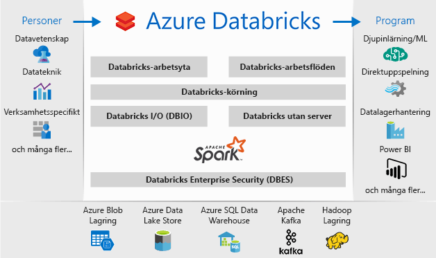

# Vad är Azure Databricks?

Azure Databricks är en Apache Spark-baserad analysplattform som är optimerad för Microsoft Azures plattform för molntjänster. Databricks har utformats med grundarna av Apache Spark och är integrerat med Azure för att tillhandahålla konfiguration med ett klick, effektiva arbetsflöden och en interaktiv arbetsyta som möjliggör samarbete mellan dataanalytiker, dataingenjörer och affärsanalytiker.

Azure Databricks är en snabb och enkel Apache Spark-baserad analystjänst med samarbetsfunktioner. För en stordatapipeline matas data (rådata eller strukturerade data) in i Azure via Azure Data Factory i batchar eller strömmas i nära realtid med hjälp av Kafka, Event Hub eller IoT Hub. Dessa data hamnar i en datasjö för långsiktig beständig lagring i Azure Blob Storage eller Azure Data Lake Storage. Som en del av ditt analysarbetsflöde använder du Azure Databricks för att läsa data från flera datakällor såsom [Azure Blob Storage](../storage/blobs/storage-blobs-introduction.md), [Azure Data Lake Storage](../data-lake-store/index.md), [Azure Cosmos DB](../cosmos-db/index.yml) eller [Azure SQL Data Warehouse](../sql-data-warehouse/index.md) och omvandlar dem till banbrytande insikter med hjälp av Spark.

## Apache Spark-baserad analysplattform

Azure Databricks består av Apache Spark-klusterteknik och funktioner med helt öppen källkod. Spark i Azure Databricks innehåller följande komponenter:

* **Spark SQL och DataFrames**: Spark SQL är Spark-modulen för arbete med strukturerade data. En DataFrame är en distribuerad datasamling som har ordnats i namngivna kolumner. Begreppsmässigt motsvarar den en tabell i en relationsdatabas eller en dataram i R/Python.

* **Strömning**: Realtidsbearbetning av data och analys för analysprogram och interaktiva program. Integreras med HDFS, Flume och Kafka.

* **MLib**: Machine Learning-bibliotek som består av vanliga algoritmer och verktyg, inklusive klassificering, regression, klustring, samarbetsfilter, dimensionsminskning samt underliggande optimeringsprimitiver.

* **GraphX**: Diagram och diagramberäkning för ett brett omfång av användarfall, från kognitiv analys till datautforskning.

* **Spark Core API**: Har stöd för R, SQL, Python, Scala och Java.

## Apache Spark i Azure Databricks

Azure Databricks bygger på funktionerna i Spark genom att tillhandahålla en underhållsfri molnplattform som innehåller:

- Helt hanterade Spark-kluster
- En interaktiv arbetsyta för utforskning och visualisering
- En plattform för Spark-baserade program

### Helt hanterade Apache Spark-kluster i molnet

Azure Databricks har en säker och tillförlitlig produktionsmiljö i molnet, som hanteras och stöds av Spark-experter. Du kan:

* Skapa kluster på några sekunder.
* Autoskala automatiskt kluster upp och ned, inklusive serverlösa kluster, och dela dem i olika grupper. 
* Använd kluster programmässigt med hjälp av REST-API:er. 
* Använd säkra funktioner för dataintegrering som byggs ovanpå Spark och gör det möjligt att göra data enhetliga utan centralisering. 
* Få åtkomst direkt till de senaste Apache Spark-funktionerna med varje version.

### Databricks Runtime
Databricks Runtime bygger på Apache Spark och är utformat för Azure-molnet. 

Med det **serverlösa** alternativet kan Azure Databricks helt ta bort komplexiteten i infrastrukturen och behovet av specialkunskaper för att installera och konfigurera datainfrastrukturen. Det serverlösa alternativet hjälper dataexperter att snabbt iterera som ett team.

För datatekniker som bryr sig om prestanda för produktionsjobb tillhandahåller Azure Databricks en Spark-motor som är snabbare och har bättre prestanda i olika optimeringar i I/O-lagret och bearbetningslagret (Databricks I/O).

### Arbetsyta för samarbete

Via en gemensam och integrerad miljö effektiviserar Azure Databricks processen med att utforska data, skapa prototyper och köra datadrivna program i Spark.

* Avgör hur du vill använda data med enkel datautforskning.
* Dokumentera förloppet på bärbara datorer i R, Python, Scala eller SQL.
* Visualisera data med några få klickningar och använd välbekanta verktyg som Matplotlib, ggplot eller d3.
* Använd interaktiva instrumentpaneler för att skapa dynamiska rapporter.
* Använd Spark och interagera med data samtidigt.

## Företagssäkerhet

Azure Databricks ger Azure-säkerhet i företagsklass, inklusive integrering av Azure Active Directory, rollbaserade kontroller och serviceavtal som skyddar data och företaget.

* Med hjälp av integrering med Azure Active Directory kan du köra fullständiga Azure-baserade lösningar med Azure Databricks.
* Den rollbaserade åtkomsten i Azure Databricks möjliggör detaljerad användarbehörighet för bärbara datorer, kluster, jobb och data.
* Serviceavtal i företagsklass. 

## Integrering med Azure-tjänster

Azure Databricks integreras djupt med Azure-databaser och -lager: SQL Data Warehouse, Cosmos DB, Data Lake Store och Blob Storage. 

## Integrering med Power BI
Genom omfattande integrering med Power BI gör Azure Databricks det möjligt att identifiera och dela dina effektfulla insikter snabbt och enkelt. Du kan även använda andra BI-verktyg, som Tableau Software via JDBC/ODBC-klusterslutpunkter.

## Nästa steg

* [Snabbstart: Köra ett Spark-jobb på Azure Databricks](quickstart-create-databricks-workspace-portal.md)
* [Arbeta med Spark-kluster](https://docs.azuredatabricks.net/user-guide/clusters/index.html)
* [Arbeta med bärbara datorer](https://docs.azuredatabricks.net/user-guide/notebooks/index.html)
* [Skapa Spark-jobb](https://docs.azuredatabricks.net/user-guide/jobs.html)

 

