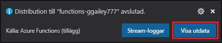

# Snabb start: skapa en funktion i Azure med python med hjälp av Visual Studio Code

[!INCLUDE [functions-language-selector-quickstart-vs-code](../../includes/functions-language-selector-quickstart-vs-code.md)]

I den här artikeln använder du Visual Studio Code för att skapa en python-funktion som svarar på HTTP-begäranden. När du har testat koden lokalt distribuerar du den till den serverbaserade miljön för Azure Functions.

Att slutföra den här snabb starten innebär en låg kostnad av några USD cent eller mindre i ditt Azure-konto.

Det finns också en [CLI-baserad version](create-first-function-cli-python.md) av den här artikeln.

## Konfigurera din miljö

Innan du börjar bör du kontrol lera att du har följande krav på plats:

+ Ett Azure-konto med en aktiv prenumeration. [Skapa ett konto kostnads fritt](https://azure.microsoft.com/free/?ref=microsoft.com&utm_source=microsoft.com&utm_medium=docs&utm_campaign=visualstudio).

+ [Node.js](https://nodejs.org/)som krävs av Windows för NPM. Endast [aktiva LTS-och underhålls LTS-versioner](https://nodejs.org/about/releases/). Använd `node --version` kommandot för att kontrol lera din version.
    Krävs inte för lokal utveckling på macOS och Linux.

+ [Python 3,8](https://www.python.org/downloads/release/python-381/), [python 3,7](https://www.python.org/downloads/release/python-375/), [python 3,6](https://www.python.org/downloads/release/python-368/) stöds av Azure Functions (x64).

+ [Visual Studio Code](https://code.visualstudio.com/) på en av de [plattformar som stöds](https://code.visualstudio.com/docs/supporting/requirements#_platforms).

+ [Python-tillägget](https://marketplace.visualstudio.com/items?itemName=ms-python.python) för Visual Studio Code.  

+ [Azure Functions-tillägget](https://marketplace.visualstudio.com/items?itemName=ms-azuretools.vscode-azurefunctions) för Visual Studio Code.

## Skapa ditt lokala projekt

I det här avsnittet använder du Visual Studio Code för att skapa ett lokalt Azure Functions projekt i python. Senare i den här artikeln ska du publicera funktions koden till Azure.

1. Välj Azure-ikonen i aktivitets fältet och välj sedan ikonen **Skapa nytt projekt** i avsnittet **Azure: Functions** .

    

1. Välj en katalog plats för projekt arbets ytan och välj **Välj**.

    > [!NOTE]
    > De här stegen har utformats för att slutföras utanför en arbets yta. Välj i det här fallet inte en projektmapp som ingår i en arbetsyta.

1. Ange följande information i prompten:

    + **Välj ett språk för ditt funktions projekt** : Välj `Python` .

    + **Välj ett python-alias för att skapa en virtuell miljö** : Välj platsen för din python-tolk. Om platsen inte visas anger du den fullständiga sökvägen till din python-binärfil.  

    + **Välj en mall för projektets första funktion** : Välj `HTTP trigger` .

    + **Ange ett funktions namn** : typ `HttpExample` .

    + **Autentiseringsnivå** : Välj `Anonymous` , vilket gör att vem som helst kan anropa funktions slut punkten. Mer information om autentiseringsnivå finns i [Authorization Keys](functions-bindings-http-webhook-trigger.md#authorization-keys).

    + **Välj hur du vill öppna projektet** : Välj `Add to workspace` .

1. Med hjälp av den här informationen genererar Visual Studio Code ett Azure Functions-projekt med en HTTP-utlösare. Du kan visa de lokala projektfilerna i Utforskaren. Mer information om filer som skapas finns i [genererade projektfiler](functions-develop-vs-code.md#generated-project-files).

[!INCLUDE [functions-run-function-test-local-vs-code](../../includes/functions-run-function-test-local-vs-code.md)]

När du har kontrollerat att funktionen fungerar korrekt på den lokala datorn är det dags att använda Visual Studio Code för att publicera projektet direkt till Azure.

[!INCLUDE [functions-sign-in-vs-code](../../includes/functions-sign-in-vs-code.md)]

## Publicera projektet på Azure

I det här avsnittet ska du skapa en Function-app och relaterade resurser i din Azure-prenumeration och sedan distribuera din kod. 

> [!IMPORTANT]
> Om du publicerar till en befintlig funktionsapp skrivs innehållet i den appen över i Azure. 

1. Välj Azure-ikonen i aktivitets fältet och välj sedan knappen **distribuera till Function-appen** i avsnittet **Azure:** functions.

    

1. Ange följande information i prompten:

    + **Välj mapp** : Välj en mapp från din arbets yta eller bläddra till en mapp som innehåller din Function-app. Du ser inte det här om du redan har en giltig Function-app öppen.

    + **Välj prenumeration** : Välj den prenumeration som ska användas. Du ser inte det här om du bara har en prenumeration.

    + **Välj Funktionsapp i Azure** : Välj `+ Create new Function App` . (Välj inte `Advanced` alternativet, som inte beskrivs i den här artikeln.)

    + **Ange ett globalt unikt namn för Function-appen** : Ange ett namn som är giltigt i en URL-sökväg. Namnet du skriver verifieras för att säkerställa att det är unikt i Azure Functions. 

    + **Välj en körning** : Välj den version av python som du har kört lokalt. Du kan `python --version` kontrol lera din version med hjälp av kommandot.

    + **Välj en plats för nya resurser** : om du vill ha bättre prestanda väljer du en [region](https://azure.microsoft.com/regions/) nära dig.

1. När det är slutfört skapas följande Azure-resurser i din prenumeration med hjälp av namn baserat på ditt funktions program namn:

    + En resurs grupp, som är en logisk behållare för relaterade resurser.
    + Ett standard Azure Storage-konto som upprätthåller tillstånd och annan information om dina projekt.
    + En förbruknings plan som definierar den underliggande värden för din server lös Function-app. 
    + En Function-app som tillhandahåller miljön för att köra funktions koden. Med en Function-app kan du gruppera funktioner som en logisk enhet för enklare hantering, distribution och delning av resurser inom samma värd plan.
    + En Application Insights instans som är ansluten till Function-appen, som spårar användningen av din server lös funktion.

    Ett meddelande visas när funktionsappen har skapats och distributionspaketet har tillämpats. 

1. Välj **Visa utdata** i det här meddelandet för att Visa skapande-och distributions resultaten, inklusive de Azure-resurser som du har skapat. Om du saknar meddelandet väljer du klock ikonen i det nedre högra hörnet för att se den igen.

    

[!INCLUDE [functions-vs-code-run-remote](../../includes/functions-vs-code-run-remote.md)]

[!INCLUDE [functions-cleanup-resources-vs-code.md](../../includes/functions-cleanup-resources-vs-code.md)]

## Nästa steg

Du har nu använt Visual Studio Code för att skapa en funktionsapp med en enkel HTTP-utlöst funktion. I nästa artikel expanderar du den funktionen genom att lägga till en utgående bindning. Den här bindningen skriver strängen från HTTP-begäran till ett meddelande i en Azure Queue Storage-kö. 

> [!div class="nextstepaction"]
> [Ansluta till en Azure Storage-kö](functions-add-output-binding-storage-queue-vs-code.md?pivots=programming-language-python)

[Har du problem? Berätta för oss.](https://aka.ms/python-functions-qs-survey)

[Azure Functions Core Tools]: functions-run-local.md
[Azure Functions extension for Visual Studio Code]: https://marketplace.visualstudio.com/items?itemName=ms-azuretools.vscode-azurefunctions
