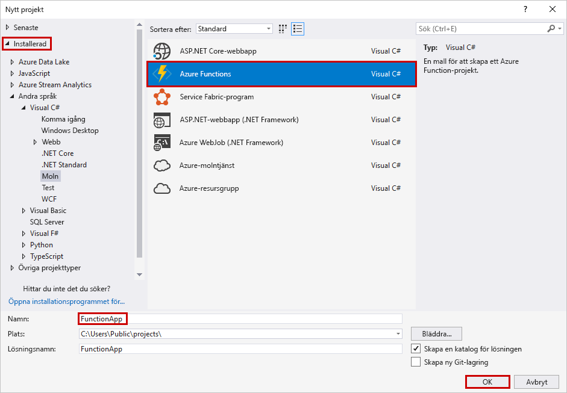
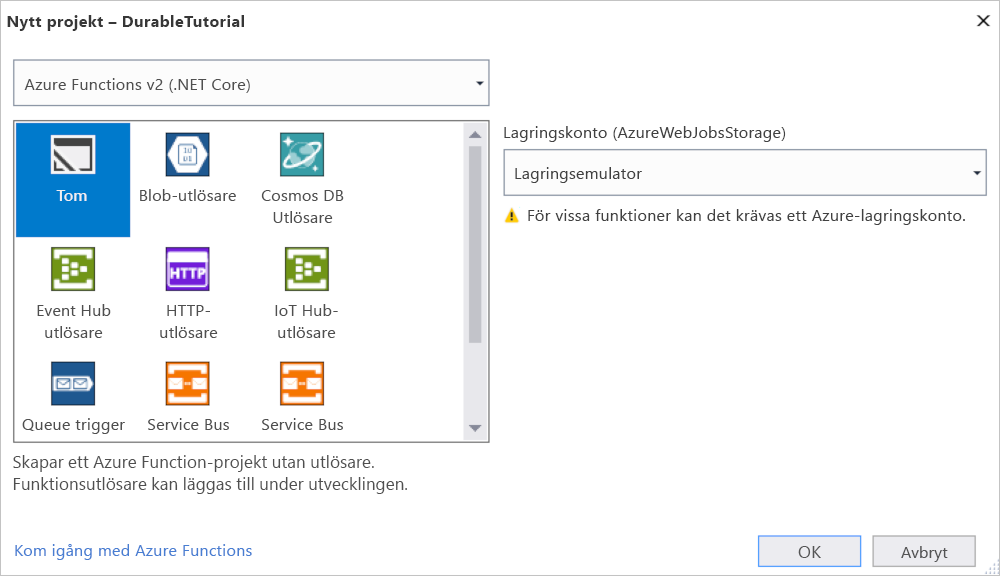
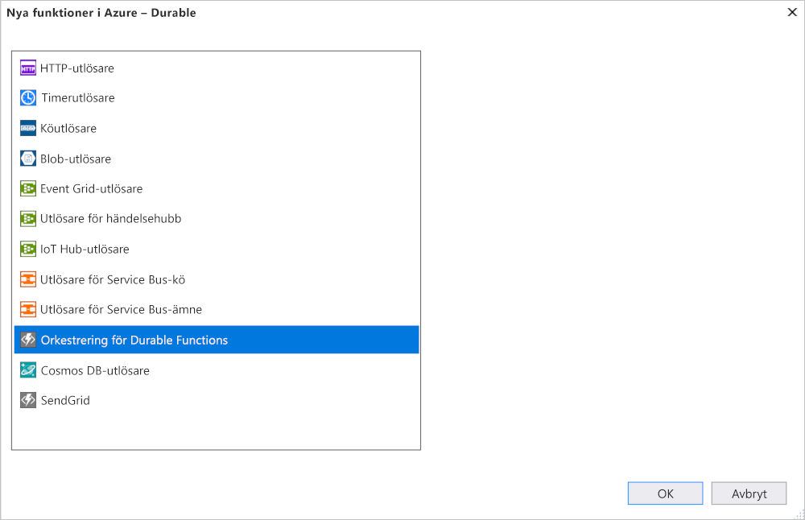

# <a name="create-your-first-durable-function-in-c"></a>Skapa din första beständiga funktion i C\#

*Durable Functions* är en utökning av [Azure Functions](../functions-overview.md) som gör att du kan skriva tillståndskänsliga funktioner i en serverlös miljö. Tillägget hanterar tillstånd, kontrollpunkter och omstarter.

::: zone pivot="code-editor-vscode"

I den här artikeln får du lära dig hur du använder Visual Studio Code för att lokalt skapa och testa en "Hello World"-beständig funktion.  Den här funktionen orkestrerar och kedjar samman anrop till andra funktioner. Du publicerar sedan funktionskoden till Azure. De här verktygen är tillgängliga som en del av VS Code [Azure Functions-tillägget](https://marketplace.visualstudio.com/items?itemName=ms-azuretools.vscode-azurefunctions).


## <a name="prerequisites"></a>Förutsättningar

För att slutföra den här kursen behöver du:

* Installera [Visual Studio Code](https://code.visualstudio.com/download).

* Installera följande VS Code-tillägg:
    - [Azure Functions](https://marketplace.visualstudio.com/items?itemName=ms-azuretools.vscode-azurefunctions)
    - [C#](https://marketplace.visualstudio.com/items?itemName=ms-dotnettools.csharp)

* Kontrol lera att du har den senaste versionen av [Azure Functions Core tools](../functions-run-local.md).

* Durable Functions kräver ett Azure Storage-konto. Du behöver en Azure-prenumeration.

* Kontrol lera att du har version 3,1 eller en senare version av [.net Core SDK](https://dotnet.microsoft.com/download) installerad.

[!INCLUDE [quickstarts-free-trial-note](../../../includes/quickstarts-free-trial-note.md)]

## <a name="create-your-local-project"></a><a name="create-an-azure-functions-project"></a>Skapa ditt lokala projekt 

I det här avsnittet använder du Visual Studio Code för att skapa ett lokalt Azure Functions-projekt. 

1. Tryck på F1 (eller Ctrl + Cmd + Shift + P) i Visual Studio Code för att öppna kommando paletten. I paletten kommando söker du efter och väljer `Azure Functions: Create New Project...` .

    

1. Välj en tom mapplats för ditt projekt och välj **Välj**.

1. Ange följande information i instruktionerna nedan:

    | Prompt | Värde | Beskrivning |
    | ------ | ----- | ----------- |
    | Välj ett språk för ditt projekt för Function-appen | C# | Skapa ett lokalt C# Functions-projekt. |
    | Välj en version | Azure Functions v3 | Du ser bara det här alternativet när kärn verktygen inte redan har installerats. I det här fallet installeras kärn verktyg första gången du kör appen. |
    | Välj en mall för projektets första funktion | Hoppa över så länge | |
    | Välj hur du vill öppna projektet | Öppna i aktuellt fönster | Öppnar VS-kod i den mapp som du har valt. |

Visual Studio Code installerar Azure Functions Core Tools, om det behövs. Det skapar också ett app-projekt i en mapp. Det här projektet innehåller [host.js](../functions-host-json.md) och [local.settings.jsi](../functions-run-local.md#local-settings-file) konfigurationsfiler.

## <a name="add-functions-to-the-app"></a>Lägga till funktioner i appen

Följande steg använder en mall för att skapa varaktig funktionskod.

1. I paletten kommando söker du efter och väljer `Azure Functions: Create Function...` .

1. Ange följande information i instruktionerna nedan:

    | Prompt | Värde | Beskrivning |
    | ------ | ----- | ----------- |
    | Välj en mall för din funktion | DurableFunctionsOrchestration | Skapa ett Durable Functions Orchestration |
    | Ange ett funktions namn | HelloOrchestration | Namnet på klassen där funktionerna skapas |
    | Ange ett namn område | Company. Function | Namnrymd för den genererade klassen |

1. Vid VS-kod kan du välja ett lagrings konto genom att välja **Välj lagrings konto**. Följ instruktionerna och ange följande information för att skapa ett nytt lagrings konto i Azure.

    | Prompt | Värde | Beskrivning |
    | ------ | ----- | ----------- |
    | Välj en prenumeration | *namnet på din prenumeration* | Välj din Azure-prenumeration |
    | Välj ett lagrings konto | Skapa ett nytt lagringskonto |  |
    | Ange namnet på det nya lagrings kontot | *unikt namn* | Namn på det lagrings konto som ska skapas |
    | Välj en resursgrupp | *unikt namn* | Namnet på den resurs grupp som ska skapas |
    | Välja en plats | *nationella* | Välj en region nära dig |

En klass som innehåller de nya funktionerna läggs till i projektet. VS Code lägger också till anslutnings strängen för lagrings kontot till *local.settings.jspå* och en referens till [`Microsoft.Azure.WebJobs.Extensions.DurableTask`](https://www.nuget.org/packages/Microsoft.Azure.WebJobs.Extensions.DurableTask) NuGet-paketet *i. CSPROJ* -projektfilen.

Öppna den nya *HelloOrchestration.cs* -filen för att visa innehållet. Det här beständiga funktionen är ett enkelt funktionslänkningsexempel med följande metoder:  

| Metod | FunctionName | Description |
| -----  | ------------ | ----------- |
| **`RunOrchestrator`** | `HelloOrchestration` | Hanterar varaktig orkestrering. I det här fallet startar orkestreringen, den skapar en lista och lägger till resultatet av tre funktionsanrop i listan.  När de tre funktionsanropen har slutförts returnerar den listan. |
| **`SayHello`** | `HelloOrchestration_Hello` | Funktionen returnerar ett ”hello”. Funktionen som innehåller affärs logiken som dirigeras. |
| **`HttpStart`** | `HelloOrchestration_HttpStart` | En [HTTP-utlöst funktion](../functions-bindings-http-webhook.md) som startar en instans av orkestreraren och returnerar ett statuskontrollsvar. |

Nu när du har skapat ditt funktionsprojekt och en beständig funktion kan du testa den på en lokal dator.

## <a name="test-the-function-locally"></a>Testa funktionen lokalt

Med Azure Functions Core Tools kan du köra ett Azure Functions-projekt på din lokala utvecklingsdator. Du uppmanas att installera de här verktygen första gången du startar en funktion från Visual Studio Code.

1. Testa din funktion genom att ange en Bryt punkt i `SayHello` aktivitetens funktions kod och tryck på F5 för att starta projektet för Function-appen. Utdata från Core Tools visas på panelen **Terminal**.

    > [!NOTE]
    > Mer information om fel sökning hittar du i [Durable Functions Diagnostics](durable-functions-diagnostics.md#debugging) .

1. På panelen **Terminal** kopierar du URL-slutpunkten för den HTTP-utlösta funktionen.

    

1. Skicka en HTTP POST-begäran till URL-slutpunkten med hjälp av ett verktyg som [Postman](https://www.getpostman.com/) eller [sväng](https://curl.haxx.se/).

   Svaret är det första resultatet från HTTP-funktionen, som anger att den beständiga orkestreringen har startats korrekt. Det är inte ännu slutresultatet av orkestreringen. Svaret innehåller några användbara URL:er. För tillfället kör vi en fråga om orkestreringens status.

1. Kopiera URL-värdet för `statusQueryGetUri` och klistra in det i webbläsarens Adress fält och kör begäran. Alternativt kan du även fortsätta att använda Postman för att utfärda GET-begäran.

   Begäran kör en fråga mot orkestreringsinstansen om statusen. Du får ett möjligt svar som visar att instansen har slutförts och innehåller utdata eller resultat från den varaktiga funktionen. Det ser ut så här: 

    ```json
    {
        "name": "HelloOrchestration",
        "instanceId": "9a528a9e926f4b46b7d3deaa134b7e8a",
        "runtimeStatus": "Completed",
        "input": null,
        "customStatus": null,
        "output": [
            "Hello Tokyo!",
            "Hello Seattle!",
            "Hello London!"
        ],
        "createdTime": "2020-03-18T21:54:49Z",
        "lastUpdatedTime": "2020-03-18T21:54:54Z"
    }
    ```

1. Stoppa fel sökningen genom att trycka på **SKIFT + F5** i vs Code.

När du har kontrollerat att funktionen körs korrekt på den lokala datorn är det dags att publicera projektet på Azure.

[!INCLUDE [functions-create-function-app-vs-code](../../../includes/functions-sign-in-vs-code.md)]

[!INCLUDE [functions-publish-project-vscode](../../../includes/functions-publish-project-vscode.md)]

## <a name="test-your-function-in-azure"></a>Testa din funktion i Azure

1. Kopiera URL:en för HTTP-utlösaren från panelen **Utdata**. Den URL som anropar den HTTP-utlösta funktionen ska ha följande format:

    `https://<functionappname>.azurewebsites.net/api/HelloOrchestration_HttpStart`

1. Klistra in den nya URL:en för HTTP-begäran i webbläsarens adressfält. Du bör få samma statussvar som förut när du använder den publicerade appen.

## <a name="next-steps"></a>Nästa steg

Du har använt Visual Studio Code för att skapa och publicera en funktion i C#-appen.

> [!div class="nextstepaction"]
> [Läs mer om vanliga mönster för beständiga funktioner](durable-functions-overview.md#application-patterns)

::: zone-end

::: zone pivot="code-editor-visualstudio"

I den här artikeln får du lära dig hur du använder Visual Studio 2019 för att lokalt skapa och testa en "Hello World"-beständig funktion.  Den här funktionen orkestrerar och kedjar samman anrop till andra funktioner. Du publicerar sedan funktionskoden till Azure. De här verktygen är tillgängliga som en del av arbets belastningen Azure Development i Visual Studio 2019.


## <a name="prerequisites"></a>Förutsättningar

För att slutföra den här kursen behöver du:

* Installera [Visual Studio 2019](https://visualstudio.microsoft.com/vs/). Kontrollera att även arbetsbelastningen **Azure-utveckling** är installerad. Visual Studio 2017 har också stöd för Durable Functions utveckling, men användar gränssnittet och stegen är annorlunda.

* Kontrollera att [Azure Storage Emulator](../../storage/common/storage-use-emulator.md) är installerad och körs.

[!INCLUDE [quickstarts-free-trial-note](../../../includes/quickstarts-free-trial-note.md)]

## <a name="create-a-function-app-project"></a>Skapa ett funktionsapprojekt

Med Azure Functions-mallen skapas ett projekt som kan publiceras till en funktionsapp i Azure. Med en Function-app kan du gruppera funktioner som en logisk enhet för enklare hantering, distribution, skalning och delning av resurser.

1. I Visual Studio väljer du **nytt**  >  **projekt** på **Arkiv** -menyn.

1. I dialog rutan **skapa ett nytt projekt** söker du efter `functions` , väljer mallen **Azure Functions** och väljer **Nästa**. 

    

1. Skriv ett **projekt namn** för projektet och välj **OK**. Projekt namnet måste vara giltigt som ett C#-namn område, så Använd inte under streck, bindestreck eller andra tecken som inte är alfanumeriska.

1. Använd de inställningar som anges i tabellen som följer efter bilden i **skapa ett nytt Azure Functions program**.

    

    | Inställning      | Föreslaget värde  | Beskrivning                      |
    | ------------ |  ------- |----------------------------------------- |
    | **Version** | Azure Functions 3,0 <br />(.NET Core) | Skapar ett funktions projekt som använder version 3,0-körningen av Azure Functions, som har stöd för .NET Core 3,1. Läs mer i informationen om att [köra rätt körningsversion av Azure Functions](../functions-versions.md).   |
    | **Mall** | Tom | Detta skapar en tom funktionsapp. |
    | **Lagringskonto**  | Lagringsemulator | Det krävs ett lagringskonto för tillståndshanteringen för den beständiga funktionen. |

4. Välj **skapa** för att skapa ett tomt funktions projekt. Det här projektet har grundläggande konfigurationsfiler som behövs för att köra dina funktioner.

## <a name="add-functions-to-the-app"></a>Lägga till funktioner i appen

Följande steg använder en mall för att skapa varaktig funktionskod.

1. Högerklicka på projektet i Visual Studio och välj **Lägg till**  >  **ny Azure-funktion**.

    

1. Verifiera att **Azure Function** har marker ATS på Lägg till-menyn, Skriv ett namn för C#-filen och välj sedan **Lägg till**.

1. Välj mallen **Durable Functions Orchestration** och välj sedan **OK**

    

En ny beständig funktion läggs till i appen.  Öppna den nya .cs-filen för att visa innehållet. Det här beständiga funktionen är ett enkelt funktionslänkningsexempel med följande metoder:  

| Metod | FunctionName | Description |
| -----  | ------------ | ----------- |
| **`RunOrchestrator`** | `<file-name>` | Hanterar varaktig orkestrering. I det här fallet startar orkestreringen, den skapar en lista och lägger till resultatet av tre funktionsanrop i listan.  När de tre funktionsanropen har slutförts returnerar den listan. |
| **`SayHello`** | `<file-name>_Hello` | Funktionen returnerar ett ”hello”. Funktionen som innehåller affärs logiken som dirigeras. |
| **`HttpStart`** | `<file-name>_HttpStart` | En [HTTP-utlöst funktion](../functions-bindings-http-webhook.md) som startar en instans av orkestreraren och returnerar ett statuskontrollsvar. |

Nu när du har skapat ditt funktionsprojekt och en beständig funktion kan du testa den på en lokal dator.

## <a name="test-the-function-locally"></a>Testa funktionen lokalt

Med Azure Functions Core Tools kan du köra ett Azure Functions-projekt på din lokala utvecklingsdator. Du uppmanas att installera de här verktygen första gången du startar en funktion från Visual Studio.

1. Tryck på F5 för att testa funktionen. Acceptera begäran från Visual Studio för att ladda ned och installera Azure Functions Core (CLI)-verktyg. Du kan även behöva skapa ett brandväggsundantag så att verktygen kan hantera HTTP-förfrågningar.

2. Kopiera URL:en för funktionen från dina Azure Functions-utdata.

    

3. Klistra in webbadressen för HTTP-begäran i webbläsarens adressfält och kör begäran. Nedan visas svaret på den lokala GET-begäran som returnerades av funktionen i webbläsaren:

    

    Svaret är det första resultatet från HTTP-funktionen, som anger att den beständiga orkestreringen har startats korrekt.  Det är inte ännu slutresultatet av orkestreringen.  Svaret innehåller några användbara URL:er.  För tillfället kör vi en fråga om orkestreringens status.

4. Kopiera URL-värdet för `statusQueryGetUri`, klistra in det i webbläsarens adressfält och kör begäran.

    Begäran kör en fråga mot orkestreringsinstansen om statusen. Du bör så småningom få ett svar som liknar följande.  Det här resultatet visar att instansen har slutförts och innehåller utdata eller resultat från den varaktiga funktionen.

    ```json
    {
        "instanceId": "d495cb0ac10d4e13b22729c37e335190",
        "runtimeStatus": "Completed",
        "input": null,
        "customStatus": null,
        "output": [
            "Hello Tokyo!",
            "Hello Seattle!",
            "Hello London!"
        ],
        "createdTime": "2019-11-02T07:07:40Z",
        "lastUpdatedTime": "2019-11-02T07:07:52Z"
    }
    ```

5. Stoppa fel sökningen genom att trycka på **SKIFT + F5**.

När du har kontrollerat att funktionen körs korrekt på den lokala datorn är det dags att publicera projektet på Azure.

## <a name="publish-the-project-to-azure"></a>Publicera projektet på Azure

Du måste ha en funktionsapp i din Azure-prenumeration innan du kan publicera projektet. Du kan skapa en funktionsapp direkt från Visual Studio.

[!INCLUDE [Publish the project to Azure](../../../includes/functions-vstools-publish.md)]

## <a name="test-your-function-in-azure"></a>Testa din funktion i Azure

1. Kopiera den grundläggande URL:en för funktionsappen från sidan Publicera profil. Ersätt `localhost:port`-delen av URL:en som du använde när du testade funktionen lokalt med den nya bas-URL:en.

    Den URL som anropar HTTP-utlösaren för den beständiga funktionen ska ha följande format:

    `https://<APP_NAME>.azurewebsites.net/api/<FUNCTION_NAME>_HttpStart`

2. Klistra in den nya URL:en för HTTP-begäran i webbläsarens adressfält. Du bör få samma statussvar som förut när du använder den publicerade appen.

## <a name="next-steps"></a>Nästa steg

Du har använt Visual Studio för att skapa och publicera en beständig C#-funktionsapp.

> [!div class="nextstepaction"]
> [Läs mer om vanliga mönster för beständiga funktioner](durable-functions-overview.md#application-patterns)

::: zone-end
