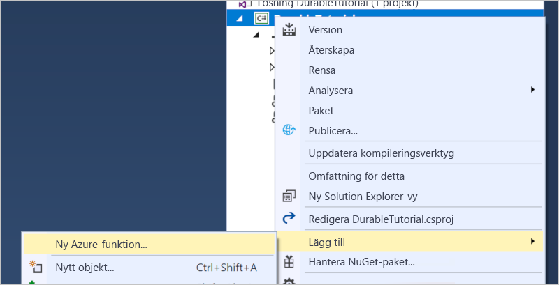

# <a name="create-your-first-durable-function-in-c"></a>Skapa din första beständiga funktion i C\#

*Durable Functions* är en utökning av [Azure Functions](../functions-overview.md) som gör att du kan skriva tillståndskänsliga funktioner i en serverlös miljö. Tillägget hanterar tillstånd, kontrollpunkter och omstarter.

I den här artikeln får du lära dig hur du använder Visual Studio 2017-verktyg för Azure Functions för att skapa och testa en beständig ”Hello World”-funktion lokalt.  Den här funktionen orkestrerar och kedjar samman anrop till andra funktioner. Du publicerar sedan funktionskoden till Azure. De här verktygen är tillgängliga som en del av arbetsbelastningen Azure Development i Visual Studio 2017.


## <a name="prerequisites"></a>Nödvändiga komponenter

För att slutföra den här självstudien behöver du:

* Installera [Visual Studio 2017](https://azure.microsoft.com/downloads/). Kontrollera att även arbetsbelastningen **Azure-utveckling** är installerad.

* Kontrollera att du har de [senaste Azure Functions-verktygen](../functions-develop-vs.md#check-your-tools-version).

* Kontrollera att [Azure Storage Emulator](../../storage/common/storage-use-emulator.md) är installerad och körs.

[!INCLUDE [quickstarts-free-trial-note](../../../includes/quickstarts-free-trial-note.md)]

## <a name="create-a-function-app-project"></a>Skapa ett funktionsapprojekt

Med Azure Functions-mallen skapas ett projekt som kan publiceras till en funktionsapp i Azure. Med en funktionsapp kan du gruppera funktioner som en logisk enhet så att det blir enklare att hantera, distribuera och dela resurser.

1. Välj **Nytt** > **Projekt** från **Arkiv**-menyn i Visual Studio.

2. I dialogrutan **Nytt projekt** väljer du **Installerat**, expanderar **Visual C#** > **Cloud**, väljer **Azure Functions**, skriver ett **namn** för projektet och klickar sedan på **OK**. Funktionsappens namn måste vara ett giltigt C#-namnområde. Du kan inte använda understreck, bindestreck eller andra icke-alfanumeriska tecken.

    

3. Använd inställningarna som anges i tabellen under bilden.

    

    | Inställning      | Föreslaget värde  | Beskrivning                      |
    | ------------ |  ------- |----------------------------------------- |
    | **Version** | Azure Functions 2.x <br />(.NET Core) | Skapar ett funktionsprojekt som använder körningsversion 2.x av Azure Functions, som har stöd för .Net Core. Azure Functions 1.x har stöd för .NET Framework. Läs mer i informationen om att [köra rätt körningsversion av Azure Functions](../functions-versions.md).   |
    | **Mall** | Tom | Detta skapar en tom funktionsapp. |
    | **Lagringskonto**  | Lagringsemulator | Det krävs ett lagringskonto för tillståndshanteringen för den beständiga funktionen. |

4. Skapa ett tomt funktionsprojekt genom att klicka på **OK**. Det här projektet har grundläggande konfigurationsfiler som behövs för att köra dina funktioner.

## <a name="add-functions-to-the-app"></a>Lägga till funktioner i appen

Följande steg använder en mall för att skapa varaktig funktionskod.

1. Högerklicka på projektet i Visual Studio och välj **Lägg till** > **Ny Azure-funktion**.

    

2. Kontrollera att **Azure Function** är markerad på menyn Lägg till och ge C#-filen ett namn.  Tryck på **Lägg till**.

3. Välj mallen **Durable Functions Orchestration** (Orkestrering av beständiga funktioner) och klicka på **Ok**

      

En ny beständig funktion läggs till i appen.  Öppna den nya .cs-filen för att visa innehållet. Det här beständiga funktionen är ett enkelt funktionslänkningsexempel med följande metoder:  

| Metod | FunctionName | Beskrivning |
| -----  | ------------ | ----------- |
| **`RunOrchestrator`** | `<file-name>` | Hanterar varaktig orkestrering. I det här fallet startar orkestreringen, den skapar en lista och lägger till resultatet av tre funktionsanrop i listan.  När de tre funktionsanropen har slutförts returnerar den listan. |
| **`SayHello`** | `<file-name>_Hello` | Funktionen returnerar ett ”hello”. Det här är den funktion som innehåller affärslogiken som orkestreras. |
| **`HttpStart`** | `<file-name>_HttpStart` | En [HTTP-utlöst funktion](../functions-bindings-http-webhook.md) som startar en instans av orkestreraren och returnerar ett statuskontrollsvar. |

Nu när du har skapat ditt funktionsprojekt och en beständig funktion kan du testa den på en lokal dator.

## <a name="test-the-function-locally"></a>Testa funktionen lokalt

Med Azure Functions Core Tools kan du köra ett Azure Functions-projekt på din lokala utvecklingsdator. Du uppmanas att installera de här verktygen första gången du startar en funktion från Visual Studio.

1. Tryck på F5 för att testa funktionen. Acceptera begäran från Visual Studio för att ladda ned och installera Azure Functions Core (CLI)-verktyg. Du kan även behöva skapa ett brandväggsundantag så att verktygen kan hantera HTTP-förfrågningar.

2. Kopiera URL:en för funktionen från dina Azure Functions-utdata.

    

3. Klistra in webbadressen för HTTP-begäran i webbläsarens adressfält och kör begäran. Nedan visas svaret på den lokala GET-begäran som returnerades av funktionen i webbläsaren:

    

    Svaret är det första resultatet från HTTP-funktionen, som anger att den beständiga orkestreringen har startats korrekt.  Det är inte ännu slutresultatet av orkestreringen.  Svaret innehåller några användbara URL:er.  För tillfället kör vi en fråga om orkestreringens status.

4. Kopiera URL-värdet för `statusQueryGetUri`, klistra in det i webbläsarens adressfält och kör begäran.

    Begäran kör en fråga mot orkestreringsinstansen om statusen. Du bör så småningom få ett svar som liknar följande.  Detta visar att instansen har slutförts och innehåller utdata eller resultat för den beständiga funktionen.

    ```json
    {
        "instanceId": "d495cb0ac10d4e13b22729c37e335190",
        "runtimeStatus": "Completed",
        "input": null,
        "customStatus": null,
        "output": [
            "Hello Tokyo!",
            "Hello Seattle!",
            "Hello London!"
        ],
        "createdTime": "2018-11-08T07:07:40Z",
        "lastUpdatedTime": "2018-11-08T07:07:52Z"
    }
    ```

5. Tryck på **Skift + F5** för att stoppa felsökningen.

När du har kontrollerat att funktionen körs korrekt på den lokala datorn är det dags att publicera projektet på Azure.

## <a name="publish-the-project-to-azure"></a>Publicera projektet på Azure

Du måste ha en funktionsapp i din Azure-prenumeration innan du kan publicera projektet. Du kan skapa en funktionsapp direkt från Visual Studio.

[!INCLUDE [Publish the project to Azure](../../../includes/functions-vstools-publish.md)]

## <a name="test-your-function-in-azure"></a>Testa din funktion i Azure

1. Kopiera den grundläggande URL:en för funktionsappen från sidan Publicera profil. Ersätt `localhost:port`-delen av URL:en som du använde när du testade funktionen lokalt med den nya bas-URL:en.

    Den URL som anropar HTTP-utlösaren för den beständiga funktionen ska ha följande format:

        http://<APP_NAME>.azurewebsites.net/api/<FUNCTION_NAME>_HttpStart

2. Klistra in den nya URL:en för HTTP-begäran i webbläsarens adressfält. Du bör få samma statussvar som förut när du använder den publicerade appen.

## <a name="next-steps"></a>Nästa steg

Du har använt Visual Studio för att skapa och publicera en beständig C#-funktionsapp.

> [!div class="nextstepaction"]
> [Läs mer om vanliga mönster för beständiga funktioner.](durable-functions-concepts.md)
