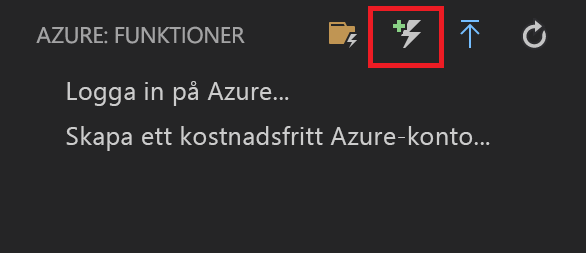
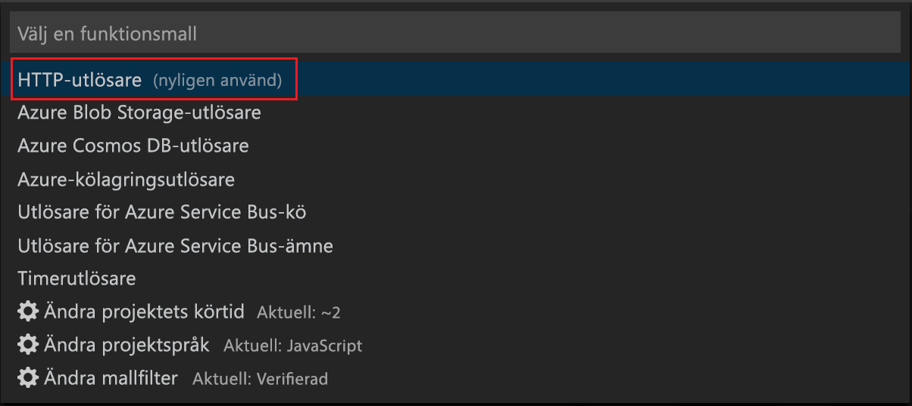
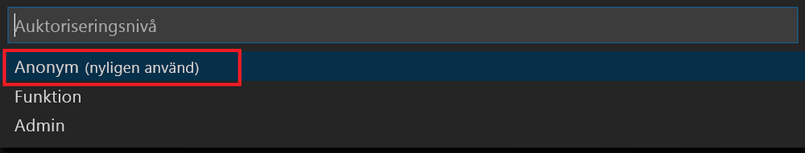

# Skapa din första beständiga funktion i JavaScript

*Durable Functions* är en utökning av [Azure Functions](../functions-overview.md) som gör att du kan skriva tillståndskänsliga funktioner i en serverlös miljö. Tillägget hanterar tillstånd, kontrollpunkter och omstarter.

I den här artikeln får du lära dig hur du använder Azure Functions-tillägget för Visual Studio Code för att skapa och testa en beständig ”Hello World”-funktion lokalt.  Den här funktionen orkestrerar och kedjar samman anrop till andra funktioner. Du publicerar sedan funktionskoden till Azure.

## Nödvändiga komponenter

För att slutföra den här självstudien behöver du:

* Installera [Visual Studio Code](https://code.visualstudio.com/download).

* Kontrollera att du har de [senaste Azure Functions-verktygen](../functions-develop-vs.md#check-your-tools-version).

* På en Windows-dator kontrollerar du att [Azure Storage Emulator](../../storage/common/storage-use-emulator.md) är installerad och körs. På en Mac- eller Linux-dator måste du använda ett faktiskt Azure Storage-konto.

* Se till att du har version 8.0 eller en senare version av [Node.js](https://nodejs.org/) installerad.

[!INCLUDE [quickstarts-free-trial-note](../../../includes/quickstarts-free-trial-note.md)]

[!INCLUDE [functions-install-vs-code-extension](../../../includes/functions-install-vs-code-extension.md)]

[!INCLUDE [functions-create-function-app-vs-code](../../../includes/functions-create-function-app-vs-code.md)]

## Installera npm-paketet för Durable Functions

1. Installera npm-paketet för `durable-functions` genom att köra `npm install durable-functions` i funktionsappens rotkatalog.

## Skapa en startfunktion

Skapa först en HTTP-utlöst funktion som startar en orkestrering av beständig funktion.

1. I **Azure: Functions** väljer du ikonen Skapa funktion.

    

2. Välj mappen med funktionsappsprojektet och välj funktionsmallen **HTTP-utlösare**.

    

3. Skriv `HttpStart` som funktionens namn och tryck på Retur. Välj sedan **Anonym** autentisering.

    

    En funktion skapas på ditt valda språk med hjälp av mallen för en HTTP-utlöst funktion.

4. Ersätt index.js med nedanstående JavaScript:

    [!code-javascript[Main](~/samples-durable-functions/samples/javascript/HttpStart/index.js)]

5. Ersätt function.json med nedanstående JSON:

    [!code-json[Main](~/samples-durable-functions/samples/javascript/HttpStart/function.json)]

Nu har vi skapat en startpunkt till vår beständiga funktion. Vi lägger till en orkestrerare.

## Skapa en orkestrerarfunktion

Därefter skapar du en annan funktion som ska vara orkestrerare. Vi gör det enklare genom att använda mallen för HTTP-utlösarfunktion. Själva funktionskoden ersätts av orkestrerarkoden.

1. Upprepa stegen från föregående avsnitt och skapa en andra funktion med hjälp av HTTP-utlösarmallen. Den här gången ger du funktionen namnet `OrchestratorFunction`.

2. Öppna filen index.js för den nya funktionen och ersätt innehållet med följande kod:

    [!code-json[Main](~/samples-durable-functions/samples/javascript/E1_HelloSequence/index.js)]

3. Öppna filen function.json och ersätt den med följande JSON:

    [!code-json[Main](~/samples-durable-functions/samples/javascript/E1_HelloSequence/function.json)]

Vi har lagt till en orkestrerare för att samordna aktivitetsfunktioner. Nu lägger vi till den refererade aktivitetsfunktionen.

## Skapa en aktivitetsfunktion

1. Upprepa stegen från föregående avsnitt och skapa en tredje funktion med hjälp av HTTP-utlösarmallen. Den här gången ger du dock funktionen namnet `SayHello`.

2. Öppna filen index.js för den nya funktionen och ersätt innehållet med följande kod:

    [!code-javascript[Main](~/samples-durable-functions/samples/javascript/E1_SayHello/index.js)]

3. Ersätt function.json med nedanstående JSON:

    [!code-json[Main](~/samples-durable-functions/samples/csx/E1_SayHello/function.json)]

Nu har vi lagt till alla komponenter som behövs för att påbörja en orkestrering och kedja ihop aktivitetsfunktioner.

## Testa funktionen lokalt

Med Azure Functions Core Tools kan du köra ett Azure Functions-projekt på din lokala utvecklingsdator. Du uppmanas att installera de här verktygen första gången du startar en funktion från Visual Studio Code.  

1. På en Windows-dator startar du Azure Storage Emulator och se till att egenskapen **AzureWebJobsStorage** för local.settings.json har angetts till `UseDevelopmentStorage=true`. På en Mac- eller Linux-dator måste du ange egenskapen **AzureWebJobsStorage** till anslutningssträngen för ett befintligt Azure Storage-konto. Du skapar ett lagringskonto senare i den här artikeln.

2. Ange en brytpunkt i funktionskoden och tryck på F5 för att starta funktionsappsprojektet om du vill testa funktionen. Utdata från Core Tools visas på panelen **Terminal**. Om det här är första gången du Durable Functions installeras Durable Functions-tillägget, och bygget kan ta några sekunder.

    > [!NOTE]
    > JavaScript Durable Functions kräver version **1.7.0** eller senare av tillägget **Microsoft.Azure.WebJobs.Extensions.DurableTask**. Kontrollera att versionen av tillägget Durable Functions i din `extensions.csproj`-fil uppfyller det här kravet. Om inte, stoppar du din funktionsapp, ändrar version och trycker på F5 för att starta om funktionsappen.

3. På panelen **Terminal** kopierar du URL-slutpunkten för den HTTP-utlösta funktionen.

    

4. Klistra in webbadressen för HTTP-begäran i webbläsarens adressfält och se statusen för orkestreringen.

5. Tryck på SKIFT+F1 för att stoppa felsökningen.

När du har kontrollerat att funktionen körs korrekt på den lokala datorn är det dags att publicera projektet på Azure.

[!INCLUDE [functions-create-function-app-vs-code](../../../includes/functions-sign-in-vs-code.md)]

[!INCLUDE [functions-publish-project-vscode](../../../includes/functions-publish-project-vscode.md)]

## Testa din funktion i Azure

1. Kopiera URL:en för HTTP-utlösaren från panelen **Utdata**. Den URL som anropar den HTTP-utlösta funktionen ska ha följande format:

        http://<functionappname>.azurewebsites.net/orchestrators/<functionname>

2. Klistra in den nya URL:en för HTTP-begäran i webbläsarens adressfält. Du bör få samma statussvar som förut när du använder den publicerade appen.

## Nästa steg

Du har använt Visual Studio Code för att skapa och publicera en beständig JavaScript-funktionsapp.

> [!div class="nextstepaction"]
> [Läs mer om vanliga mönster för beständiga funktioner](durable-functions-overview.md)