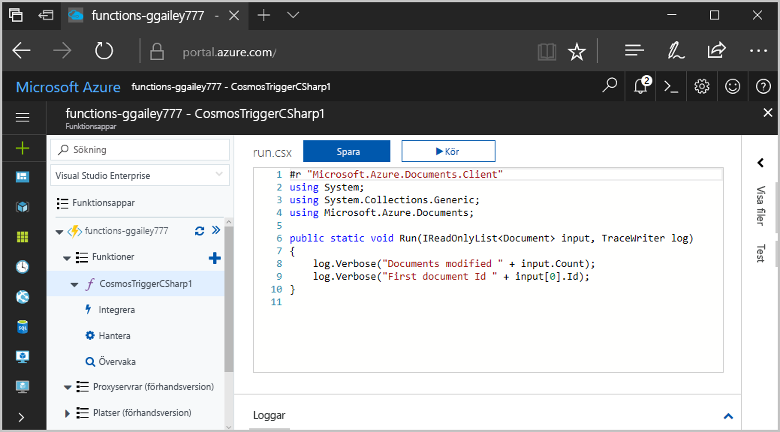
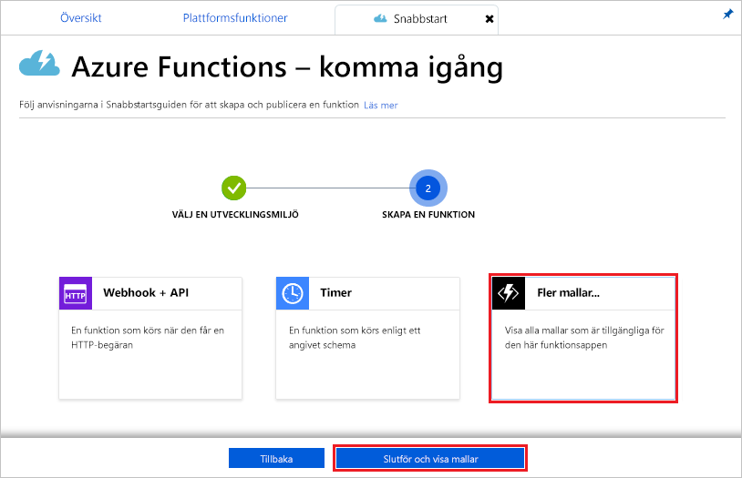
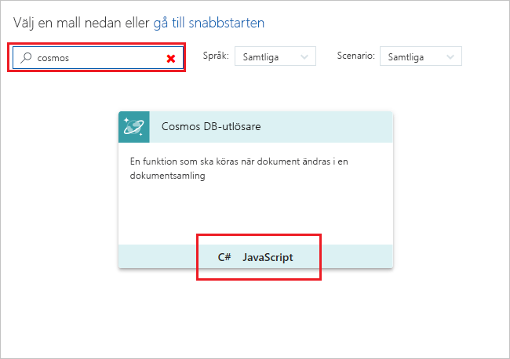
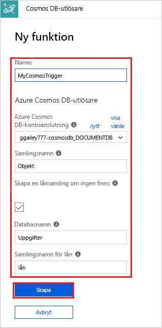
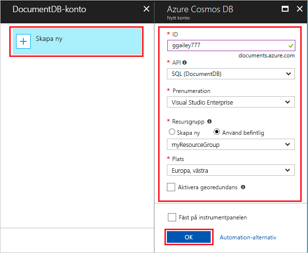
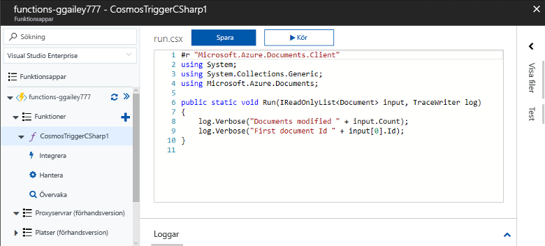
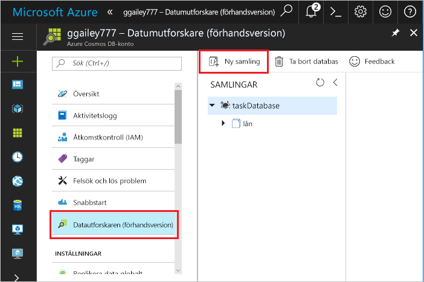
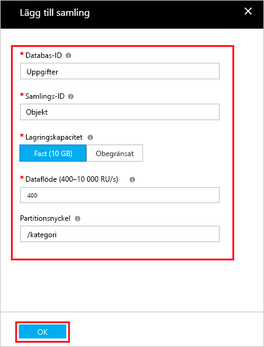

# Skapa en funktion som utlöses av Azure Cosmos DB

Lär dig hur du skapar en funktion som utlöses när data läggs till eller ändras i Azure Cosmos DB. Läs mer om Azure Cosmos DB i [Azure Cosmos DB: serverlösa databasen datoranvändning med hjälp av Azure Functions](..\cosmos-db\serverless-computing-database.md).

## Krav

För att slutföra den här självstudien behöver du:

+ Om du inte har en Azure-prenumeration kan du skapa ett [kostnadsfritt konto](https://azure.microsoft.com/free/?WT.mc_id=A261C142F) innan du börjar.

[!INCLUDE [functions-portal-favorite-function-apps](../../includes/functions-portal-favorite-function-apps.md)]

## Skapa en Azure Functions-app

[!INCLUDE [Create function app Azure portal](../../includes/functions-create-function-app-portal.md)]

Därefter skapar du en funktion i den nya funktionsappen.

## Skapa Azure DB som Cosmos-utlösare

1. Expandera funktionsappen och klicka på knappen **+** bredvid **Funktioner**. Om det är den första funktionen i din funktionsapp väljer du **Anpassad funktion**. Detta visar en fullständig uppsättning med funktionsmallar.

    

2. Leta upp och välj den **Azure CosmosDBTrigger** mall för språket.

    

3. Konfigurera den nya utlösaren med inställningar som anges i tabellen nedan avbildningen.

    
    
    | Inställning      | Föreslaget värde  | Beskrivning                                |
    | ------------ | ---------------- | ------------------------------------------ |
    | **Namnge din funktion** | Standard | Använd funktionen standardnamnet föreslås av mallen. |
    | **Databasnamn** | Uppgifter | Namnet på databasen med en samling som ska övervakas. |
    | **Samlingsnamn** | Objekt | Namnet på samlingen som ska övervakas. |
    | **Skapa lån samling, om det inte finns** | Markerad | Samlingen finns inte redan, så du måste skapa den. |

4. Välj **ny** bredvid den **Azure Cosmos databasanslutningen konto** etiketten och välj ett befintligt Cosmos-DB-konto eller **+ Skapa nytt**. 
 
    

6. När du skapar ett nytt Cosmos-DB-konto kan du använda den **nytt konto** inställningar som anges i tabellen.

    | Inställning      | Föreslaget värde  | Beskrivning                                |
    | ------------ | ---------------- | ------------------------------------------ |
    | **ID** | Namnet på databasen | Unikt ID för Azure Cosmos-DB-databas  |
    | **API** | SQL (DocumentDB) | Det här avsnittet använder dokumentdatabasen API.  |
    | **Prenumeration** | Azure-prenumeration | Azure-prenumeration  |
    | **Resursgrupp** | myResourceGroup |  Använd den befintliga resursgruppen som innehåller din funktionsapp. |
    | **Plats**  | Västeuropa | Välj en plats nära funktionsappen eller nära andra appar som använder de lagrade dokumenten.  |

6. Skapa databasen genom att klicka på **OK**. Det kan ta några minuter att skapa databasen. När databasen har skapats lagras databasanslutningssträngen som en funktionsappsinställning. Namnet på den här appinställningen infogas i **Azure Cosmos databasanslutningen konto**. 

7. Klicka på **skapa** aktiveras funktionen att skapa Azure Cosmos-DB. När funktionen har skapats visas mallbaserade funktionskoden.  

    

    Den här funktionen mallen skriver antalet dokument och första dokument-ID till loggarna. 

Sedan du ansluta till ditt konto i Azure Cosmos DB och skapa den **uppgifter** samlingen i databasen. 

## Skapa objektmängden

1. Öppna en andra instans av den [Azure-portalen](https://portal.azure.com) i en ny flik i webbläsaren. 

2. Expandera ikonen-stapel på vänster sida av portalen typen `cosmos` i sökfältet och välj **Azure Cosmos DB**.

    

2. Välj Azure DB som Cosmos-konto, och välj sedan den **Data Explorer**. 
 
3. I **samlingar**, Välj **taskDatabase** och välj **ny samling**.

    

4. I **lägga till samlingen**, använder de inställningar som visas i tabellen nedan avbildningen. 
 
    
 
    | Inställning|Föreslaget värde|Beskrivning |
    | ---|---|--- |
    | **Databas-ID** | Uppgifter |Namnet på din nya databas. Detta måste matcha namnet som definierats i funktionsbindning. |
    | **Samlings-ID** | Objekt | Namnet på den nya samlingen. Detta måste matcha namnet som definierats i funktionsbindning.  |
    | **Lagringskapacitet** | Fast (10 GB)|Använd standardvärdet. Det här värdet är databasens lagringskapacitet. |
    | **Dataflöde** |400 RU| Använd standardvärdet. Du kan skala upp dataflödet senare om du vill minska svarstiden. |
    | **[Partitionsnyckeln](../cosmos-db/partition-data.md#design-for-partitioning)** | /category|En partitionsnyckel som distribuerar data jämnt till varje partition. Det är viktigt att välja rätt partitionsnyckel när man skapar en performant samling. | 

1. Klicka på **OK** att skapa den **uppgifter** samling. Det kan ta en kort tid för en samling som ska skapas.

När den samling som har angetts i funktionen bindningen finns, kan du testa funktionen genom att lägga till dokument med nya samlingen.

## Testa funktionen

1. Expandera den nya **taskCollection** samling i Data Explorer välja **dokument**och välj **nytt dokument**.

    

2. Ersätt innehållet i det nya dokumentet med följande innehåll och välj sedan **spara**.

        {
            "id": "task1",
            "category": "general",
            "description": "some task"
        }

1. Växla till den första fliken som innehåller din funktion i portalen. Utöka funktionsloggar och kontrollera att det nya dokumentet har utlöst funktionen. Se det i `task1` dokument-ID-värde skrivs till loggarna. 

    

4. (Valfritt) Gå tillbaka till dokumentet, ändra och klicka på **uppdatering**. Sedan gå tillbaka till funktionsloggar och kontrollera att uppdateringen har också aktiveras funktionen.

## Rensa resurser

[!INCLUDE [Next steps note](../../includes/functions-quickstart-cleanup.md)]

## Nästa steg

Du har skapat en funktion som körs när ett dokument läggs till eller ändras i Azure Cosmos-DB.

[!INCLUDE [Next steps note](../../includes/functions-quickstart-next-steps.md)]

Mer information om Queue Storage-utlösare finns i [Azure Functions Storage queue bindings](functions-bindings-storage-queue.md) (Azure Functions-lagringsköbindningar).
