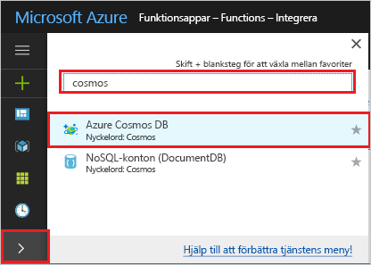
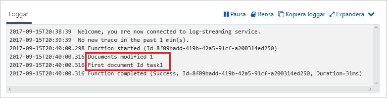

# <a name="create-a-function-triggered-by-azure-cosmos-db"></a>Skapa en funktion som utlöses av Azure Cosmos DB

Lär dig hur du skapar en funktion som utlöses när data läggs till eller ändras i Azure Cosmos DB. Läs mer om Azure Cosmos DB i [Azure Cosmos DB: Serverless database computing using Azure Functions](../cosmos-db/serverless-computing-database.md) (Azure Cosmos DB: Serverfria databasberäkningar med Azure Functions).

:::image type="content" source="./media/functions-create-cosmos-db-triggered-function/quickstart-completed.png" alt-text="Azure Cosmos DB kod":::

## <a name="prerequisites"></a>Förutsättningar

För att slutföra den här kursen behöver du:

+ Om du inte har någon Azure-prenumeration kan du [skapa ett kostnadsfritt konto](https://azure.microsoft.com/free/?WT.mc_id=A261C142F) innan du börjar.

> [!NOTE]
> [!INCLUDE [SQL API support only](../../includes/functions-cosmosdb-sqlapi-note.md)]

## <a name="sign-in-to-azure"></a>Logga in på Azure
Logga in på [Azure-portalen](https://portal.azure.com/) med ditt Azure-konto.

## <a name="create-an-azure-cosmos-db-account"></a>Skapa ett Azure Cosmos DB-konto

Du måste ha ett Azure Cosmos DB-konto som använder SQL API innan du skapar utlösaren.

[!INCLUDE [cosmos-db-create-dbaccount](../../includes/cosmos-db-create-dbaccount.md)]

## <a name="create-an-azure-function-app"></a>Skapa en Azure Functions-app

[!INCLUDE [Create function app Azure portal](../../includes/functions-create-function-app-portal.md)]

Därefter skapar du en funktion i den nya funktionsappen.

<a name="create-function"></a>

## <a name="create-azure-cosmos-db-trigger"></a>Skapa en Azure Cosmos DB-utlösare

1. I din Function-app väljer du **Functions** i den vänstra menyn och väljer sedan **Lägg till** på den översta menyn. 

1. På sidan **ny funktion** anger du `cosmos` i Sök fältet och väljer sedan mallen **Azure Cosmos DB utlösare** .

   :::image type="content" source="./media/functions-create-cosmos-db-triggered-function/function-choose-cosmos.png" alt-text="Sidan funktioner i Azure Portal":::


1. Konfigurera den nya utlösaren med de inställningar som anges i följande tabell:

    | Inställning      | Föreslaget värde  | Beskrivning                                |
    | ------------ | ---------------- | ------------------------------------------ |
    | **Ny funktion** | Acceptera standard namnet | Namnet på funktionen. |
    | **Cosmos DB kontoanslutning** | Acceptera det nya standard namnet | Välj **nytt**, **databas kontot** som du skapade tidigare och klicka sedan på **OK**. Den här åtgärden skapar en program inställning för din konto anslutning. Den här inställningen används av bindningen för anslutningen till databasen. |
    | **Databasnamn** | Uppgifter | Namnet på databasen som innehåller den samling som ska övervakas. |
    | **Samlingsnamn** | Poster | Namnet på den samling som ska övervakas. |
    | **Samlingsnamn för lån** | leases | Namn på den samling där lånet ska lagras. |
    | **Skapa en låne samling om den inte finns** | Ja | Kontrollerar om det finns någon låne samling och skapar den automatiskt. |

    :::image type="content" source="./media/functions-create-cosmos-db-triggered-function/functions-cosmosdb-trigger-settings.png" alt-text="Skapa en funktion som utlöses av Azure Cosmos DB":::

1. Välj **Skapa funktion**. 

    Azure skapar funktionen Cosmos DB trigger.

1. Om du vill visa den mallbaserade funktions koden väljer du **kod + test**.

    :::image type="content" source="./media/functions-create-cosmos-db-triggered-function/function-cosmosdb-template.png" alt-text="Cosmos DB – funktionsmall i C#":::

    Den här funktionsmallen skriver antalet dokument och ID:t för det första dokumentet till loggarna.

Sedan ansluter du till ditt Azure Cosmos DB-konto och skapar `Items` behållaren i `Tasks` databasen.

## <a name="create-the-items-container"></a>Skapa behållaren objekt

1. Öppna en andra instans av [Azure-portalen](https://portal.azure.com) på en ny flik i webbläsaren.

1. Expandera ikonfältet till vänster på portalen, skriv `cosmos` i sökfältet och välj **Azure Cosmos DB**.

    

1. Välj ditt Azure Cosmos DB-konto och välj sedan **Datautforskaren**. 

1. Under **SQL API** väljer du **uppgifter** databas och sedan **ny behållare**.

    

1. I **Lägg till behållare** använder du inställningarna som visas i tabellen under bilden. 

    

    | Inställning|Föreslaget värde|Beskrivning |
    | ---|---|--- |
    | **Databas-ID** | Uppgifter |Namnet på din nya databas. Måste matcha namnet som definierats i funktionsbindningen. |
    | **Container-ID** | Poster | Namnet på den nya behållaren. Måste matcha namnet som definierats i funktionsbindningen.  |
    | **[Partitionsnyckel](../cosmos-db/partitioning-overview.md)** | /category|En partitionsnyckel som distribuerar data jämnt till varje partition. Det är viktigt att välja rätt partitionsnyckel när du skapar en utförande behållare. | 
    | **Dataflöde** |400 RU| Använd standardvärdet. Du kan skala upp dataflödet senare om du vill minska svarstiden. |    

1. Skapa behållaren objekt genom att klicka på **OK** . Det kan ta en stund innan behållaren har skapats.

När den behållare som anges i funktions bindningen finns kan du testa funktionen genom att lägga till objekt i den nya behållaren.

## <a name="test-the-function"></a>Testa funktionen

1. Expandera behållaren nya **objekt** i datautforskaren, Välj **objekt** och välj sedan **nytt objekt**.

    :::image type="content" source="./media/functions-create-cosmos-db-triggered-function/create-item-in-container.png" alt-text="Skapa ett objekt i objekt behållare":::

1. Ersätt innehållet i det nya objektet med följande innehåll och välj sedan **Spara**.

    ```yaml
    {
        "id": "task1",
        "category": "general",
        "description": "some task"
    }
    ```

1. Växla till den första webbläsarfliken som innehåller din funktion i portalen. Utöka funktionsloggarna och kontrollera att det nya dokumentet har utlöst funktionen. Se efter så att dokumentets ID-värde `task1` skrivs till loggarna. 

    

1. (Valfritt) Gå tillbaka till dokumentet, gör en ändring och klicka på **Uppdatera**. Gå tillbaka till funktionsloggarna och kontrollera att uppdateringen också har utlöst funktionen.

## <a name="clean-up-resources"></a>Rensa resurser

[!INCLUDE [Next steps note](../../includes/functions-quickstart-cleanup.md)]

## <a name="next-steps"></a>Nästa steg

Du har nu skapat en funktion som körs när ett dokument läggs till eller ändras i Azure Cosmos DB. Mer information om Cosmos DB-utlösare finns i [Azure Cosmos DB-bindningar för Azure Functions](functions-bindings-cosmosdb.md).

[!INCLUDE [Next steps note](../../includes/functions-quickstart-next-steps.md)]