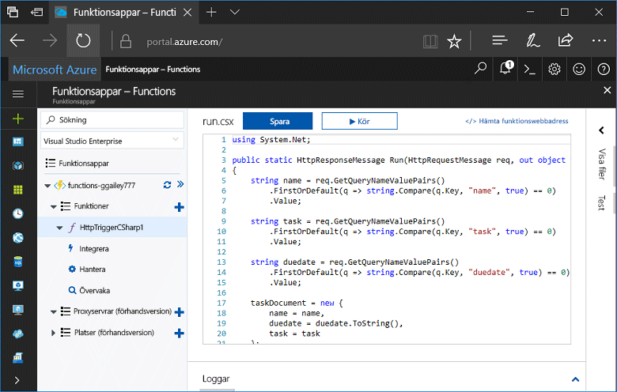
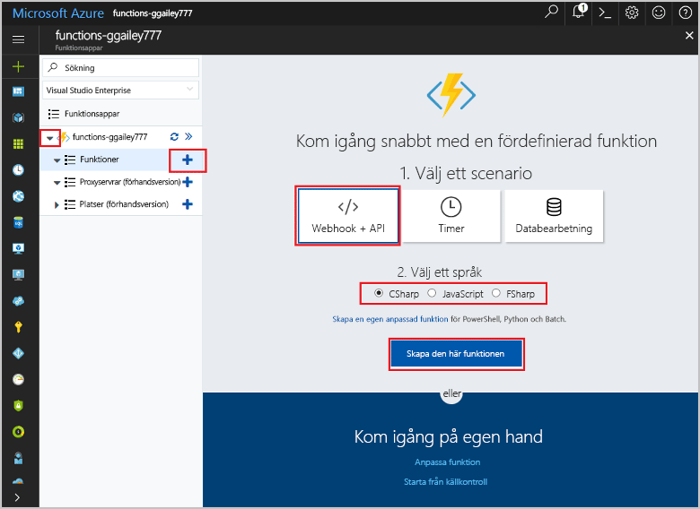
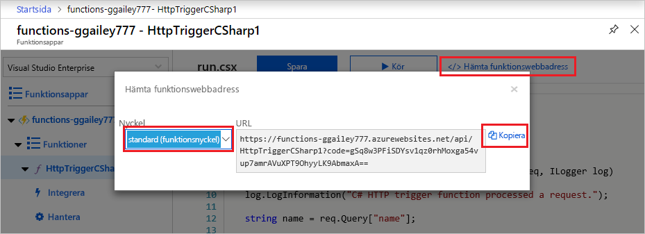
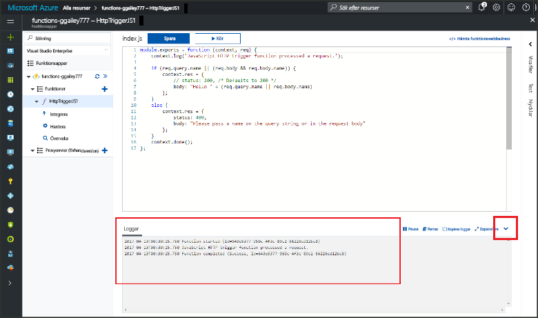

# Skapa din första funktion i Azure Portal

Med Azure Functions kan du köra kod i en [serverfri](https://azure.microsoft.com/overview/serverless-computing/) miljö utan att först behöva skapa en virtuell dator eller publicera en webbapp. I det här ämnet får du lära dig att använda Functions till att skapa en ”hello world”-funktion i Azure Portal.

[!INCLUDE [quickstarts-free-trial-note](../../includes/quickstarts-free-trial-note.md)]

## Logga in på Azure

Logga in på Azure-portalen på <http://portal.azure.com> med ditt Azure-konto.

## Skapa en funktionsapp

Du måste ha en funktionsapp som värd för körning av dina funktioner. I en funktionsapp kan du gruppera funktioner som en logisk enhet så att det blir enklare att hantera, distribuera och dela resurser. 

[!INCLUDE [Create function app Azure portal](../../includes/functions-create-function-app-portal-experiment.md)]

Därefter skapar du en funktion i den nya funktionsappen.

## Skapa en HTTP-utlöst funktion

1. Expandera den nya funktionsappen och klicka på knappen **+** bredvid **Funktioner**.

2.  På sidan **Kom igång snabbt** väljer du **WebHook + API**. **Välj ett språk** för funktionen och klicka på **Skapa den här funktionen**. 
   
    

En funktion skapas i ditt valda språk med hjälp av mallen för en HTTP-utlöst funktion. Det här avsnittet visar en C#-skriptfunktion i portalen, men du kan skapa en funktion i alla [språk som stöds](supported-languages.md). 

Nu kan du köra den nya funktionen genom att skicka en HTTP-begäran.

## Testa funktionen

1. I den nya funktionen klickar du på **</> Hämta funktionswebbadress** längst upp till höger och väljer **Standard (funktionsnyckel)**. Sedan klickar du på **Kopiera**. 

    

2. Klistra in funktionens URL i adressfältet för din webbläsare. Lägg till frågesträngvärdet `&name=<yourname>` i slutet av den här webbadressen och tryck på knappen `Enter` på tangentbordet för att utföra begäran. Du bör se svaret som returnerades av funktionen som visas i webbläsaren.  

    Det här exemplet visar svaret i webbläsaren Edge (andra webbläsare kan även visa XML):

    

    Begäransadressen innehåller en nyckel som krävs för åtkomst till din funktion över HTTP.   

3. När din funktion körs skrivs spårningsinformation till loggarna. Om du vill visa spårningsinformationen från föregående körning återgår du till funktionen i portalen och klickar på pilen längst ned på skärmen så att **Loggar** expanderas. 

   

## Rensa resurser

[!INCLUDE [Clean-up resources](../../includes/functions-quickstart-cleanup.md)]

## Nästa steg

Du har nu skapat en funktionsapp med en enkel HTTP-utlöst funktion.  

[!INCLUDE [Next steps note](../../includes/functions-quickstart-next-steps.md)]

Mer information finns i [Azure Functions HTTP and webhook bindings](functions-bindings-http-webhook.md) (HTTP- och webhookbindningar i Azure Functions).

