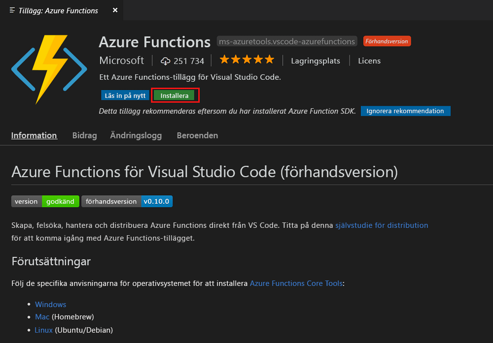
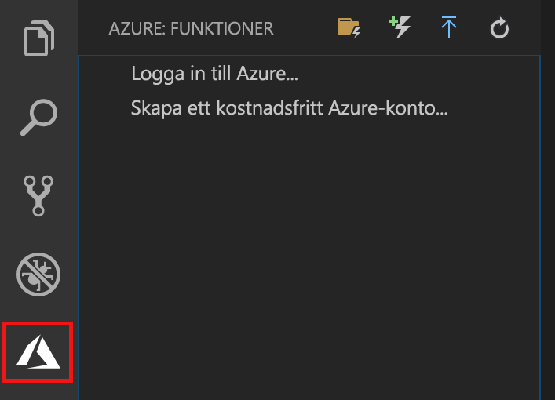
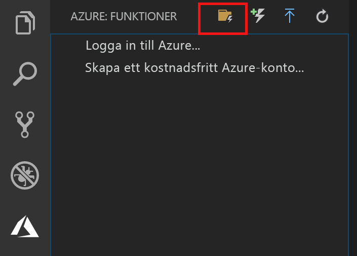
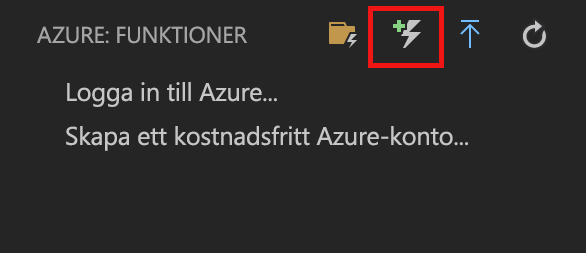
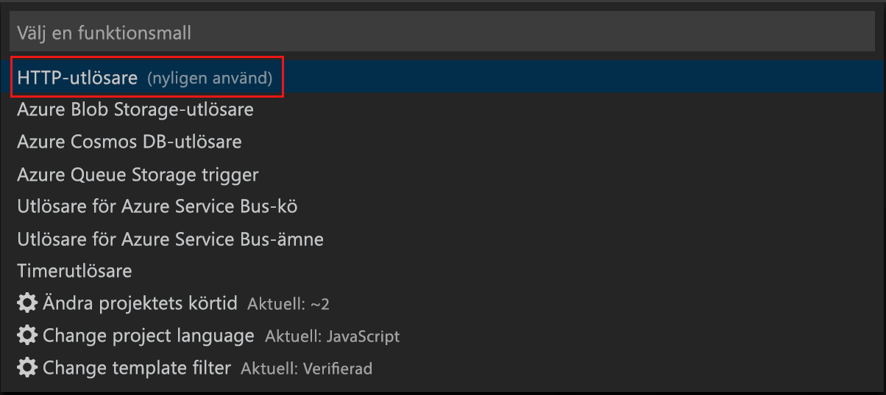
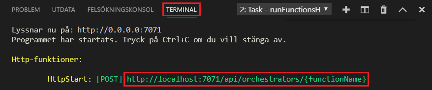
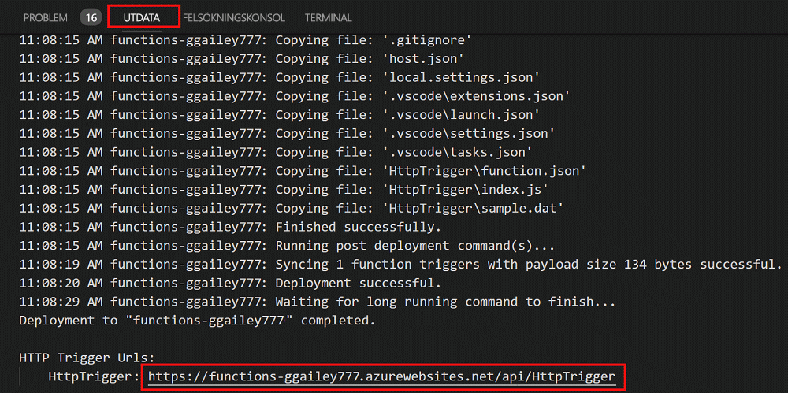

# Skapa din första funktion med Visual Studio Code

Med Azure Functions kan du köra kod i en [serverfri](https://azure.microsoft.com/solutions/serverless/) miljö utan att först behöva skapa en virtuell dator eller publicera en webbapp.

I den här artikeln får du lära dig hur du använder [Azure Functions-tillägg för Visual Studio Code] för att skapa och testa en ”Hello World”-funktion på din lokala dator med Microsoft Visual Studio Code. Du publicerar sedan funktionskoden till Azure från Visual Studio Code.

Tillägget stöder för närvarande C#-, JavaScript- och Java-funktioner. Stegen i den här artikeln kan variera beroende på ditt val av språk för Azure Functions-projektet. Tillägget finns för närvarande i en förhandsversion. Mer information finns på sidan om [Azure Functions-tillägg för Visual Studio Code].

## Nödvändiga komponenter

För att slutföra den här snabbstarten behöver du:

* Installera [Visual Studio Code](https://code.visualstudio.com/) på en av de [plattformar som stöds](https://code.visualstudio.com/docs/supporting/requirements#_platforms). Den här artikeln har utvecklats och testats på en enhet med macOS (High Sierra).

* Installera version 2.x av [Azure Functions Core Tools](functions-run-local.md#v2), som fortfarande finns i förhandsversion.

* Installera de specifika kraven för ditt valda språk:

    | Språk | Anknytning |
    | -------- | --------- |
    | **C#** | [C# för Visual Studio Code](https://marketplace.visualstudio.com/items?itemName=ms-vscode.csharp) [.NET Core CLI-verktyg](https://docs.microsoft.com/dotnet/core/tools/?tabs=netcore2x)*   |
    | **Java** | [Felsökningsprogram för Java](https://marketplace.visualstudio.com/items?itemName=vscjava.vscode-java-debug) [JDK 1.8](http://www.oracle.com/technetwork/java/javase/downloads/index.html) [Maven 3+](https://maven.apache.org/) |
    | **JavaScript** | [Node 8.0+](https://nodejs.org/)  |

    \* Krävs också av Core Tools.

[!INCLUDE [quickstarts-free-trial-note](../../includes/quickstarts-free-trial-note.md)]

## Installera Azure Functions-tillägget

Azure Functions-tillägget används för att skapa, testa och distribuera funktioner till Azure.

1. Öppna **Tillägg** i Visual Studio Code och sök efter `azure functions`, eller [öppna den här länken i Visual Studio Code](vscode:extension/ms-azuretools.vscode-azurefunctions).

1. Välj **Installera** för att installera tillägget för Visual Studio Code. 

    

1. Starta om Visual Studio Code och välj Azure-ikonen i aktivitetsfältet. Ett Azure Functions-område bör visas i sidofältet.

    

## Skapa ett Azure Functions-projekt

Med Azure Functions-projektmallen i Visual Studio Code skapas ett projekt som kan publiceras till en funktionsapp i Azure. Med en funktionsapp kan du gruppera funktioner som en logisk enhet så att det blir enklare att hantera, distribuera och dela resurser.

1. Välj Azure-logotypen i Visual Studio Code så att området **Azure: Funktioner** visas och välj sedan ikonen Skapa nytt projekt.

    

1. Välj en plats för projektarbetsytan och välj **Välj**.

    > [!NOTE]
    > Den här artikeln har utformats för att genomföras utanför en arbetsyta. Välj i det här fallet inte en projektmapp som ingår i en arbetsyta.

1. Välj språk för ditt funktionsappsprojekt. I den här artikeln används JavaScript.
    

1. Välj **Lägg till på arbetsyta** när du uppmanas att göra det.

I Visual Studio Code skapas funktionsappsprojektet på en ny arbetsyta. Det här projektet innehåller konfigurationsfilerna [host.json](functions-host-json.md) och [local.settings.json](functions-run-local.md#local-settings-file), plus eventuella språkspecifika projektfiler. Du får också en ny Git-lagringsplats i projektmappen.

## Skapa en HTTP-utlöst funktion

1. Välj ikonen Skapa funktion i **Azure: Funktioner**.

    

1. Välj mappen med funktionsappsprojektet och välj funktionsmallen **HTTP-utlösare**.

    

1. Skriv `HTTPTrigger` som funktionens namn och tryck på Retur. Välj sedan **Anonym** autentisering.

    

    En funktion skapas på ditt valda språk med hjälp av mallen för en HTTP-utlöst funktion.

    

Du kan lägga till bindningar för indata och utdata i funktionen genom att ändra function.json-filen. Mer information finns i [Utlösare och bindningar i Azure Functions](functions-triggers-bindings.md).

Nu när du har skapat ditt funktionsprojekt och en HTTP-utlöst funktion kan du testa den på en lokal dator.

## Testa funktionen lokalt

Med Azure Functions Core Tools kan du köra ett Azure Functions-projekt på din lokala utvecklingsdator. Du uppmanas att installera de här verktygen första gången du startar en funktion från Visual Studio Code.  

1. Ange en brytpunkt i funktionskoden och tryck på F5 för att starta funktionsappsprojektet om du vill testa funktionen. Utdata från Core Tools visas på panelen **Terminal**.

1. På panelen **Terminal** kopierar du URL-slutpunkten för den HTTP-utlösta funktionen.

    

1. Klistra in webbadressen för HTTP-begäran i webbläsarens adressfält. Lägg till frågesträngen `?name=<yourname>` i webbadressen och kör din begäran. Körningen pausas när brytpunkten nås.

    

1. När du fortsätter körningen visas svaret på GET-begäran i webbläsaren nedan:

    

1. Tryck på SKIFT+F1 för att stoppa felsökningen.

När du har kontrollerat att funktionen körs korrekt på den lokala datorn är det dags att publicera projektet på Azure.

## Logga in på Azure

Innan du kan publicera appen måste du logga in på Azure.

1. I området **Azure: Funktioner** väljer du **Logga in på Azure...**. Om du inte redan har ett kan du **skapa ett kostnadsfritt Azure-konto**.

    

1. Välj **Kopiera och öppna** när du uppmanas att göra det eller kopiera koden som visas och öppna <https://aka.ms/devicelogin> i webbläsaren.

1. Klistra in den kopierade koden på sidan **Inloggning på enhet**, kontrollera inloggningen för Visual Studio Code och välj sedan **Fortsätt**.  

1. Slutför inloggningen med dina Azure-kontouppgifter. När du har loggat in kan du stänga webbläsaren.

## Publicera projektet på Azure

I Visual Studio Code kan du publicera funktionsprojektet direkt på Azure. Samtidigt skapar du en funktionsapp och relaterade resurser i Azure-prenumerationen. Funktionsappen är ett körningssammanhang för dina funktioner. Projektet paketeras och distribueras till den nya funktionsappen i Azure-prenumerationen. 

Den här artikeln förutsätter att du skapar en ny funktionsapp. Om du publicerar till en befintlig funktionsapp skrivs innehållet i den appen över i Azure.

1. I området **Azure: Funktioner** väljer du ikonen Distribuera till funktionsapp.

    

1. Välj projektmappen, som är den aktuella arbetsytan.

1. Om du har fler än en prenumeration väljer du den där du vill lagra funktionsappen och väljer sedan **+ Skapa ny funktionsapp**.

1. Ange ett globalt unikt namn som identifierar funktionsappen och tryck på Retur. Giltiga tecken i ett namn på en funktionsapp är `a-z`, `0-9` och `-`.

1. Välj **+ Skapa ny resursgrupp**, ange ett resursgruppsnamn, till exempel `myResourceGroup`, och tryck på Retur. Du kan också använda en befintlig resursgrupp.

1. Välj **+ Skapa nytt lagringskonto**, ange ett globalt unikt namn på det nya lagringskontot som ska användas av funktionsappen och tryck på Retur. Namnet på ett lagringskonto måste vara mellan 3 och 24 tecken långt och får endast innehålla siffror och gemener. Du kan också använda ett befintligt konto.

1. Välj en plats i en [region](https://azure.microsoft.com/regions/) nära dig eller nära andra tjänster som används av dina funktioner.

    Funktionsappen börjar skapas när du har valt din plats. Ett meddelande visas när funktionsappen har skapats och distributionspaketet har tillämpats.

1. Välj **Visa utdata** i meddelandena om du vill visa skapande- och distributionsresultatet, inklusive Azure-resurserna som du har skapat.

    

1. Anteckna URL:en för den nya funktionsappen i Azure. Den använder du för att testa funktionen när projektet har publicerats till Azure.

    

1. I området **Azure: Funktioner** visas nu den nya funktionsappen under din prenumeration. När du expanderar den här noden visas funktionerna i funktionsappen, samt programinställningar och funktionsproxyservrar.

    

    Från funktionsappens nod Ctrl-klickar (högerklickar) du för att välja att utföra olika hanterings- och konfigurationsuppgifter för funktionsappen i Azure. Du kan också välja att visa funktionsappen på Azure-portalen.

## Testa din funktion i Azure

1. Kopiera URL:en för HTTP-utlösaren från panelen **Utdata**. Lägg till frågesträngen `?name=<yourname>` i slutet av URL:en som tidigare och kör begäran.

    Den URL som anropar den HTTP-utlösta funktionen ska ha följande format:

        http://<functionappname>.azurewebsites.net/api/<functionname>?name=<yourname> 

1. Klistra in den nya URL:en för HTTP-begäran i webbläsarens adressfält. Nedan visas svaret på fjärr-GET-begäran som returnerades av funktionen i webbläsaren: 

    

## Nästa steg

Du har nu använt Visual Studio Code för att skapa en funktionsapp med en enkel HTTP-utlöst funktion. Mer information om hur du utvecklar funktioner på ett visst språk finns i språkreferensguiderna för [JavaScript](functions-reference-node.md), [.NET](functions-dotnet-class-library.md) och [Java](functions-reference-java.md).

Nu kanske du vill veta mer om lokal testning och felsökning från Terminal eller kommandotolken med hjälp av Azure Functions Core Tools.

> [!div class="nextstepaction"]
> [Koda och testa lokalt](functions-run-local.md)

[Azure Functions Core Tools]: functions-run-local.md
[Azure Functions-tillägg för Visual Studio Code]: https://marketplace.visualstudio.com/items?itemName=ms-azuretools.vscode-azurefunctions
