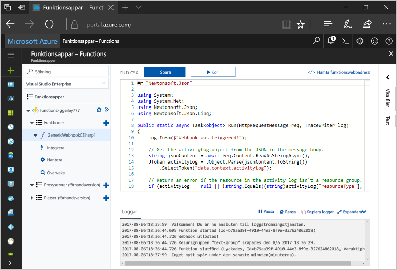
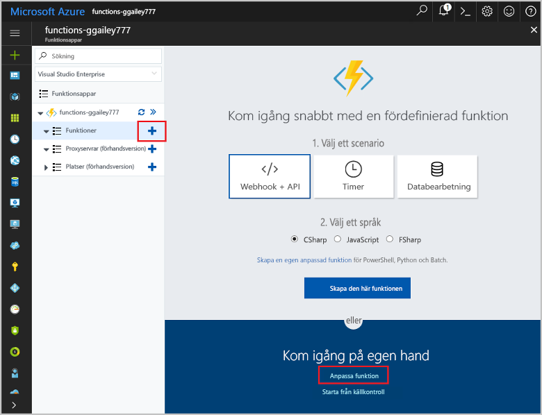
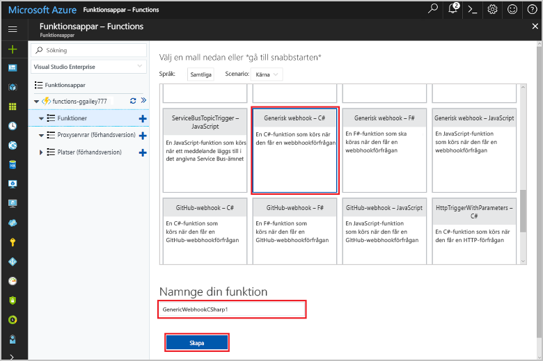
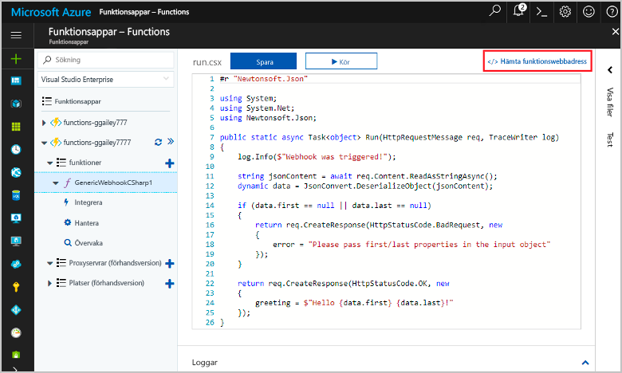
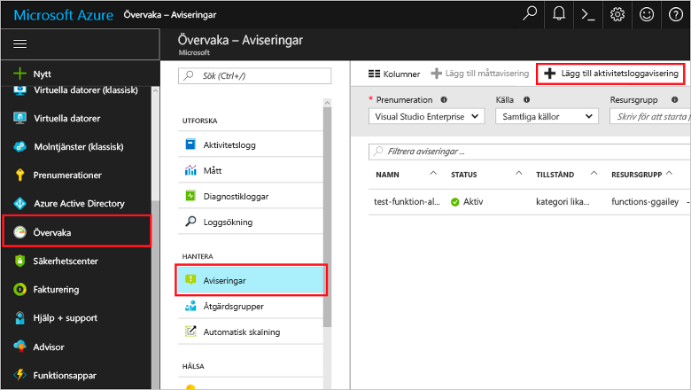
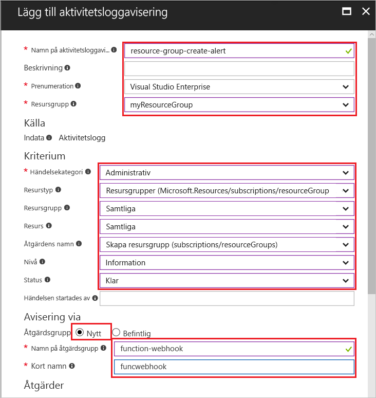
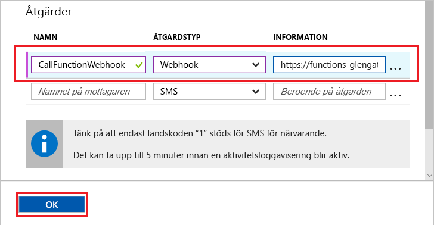
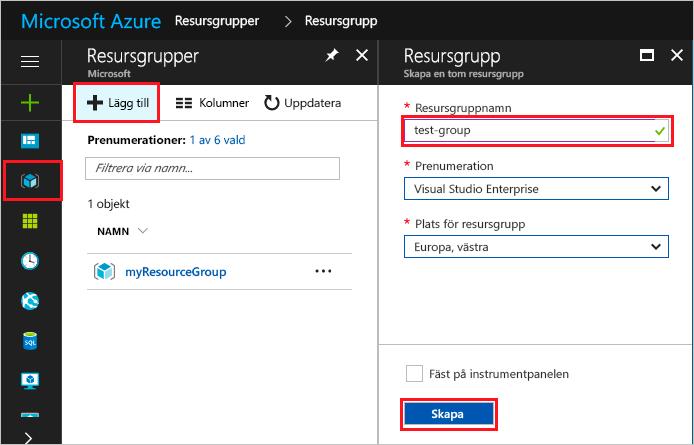
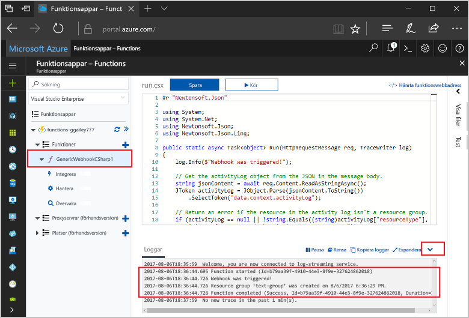

# <a name="create-a-function-triggered-by-a-generic-webhook"></a>Skapa en funktion som utlöses av en allmän webhook

Med Azure Functions kan du köra kod i en serverfri miljö utan att först behöva skapa en virtuell dator eller publicera en webbapp. Du kan till exempel konfigurera en funktion som utlöses av en avisering från Azure Monitor. Det här avsnittet visar hur du kör C#-kod när en resursgrupp läggs till i din prenumeration.   



## <a name="prerequisites"></a>Nödvändiga komponenter 

För att slutföra den här självstudien behöver du:

+ Om du inte har en Azure-prenumeration kan du skapa ett [kostnadsfritt konto](https://azure.microsoft.com/free/?WT.mc_id=A261C142F) innan du börjar.

## <a name="create-an-azure-function-app"></a>Skapa en Azure Functions-app

[!INCLUDE [Create function app Azure portal](../../includes/functions-create-function-app-portal.md)]

Därefter skapar du en funktion i den nya funktionsappen.

## <a name="create-function"></a>Skapa en funktion som utlöses av en allmän webhook

1. Expandera funktionsappen och klicka på knappen **+** bredvid **Funktioner**. Om den här funktionen är den första funktionen i din funktionsapp väljer du **Anpassad funktion**. Detta visar en fullständig uppsättning med funktionsmallar.

    

2. Skriv `generic` i sökfältet och välj sedan önskat språk för utlösarmallen för allmän webhook. I det här avsnittet används en C#-funktion.

     

2. Skriv ett **namn** för funktionen och välj sedan **Skapa**. 

      

2. Klicka på **</> Hämta funktionswebbadress** och kopiera och spara värdet. Du kan använda det här värdet för att konfigurera webhooken. 

    
         
Därefter skapar du en webhook-slutpunkt i en aktivitetsloggavisering i Azure Monitor. 

## <a name="create-an-activity-log-alert"></a>Skapa en aktivitetsloggavisering

1. I Azure Portal går du till tjänsten **Monitor**, väljer **Aviseringar** och klickar på **Lägg till aktivitetsloggavisering**.   

    

2. Använd inställningarna på det sätt som beskrivs i tabellen:

    

    | Inställning      |  Föreslaget värde   | Beskrivning                              |
    | ------------ |  ------- | -------------------------------------------------- |
    | **Namn på aktivitetsloggavisering** | resource-group-create-alert | Namnet på aktivitetsloggaviseringen. |
    | **Prenumeration** | Din prenumeration | Den prenumeration som du använder för den här kursen. | 
    |  **Resursgrupp** | myResourceGroup | Den resursgrupp som aviseringsresurserna distribueras till. Om du använder samma resursgrupp som din funktionsapp blir det enklare att rensa upp efter att du har slutfört kursen. |
    | **Händelsekategori** | Administrativ | Den här kategorin innehåller ändringar som gjorts i Azure-resurser.  |
    | **Resurstyp** | Resursgrupper | Filtrerar aviseringar till resursgruppaktiviteter. |
    | **Resursgrupp**<br/>och **Resurs** | Alla | Övervakar alla resurser. |
    | **Åtgärdsnamn** | Skapa resursgrupp | Filtrerar aviseringar till skapandeåtgärder. |
    | **Nivå** | Information | Tar med aviseringar på informationsnivå. | 
    | **Status** | Lyckades | Filtrerar aviseringar till åtgärder som har slutförts utan fel. |
    | **Åtgärdsgrupp** | Ny | Skapa en ny åtgärdsgrupp som definierar vilken åtgärd som ska vidtas när en avisering har genererats. |
    | **Namn på åtgärdsgrupp** | function-webhook | Ett namn som identifierar åtgärdsgruppen.  | 
    | **Kort namn** | funcwebhook | Ett kort namn för åtgärdsgruppen. |  

3. Lägg till en åtgärd i **Åtgärder** med de inställningar som anges i tabellen: 

    

    | Inställning      |  Föreslaget värde   | Beskrivning                              |
    | ------------ |  ------- | -------------------------------------------------- |
    | **Namn** | CallFunctionWebhook | Ett namn för åtgärden. |
    | **Åtgärdstyp** | Webhook | Svaret på aviseringen är att en webhook-URL anropas. |
    | **Detaljer** | Funktionswebbadress | Klistra in webhook-URL:en för den funktion som du kopierade tidigare. |v

4. Klicka på **OK** för att skapa aviseringen och åtgärdsgruppen.  

Webhooken anropas nu när en resursgrupp skapas i din prenumeration. Sedan ändrar du koden i din funktion för att hantera JSON-loggdata i brödtexten i begäran.   

## <a name="update-the-function-code"></a>Uppdatera funktionskoden

1. Gå tillbaka till din funktionsapp i portalen och expandera din funktion. 

2. Ersätt C#-skriptkoden i funktionen i portalen med följande kod:

    ```csharp
    #r "Newtonsoft.Json"
    
    using System;
    using System.Net;
    using Newtonsoft.Json;
    using Newtonsoft.Json.Linq;
    
    public static async Task<object> Run(HttpRequestMessage req, TraceWriter log)
    {
        log.Info($"Webhook was triggered!");
    
        // Get the activityLog object from the JSON in the message body.
        string jsonContent = await req.Content.ReadAsStringAsync();
        JToken activityLog = JObject.Parse(jsonContent.ToString())
            .SelectToken("data.context.activityLog");
    
        // Return an error if the resource in the activity log isn't a resource group. 
        if (activityLog == null || !string.Equals((string)activityLog["resourceType"], 
            "Microsoft.Resources/subscriptions/resourceGroups", 
            System.StringComparison.OrdinalIgnoreCase))
        {
            log.Error("An error occurred");
            return req.CreateResponse(HttpStatusCode.BadRequest, new
            {
                error = "Unexpected message payload or wrong alert received."
            });
        }
    
        // Write information about the created resource group to the streaming log.
        log.Info(string.Format("Resource group '{0}' was {1} on {2}.",
            (string)activityLog["resourceGroupName"],
            ((string)activityLog["subStatus"]).ToLower(), 
            (DateTime)activityLog["submissionTimestamp"]));
    
        return req.CreateResponse(HttpStatusCode.OK);    
    }
    ```

Nu kan du testa funktionen genom att skapa en ny resursgrupp i din prenumeration.

## <a name="test-the-function"></a>Testa funktionen

1. Klicka på resursgruppikonen till vänster i Azure Portal, välj **+ Lägg till**, ange ett **namn för resursgruppen** och välj **Skapa** för att skapa en tom resursgrupp.
    
    

2. Gå tillbaka till din funktion och expandera fönstret **Loggar**. När resursgruppen har skapats utlöses webhooken av aktivitetsloggaviseringen och funktionen körs. Du kan se att namnet på den nya resursgruppen skrivs till loggarna.  

    

3. (Valfritt) Gå tillbaka och ta bort resursgruppen som du skapade. Observera att den här aktiviteten inte utlöser funktionen. Det beror på att ta bort borttagningsåtgärder filtreras bort av aviseringen. 

## <a name="clean-up-resources"></a>Rensa resurser

[!INCLUDE [Next steps note](../../includes/functions-quickstart-cleanup.md)]

## <a name="next-steps"></a>Nästa steg

Du har skapat en funktion som körs när en begäran tas emot från en allmän webhook. 

[!INCLUDE [Next steps note](../../includes/functions-quickstart-next-steps.md)]

Mer information om webhook-utlösare finns i [Azure Functions HTTP och webhook-bindningar](functions-bindings-http-webhook.md). Mer information om hur du utvecklar funktioner i C# finns i [utvecklarreferensen för C#-skript för Azure Functions](functions-reference-csharp.md).

