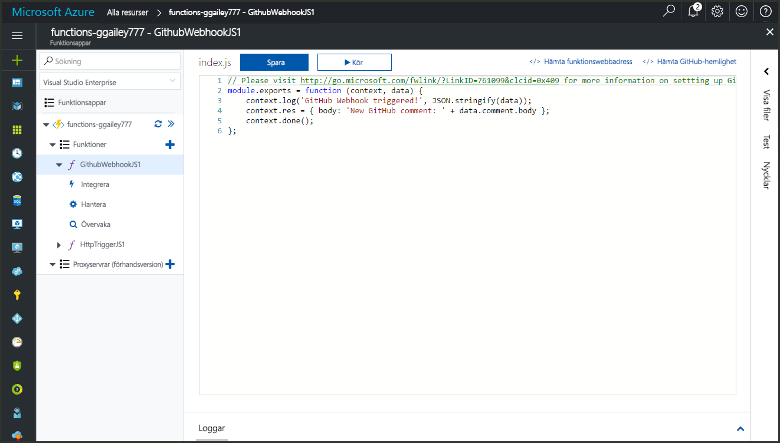
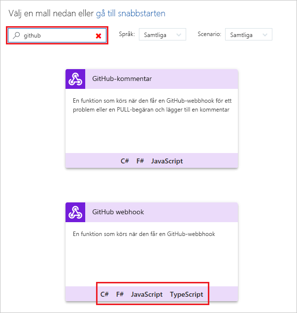
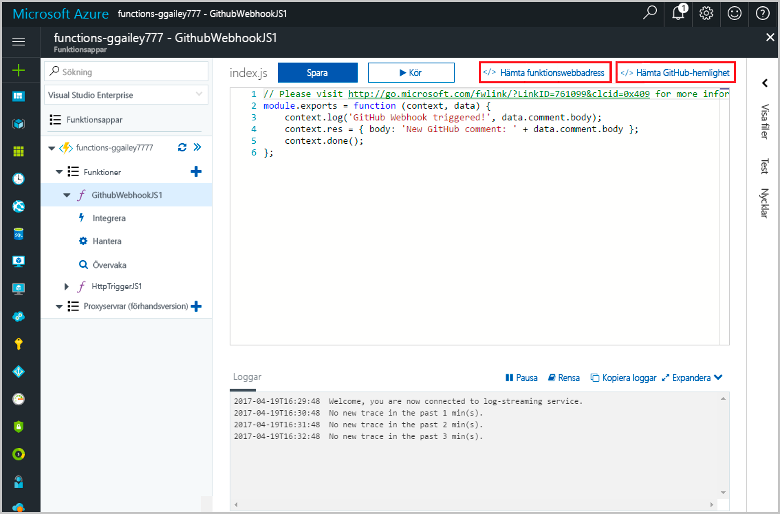

# Skapa en funktion som utlöses av en GitHub-webhook

Läs om hur du skapar en funktion som utlöses av en GitHub-webhook. 

För det här avsnittet krävs de resurser som skapades i avsnittet [Create your first function from the Azure portal](functions-create-first-azure-function.md) (Skapa din första funktion i Azure Portal).

Du behöver också ett GitHub-konto. Du kan [registrera dig för ett kostnadsfritt GitHub-konto](https://github.com/join) om du inte redan har ett. 

Det bör ta mindre än fem minuter att slutföra alla steg i det här avsnittet.

## Hitta din funktionsapp    

1. Logga in på [Azure-portalen](https://portal.azure.com/). 

2. I sökfältet längst upp i portalen skriver du namnet på din funktionsapp. Välj den sedan i listan.

## Skapa en funktion som utlöses med en GitHub-webhook

1. I funktionsappen klickar du på knappen **+** bredvid **Funktioner**. Klicka sedan på **GitHubWebHook**-mallen för ditt språk och på **Skapa**.
   
     

2. Klicka på **</> Get function URL** (Hämta URL för funktion) och kopiera och spara värdena. Gör samma sak för **</> Get GitHub secret** (Hämta hemlighet för GitHub). Du behöver dessa värden när du konfigurerar webhooken i GitHub. 

     
         
Skapa sedan en webhook i GitHub-databasen. 

## Konfigurera webhooken
1. Navigera till en databas du äger i GitHub. Du kan också använda en databas som du har förgrenat.
 
2. Klicka på **Settings** (Inställningar), klicka på **Webhooks** och klicka sedan på **Add webhook**(Lägg till webhook).
   
    

3. Klistra in funktionens URL-adress och hemlighet till **Payload URL** (URL för nyttolast) och **Hemlighet** och välj **application/json** som **Innehållstyp**.

4. Klicka på **Let me select individual events** (Låt mig välja individuella händelser), välj **Ärendekommentar** och klicka på **Add webhook** (Lägg till webhook).
   
    

Nu har webhooken konfigurerats för att utlösa din funktion när en ny ärendekommentar läggs till. 

## Testa funktionen
1. I din GitHub-databas öppnar du fliken **Issues** (Problem) i ett nytt webbläsarfönster.

2. I det nya fönstret klickar du på **Nytt ärende**, skriver en titel och klickar på **Submit new issue** (Skicka nytt ärende). 

2. Skriv en kommentar i ärendet och klicka på **Kommentar**. 

3. I det andra GitHub-fönstret klickar du på **Redigera** bredvid din nya webhook. Bläddra sedan ned till **Senaste leveranser** och verifiera att en webhook-begäran har bearbetats av din funktion. 
 
    

   Svaret från din funktion ska innehålla `New GitHub comment: <Your issue comment text>`.

## Nästa steg

[!INCLUDE [Next steps note](../../includes/functions-quickstart-next-steps.md)]

[!INCLUDE [Getting Started Note](../../includes/functions-get-help.md)]

