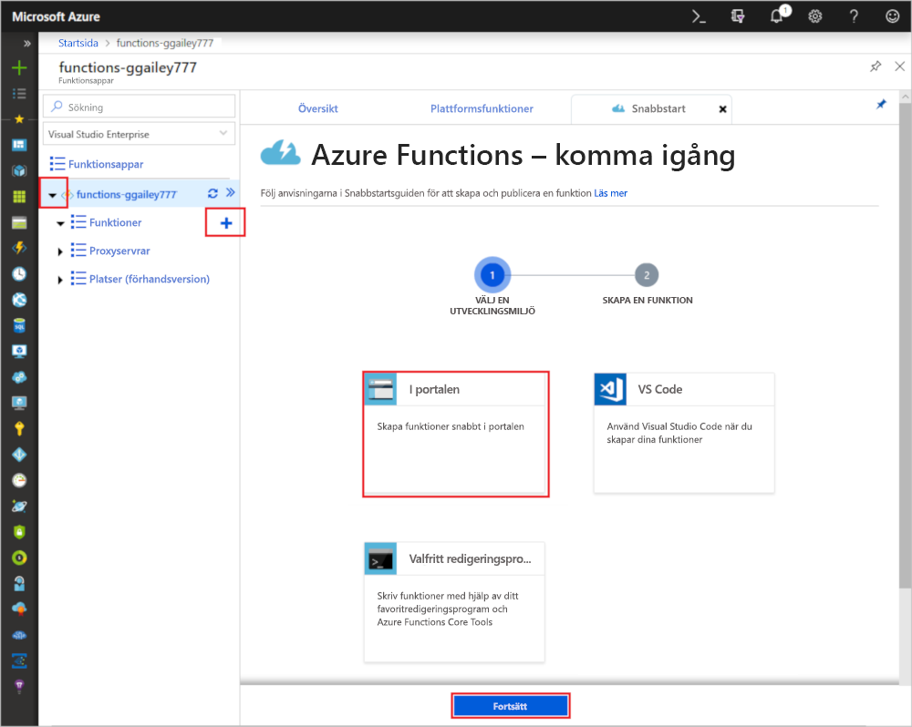

# Skapa en funktion i Azure som utlöses av en timer

Lär dig hur du använder Azure Functions för att skapa en [serverlös](https://azure.microsoft.com/solutions/serverless/) funktion som körs baserat på ett schema som du definierar.

## Krav

För att slutföra den här kursen behöver du:

+ Om du inte har en Azure-prenumeration kan du skapa ett [kostnadsfritt](https://azure.microsoft.com/free/?WT.mc_id=A261C142F) konto innan du börjar.

## Skapa en Azure Functions-app

[!INCLUDE [Create function app Azure portal](../../includes/functions-create-function-app-portal.md)]

Därefter skapar du en funktion i den nya funktionsappen.

## Skapa en timerutlöst funktion

1. Expandera funktionsappen **+** och klicka på knappen bredvid **Funktioner**. Om det här är den första funktionen i din funktionsapp väljer du **I portalen** och sedan **Fortsätt**. Annars går du till steg 3.

   

2. Välj **Fler mallar** och sedan **Slutför och visa mallar**.

    

3. I sökfältet skriver du `timer` och konfigurerar den nya utlösaren med inställningarna enligt tabellen under bilden.

    

    | Inställning | Föreslaget värde | Beskrivning |
    |---|---|---|
    | **Namn** | Default | Det här är namnet på den timerutlösta funktionen. |
    | **Schema** | 0 \*/1 \* \* \*\* | Ett [CRON-uttryck](functions-bindings-timer.md#ncrontab-expressions) med sex fält som schemalägger att funktionen ska köras varje minut. |

4. Klicka på **Skapa**. En funktion skapas på ditt valda språk som körs varje minut, på minuten.

5. Kontrollera körningen genom att granska spårningsinformationen som skrivs till loggarna.

    

Sedan ändrar du funktionens schema så att det körs en gång per timme i stället för varje minut.

## Uppdatera timerschemat

1. Expandera funktionen och klicka på **Integrera**. Det är här du definierar in- och utdatabindningar för funktionen och även anger schemat. 

2. Ange ett nytt **Schema**-värde för `0 0 */1 * * *` så att det körs varje timme och klicka sedan på **Spara**.  

Du har nu en funktion som körs en gång i timmen, på timmen.

## Rensa resurser

[!INCLUDE [Next steps note](../../includes/functions-quickstart-cleanup.md)]

## Nästa steg

Du har skapat en funktion som körs enligt ett schema. Mer information timerutlösare finns i [Schedule code execution with Azure Functions](functions-bindings-timer.md) (Schemalägga kodkörning med Azure Functions).

[!INCLUDE [Next steps note](../../includes/functions-quickstart-next-steps.md)]
