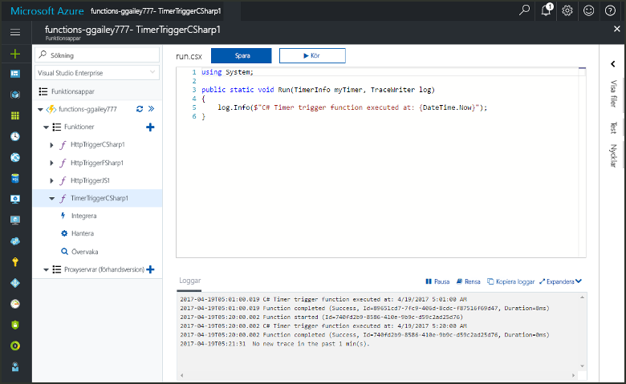
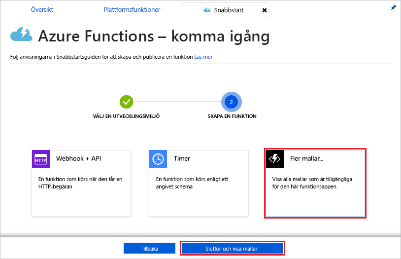
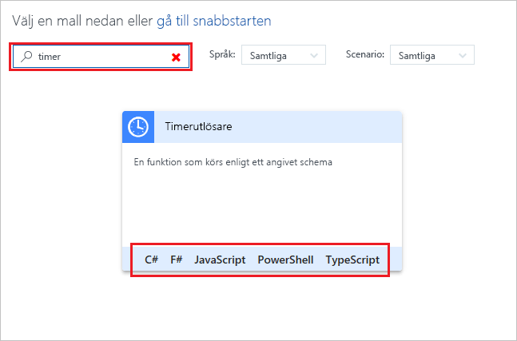
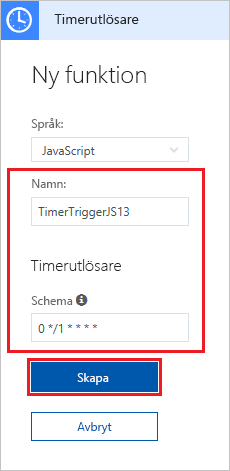
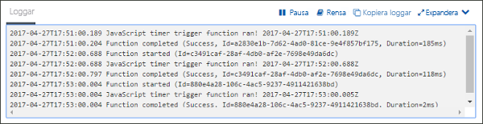
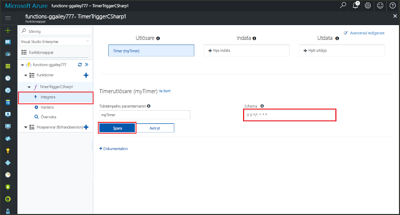

# Skapa en funktion i Azure som utlöses av en timer

Lär dig hur du använder Azure Functions för att skapa en funktion [utan server](https://azure.microsoft.com/overview/serverless-computing/) som körs enligt ett schema som du definierar.

## Nödvändiga komponenter

För att slutföra den här kursen behöver du:

+ Om du inte har en Azure-prenumeration kan du skapa ett [kostnadsfritt konto](https://azure.microsoft.com/free/?WT.mc_id=A261C142F) innan du börjar.

## Skapa en Azure Functions-app

[!INCLUDE [Create function app Azure portal](../../includes/functions-create-function-app-portal.md)]

Därefter skapar du en funktion i den nya funktionsappen.

## Skapa en timerutlöst funktion

1. Expandera funktionsappen och klicka på knappen **+** bredvid **Funktioner**. Om det är den första funktionen i din funktionsapp väljer du **Anpassad funktion**. Detta visar en fullständig uppsättning med funktionsmallar.

    

2. Skriv `timer` i sökfältet och välj sedan önskat språk för utlösarmallen för timern. 

    

3. Konfigurera den nya utlösaren med inställningar enligt tabellen under bilden.

    

    | Inställning | Föreslaget värde | Beskrivning |
    |---|---|---|
    | **Namn** | Standard | Det här är namnet på den timerutlösta funktionen. |
    | **[Schema](http://en.wikipedia.org/wiki/Cron#CRON_expression)** | 0 \*/1 \* \* \* \* | Ett [CRON-uttryck](http://en.wikipedia.org/wiki/Cron#CRON_expression) med sex fält som schemalägger att funktionen ska köras varje minut. |

2. Klicka på **Skapa**. En funktion skapas i valt språk som körs varje minut.

3. Kontrollera körningen genom att granska spårningsinformationen som skrivs till loggarna.

    

Sedan ändrar du funktionens schema så att det körs en gång per timme i stället för varje minut. 

## Uppdatera timerschemat

1. Expandera funktionen och klicka på **Integrera**. Det är här du definierar in- och utdatabindningar för funktionen och även anger schemat. 

2. Ange ett nytt **Schema**-värde för `0 0 */1 * * *` så att det körs varje timme och klicka sedan på **Spara**.  

Du har nu en funktion som körs en gång i timmen. 

## Rensa resurser

[!INCLUDE [Next steps note](../../includes/functions-quickstart-cleanup.md)]

## Nästa steg

Du har skapat en funktion som körs enligt ett schema.

[!INCLUDE [Next steps note](../../includes/functions-quickstart-next-steps.md)]

Mer information timerutlösare finns i [Schedule code execution with Azure Functions](functions-bindings-timer.md) (Schemalägga kodkörning med Azure Functions).
