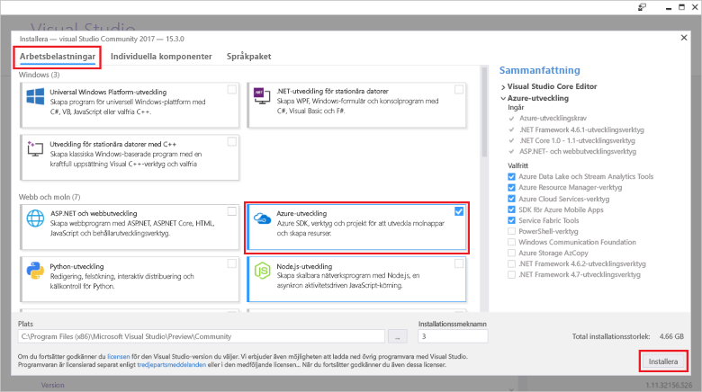

# Snabb start: skapa din första funktion i Azure med Visual Studio

I den här artikeln använder du Visual Studio för att skapa en C#-baserad funktion i C#-klassen som svarar på HTTP-begäranden. När du har testat koden lokalt distribuerar du den till den serverbaserade miljön för Azure Functions.  

Att slutföra den här snabb starten innebär en låg kostnad av några USD cent eller mindre i ditt Azure-konto.

## Förutsättningar

För att slutföra den här kursen måste du först installera [Visual Studio 2019](https://azure.microsoft.com/downloads/). Se till att du väljer arbets belastningen **Azure Development** under installationen. Om du vill skapa ett Azure Functions-projekt med hjälp av Visual Studio 2017 i stället måste du först installera de [senaste Azure Functions verktygen](functions-develop-vs.md#check-your-tools-version).

Om du inte har en [Azure-prenumeration](../guides/developer/azure-developer-guide.md#understanding-accounts-subscriptions-and-billing)kan du skapa ett [kostnads fritt konto](https://azure.microsoft.com/free/dotnet/) innan du börjar.

## Skapa ett funktionsapprojekt

[!INCLUDE [Create a project using the Azure Functions template](../../includes/functions-vstools-create.md)]

Visual Studio skapar ett projekt och en klass som innehåller en exempel kod för funktionen HTTP-utlösare. Den formaterade exempelkoden skickar ett HTTP-svar som innehåller ett värde från förfrågan eller frågesträngen. `HttpTrigger`Attributet anger att funktionen utlöses av en HTTP-begäran. 

## Byt namn på funktionen

`FunctionName`Attributet Method anger namnet på funktionen, som som standard genereras som `Function1` . Eftersom verktyget inte tillåter att du åsidosätter standard funktions namnet när du skapar projektet ska du ta en minut för att skapa ett bättre namn för funktions klassen, filen och metadata.

1. Högerklicka på filen Function1.cs i **Utforskaren** och Byt namn på den till `HttpExample.cs` .

1. I koden byter du namn på Function1-klassen till ' HttpExample '.

1. I `HttpTrigger` metoden med namnet `Run` byter du namn på `FunctionName` attributet Method till `HttpExample` .

Nu när du har bytt namn på funktionen kan du testa den på den lokala datorn.

## Köra funktionen lokalt

Visual Studio integreras med Azure Functions Core Tools så att du kan testa dina funktioner lokalt med den fullständiga Azure Functions-körningen.  

[!INCLUDE [functions-run-function-test-local-vs](../../includes/functions-run-function-test-local-vs.md)]

När du har kontrollerat att funktionen körs korrekt på den lokala datorn är det dags att publicera projektet på Azure.

## Publicera projektet på Azure

Innan du kan publicera ditt projekt måste du ha en Function-app i din Azure-prenumeration. Visual Studio-publicering skapar en Function-app för första gången du publicerar projektet.

[!INCLUDE [Publish the project to Azure](../../includes/functions-vstools-publish.md)]

## Testa din funktion i Azure

1. I Cloud Explorer ska din nya Function-app väljas. Om inte, expanderar du prenumerationen > **app Services** och väljer sedan den nya Function-appen.

1. Högerklicka på Function-appen och välj **Öppna i webbläsare**. Detta öppnar roten för din Function-app i din standard webbläsare och visar sidan som visar att funktions programmet körs. 

    :::image type="content" source="media/functions-create-your-first-function-visual-studio/function-app-running-azure.png" alt-text="Function-appen körs":::

1. I adress fältet i webbläsaren lägger du till strängen i `/api/HttpExample?name=Functions` bas-URL: en och kör begäran.

    Den URL som anropar funktionen HTTP-utlösare har följande format:

    `http://<APP_NAME>.azurewebsites.net/api/HttpExample?name=Functions`

2. Gå till denna URL så ser du ett svar i webbläsaren till den fjärranslutna GET-begäran som returnerades av funktionen, som ser ut som i följande exempel:

    :::image type="content" source="media/functions-create-your-first-function-visual-studio/functions-create-your-first-function-visual-studio-browser-azure.png" alt-text="Funktionssvar i webbläsaren":::

## Rensa resurser

De andra snabbstarterna i den här samlingen bygger på den här snabbstarten. Om du planerar att arbeta med efterföljande snabb starter, självstudier eller med någon av de tjänster som du har skapat i den här snabb starten ska du inte rensa resurserna.

*Resurser* i Azure avser funktionsappar, funktioner, lagringskonton och så vidare. De är grupperade i *resurs grupper* och du kan ta bort allt i en grupp genom att ta bort gruppen. 

Du skapade resurser för att slutföra de här snabbstarterna. Det är möjligt att du debiteras för de här resurserna beroende på din [kontostatus](https://azure.microsoft.com/account/) och dina [servicepriser](https://azure.microsoft.com/pricing/). Om du inte behöver resurserna längre så visar vi hur du tar bort dem här:

1. I Cloud Explorer expanderar du prenumerationen > **app Services**, högerklickar på din Function-app och väljer **Öppna i portalen**. 

1. På sidan Function-app väljer du fliken **Översikt** och väljer sedan länken under **resurs grupp**.

   :::image type="content" source="media/functions-create-your-first-function-visual-studio/functions-app-delete-resource-group.png" alt-text="Välj den resurs grupp som ska tas bort från sidan funktions program":::

2. På sidan **resurs grupp** granskar du listan över resurser som ingår och kontrollerar att de är de som du vill ta bort.
 
3. Välj **Ta bort resursgrupp** och följ instruktionerna.

   Borttagningen kan ta några minuter. När du är färdig visas ett meddelande i några sekunder. Du kan även välja klockikonen längst upp på sidan för att se meddelandet.

## Nästa steg

I den här snabb starten använde du Visual Studio för att skapa och publicera en C# Function-app i Azure med en enkel HTTP-utlösnings funktion. 

Gå vidare till nästa artikel om du vill lära dig hur du lägger till en Azure Storage Queue-bindning till din funktion:
> [!div class="nextstepaction"]
> [Lägg till en Azure Storage Queue-bindning till din funktion](functions-add-output-binding-storage-queue-vs.md)

