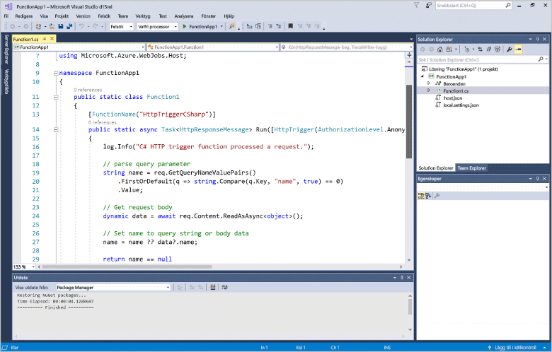
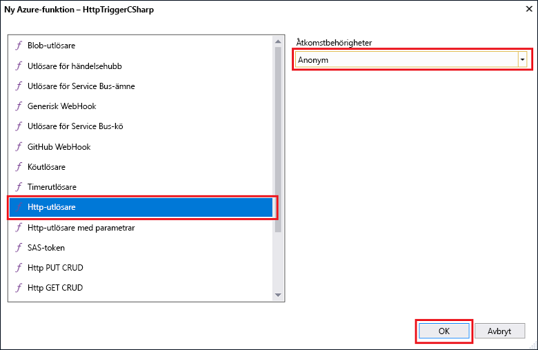
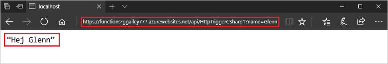

# Skapa din första funktion med Visual Studio 

Med Azure Functions kan du köra kod i en serverfri miljö utan att först behöva skapa en virtuell dator eller publicera en webbapp. 

I det här avsnittet lär du dig hur du använder Azure Functions Tools för Visual Studio 2017 för att skapa och testa en "hello world"-funktion lokalt. Du publicerar sedan funktionskoden till Azure.

## Krav

För att slutföra den här självstudien installerar du:

* [Visual Studio 2017 Preview version 15.3](https://www.visualstudio.com/vs/preview/) (Förhandsversion 15.3 av Visual Studio 2017) inklusive arbetsbelastningen **Azure Development**.
    
    

[!INCLUDE [quickstarts-free-trial-note](../../includes/quickstarts-free-trial-note.md)]

## Installera Azure Functions Tools för Visual Studio 2017

Innan du börjar måste du ladda ned och installera Azure Functions Tools för Visual Studio 2017. Dessa verktyg kan endast användas med Förhandsversion 15.3 av Visual Studio 2017 eller en senare version. Om du redan har installerat Azure Functions Tools kan du hoppa över det här avsnittet.

[!INCLUDE [Install the Azure Functions Tools for Visual Studio](../../includes/functions-install-vstools.md)]   

## Skapa ett Azure Functions-projekt i Visual Studio

[!INCLUDE [Create a project using the Azure Functions template](../../includes/functions-vstools-create.md)]

Nu när du har skapat projektet kan du skapa din första funktion.

## Skapa funktionen

I **Solution Explorer** högerklickar du på projektnoden och väljer **Lägg till** > **Nytt objekt**. Välj **Azure Function** och klicka på **Lägg till**.

Välj **HttpTrigger**, ange ett **Funktionsnamn**, välj **Anonym** för **Åtkomsträttigheter** och klicka på **Skapa**. Funktionen som skapas kan nås av en HTTP-begäran från alla klienter. 

Nu när du har skapat en HTTP-utlöst funktion kan du testa den på en lokal dator.

## Testa funktionen lokalt

[!INCLUDE [Test the function locally](../../includes/functions-vstools-test.md)]

Kopiera URL:en för funktionen från dina Azure Functions-utdata.  

 Klistra in webbadressen för HTTP-begäran i webbläsarens adressfält. Lägg till frågesträngen `&name=<yourname>` i webbadressen och kör din begäran. Nedan visas svaret på den lokala GET-begäran som returnerades av funktionen i webbläsaren: 

För att stoppa felsökningen klickar du på knappen **Stopp** i Visual Studio-verktygsfältet.

När du har kontrollerat att funktionen körs korrekt på den lokala datorn är det dags att publicera projektet på Azure.

## Publicera projektet på Azure

Du måste ha en funktionsapp i din Azure-prenumeration innan du kan publicera projektet. Du kan skapa en funktionsapp direkt från Visual Studio.

[!INCLUDE [Publish the project to Azure](../../includes/functions-vstools-publish.md)]

## Testa din funktion i Azure

Kopiera den grundläggande URL:en för funktionsappen från sidan Publicera profil. Ersätt `localhost:port`-delen av URL:en som du använde när du testade funktionen lokalt med den nya bas-URL:en. Lägg till frågesträngen `&name=<yourname>` i URL:en som tidigare och kör din begäran.

Den URL som anropar den HTTP-utlösta funktionen ser ut så här:

    http://<functionappname>.azurewebsites.net/api/<functionname>?name=<yourname> 

Klistra in den nya URL:en för HTTP-begäran i webbläsarens adressfält. Nedan visas svaret på fjärr-GET-begäran som returnerades av funktionen i webbläsaren: 

 

## Nästa steg

Du har nu använt Visual Studio för att skapa en C#-funktionsapp med en enkel HTTP-utlöst funktion. 

[!INCLUDE [functions-quickstart-next-steps](../../includes/functions-quickstart-next-steps.md)]

Läs mer om lokal testning och felsökning med hjälp av Azure Functions Core Tools i [Code and test Azure Functions locally](functions-run-local.md) (Koda och testa Azure Functions lokalt). 

