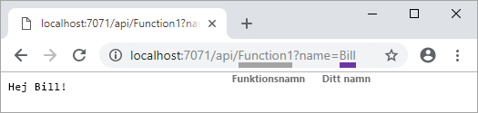
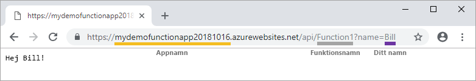

# Skapa din första funktion med Visual Studio

Med Azure Functions kan du köra kod i en [serverfri](https://azure.microsoft.com/solutions/serverless/) miljö utan att först behöva skapa en virtuell dator eller publicera en webbapp.

I den här artikeln får du lära dig hur du använder Visual Studio 2017-verktyg med Azure Functions för att skapa och testa en ”Hello World”-funktion lokalt. Du publicerar sedan funktionskoden till Azure. De här verktygen är tillgängliga som en del av arbetsbelastningen Azure Development i Visual Studio 2017.

Det här avsnittet innehåller [en video](#watch-the-video) som visar samma grundläggande steg.

## Nödvändiga komponenter

För att slutföra den här självstudien behöver du:

* Installera [Visual Studio 2017](https://azure.microsoft.com/downloads/) och kontrollera att även arbetsbelastningen **Azure-utveckling** är installerad.

* Kontrollera att du har de [senaste Azure Functions-verktygen](functions-develop-vs.md#check-your-tools-version).

[!INCLUDE [quickstarts-free-trial-note](../../includes/quickstarts-free-trial-note.md)]

## Skapa ett funktionsapprojekt

[!INCLUDE [Create a project using the Azure Functions template](../../includes/functions-vstools-create.md)]

Visual Studio skapar ett projekt och i det en klass som innehåller formaterad exempelkod för den valda typen. Attributet **FunctionName** i metoden anger namnet på funktionen. Attributet **HttpTrigger** anger att funktionen utlöses av en HTTP-förfrågan. Den formaterade exempelkoden skickar ett HTTP-svar som innehåller ett värde från förfrågan eller frågesträngen. Du kan lägga till bindningar för indata och utdata i en funktion genom att lägga till lämpliga attribut i metoden. Mer information finns i avsnittet [Triggers and bindings](functions-dotnet-class-library.md#triggers-and-bindings) (Utlösare och bindningar) i [Azure Functions C# developer reference](functions-dotnet-class-library.md) (Azure Functions C#-referens för utvecklare).

Nu när du har skapat ditt funktionsprojekt och en HTTP-utlöst funktion kan du testa den på en lokal dator.

## Testa funktionen lokalt

Med Azure Functions Core Tools kan du köra ett Azure Functions-projekt på din lokala utvecklingsdator. Du uppmanas att installera de här verktygen första gången du startar en funktion från Visual Studio.

1. Tryck på F5 för att testa funktionen. Acceptera begäran från Visual Studio för att ladda ned och installera Azure Functions Core (CLI)-verktyg. Du kan även behöva skapa ett brandväggsundantag så att verktygen kan hantera HTTP-förfrågningar.

2. Kopiera URL:en för funktionen från dina Azure Functions-utdata.

    

3. Klistra in webbadressen för HTTP-begäran i webbläsarens adressfält. Lägg till frågesträngen `?name=<YOUR_NAME>` i webbadressen och kör din begäran. Nedan visas svaret på den lokala GET-begäran som returnerades av funktionen i webbläsaren: 

    

4. Tryck på **Skift + F5** för att stoppa felsökningen.

När du har kontrollerat att funktionen körs korrekt på den lokala datorn är det dags att publicera projektet på Azure.

## Publicera projektet på Azure

Du måste ha en funktionsapp i din Azure-prenumeration innan du kan publicera projektet. Du kan skapa en funktionsapp direkt från Visual Studio.

[!INCLUDE [Publish the project to Azure](../../includes/functions-vstools-publish.md)]

## Testa din funktion i Azure

1. Kopiera den grundläggande URL:en för funktionsappen från sidan Publicera profil. Ersätt `localhost:port`-delen av URL:en som du använde när du testade funktionen lokalt med den nya bas-URL:en. Lägg till frågesträngen `?name=<YOUR_NAME>` i URL:en som tidigare och kör din begäran.

    Den URL som anropar din HTTP-utlösta funktion ska ha följande format:

        http://<APP_NAME>.azurewebsites.net/api/<FUNCTION_NAME>?name=<YOUR_NAME> 

2. Klistra in den nya URL:en för HTTP-begäran i webbläsarens adressfält. Nedan visas svaret på fjärr-GET-begäran som returnerades av funktionen i webbläsaren:

    

## Titta på videon

> [!VIDEO https://www.youtube-nocookie.com/embed/DrhG-Rdm80k]

## Nästa steg

Du har nu använt Visual Studio till att skapa och publicera en C#-funktionsapp med en enkel HTTP-utlöst funktion.

* [Läs hur du lägger till indata- och utdatabindningar som integreras med andra tjänster.](functions-develop-vs.md#add-bindings)
* [Läs mer om hur du utvecklar funktioner som .NET-klassbibliotek](functions-dotnet-class-library.md).
