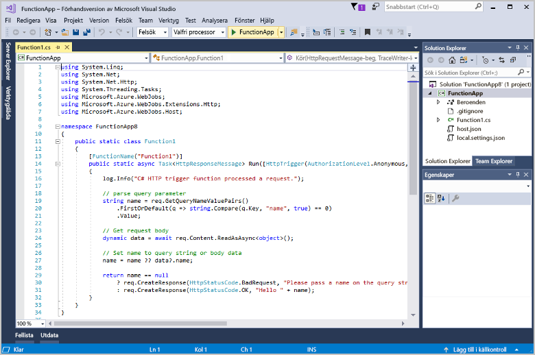

# Skapa din första funktion med Visual Studio

Azure Functions kan du köra din kod i en [serverlösa](https://azure.microsoft.com/overview/serverless-computing/) miljö utan att först skapa en virtuell dator eller publicera ett webbprogram.

Lär dig hur du använder 2017 för Visual Studio tools för Azure Functions för att skapa och testa en ”hello world”-funktionen lokalt i det här avsnittet. Du publicerar sedan funktionskoden till Azure. De här verktygen är tillgängliga som en del av arbetsbelastningen Azure Development i Visual Studio 2017 version 15.3, eller en senare version.

## Krav

För att slutföra den här självstudien installerar du:

* [Visual Studio 2017 version 15,4](https://www.visualstudio.com/vs/) eller en senare version, inklusive den **Azure-utveckling** arbetsbelastning.

    
    
[!INCLUDE [quickstarts-free-trial-note](../../includes/quickstarts-free-trial-note.md)] 

## Skapa ett Azure Functions-projekt i Visual Studio

[!INCLUDE [Create a project using the Azure Functions template](../../includes/functions-vstools-create.md)]

Nu när du har skapat projektet kan du skapa din första funktion.

## Skapa funktionen

1. I **Solution Explorer** högerklickar du på projektnoden och väljer **Lägg till** > **Nytt objekt**. Välj **Azure-funktion**, ange `HttpTriggerCSharp.cs` för **namn**, och klicka på **Lägg till**.

2. Välj **HttpTrigger**väljer **anonym** för **åtkomstbehörigheter**, och klicka på **OK**. Funktionen som skapas kan nås av en HTTP-begäran från alla klienter. 

    

    En kodfil läggs till ditt projekt som innehåller en klass som implementerar din funktionskoden. Den här koden är baserad på en mall, som tar emot ett namnvärde och ta bort eko tillbaka. Den **FunctionName** attributet anger namnet på funktionen. Den **HttpTrigger** attributet anger meddelandet som utlöser funktionen. 

    

Nu när du har skapat en HTTP-utlöst funktion kan du testa den på en lokal dator.

## Testa funktionen lokalt

Med Azure Functions Core Tools kan du köra Azure Functions-projekt på din lokala utvecklingsdator. Du uppmanas att installera de här verktygen första gången du startar en funktion från Visual Studio.  

1. Tryck på F5 för att testa funktionen. Acceptera begäran från Visual Studio för att ladda ned och installera Azure Functions Core (CLI)-verktyg.  Du kan även behöva skapa ett brandväggsundantag så att verktygen kan hantera HTTP-förfrågningar.

2. Kopiera URL:en för funktionen från dina Azure Functions-utdata.  

    

3. Klistra in webbadressen för HTTP-begäran i webbläsarens adressfält. Lägg till frågesträngen `?name=<yourname>` i webbadressen och kör din begäran. Nedan visas svaret på den lokala GET-begäran som returnerades av funktionen i webbläsaren: 

    

4. För att stoppa felsökningen klickar du på knappen **Stopp** i Visual Studio-verktygsfältet.

När du har kontrollerat att funktionen körs korrekt på den lokala datorn är det dags att publicera projektet på Azure.

## Publicera projektet på Azure

Du måste ha en funktionsapp i din Azure-prenumeration innan du kan publicera projektet. Du kan skapa en funktionsapp direkt från Visual Studio.

[!INCLUDE [Publish the project to Azure](../../includes/functions-vstools-publish.md)]

## Testa din funktion i Azure

1. Kopiera den grundläggande URL:en för funktionsappen från sidan Publicera profil. Ersätt `localhost:port`-delen av URL:en som du använde när du testade funktionen lokalt med den nya bas-URL:en. Lägg till frågesträngen `?name=<yourname>` i URL:en som tidigare och kör din begäran.

    Den URL som anropar den HTTP-utlösta funktionen ser ut så här:

        http://<functionappname>.azurewebsites.net/api/<functionname>?name=<yourname> 

2. Klistra in den nya URL:en för HTTP-begäran i webbläsarens adressfält. Nedan visas svaret på fjärr-GET-begäran som returnerades av funktionen i webbläsaren: 

    
 
## Nästa steg

Du har nu använt Visual Studio för att skapa en C#-funktionsapp med en enkel HTTP-utlöst funktion. 

+ Information om hur du konfigurerar ditt projekt för att ge stöd för andra typer av utlösare och bindningar finns i [Configure the project for local development](functions-develop-vs.md#configure-the-project-for-local-development) (Konfigurera projektet för lokal utveckling) i avsnittet [Azure Functions Tools for Visual Studio](functions-develop-vs.md) (Azure Functions Tools för Visual Studio).
+ Läs mer om lokal testning och felsökning med hjälp av Azure Functions Core Tools i [Code and test Azure Functions locally](functions-run-local.md) (Koda och testa Azure Functions lokalt). 
+ Mer information om hur du utvecklar fungerar som .NET-klassbibliotek finns i [Using .NET class libraries with Azure Functions](functions-dotnet-class-library.md) (Använda .NET-klassbibliotek med Azure Functions). 

