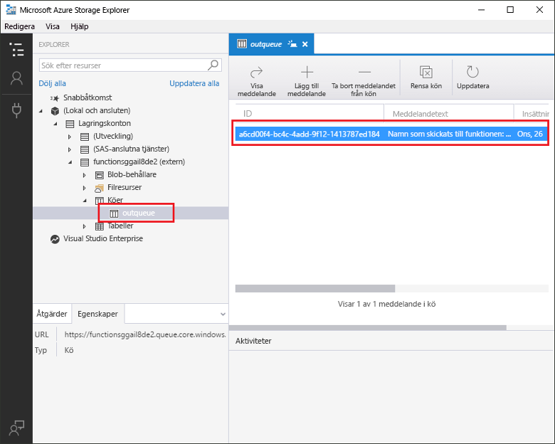
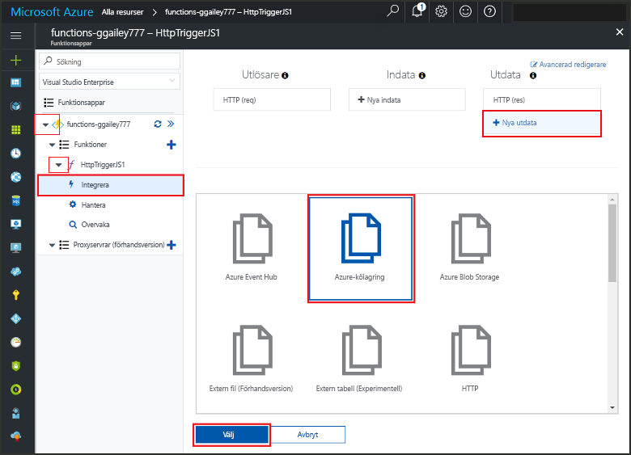
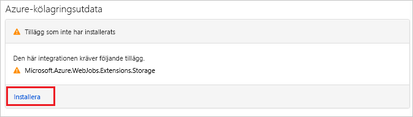
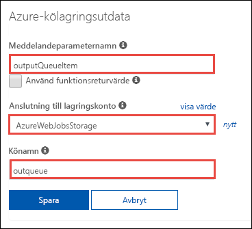
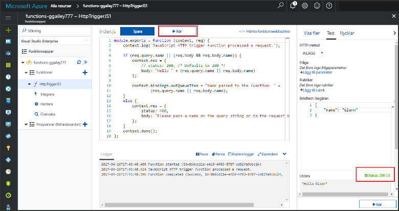
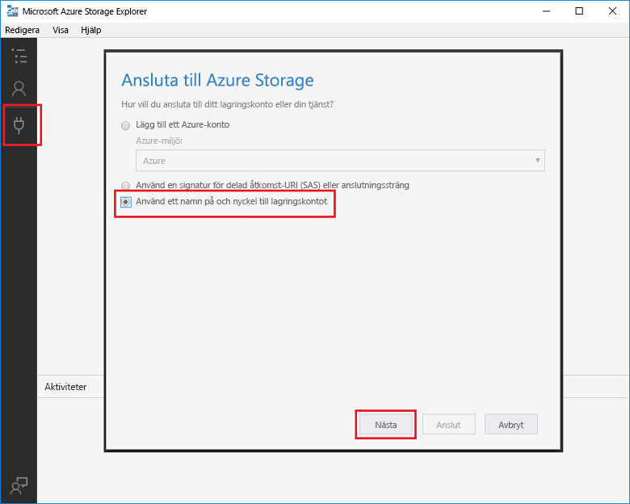
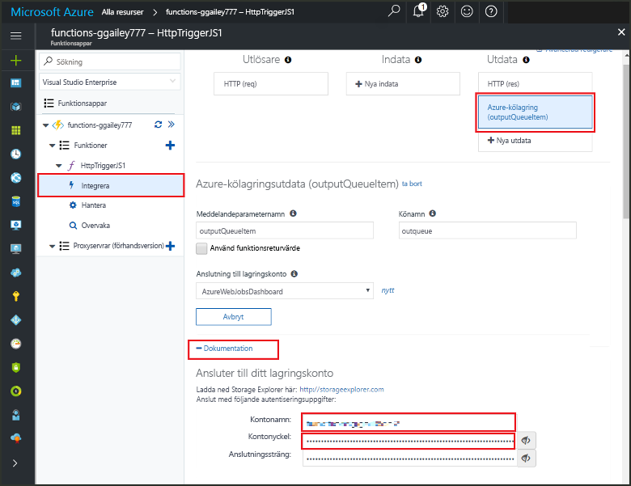
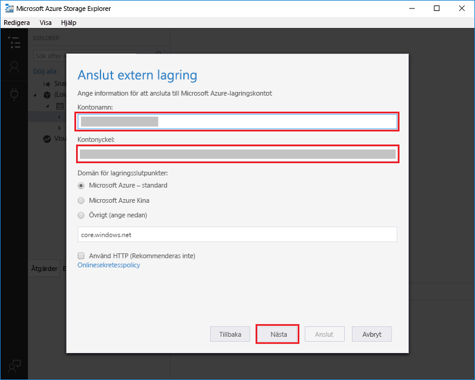

# <a name="add-messages-to-an-azure-storage-queue-using-functions"></a>Lägga till meddelanden i en Azure Storage-kö med Functions

I Azure Functions kan du använda indata- och utdatabindningar för att skapa data från externa tjänster som är tillgängliga för din kod. I den här snabbstarten använder du en utdatabindning för att skapa ett meddelande i en kö när en funktion utlöses av en HTTP-begäran. Du kan använda Azure Storage Explorer för att se kömeddelanden som din funktion skapar:



## <a name="prerequisites"></a>Nödvändiga komponenter

För att slutföra den här snabbstarten behöver du:

* Följ anvisningarna i [Skapa din första funktion i Azure Portal](functions-create-first-azure-function.md) och utför inte steget **Rensa resurser**. Den här snabbstarten skapar funktionsappen och funktionen som du använder här.

* Installera [Microsoft Azure Storage Explorer](http://storageexplorer.com/). Det här är ett verktyg som du använder för att undersöka kömeddelanden som skapas av din utdatabindning.

## <a name="add-binding"></a>Lägga till en utdatabindning

I det här avsnittet använder du portalens användargränssnitt för att lägga till en Queue Storage-utdatabindning till funktionen som du skapade tidigare. Den här bindningen gör det möjligt att skriva minimal kod för att skapa ett meddelande i en kö. Du behöver inte skriva kod för uppgifter som till exempel att öppna en lagringsanslutning, skapa en kö eller lägga till en referens i en kö. Azure Functions-körningen och utdatabindningen tar hand om de här aktiviteterna åt dig.

1. Öppna sidan för funktionsappen som du skapade i [Skapa din första funktion i Azure Portal](functions-create-first-azure-function.md) på sidan för funktionsappar i Azure Portal. Detta gör du genom att välja **Alla tjänster > Funktionsappar** och sedan markera din funktionsapp.

1. Välj funktionen som du skapade i den tidigare snabbstarten.

1. Välj **Integrera > Nya utdata > Azure Queue Storage**.

1. Klicka på **Välj**.

    

1. Om du får ett meddelande om att **tilläggen inte har installerats** väljer du **Installera** för att installera tillägget för Storage-bindningar i funktionsappen. Det kan ta någon minut.

    

1. Under **Azure Queue Storage-utdata** använder du inställningarna som anges i tabellen under den här skärmbilden: 

    

    | Inställning      |  Föreslaget värde   | Beskrivning                              |
    | ------------ |  ------- | -------------------------------------------------- |
    | **Meddelandeparameternamn** | outputQueueItem | Namnet på utdatabindningsparametern. | 
    | **Lagringskontoanslutning** | AzureWebJobsStorage | Du kan antingen använda den lagringskontoanslutning som redan används i funktionsappen eller skapa en ny.  |
    | **Könamn**   | utkö    | Namnet på kön som ska anslutas till i ditt Storage-konto. |

1. Klicka på **Spara** för att lägga till bindningen.

Nu när du har definierat en utdatabindning måste du uppdatera koden så att bindningen används när meddelanden läggs till i en kö.  

## <a name="add-code-that-uses-the-output-binding"></a>Lägg till kod som använder utdatabindning

I det här avsnittet lägger du till kod som skriver ett meddelande till utdatakön. Meddelandet innehåller värdet som skickades till HTTP-utlösaren i frågesträngen. Om frågesträngen till exempel innehåller `name=Azure` så är kömeddelandet *Name passed to the function: Azure* (Namn som skickats till funktionen: Azure).

1. Välj din funktion så att funktionskoden visas i redigeraren.

1. Uppdatera funktionskoden beroende på ditt funktionsspråk:

    # <a name="ctabcsharp"></a>[C\#](#tab/csharp)

    Lägg till en **outputQueueItem**-parameter till metodsignaturen som visas i följande exempel.

    ```cs
    public static async Task<IActionResult> Run(HttpRequest req,
        ICollector<string> outputQueueItem, ILogger log)
    {
        ...
    }
    ```

    I meddelandetexten för funktionen precis före `return`-instruktionen lägger du till kod som använder parametern för att skapa ett kömeddelande.

    ```cs
    outputQueueItem.Add("Name passed to the function: " + name);
    ```

    # <a name="javascripttabnodejs"></a>[JavaScript](#tab/nodejs)

    Lägg till kod som använder utdatabindningen till `context.bindings`-objektet för att skapa ett kömeddelande. Lägg till den här koden före `context.done`-instruktionen.

    ```javascript
    context.bindings.outputQueueItem = "Name passed to the function: " + 
                (req.query.name || req.body.name);
    ```

    ---

1. Välj **Spara** för att spara ändringarna.

## <a name="test-the-function"></a>Testa funktionen

1. Välj **Kör** när kodändringarna har sparats. 

    

    Observera att **Begärandetexten** innehåller värdet `name` *Azure*. Värdet visas i kömeddelandet som skapas när funktionen anropas.
    
    Som ett alternativ till att välja **Kör** här kan du anropa funktionen genom att ange en URL i en webbläsare och ange värdet `name` i frågesträngen. Webbläsarmetoden visas i den [tidigare snabbstarten](functions-create-first-azure-function.md#test-the-function).

2. Kontrollera i loggfilerna att funktionen har slutförts utan fel. 

En ny kö med namnet **outqueue** skapas i ditt lagringskonto av funktionskörningen när utdatabindningen används för första gången. Du använder Storage Explorer för att verifiera att kön och ett meddelande i den har skapats.

### <a name="connect-storage-explorer-to-your-account"></a>Anslut Storage Explorer till ditt konto

Hoppa över det här avsnittet om du redan har installerat Storage Explorer och anslutit den till lagringskontot som du använder med den här snabbstarten.

2. Kör verktyget [Microsoft Azure Storage Explorer](http://storageexplorer.com/), klicka på anslutningsikonen till vänster, välj **Use a storage account name and key** (Använd ett kontonamn och en kontonyckel för lagringskontot) och klicka på **Nästa**.

    

1. Välj din funktion och sedan **Integrera** på sidan för funktionsappar i Azure Portal.

1. Välj **Azure Queue Storage**-utdatabindningen som du lade till i ett tidigare steg.

1. Expandera avsnittet **Dokumentation** längst ned på sidan. 

   Portalen visar de autentiseringsuppgifter som du kan använda i Storage Explorer för att ansluta till lagringskontot.

   

1. Kopiera värdet **Kontonamn** från portalen och klistra in det i rutan **Kontonamn** i Storage Explorer.
 
1. Klicka på ikonen visa/dölj bredvid **Kontonyckel** för att visa värdet, kopiera sedan värdet **Kontonyckel** och klistra in det i rutan **Kontonyckel** i Storage Explorer.
  
3. Välj **Nästa > Anslut**.

   

### <a name="examine-the-output-queue"></a>Granska utdatakö

4. I Storage Explorer väljer du det lagringskonto som du använder för den här snabbstarten.

1. Expandera noden **Köer** och välj sedan kön med namnet **outqueue**. 

   Kön innehåller meddelandet som köutdatabindningen skapade när du körde den HTTP-utlösta funktionen. Om du startade en funktion med standardvärdet `name` för *Azure* så är kömeddelandet *Name passed to the function: Azure* (Namn som skickats till funktionen: Azure).

    

2. Kör funktionen igen så ser du ett nytt meddelande i kön.  

## <a name="clean-up-resources"></a>Rensa resurser

[!INCLUDE [Clean up resources](../../includes/functions-quickstart-cleanup.md)]

## <a name="next-steps"></a>Nästa steg

I den här snabbstarten lade du till en utdatabindning i en befintlig funktion. Mer information om bindning till Queue Storage finns i [Azure Functions Storage queue bindings](functions-bindings-storage-queue.md) (Azure Functions-lagringsköbindningar). 

[!INCLUDE [Next steps note](../../includes/functions-quickstart-next-steps.md)]
