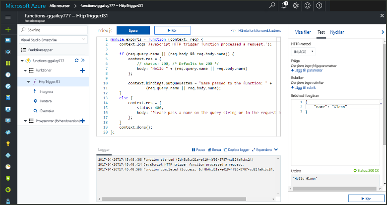

# <a name="add-messages-to-an-azure-storage-queue-using-functions"></a>Lägga till meddelanden i en Azure Storage-kö med Functions

I Azure Functions kan du använda indata- och utdatabindningar för att ansluta till data i en extern tjänst från din funktion på ett deklarativt sätt. I det här avsnittet får du lära dig hur du uppdaterar en befintlig funktion genom att lägga till en utdatabindning som skickar meddelanden till Azure Queue Storage.  



Det bör ta mindre än fem minuter att slutföra alla steg i det här avsnittet.

## <a name="prerequisites"></a>Krav 

[!INCLUDE [Previous topics](../../includes/functions-quickstart-previous-topics.md)]

Du måste också hämta och installera [Microsoft Azure Storage Explorer](http://storageexplorer.com/). 

[!INCLUDE [functions-portal-favorite-function-apps](../../includes/functions-portal-favorite-function-apps.md)] 

## <a name="add-binding"></a>Lägga till en utdatabindning
 
1. Expandera både din funktionsapp och din funktion.

2. Klicka på **Integrera** och **+ Nya utdata** och klicka sedan på **Azure Queue Storage** och på **Välj**.
    
    

3. Använd inställningarna i tabellen och klicka sedan på **Spara**: 

    

    | Inställning      |  Föreslaget värde   | Beskrivning                              |
    | ------------ |  ------- | -------------------------------------------------- |
    | **Könamn**   | myqueue-items    | Namnet på kön som ska anslutas till i ditt Storage-konto. |
    | **Lagringskontoanslutning** | AzureWebJobStorage | Du kan antingen använda den lagringskontoanslutning som redan används i funktionsappen eller skapa en ny.  |
    | **Meddelandeparameternamn** | outQueueItem | Namnet på utdatabindningsparametern. | 

Nu när du har definierat en utdatabindning måste du uppdatera koden så att bindningen används när meddelanden läggs till i en kö.  

## <a name="update-the-function-code"></a>Uppdatera funktionskoden

1. Klicka på din funktion för att visa funktionskoden i redigeraren. 

2. För en C#-funktion uppdaterar du funktionsdefinitionen på följande sätt för att lägga till lagringsbindningsparametern **outQueueItem**. Hoppa över det här steget om du använder en JavaScript-funktion.

    ```cs   
    public static async Task<HttpResponseMessage> Run(HttpRequestMessage req, 
        ICollector<string> outQueueItem, TraceWriter log)
    {
        ....
    }
    ```

3. Lägg till följande kod i funktionen precis innan metoden returneras. Använd lämpligt kodstycke för det språk som du använder för funktionen.

    ```javascript
    context.bindings.outQueueItem = "Name passed to the function: " + 
                (req.query.name || req.body.name);
    ```

    ```cs
    outQueueItem.Add("Name passed to the function: " + name);     
    ```

4. Klicka på **Spara** för att spara ändringarna.

Värdet som skickades till HTTP-utlösaren ingår i ett meddelande som har lagts till i kön.
 
## <a name="test-the-function"></a>Testa funktionen 

1. När kodändringarna har sparats klickar du på **Kör**. 

    

2. Kontrollera i loggfilerna att funktionen har slutförts utan fel. En ny kö med namnet **outqueue** skapas i ditt lagringskonto av funktionskörningen när utdatabindningen används för första gången.

Därefter kan du ansluta till ditt lagringskonto och kontrollera den nya kön och meddelandet som du lade till. 

## <a name="connect-to-the-queue"></a>Ansluta till kön

Hoppa över de första tre stegen om du redan har installerat Lagringsutforskaren och anslutit den till ditt lagringskonto.    

1. Klicka på **Integrera** i din funktion och sedan på den nya **Azure Queue Storage**-utdatabindningen. Expandera sedan **Dokumentation**. Kopiera både **kontonamnet** och **kontonyckeln**. Du använder dessa autentiseringsuppgifter för att ansluta till lagringskontot.
 
    

2. Kör verktyget [Microsoft Azure Storage Explorer](http://storageexplorer.com/), klicka på anslutningsikonen till vänster, välj **Use a storage account name and key** (Använd ett kontonamn och en kontonyckel för lagringskontot) och klicka på **Nästa**.

    
    
3. Ange **kontonamnet** och **kontonyckeln** från steg 1, klicka på **Nästa** och sedan på **Anslut**. 
  
    

4. Expandera det anslutna lagringskontot, högerklicka på **Köer** och kontrollera att det finns en kö med namnet **myqueue-items**. Du bör även se ett meddelande som redan finns i kön.  
 
    
 

## <a name="clean-up-resources"></a>Rensa resurser

[!INCLUDE [Next steps note](../../includes/functions-quickstart-cleanup.md)]

## <a name="next-steps"></a>Nästa steg

Du har lagt till en utdatabindning i en befintlig funktion. 

[!INCLUDE [Next steps note](../../includes/functions-quickstart-next-steps.md)]

Mer information om bindning till Queue Storage finns i [Azure Functions Storage queue bindings](functions-bindings-storage-queue.md) (Azure Functions-lagringsköbindningar). 


