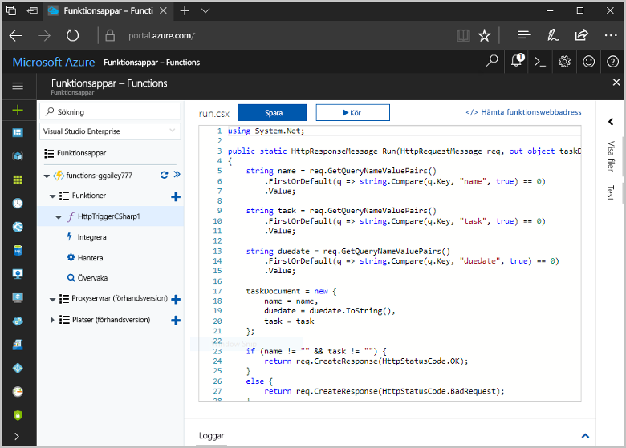
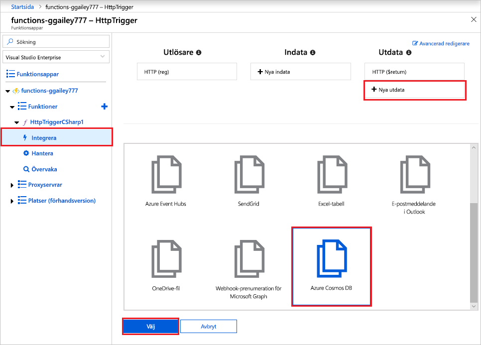
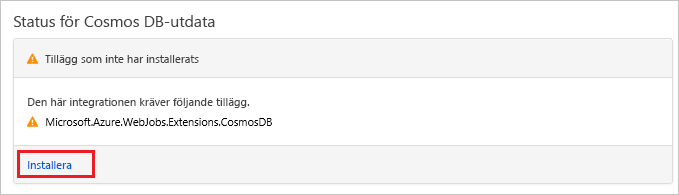
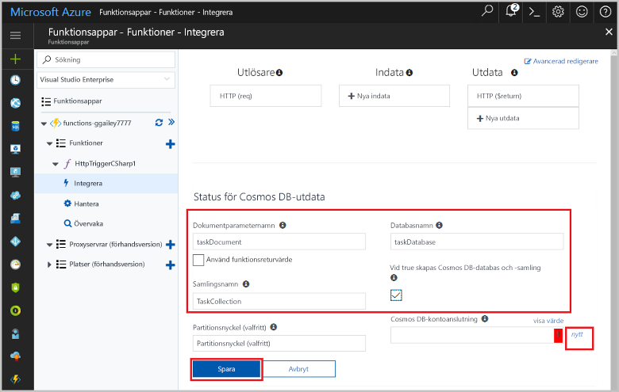
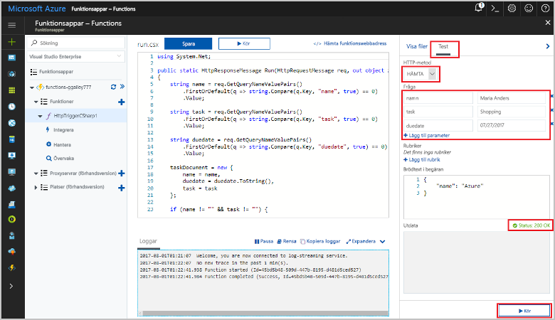
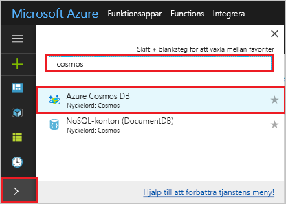

# <a name="store-unstructured-data-using-azure-functions-and-azure-cosmos-db"></a>Lagra ostrukturerade data i Azure Functions och Azure Cosmos DB

[Azure Cosmos DB](https://azure.microsoft.com/services/cosmos-db/) är ett väldigt bra sätt att lagra ostrukturerade och JSON-data. I kombination med Azure Functions, gör Cosmos DB lagring av data snabbt och enkelt med mycket mindre kod än vad som krävs för att lagra data i en relationsdatabas.

> [!NOTE]
> Just nu fungerar Azure Cosmos DB-utlösaren, indatabindningar och utdatabindningar endast med SQL API och Graph API-konton.

I Azure Functions kan du använda indata- och utdatabindningar för att ansluta till data i en extern tjänst från din funktion på ett deklarativt sätt. I den här artikeln lär du dig hur du uppdaterar en befintlig funktion för att lägga till en utdatabindning som lagrar ostrukturerade data i ett Azure Cosmos DB-dokument.



## <a name="prerequisites"></a>Nödvändiga komponenter

För att slutföra den här självstudien behöver du:

[!INCLUDE [Previous quickstart note](../../includes/functions-quickstart-previous-topics.md)]

## <a name="create-an-azure-cosmos-db-account"></a>Skapa ett Azure Cosmos DB-konto

Du måste ha ett Azure Cosmos DB-konto som använder SQL API innan du skapar utdatabindningen.

[!INCLUDE [cosmos-db-create-dbaccount](../../includes/cosmos-db-create-dbaccount.md)]

## <a name="add-an-output-binding"></a>Lägg till en utdatabindning

1. I portalen går du till funktionsappen du skapade tidigare och expanderar både funktionsappen och funktionen.

1. Välj **Integrera** och **+ Nya utdata**, som du hittar längst upp till höger på sidan. Välj **Azure Cosmos DB** och klicka på **Välj**.

    

1. Om du får ett meddelande om att **tilläggen inte har installerats** väljer du **Installera** för att installera tillägget för Azure Cosmos DB-bindningar i funktionsappen. Installationen kan ta några minuter.

    

1. Använd inställningarna för **Azure Cosmos DB-utdata** på det sätt som beskrivs i tabellen:

    

    | Inställning      | Föreslaget värde  | Beskrivning                                |
    | ------------ | ---------------- | ------------------------------------------ |
    | **Dokumentparameternamn** | taskDocument | Namn som refererar till Cosmos DB-objektet i koden. |
    | **Databasnamn** | taskDatabase | Namnet på databasen där dokumenten ska sparas. |
    | **Samlingsnamn** | TaskCollection | Databassamlingens namn. |
    | **Om värdet är true skapas Cosmos DB-databasen och -samlingen** | Markerad | Samlingen finns inte redan, så du måste skapa den. |
    | **Azure Cosmos DB-kontoanslutning** | Ny inställning | Välj **Ny**, välj sedan din **prenumeration**, det **databaskonto** som du skapade tidigare och sedan **Välj**. Skapar en programinställning för din kontoanslutning. Den här inställningen används av bindningen för anslutningen till databasen. |
    | **Samlingsdataflöde** |400 RU| Du kan skala upp dataflödet senare om du vill minska svarstiden. |

1. Välj **Spara** för att skapa bindningen.

## <a name="update-the-function-code"></a>Uppdatera funktionskoden

Ersätt den befintliga funktionskoden med följande kod, på ditt valda språk:

# <a name="ctabcsharp"></a>[C\#](#tab/csharp)

Ersätt den befintliga C#-funktionen med följande kod:

```csharp
#r "Newtonsoft.Json"

using Microsoft.AspNetCore.Mvc;
using Microsoft.AspNetCore.Http;
using Microsoft.Extensions.Logging;

public static IActionResult Run(HttpRequest req, out object taskDocument, ILogger log)
{
    string name = req.Query["name"];
    string task = req.Query["task"];
    string duedate = req.Query["duedate"];

    // We need both name and task parameters.
    if (!string.IsNullOrEmpty(name) && !string.IsNullOrEmpty(task))
    {
        taskDocument = new
        {
            name,
            duedate,
            task
        };

        return (ActionResult)new OkResult();
    }
    else
    {
        taskDocument = null;
        return (ActionResult)new BadRequestResult();
    }
```

# <a name="javascripttabnodejs"></a>[JavaScript](#tab/nodejs)

Ersätt den befintliga JavaScript-funktionen med följande kod:

```js
module.exports = async function (context, req) {

    // We need both name and task parameters.
    if (req.query.name && req.query.task) {

        // Set the output binding data from the query object.
        context.bindings.taskDocument = req.query;

        // Success.
        context.res = {
            status: 200
        };
    }
    else {
        context.res = {
            status: 400,
            body: "The query options 'name' and 'task' are required."
        };
    }
};
```
---

Det här kodexemplet läser frågesträngarna i HTTP-begäran och tilldelar dem till fält i `taskDocument`-objektet. `taskDocument`-bindningen skickar objektdata från den här bindningsparametern för lagring i den bundna dokumentdatabasen. Databasen skapas första gången funktionen körs.

## <a name="test-the-function-and-database"></a>Testa funktionen och databasen

1. Expandera det högra fönstret och välj **Test**. Under **Fråga** klickar du på **+ Lägg till parameter** och lägger till följande parametrar i frågesträngen:

    + `name`
    + `task`
    + `duedate`

1. Klicka på **Kör** och kontrollera att statusen 200 returneras.

    

1. Expandera ikonfältet till vänster på Azure-portalen, skriv `cosmos` i sökfältet och välj **Azure Cosmos DB**.

    

1. Välj ditt Azure Cosmos DB-konto och välj sedan **Datautforskaren**.

1. Expandera **Samlingar**-noderna, välj det nya dokumentet och kontrollera att dokumentet innehåller dina frågesträngsvärden, samt en del ytterligare metadata.

    

Du har lagt till en bindning till din HTTP-utlösare för att lagra ostrukturerade data i en Azure Cosmos DB.

[!INCLUDE [Clean-up section](../../includes/clean-up-section-portal.md)]

## <a name="next-steps"></a>Nästa steg

[!INCLUDE [functions-quickstart-next-steps](../../includes/functions-quickstart-next-steps.md)]

Mer information om att binda till en Cosmos DB-databas finns i [Azure Functions Cosmos DB-bindningar](functions-bindings-cosmosdb.md).
