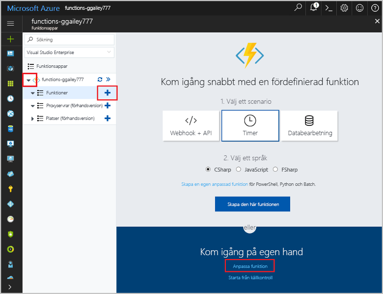

# <a name="create-an-openapi-definition-for-a-function"></a>Skapa en OpenAPI-definition för en funktion
REST-API:er beskrivs ofta med hjälp av en OpenAPI-definition (kallades tidigare för en [Swagger](http://swagger.io/)-fil). Den här definitionen innehåller information om vilka åtgärder som är tillgängliga i API:t och hur data om förfrågningar och svar för API:t ska vara strukturerade.

I den här självstudien skapar du en funktion som avgör om en nödreparation på en vindturbin är kostnadseffektiv. Du kan sedan skapa en OpenAPI-definition för funktionsappen så att funktionen kan anropas från andra appar och tjänster.

I den här guiden får du lära dig att:

> [!div class="checklist"]
> * skapar en funktion i Azure
> * genererar en OpenAPI-definition med hjälp av OpenAPI-verktyg
> * ändrar definitionen för att tillhandahålla ytterligare metadata
> * testar definitionen genom att anropa funktionen.

## <a name="create-a-function-app"></a>Skapa en funktionsapp

Du måste ha en funktionsapp som värd för körning av dina funktioner. I en funktionsapp kan du gruppera funktioner som en logisk enhet så att de blir enklare att hantera, distribuera, skala och dela resurser. 

[!INCLUDE [Create function app Azure portal](../../includes/functions-create-function-app-portal.md)]


## <a name="create-the-function"></a>Skapa funktionen

I den här självstudien används en HTTP-utlöst funktion som tar två parametrar: beräknad tid för att reparera turbinen (i timmar) och turbinens kapacitet (i kilowatt). Funktionen beräknar sedan hur mycket en reparation skulle kosta och hur mycket intäkter turbinen kan generera under en 24-timmarsperiod.

1. Expandera funktionsappen och välj knappen **+** bredvid **Funktioner**. Om det är den första funktionen i din funktionsapp väljer du **Anpassad funktion**. Detta visar en fullständig uppsättning med funktionsmallar. 

    

2. Skriv `http` i sökfältet och välj sedan **C#** för HTTP-utlösarmallen. 
 
    

3. Skriv `TurbineRepair` som funktionens **Namn**, välj `Function` för **[Autentiseringsnivå](functions-bindings-http-webhook.md#http-auth)** och välj sedan **Skapa**.  

    

1. Ersätt innehållet i filen run.csx med följande kod och klicka sedan på **Spara**:

    ```csharp
    using System.Net;

    const double revenuePerkW = 0.12; 
    const double technicianCost = 250; 
    const double turbineCost = 100;

    public static async Task<HttpResponseMessage> Run(HttpRequestMessage req, TraceWriter log)
    {   

        //Get request body
        dynamic data = await req.Content.ReadAsAsync<object>();
        int hours = data.hours;
        int capacity = data.capacity;

        //Formulas to calculate revenue and cost
        double revenueOpportunity = capacity * revenuePerkW * 24;  
        double costToFix = (hours * technicianCost) +  turbineCost;
        string repairTurbine;

        if (revenueOpportunity > costToFix){
            repairTurbine = "Yes";
        }
        else {
            repairTurbine = "No";
        }

        return req.CreateResponse(HttpStatusCode.OK, new{
            message = repairTurbine,
            revenueOpportunity = "$"+ revenueOpportunity,
            costToFix = "$"+ costToFix         
        }); 
    }
    ```
    Den här funktionskoden returnerar meddelandet `Yes` eller `No` som indikation på om en nödreparation är kostnadseffektiv, intäktsmöjligheten som turbinen representerar och kostnaden för att reparera turbinen. 

1. Testa funktionen genom att klicka på **Test** längst till höger för att expandera fliken Test. Ange följande värde för **Brödtext i förfrågan** och klicka sedan på **Kör**.

    ```json
    {
    "hours": "6",
    "capacity": "2500"
    }
    ```

    

    Följande värde returneras i brödtexten i svaret.

    ```json
    {"message":"Yes","revenueOpportunity":"$7200","costToFix":"$1600"}
    ```

Nu har du en funktion som avgör om en nödreparation är kostnadseffektiv. Nästa steg är att skapa och ändra en OpenAPI-definition för funktionsappen.

## <a name="generate-the-openapi-definition"></a>Generera OpenAPI-definitionen

Nu är du redo att generera OpenAPI-definitionen. Den här definitionen kan användas av andra Microsoft-program som API Apps, [PowerApps](functions-powerapps-scenario.md) och [Microsoft Flow](../azure-functions/app-service-export-api-to-powerapps-and-flow.md), samt av andra utvecklingsverktyg från tredje part som [Postman](https://www.getpostman.com/docs/importing_swagger) och [många andra paket](http://swagger.io/tools/).

1. Välj endast de *verb* som ditt API har stöd för (i det här fallet POST). Det gör den genererade API-definitionen tydligare.

    1. På fliken **Integrera** för den nya HTTP-utlösta funktionen ändrar du **Tillåtna HTTP-metoder** till **Valda metoder**.

    1. I **Valda HTTP-metoder** avmarkerar du alla alternativ utom **POST** och klickar på **Spara**.

        
        
1. Klicka på din funktionsappens namn (till exempel **function-demo-energy**) > **Plattformsfunktioner** > **API-definition**.

    

1. På fliken **API-definition** klickar du på **Funktion**.

    

    Det här steget möjliggör en uppsättning OpenAPI-alternativ för funktionsappen, inklusive en slutpunkt som kan vara värd för en OpenAPI-fil från funktionsappens domän, en infogad kopia av [OpenAPI Editor](http://editor.swagger.io), och en mallgenerator för API-definitioner.

1. Klicka på **Generera API-definitionsmall** > **Spara**.

    

    Azure söker igenom funktionsappen efter HTTP-utlösarfunktioner och använder informationen i functions.json till att generera en OpenAPI-definition. Här är den definition som genereras:

    ```yaml
    swagger: '2.0'
    info:
    title: function-demo-energy.azurewebsites.net
    version: 1.0.0
    host: function-demo-energy.azurewebsites.net
    basePath: /
    schemes:
    - https
    - http
    paths:
    /api/TurbineRepair:
        post:
        operationId: /api/TurbineRepair/post
        produces: []
        consumes: []
        parameters: []
        description: >-
            Replace with Operation Object
            #http://swagger.io/specification/#operationObject
        responses:
            '200':
            description: Success operation
        security:
            - apikeyQuery: []
    definitions: {}
    securityDefinitions:
    apikeyQuery:
        type: apiKey
        name: code
        in: query
    ```

    Den här definitionen beskrivs som en _mall_ eftersom det behövs mer metadata för att den ska vara en fullständig OpenAPI-definition. Du kommer att ändra definitionen i nästa steg.

## <a name="modify-the-openapi-definition"></a>Ändra OpenAPI-definitionen
Nu när du har en malldefinition kan ändra du den och tillhandahålla ytterligare metadata om API:ts åtgärder och datastrukturer. I **API-definition** tar du bort definitionen från `post` till slutet av definitionen. Klistra sedan in innehållet nedan och klicka på **spara**.

```yaml
    post:
      operationId: CalculateCosts
      description: Determines if a technician should be sent for repair
      summary: Calculates costs
      x-ms-summary: Calculates costs
      x-ms-visibility: important
      produces:
        - application/json
      consumes:
        - application/json
      parameters:
        - name: body
          in: body
          description: Hours and capacity used to calculate costs
          x-ms-summary: Hours and capacity
          x-ms-visibility: important
          required: true
          schema:
            type: object
            properties:
              hours:
                description: The amount of effort in hours required to conduct repair
                type: number
                x-ms-summary: Hours
                x-ms-visibility: important
              capacity:
                description: The max output of a turbine in kilowatts
                type: number
                x-ms-summary: Capacity
                x-ms-visibility: important
      responses:
        200:
          description: Message with cost and revenue numbers
          x-ms-summary: Message
          schema:
           type: object
           properties:
            message:
              type: string
              description: Returns Yes or No depending on calculations
              x-ms-summary: Message 
            revenueOpportunity:
              type: string
              description: The revenue opportunity cost
              x-ms-summary: RevenueOpportunity 
            costToFix:
              type: string
              description: The cost in $ to fix the turbine
              x-ms-summary: CostToFix
      security:
        - apikeyQuery: []
definitions: {}
securityDefinitions:
  apikeyQuery:
    type: apiKey
    name: code
    in: query
```

I det här fallet kan du bara klistra in uppdaterade metadata, men det är viktigt att du förstår vilka typer av ändringar vi har gjort i standardmallen:

+ vi angav att API:t skapar och använder data i JSON-format

+ vi angav obligatoriska parametrar med namn och datatyper

+ vi angav returvärden för lyckade svar med namn och datatyper

+ vi angav egna sammanfattningar och beskrivningar för API:t samt dess åtgärder och parametrar, detta är viktigt för de som ska använda funktionen

+ vi lade till x-ms-summary och x-ms-visibility, som används i användargränssnittet för Microsoft Flow och Logic Apps. Mer information finns i [OpenAPI extensions for custom APIs in Microsoft Flow](https://preview.flow.microsoft.com/documentation/customapi-how-to-swagger/) (OpenAPI-tillägg för egna API:er i Microsoft Flow).

> [!NOTE]
> Vi lämnade kvar säkerhetsdefinitionen med standardmetoden för autentisering med API-nyckel. Du skulle ändra det här avsnittet i definitionen om du använder en annan typ av autentisering.

Mer information om att definiera API-åtgärder finns i [specifikationen för OpenAPI](https://swagger.io/specification/#operationObject).

## <a name="test-the-openapi-definition"></a>Testa OpenAPI-definitionen
Innan du använder API-definitionen är det bra att först testa den i Azure Functions-gränssnittet.

1. På den **Hantera** i din funktion, under **Värdnycklar**, kopierar du nyckeln **standard**.

    

    > [!NOTE]
    >Du använder den här nyckeln för testning, och du använder den även när du anropar API:t från en app eller tjänst.

1. Återgå till API-definitionen: **function-demo-energy** > **Plattformsfunktioner** > **API-definition**.

1. Klicka på **Autentisera** i den högra rutan, ange API-nyckeln du kopierade och klicka på **Autentisera**.

    

1. Rulla nedåt och klicka på **Försök utföra åtgärden**.

    

1. Ange värden för **timmar** och **kapacitet**.

    

    Observera hur gränssnittet använder beskrivningarna från API-definitionen.

1. Klicka på **Skicka förfrågan** och klicka sedan på fliken **Kodformatering** för att se utdata.

    

## <a name="next-steps"></a>Nästa steg

I den här självstudiekursen lärde du dig att:

> [!div class="checklist"]
> * skapar en funktion i Azure
> * genererar en OpenAPI-definition med hjälp av OpenAPI-verktyg
> * ändrar definitionen för att tillhandahålla ytterligare metadata
> * testar definitionen genom att anropa funktionen.

Gå vidare till nästa avsnitt där du får lära dig hur du skapar en PowerApps-app som använder OpenAPI-definitionen du skapade nyss.
> [!div class="nextstepaction"]
> [Anropa en funktion från PowerApps](functions-powerapps-scenario.md)
