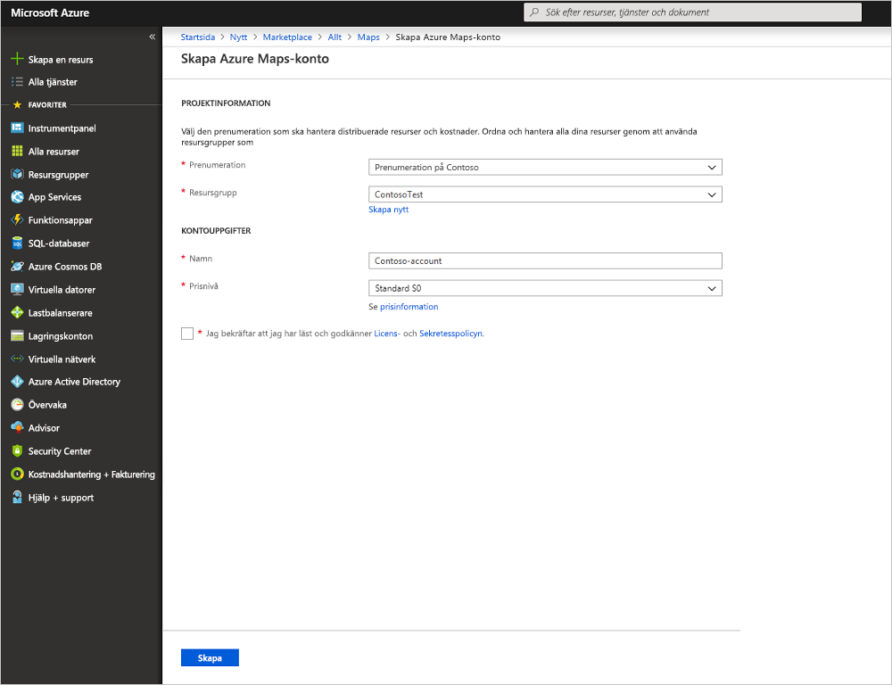
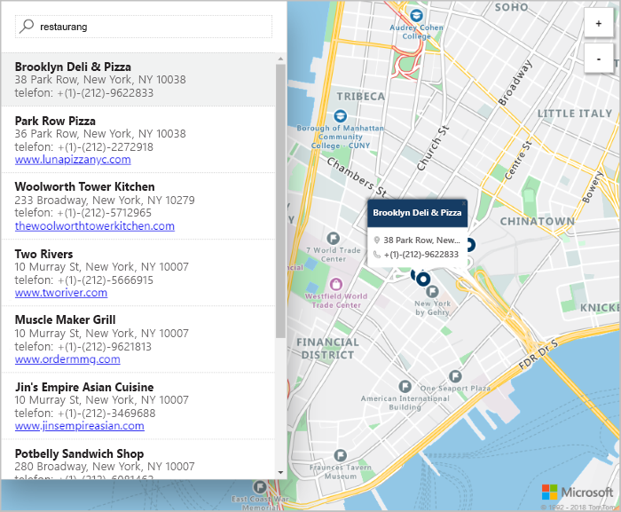

# Starta en interaktiv kartsökning med hjälp av Azure Maps

Den här artikeln visar funktionerna i Azure Maps för att skapa en karta som ger användarna en interaktiv sökupplevelse. I artikeln beskrivs också de grundläggande stegen för att skapa ditt eget Maps-konto och hur du får kontonyckeln för att använda demowebbappen.

Om du inte har en Azure-prenumeration kan du skapa ett [kostnadsfritt konto](https://azure.microsoft.com/free/?WT.mc_id=A261C142F) innan du börjar.

## Logga in på Azure-portalen

Logga in på [Azure-portalen](https://portal.azure.com/).

## Skapa ett konto och hämta din nyckel

1. Klicka på **Skapa en resurs** längst upp till vänster i [Azure Portal](https://portal.azure.com).
2. Skriv **Maps** i rutan *Sök på Marketplace*.
3. Bland *resultaten* väljer du **Maps**. Klicka på knappen **Skapa** som visas nedanför kartan.
4. Ange följande värden på sidan **Skapa Maps-konto**:
    - *Namn* för ditt nya konto.
    - Den *Prenumeration* som ska användas för det här kontot.
    - *Resursgrupp* för kontot. Du kan välja att *skapa ny* eller *använda befintlig* resursgrupp.
    - Välj en *Resursgruppsplats*.
    - Läs *licensen* och *sekretesspolicyn* och markera kryssrutan för att godkänna villkoren.
    - Klicka slutligen på knappen **Skapa**.

    

5. Efter att kontot har skapats öppnar du det och går till inställningarna i kontomenyn. Klicka på **Nycklar** för att granska de primära och sekundära prenumerationsnycklarna för ditt Azure Maps-konto. Kopiera värdet för **Primär nyckel** till din lokala Urklipp för användning i följande avsnitt.

## Hämta programmet

1. Ladda ned eller kopiera innehållet i filen [interactiveSearch.html](https://github.com/Azure-Samples/azure-maps-samples/blob/master/src/interactiveSearch.html).
2. Spara innehållet i filen lokalt som **AzureMapDemo.html** och öppna den i ett textredigeringsprogram.
3. Sök efter strängen `<insert-key>` och ersätt den med värdet för **Primärnyckel** som hämtades i föregående avsnitt.

## Starta programmet

1. Öppna filen **AzureMapDemo.html** i en webbläsare.
2. Observera att kartan visar staden Los Angeles. Zooma in och ut om du vill se hur kartan automatiskt återges med mer eller mindre information beroende på zoomnivån. 
3. Ändra kartans standardmittpunkt. I filen **AzureMapDemo.html** söker du efter variabeln med namnet **center**. Ersätt variabelns parvärde för longitud, latitud med de nya värdena **[-74.0060, 40.7128]**. Spara filen och uppdatera webbläsaren.
4. Prova den interaktiva sökupplevelsen. I sökrutan i det övre vänstra hörnet i demowebbappen söker du efter **restauranger**.
5. Flytta musen över listan med adresser/platser som visas under sökrutan och observera hur motsvarande nål på kartan visar information om den platsen. Observera att namnen och adresserna som visas är fiktiva för att skydda privata företag.

    

## Rensa resurser

Självstudierna innehåller mer information om hur du använder och konfigurerar Maps med ditt konto. Om du planerar att fortsätta med självstudierna, ska du inte rensa resurserna som du skapade i den här snabbstarten. Om du inte planerar att fortsätta kan du använda stegen nedan för att ta bort alla resurser som har skapats i den här snabbstarten.

1. Stäng webbläsaren där webbappen **AzureMapDemo.html** körs.
2. Välj **Alla resurser** i menyn till vänster i Azure Portal och välj sedan ditt Maps-konto. Klicka på **Ta bort** överst på bladet **Alla resurser**.

## Nästa steg

I den här snabbstarten har du skapat ett Maps-konto och startat en demoapp. Om du vill lära dig hur du skapar egna program med API:erna för Maps, fortsätter du med nästa självstudier.

> [!div class="nextstepaction"]
> [Sök efter platser av intresse med Maps](./tutorial-search-location.md)

Fler kodexempel och en interaktiv kodupplevelse finns i Så här-guiderna nedan.

> [!div class="nextstepaction"]
> [Så här söker du efter adresser med hjälp av Azure Maps REST-API:er](./how-to-search-for-address.md)

> [!div class="nextstepaction"]
> [Så här använder du Azure Maps kartkontroll](./how-to-use-map-control.md)
