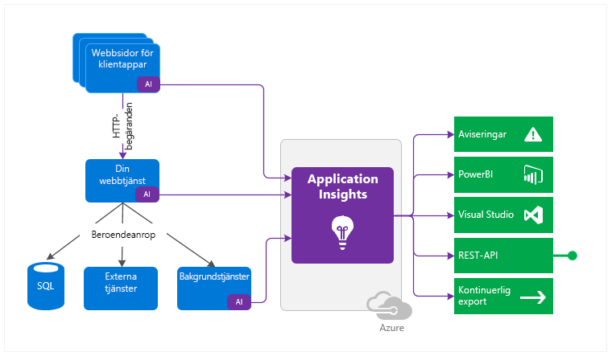
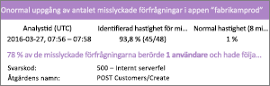
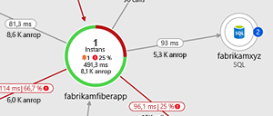
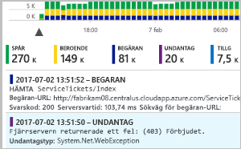
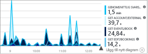
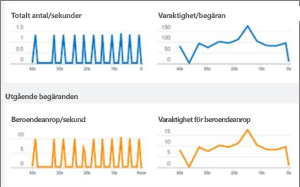
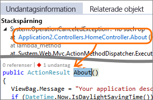
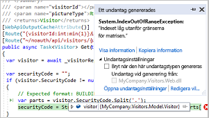
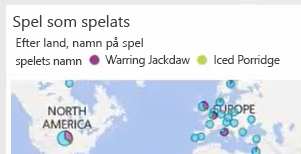

# Vad är Application Insights?
Application Insights är en utökningsbar APM-tjänst (Application Performance Management) för webbutvecklare på flera plattformar. Du kan använda den för att övervaka ditt live-webbprogram. Den identifierar automatiskt prestandaavvikelser. Den inkluderar kraftfulla analysverktyg för att hjälpa dig diagnosticera problem och förstå vad användare faktiskt gör med din app.  Den hjälper dig att kontinuerligt förbättra prestanda och användbarhet. Den fungerar för appar på en rad olika plattformar såsom .NET, Node.js och Java EE i lokala infrastrukturer, hybridkonfigurationer och offentliga moln. Den integrerar med din DevOps-process och kan användas med en rad olika utvecklingsverktyg. Den kan övervaka och analysera telemetri från mobilappar genom integrering med Visual Studio App Center.

## Hur fungerar Application Insights?
Du installerar ett litet instrumentationspaket i ditt program och konfigurerar en Application Insights-resurs på Microsoft Azure Portal. Instrumentationen övervakar din app och skickar telemetridata till portalen. (Programmet kan köras överallt – det behöver inte finnas i Azure.)

Förutom att instrumentera webbtjänstprogrammet kan du även instrumentera bakgrundskomponenter och JavaScript-koden på själva webbsidorna. 

Du kan också hämta telemetri från värdmiljöerna, t.ex. prestandaräknare, Azure Diagnostics eller Docker-loggar. Du kan även konfigurera webbtester som regelbundet skickar syntetiska förfrågningar till din webbtjänst.

Alla dessa telemetriströmmar är integrerade på Azure Portal, där du kan använda kraftfulla analys- och sökverktyg med dina rådata.

### Hur påverkas prestanda?
Effekten på din apps prestanda är mycket liten. Anropsspårning är icke-blockerande, och grupperas och skickas i en separat tråd.

## Vad övervakar Application Insights?

Application Insights är avsett för utvecklingsteamet och gör det lättare att förstå hur appen fungerar och hur den används. Tjänsten övervakar:

* **Begärandefrekvens, svarstider och felfrekvens** – Ta reda på vilka sidor som är mest populära, vid vilka tidpunkter på dagen och var dina användare finns. Se vilka sidor som fungerar bäst. Om svarstiden och felfrekvensen är hög när det finns många begäranden kan det bero på ett resurstilldelningsproblem. 
* **Beroendefrekvens, svarstider och felfrekvens** – Ta reda på om externa tjänster gör systemet långsammare.
* **Undantag** – Analysera aggregerad statistik eller välj specifika instanser och visa detaljerad information om stackspårningen och relaterade begäranden. Både server- och webbläsarundantag rapporteras.
* **Sidvyer och inläsningsprestanda** – Rapporteras av användarnas webbläsare.
* **AJAX-anrop** från webbsidor – frekvens, svarstider och felfrekvens.
* **Antal användare och sessioner**.
* **Prestandaräknare** från dina Windows- eller Linux-serverdatorer, till exempel processor, minne och nätverksanvändning. 
* **Värddiagnostik** från Docker eller Azure. 
* **Diagnostikspårningsloggar** från din app – så att du kan jämföra spårningshändelser med begäranden.
* **Anpassade händelser och mätvärden** som du skriver själv i klient- eller serverkoden för att spåra affärshändelser, t.ex. sålda artiklar eller vunna spel.

## Var ser jag min telemetri?

Du kan utforska dina data på många sätt. Läs dessa artiklar:

|  |  |
| --- | --- |
| [**Smart identifiering och manuella aviseringar**](../../azure-monitor/app/proactive-diagnostics.md) Automatiska aviseringar är anpassade efter appens normala telemetrimönster och visas vid händelser som avviker från det vanliga mönstret. Du kan också [ställa in aviseringar](../../azure-monitor/app/alerts.md) på särskilda nivåer med anpassade måttvärden eller standardmått. | |
| [**Programkarta**](../../azure-monitor/app/app-map.md) Komponenterna i din app, med viktiga mätvärden och aviseringar. |  |
| [**Profilerare**](../../azure-monitor/app/profiler.md) Granska körningsprofilerna för exempelbegäranden. | |
| [**Användningsanalys**](../../azure-monitor/app/usage-overview.md) Analysera användarsegment och kvarhållning.| |
| [**Diagnostiksökning efter instansdata**](../../azure-monitor/app/diagnostic-search.md) Sök efter och filtrera händelser, till exempel begäranden, undantag, beroendeanrop, loggspårningar och sidvyer.  | |
| [**Metrics Explorer för aggregerade data**](../../azure-monitor/app/metrics-explorer.md) Utforska, filtrera och segmentera aggregerade data, till exempel begärande-, fel- och undantagsfrekvens, svarstider och sidinläsningstider. | |
| [**Instrumentpaneler**](../../azure-monitor/app/overview-dashboard.md) Kombinera data från flera resurser och dela med andra. Perfekt för program med flera komponenter och för kontinuerlig visning i teamutrymmet. | |
| [**Live-ström med mätvärden**](../../azure-monitor/app/live-stream.md) När du distribuerar en ny version kan du titta på dessa prestandaindikatorer som visas i realtid för att kontrollera att allt fungerar som förväntat. | |
| [**Analytics**](../../azure-monitor/app/analytics.md) Besvara svåra frågor om appens prestanda och användning med hjälp av det här kraftfulla frågespråket. | |
| [**Visual Studio**](../../azure-monitor/app/visual-studio.md) Visa prestandadata i koden. Gå till kod från stackspårningar.| |
| [**Felsökning av ögonblicksbild**](../../azure-monitor/app/snapshot-debugger.md) Felsök ögonblicksbilder från program som körs med parametervärden.| |
| [**Power BI**](../../azure-monitor/app/export-power-bi.md ) Integrera användningsmätvärden med annan Business Intelligence.| |
| [**REST API**](https://dev.applicationinsights.io/) Skriv kod för att köra frågor mot dina mätvärden och rådata.|  |
| [**Löpande export**](../../azure-monitor/app/export-telemetry.md) Massexportera rådata till lagring så fort de anländer. | |

## Hur använder jag Application Insights?

### Övervaka
Installera Application Insights i din app, konfigurera [webbtester för tillgänglighet](../../azure-monitor/app/monitor-web-app-availability.md) och:

* Kolla in standard [instrument panelen](../../azure-monitor/app/overview-dashboard.md) för ditt teamrum för att hålla utkik efter belastning, svars tider och prestanda för dina beroenden, sid inläsningar och AJAX-anrop.
* Identifiera de begäranden som är långsammast och som misslyckas oftast.
* Titta på [Live Stream](../../azure-monitor/app/live-stream.md) när du distribuerar en ny version så att du genast kan upptäcka en eventuell försämring.

### Identifiera och diagnostisera
När du får en avisering eller identifierar ett problem:

* Utvärdera hur många användare som påverkas.
* Korrelera fel med undantag, beroendeanrop och spårningar.
* Undersök profilerare, ögonblicksbilder, stackdumpar och spårningsloggar.

### Bygg, mät och lär
[Mät effektiviteten](../../azure-monitor/app/usage-overview.md) i varje ny funktion som du distribuerar.

* Mät hur kunder använder nya användargränssnitts- eller företagsfunktioner.
* Skriv in anpassad telemetri i din kod.
* Basera nästa utvecklingscykel på fakta från din telemetri.

## Kom igång
Application Insights är en av de många tjänsterna som finns i Microsoft Azure, och telemetri skickas dit för analys och visning. Innan du gör något annat behöver du alltså en prenumeration på [Microsoft Azure](https://azure.com). Registreringen är gratis och om du väljer den grundläggande [prisplanen](https://azure.microsoft.com/pricing/details/application-insights/) för Application Insights betalar du inget förrän programmet har växt så pass mycket att det har en betydande användning. Om din organisation redan har en prenumeration kan du lägga till ditt Microsoft-konto till den.

Det finns flera sätt att komma igång. Börja på det sätt som passar dig bäst. Du kan fortsätta med de andra senare.

* **Vid körning: instrumentera webbappen på servern.** Perfekt för program som redan har distribuerats. Undviker uppdateringar av koden.
  * [**ASP.NET eller ASP.NET Core program som finns på Azure Web Apps**](../../azure-monitor/app/azure-web-apps.md)
  * [**ASP.NET program som finns i IIS på en virtuell Azure-dator eller skalnings uppsättning för virtuella Azure-datorer**](../../azure-monitor/app/azure-vm-vmss-apps.md)
  * [**ASP.NET program som finns i den lokala IIS-datorn**](../../azure-monitor/app/monitor-performance-live-website-now.md)
* **Vid utveckling: lägg till Application Insights i din kod.** Gör att du kan anpassa telemetri-samlingen och skicka ytterligare telemetri.
  * [ASP.NET-program](../../azure-monitor/app/asp-net.md)
  * [ASP.NET Core program](../../azure-monitor/app/asp-net-core.md)
  * [.NET-konsol program](../../azure-monitor/app/console.md)
  * [Java](../../azure-monitor/app/java-get-started.md)
  * [Node.js](../../azure-monitor/app/nodejs.md)
  * [Andra plattformar](../../azure-monitor/app/platforms.md)
* **[Instrumentera dina webbplatser](../../azure-monitor/app/javascript.md)** för sidvisning, AJAX och annan telemetri på klientsidan.
* **[Analysera mobilappsanvändning](../../azure-monitor/learn/mobile-center-quickstart.md)** genom integrering med Visual Studio App Center.
* **[Tillgänglighetstester](../../azure-monitor/app/monitor-web-app-availability.md)** –pinga din webbplats regelbundet från våra servrar.

## Nästa steg
Kom igång under körningsfasen med:

* [Virtuella Azure-datorer och skalnings uppsättningar i IIS-värdbaserade appar](../../azure-monitor/app/azure-vm-vmss-apps.md)
* [IIS-server](../../azure-monitor/app/monitor-performance-live-website-now.md)
* [Azure Web Apps](../../azure-monitor/app/azure-web-apps.md)

Kom igång under utvecklingsfasen med:

* [ASP.NET](../../azure-monitor/app/asp-net.md)
* [ASP.NET Core](../../azure-monitor/app/asp-net-core.md)
* [Java](../../azure-monitor/app/java-get-started.md)
* [Node.js](../../azure-monitor/app/nodejs.md)

## Support och feedback
* Frågor och problem:
  * [Felsökning][qna]
  * [MSDN-forum](https://social.msdn.microsoft.com/Forums/vstudio/home?forum=ApplicationInsights)
  * [StackOverflow](https://stackoverflow.com/questions/tagged/ms-application-insights)
* Dina förslag:
  * [UserVoice](https://feedback.azure.com/forums/357324-application-insights/filters/top)
* Blogg:
  * [Application Insights-blogg](https://azure.microsoft.com/blog/tag/application-insights)

## Videoklipp

- Extern video: [konfigurera Application Insights med ett ASP.NET-program](https://www.youtube.com/watch?v=blnGAVgMAfA).
- Extern video: [konfigurera Application Insights med ASP.net Core och Visual Studio](https://www.youtube.com/watch?v=NoS9UhcR4gA&t).
- Extern video: [konfigurera Application Insights med ASP.net Core och Visual Studio Code](https://youtu.be/ygGt84GDync).

<!--Link references-->

[android]: ../../azure-monitor/learn/mobile-center-quickstart.md
[azure]: ../../insights-perf-analytics.md
[client]: ../../azure-monitor/app/javascript.md
[desktop]: ../../azure-monitor/app/windows-desktop.md
[greenbrown]: ../../azure-monitor/app/asp-net.md
[ios]: ../../azure-monitor/learn/mobile-center-quickstart.md
[java]: ../../azure-monitor/app/java-get-started.md
[knowUsers]: app-insights-web-track-usage.md
[platforms]: ../../azure-monitor/app/platforms.md
[portal]: https://portal.azure.com/
[qna]: ../../azure-monitor/app/troubleshoot-faq.md
[redfield]: ../../azure-monitor/app/monitor-performance-live-website-now.md
