# Översikt över Application Insights för DevOps

Med [Application Insights](../../azure-monitor/app/app-insights-overview.md) kan du snabbt ta reda på hur appen fungerar och används när den är aktiv. Om det finns problem får du veta det, du får hjälp att bedöma effekten och att fastställa orsaken.

Följande är en berättelse från ett team som utvecklar webbappar:

* *”Vi distribuerade en mindre snabbkorrigering för några dagar sedan. Vi gjorde ingen bred testkörning, men tyvärr kom en oväntad ändring med i nyttolasten, vilket ledde till inkompatibilitet mellan klient- och serverdelarna. Serverundantagen rusade direkt i höjden, vår avisering utlöstes och vi blev medvetna om situationen. Vi behövde bara gå in på Application Insights-portalen för att få tillräckligt med information från undantagsanropsstackarna för att kunna identifiera problemet. Vi återställde direkt och begränsade skadorna. Application Insights har gjort den här delen av DevOps-cykeln mycket enkel och lätt att agera på."*

I den här artikeln följer vi ett team i Fabrikam som utvecklar ett onlinebanksystem (OBS) för att se hur de använder Application Insights för att snabbt kunna reagera på kundfeedback och göra uppdateringar.  

Teamet arbetar med en DevOps-cykel som avbildas i följande illustration:

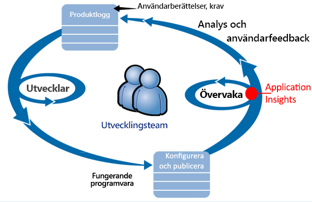

Krav som matas in i kvarvarande uppgifter för utveckling (uppgiftslista). De arbetar i korta sprintar, som ofta levererar fungerande programvara, normalt i form av förbättringar och tillägg till det befintliga programmet. Den aktiva appen uppdateras ofta med nya funktioner. När den är aktiv övervakar teamet den för att kontrollera prestanda och användning med hjälp av Application Insights. Dessa APM-data går tillbaka till de kvarvarande uppgifterna för utveckling.

Teamet använder Application Insights för att noga övervaka det aktiva webbprogrammet vad gäller:

* Prestanda. De vill förstå hur svarstiderna varierar beroende på begäransantal, hur mycket processor-, nätverks- och diskresurser och andra resurser som används, vilken programkod som sänker prestandan och var flaskhalsarna finns.
* Fel. Om det förekommer undantag eller begäran som misslyckas, eller om en prestandaräknare går utanför det förväntade omfånget, måste teamet veta det snabbt så att de kan vidta åtgärder.
* Användning. När en ny funktion släpps vill teamet veta i vilken utsträckning den används och om användarna upplever några problem med den.

Vi ska nu fokusera på feedbackdelen av cykeln:

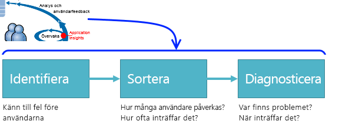

## Identifiera dålig tillgänglighet
Marcela Markova är en erfaren utvecklare i OBS-teamet och leder övervakning av onlineprestanda. Hon konfigurerar flera [tillgänglighetstester](../../azure-monitor/app/monitor-web-app-availability.md):

* Ett test med en URL för appens huvudlandningssida, http://fabrikambank.com/onlinebanking/. Hon anger kriterierna HTTP-kod 200 och texten ”Välkommen!”. Om det här testet misslyckas finns det ett allvarligt fel i nätverket eller servrarna, eller eventuellt ett distributionsproblem. (Eller så har någon ändrat Välkommen!-meddelandet på sidan utan att tala om det för henne.)
* Ett djupare test med flera steg, som loggar in och får en aktuell kontolista, kontrollerar några viktiga detaljer på varje sida. Det här testet kontrollerar att länken till kontodatabasen fungerar. Hon använder ett fiktivt kund-id, man har några sådana i testsyfte.

När de här testerna har konfigurerats känner sig Marcela trygg med att teamet snabbt kommer att få reda på eventuella driftstopp.  

Fel visas som röda punkter på webbtestdiagrammet:

Men en viktigare detalj är att en avisering om eventuella fel skickas till utvecklingsteamet. På så sätt får de veta det innan nästan alla kunder märker det.

## Övervaka prestanda
På översiktssidan i Application Insights finns det ett diagram som visar flera olika [viktiga mått](../../azure-monitor/app/web-monitor-performance.md).

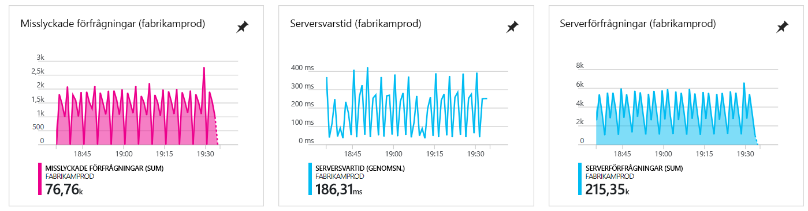

Webbläsarens sidhämtningstid beräknas från telemetri som skickas direkt från webbsidor. Serversvarstid, antal serverförfrågningar och antal misslyckade förfrågningar mäts alla på webbservern och skickas till Application Insights därifrån.

Marcela är lite bekymrad över grafen för serversvar. Den här grafen visar den genomsnittliga tiden från att servern tar emot en HTTP-förfrågan från en användares webbläsare och när den returnerar svaret. Det är inte ovanligt att man ser variationer i det här diagrammet, eftersom belastningen på systemet varierar. Men i det här fallet ser det ut att finnas en korrelation mellan små ökningar av antalet förfrågningar och stora ökningar av svarstiden. Det kan tyda på att systemet arbetar precis på gränsen.

Hon öppnar serverdiagrammen:

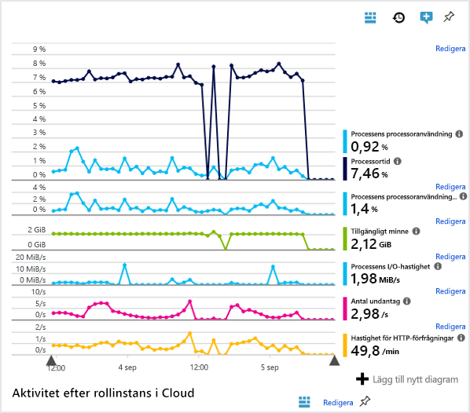

Det verkar inte finnas några tecken på resursbegränsningar där, så kanske är topparna på serversvarsdiagrammen bara ett sammanträffande.

## Ange aviseringar för att uppfylla mål
Hon vill dock hålla ett öga på svarstiderna. Hon vill veta direkt om de blir för höga.

Hon konfigurerar därför en [avisering](../../azure-monitor/app/metrics-explorer.md) för svarstider som är längre än en normal tröskel. Då känner hon sig säker på att hon kommer att få reda på om svarstiderna är långa.

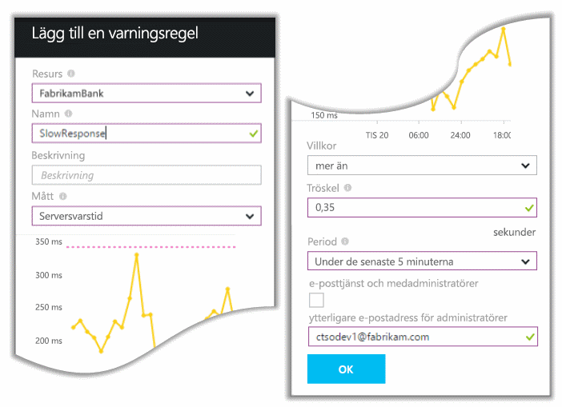

Aviseringar kan konfigureras för många olika mått. Man kan till exempel få aviseringar om antalet undantag blir högt, om mängden tillgängligt minne blir låg, eller om det sker en kraftig ökning av klientförfrågningar.

## Håll koll med aviseringar för Smart identifiering
Nästa dag kommer ett e-postmeddelande med en avisering från Application Insights. Men när hon öppnar det ser hon att det inte gäller svarstidsaviseringen som hon konfigurerade. Den berättar i stället att det har skett en plötslig ökning av antalet misslyckade förfrågningar, dvs. förfrågningar som har returnerat felkoder på 500 eller mer.

Misslyckade förfrågningar är fall då användarna har sett ett fel, normalt efter att ett undantag har utlösts i koden. De kanske ser ett meddelande med texten ”Vi kan tyvärr inte uppdatera din information just nu”. I allra värsta fall kanske en stackdump från webbservern visas på användarens skärm.

Den här aviseringen är en överraskning, eftersom förra gången hon tittade på den låg antalet misslyckade förfrågningar på en låg och bra nivå. Man kan förvänta sig ett litet antal fel på en server med hög belastning.

Det var också något av en överraskning för henne, eftersom hon inte behövde konfigurera denna avisering. Application Insights innehåller Smart identifiering. Den anpassar sig automatiskt efter appens normala felmönster och ”vänjer sig” vid fel på en viss sida, under hög belastning eller kopplat till andra mått. Den genererar endast ett larm om det sker en ökning över vad funktionen har lärt sig att förvänta sig.

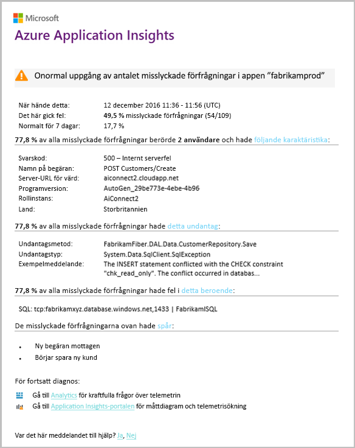

Det här är ett mycket användbart e-postmeddelande. Den genererar inte bara ett larm. Den sköter även en stor del av prioriterings- och diagnostiseringsarbetet.

Den visar hur många kunder som påverkas, samt vilka webbsidor eller åtgärder. Marcela kan bestämma om hon behöver få hela teamet att arbeta med detta som en brandövning, eller om man kan ignorera det till nästa vecka.

E-postmeddelandet visar att ett visst undantag har inträffat och att felet är kopplat till misslyckade anrop till en viss databas, vilket är ännu mer intressant. Det förklarar varför felet plötsligt uppstod trots att Marcelas team inte har distribuerat några uppdateringar på senaste tiden.

Baserat på detta e-postmeddelande kontaktar Marcella den ansvariga för databasteamet. Hon får veta att de har släppt en snabbkorrigering den senaste halvtimmen och det kanske råkade ske en mindre schemaändring...

Problemet är alltså på väg att åtgärdas, till och med innan man har undersökt loggar och inom 15 minuter från att problemet uppstod. Marcela klickar dock på länken för att öppna Application Insights. Hon kommer direkt till en misslyckad förfrågan och hon kan se det misslyckade databasanropet i den relaterade listan över beroendeanrop.

## Identifiera undantag
Efter lite konfigurering rapporteras [undantag](../../azure-monitor/app/asp-net-exceptions.md) till Application Insights automatiskt. De kan också inhämtas explicit genom att infoga anrop till [TrackException()](../../azure-monitor/app/api-custom-events-metrics.md#trackexception) i koden:  

    var telemetry = new TelemetryClient();
    ...
    try
    { ...
    }
    catch (Exception ex)
    {
       // Set up some properties:
       var properties = new Dictionary <string, string>
         {{"Game", currentGame.Name}};

       var measurements = new Dictionary <string, double>
         {{"Users", currentGame.Users.Count}};

       // Send the exception telemetry:
       telemetry.TrackException(ex, properties, measurements);
    }

Fabrikam Bank-teamet har som vana att alltid skicka telemetri för ett undantag, om det inte finns en uppenbar återställning.  

Deras strategi är i själva verket bredare än så: Man skickar telemetri i alla fall då kunden blir frustrerad över vad denne har försökt göra, oavsett om det motsvarar ett undantag i koden eller inte. Om exempelvis det externa överföringssystemet mellan banker returnerar ett meddelande om att en transaktion inte kan genomföras, som beror på en driftsorsak (inte orsakat av kunden), spårar man den händelsen.

    var successCode = AttemptTransfer(transferAmount, ...);
    if (successCode < 0)
    {
       var properties = new Dictionary <string, string>
            {{ "Code", returnCode, ... }};
       var measurements = new Dictionary <string, double>
         {{"Value", transferAmount}};
       telemetry.TrackEvent("transfer failed", properties, measurements);
    }

TrackException används för att rapportera undantag eftersom det skickar en kopia av stacken. TrackEvent används för att rapportera andra händelser. Det går att koppla eventuella åtgärder som kan vara användbara vid diagnos.

Undantag och händelser visas på bladet för [diagnostiksökning](diagnostic-search.md). Det går att gå in på detalj i dessa för att se ytterligare egenskaper och stackspårning.

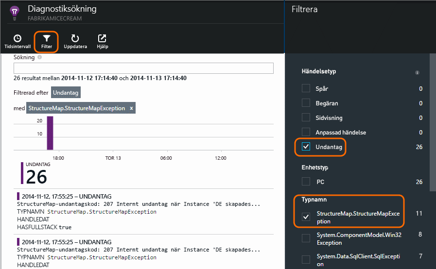

## Övervaka proaktivt
Marcela sitter inte bara och väntar på aviseringar. Kort efter varje ny distribution tittar hon på [svarstider](../../azure-monitor/app/web-monitor-performance.md), både de övergripande siffrorna och tabellen med de långsammaste förfrågningarna, samt antalet undantag.  

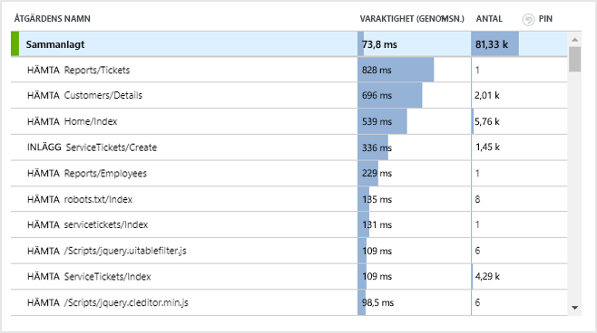

Hon kan bedöma prestandaeffekten för varje distribution, och jämför normalt varje vecka med den föregående. Om det sker en plötslig försämring tar hon upp det med aktuella utvecklare.

## Prioriteringsproblem
Prioritering, utvärdering av ett problems allvarlighetsgrad och omfattning, är det första steget efter identifiering. Ska man kalla in teamet mitt i natten? Eller kan det vänta tills man får en lämplig lucka i de kvarvarande uppgifterna? Det här är ett par viktiga frågor vid prioritering.

Hur ofta händer det? Diagrammen på bladet Översikt ger lite perspektiv på ett problem. Fabrikams program har till exempel genererat fyra webbtestaviseringar på en natt. När teamet tittade på diagrammen på morgonen kunde man se att det faktiskt fanns några röda punkter, även om de flesta av testerna fortfarande var gröna. När man gick in på detaljer i tillgänglighetsdiagrammet blev det tydligt att alla dessa tillfälliga problem kom från en testplats. Detta var uppenbarligen ett nätverksproblem som endast påverkade en väg, och som sannolikt skulle lösa sig själv.  

Däremot kan en dramatisk och stabil ökning i grafen med antal undantag eller svarstider självklart vara något att bli orolig över.

En bra prioriteringstaktik är att prova själv. Om du stöter på samma problem vet du att det är på riktigt.

Hur stor andel av användarna påverkas? Man kan få fram ett ungefärligt svar genom att dela felfrekvensen med antalet sessioner.

När svaren är långsamma jämför man tabellen med förfrågningarna med långsammast svar med användningsfrekvensen för varje sida.

Hur viktigt är det blockerade scenariot? Spelar det stor roll om detta är ett funktionellt problem som blockerar en viss användarhistoria? Om kunderna inte kan betala sina räkningar är det allvarligt, men om de inte kan ändra inställningen av skärmfärg kanske det kan vänta. Informationen om händelsen eller undantaget, eller den långsamma sidans identitet, visar var kunderna upplever problem.

## Diagnostisera problem
Diagnostik är inte riktigt detsamma som felsökning. Innan du börjar gå igenom koden bör du ha en uppfattning om varför, var och när problemet uppstod.

**När sker det?** Den historiska vyn i händelse- och måttdiagrammen gör det enkelt att korrelera effekter med möjliga orsaker. Om det finns tillfälliga toppar i svarstid eller undantagsfrekvenser kan man titta på antalet förfrågningar: om det stiger samtidigt verkar det vara ett resursproblem. Behöver du tilldela mer processorkraft eller minne? Eller är det ett beroende som inte kan hantera belastningen?

**Beror det på oss?**  Om du ser en plötslig prestandanedgång för en viss typ av förfrågan, till exempel om kunden vill ha ett kontosaldo, kan det tänkas att det beror på ett externt undersystem snarare än webbprogrammet. Välj Beroendefel och Beroendevaraktighet i Metrics Explorer och jämför deras historik under de senaste timmarna eller dagarna med det problem du har identifierat. Om det finns korrelerande ändringar kan det bero på ett externt undersystem.  

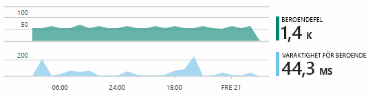

Vissa problem med långsamma beroenden är geolokaliseringsproblem. Fabrikam Bank använder virtuella Azure-datorer, och man upptäckte att man av misstag hade placera webbservern och kontoservern i olika länder. Man uppnådde en dramatisk förbättring genom att migrera en av dem.

**Vad har vi gjort?** Om problemet inte verkar ligga i ett beroende och om det inte alltid har funnits där beror det troligtvis på en ändring som har skett nyligen. Det historiska perspektivet från mått- och händelsediagrammen gör det enkelt att korrelera eventuella ändringar med distributioner. Det begränsar sökningen efter problemet. Aktivera Application Insights Profiler för att identifiera vilka rader i programkoden som gör prestandan långsammare. Se [Profiling live Azure web apps with Application Insights](./../../azure-monitor/app/profiler.md) (Profilera aktiva Azure-webbappar med Application Insights). När Profiler har aktiverats kan du se en spårning som liknar följande. I det här exemplet går det lätt att se att metoden *GetStorageTableData* har orsakat problemet.  

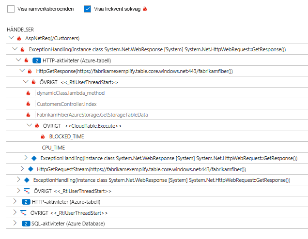

**Vad är det som händer?** En del problem inträffar sällan och kan vara svåra att spåra genom att testa offline. Allt man kan göra är att försöka fånga felet när det inträffar live. Man kan granska stackdumparna i undantagsrapporterna. Dessutom kan man skriva spårningsanrop, antingen med det loggningsramverk du föredrar eller med TrackTrace() eller TrackEvent().  

Fabrikam upplevde ett tillfälligt problem med överföringar mellan konton, men endast med vissa kontotyper. Man ville få en bättre förståelse för vad som hände, så man infogade TrackTrace()-anrop på viktiga platser i koden och bifogade kontotypen som en egenskap för varje anrop. Det gjorde det enkelt att filtrera bort de spårningarna i Diagnostiksökning. Man bifogade även parametervärden som egenskaper och mätningar av spårningsanropen.

## Åtgärda identifierade problem
När problemet har diagnostiserats går det att ta fram en plan för att åtgärda det. Du kanske behöver återställa en ändring som har gjorts nyligen eller så är det bara att rätta till felet. När åtgärden är klar meddelar Application Insights om du har lyckats eller inte.  

Utvecklingsteamet på Fabrikam Banks använder en mer strukturerad metod för prestandamätning än man gjorde innan man började använda Application Insights.

* Man konfigurerar prestandamål för särskilda mått på översiktssidan för Application Insights.
* Man utformar prestandamått i programmet redan från början, t.ex. mått som mäter användarnas väg genom ”trattar”.  

## Övervaka användaraktivitet
När svarstiden är konsekvent bra och det finns få undantag kan utvecklingsteamet gå vidare till användarvänlighet. Man kan tänka på hur man kan förbättra användarnas upplevelse, och hur man kan uppmuntra fler användare att uppnå önskade mål.

Application Insights kan också användas för att få veta hur användarna använder en app. När den fungerar smidigt skulle teamet vilja veta vilka funktioner som är mest populära, vad användarna gillar eller har problem med, och hur ofta de kommer tillbaka. Det hjälper dem att prioritera det kommande arbetet. De kan även planera att mäta framgången för varje funktion som en del av utvecklingscykeln.

En typisk användarresa genom webbplatsen har till exempel en tydlig ”tratt”. Många kunder tittar på räntorna för olika typer av lån. Ett mindre antal går vidare till att fylla i offertformuläret. Av de som får en offert är det få som går vidare till att ta ett lån.

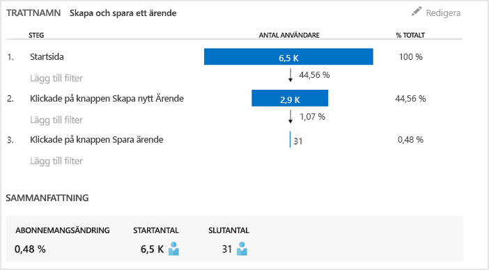

Genom att fundera över var de flesta kunderna försvinner kan företaget lista ut hur man kan få fler kunder vidare till trattens ände. I vissa fall kan det vara ett fel med användarupplevelsen (UX), knappen ”nästa” kanske är svår att hitta, eller så är inte anvisningarna tillräckligt tydliga. Det är ännu mer sannolikt att det finns affärsorsaker till bortfallet: kanske är låneräntorna för höga.

Oavsett orsak hjälper data teamet att lista ut vad användarna gör. Fler spårningsanrop kan infogas för att få fram fler detaljer. TrackEvent() kan användas för att räkna alla användaråtgärder, från små detaljer som enskilda knappklickningar, till större händelser som att man betalar av ett lån.

Teamet börjar vänja sig vid att ha information om användarnas aktivitet. När man utformar en ny funktion funderar man numera över hur man kan få fram feedback om användningen av funktionen. Man utformar spårningsanrop i funktionen redan från början. Man använder sin feedback för att förbättra funktionen under varje utvecklingscykel.

[Läs mer om att spåra användning](../../azure-monitor/app/usage-overview.md).

## Använda DevOps-cykeln
Så använder alltså ett team Application Insights för att inte bara åtgärda enskilda problem, utan för att även förbättra utvecklingslivscykeln. Jag hoppas att du nu har fått lite idéer om hur Application Insights kan hjälpa dig med hantering av programprestanda i dina egna program.

## Video

> [!VIDEO https://channel9.msdn.com/events/Connect/2016/112/player]

## Nästa steg
Du kan komma igång på flera sätt, beroende på programmets egenskaper. Välj det som passar dig bäst:

* [ASP.NET-webbapp](../../azure-monitor/app/asp-net.md)
* [Java-webapp](../../azure-monitor/app/java-get-started.md)
* [Node.js-webbapp](../../azure-monitor/app/nodejs.md)
* Appar som redan har distribuerats som har [IIS](../../azure-monitor/app/monitor-web-app-availability.md), [J2EE](../../azure-monitor/app/java-live.md) eller [Azure](../../azure-monitor/app/app-insights-overview.md) som värd.
* [Webbsidor](../../azure-monitor/app/javascript.md) – En app med en enda sida eller en vanlig webbapp, använd det här på egen hand eller tillsammans med något av serveralternativen.
* [Tillgänglighetstester](../../azure-monitor/app/monitor-web-app-availability.md) för att testa appen från internet.
