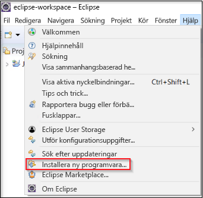
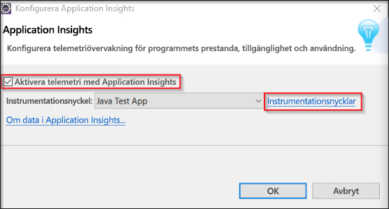

# <a name="start-monitoring-your-java-web-application"></a>Börja övervaka din Java-webbapp

Med Azure Application Insights kan du enkelt övervaka en webbapp för tillgänglighet, prestanda och användning. Du kan också snabbt identifiera och diagnostisera fel i appen utan att vänta på att en användare rapporterar dem. Med Application Insights Java SDK kan du övervaka vanliga tredjepartspaket, till exempel MongoDB, MySQL och Redis.

Snabbstarten guidar dig genom processen att lägga till Application Insights SDK för ett befintligt dynamiskt Java-webbprojekt.

## <a name="prerequisites"></a>Nödvändiga komponenter

För att slutföra den här snabbstarten behöver du:

- Installera JRE 1.7 eller 1.8
- Installera [Kostnadsfria Eclipse IDE för Java EE-utvecklare](https://www.eclipse.org/downloads/). Den här snabbstarten använder Eclipse Oxygen (4.7)
- Du behöver en Azure-prenumeration och ett befintligt dynamiskt Java-webbprojekt
 
Om du inte har ett dynamiskt Java-webbprojekt kan du skapa ett med [snabbstarten Skapa en Java-webapp](https://docs.microsoft.com/azure/app-service-web/app-service-web-get-started-java).

Om du inte har en Azure-prenumeration kan du skapa ett [kostnadsfritt](https://azure.microsoft.com/free/) konto innan du börjar.

Om du föredrar Spring framework prova den [konfigurerar en Spring Boot-initieringsapp om du vill använda Application Insights-guide](https://docs.microsoft.com/java/azure/spring-framework/configure-spring-boot-java-applicationinsights)

## <a name="sign-in-to-the-azure-portal"></a>Logga in på Azure Portal

Logga in på [Azure Portal](https://portal.azure.com/).

## <a name="enable-application-insights"></a>Aktivera Application Insights

Application Insights kan samla in telemetridata från alla internetanslutna appar, oavsett om de körs lokalt eller i molnet. Gör så här om du vill börja granska dessa data:

1. Välj **Skapa en resurs** > **Utvecklarverktyg** > **Application Insights**.

   

   

   En konfigurationsruta visas. Använd följande tabell när du ska fylla i indatafälten.

    | Inställningar        | Value           | Beskrivning  |
   | ------------- |:-------------|:-----|
   | **Namn**      | Globalt unikt värde | Namn som identifierar appen du övervakar |
   | **Programtyp** | Java-webapp | Typen av app du övervakar |
   | **Resursgrupp**     | myResourceGroup      | Namnet på den nya resursgrupp som är värd för App Insights-data |
   | **Plats** | Östra USA | Välj en plats nära dig eller nära där appen finns |

2. Klicka på **Skapa**.

## <a name="install-app-insights-plugin"></a>Installera App Insights-plugin-programmet

1. Starta **Eclipse** > klicka på **Help** (Hjälp) > välj **Install New Software** (Installera ny programvara).

   

2. Kopiera ```https://dl.microsoft.com/eclipse``` till fältet Work With (Arbeta med) > markera **Azure Toolkit for Java** (Azure Toolkit för Java) > välj **Application Insights Plugin for Java** >  **(Application Insights-plugin-programmet för Java), avmarkera** Contact all update sites during install to find required software (Kontakta alla uppdateringssidor vid installationen för att hitta programvara som krävs).

3. När installationen är klar uppmanas du att **starta om Eclipse**.

## <a name="configure-app-insights-plugin"></a>Konfigurera App Insights-plugin-programmet

1. Starta **Eclipse** > öppna ditt **projekt** > högerklicka på projektnamnet i **Projektutforskaren** > välj **Azure** > klicka på **Logga in**.

2. Välj autentiseringsmetoden **Interaktiv** > klicka på **logga in** > ange vid uppmaning dina **autentiseringsuppgifter för Azure** > välj din **Azure-prenumeration**.

3. Högerklicka på projektnamnet i **Projektutforskaren** > välj **Azure** > klicka på **Konfigurera Application Insights**.

4. Markera **Enable telemetry with Application Insights** (Aktivera telemetri med Application Insights) > välj App Insights-resursen och tillhörande **instrumenteringsnyckel** som du vill länka till Java-appen.

   

5. När du har konfigurerat Application Insights-plugin-programmet behöver du [publicera/publicera](https://docs.microsoft.com/azure/app-service/app-service-web-get-started-java#publish-the-web-app-to-azure) programmet igen innan det kan börja skicka telemetri.

> [!NOTE]
> Application Insights SDK för Java kan registrera och visualisera livemått men när du först aktiverar telemetriinsamling kan det ta några minuter innan data börjar visas i portalen. Om appen är en testapp för lågtrafik bör du komma ihåg att de flesta måtten endast registreras när det finns aktiva begäranden eller åtgärder.

## <a name="start-monitoring-in-the-azure-portal"></a>Börja övervaka i Azure-portalen

1. Nu kan du öppna Application Insights **översikt** sida i Azure portal för att visa information om programmet som körs för närvarande.

   

2. Klicka på **Programkarta** om du vill se en layout med beroendena mellan appens komponenter. För varje komponent visas KPI:er som belastning, prestanda, fel och varningar.

   

3.  Klicka på den **Appanalys** ikonen  **visa i analys**.  Då öppnas **Application Insights Analytics**, med ett funktionsrikt frågespråk för att analysera alla data som samlas in av Application Insights. I det här fallet skapas en fråga som återger antalet begäranden som ett diagram. Du kan skriva egna frågor för att analysera andra data.

   

4. Gå tillbaka till sidan **Översikt** och undersök KPI-diagrammen. På den här instrumentpanelen visas statistik om appens hälsotillstånd, inklusive antalet inkommande begäranden, varaktigheten för dessa begäranden och fel som inträffar.

   

   Om du vill möjliggör att diagrammet **Inläsningstid för sidvisning** fylls i med data för **telemetri på klientsidan** lägger du till den här skriptet på varje sida som du vill spåra:

   ```HTML
   <!-- 
   To collect user behavior analytics about your application, 
   insert the following script into each page you want to track.
   Place this code immediately before the closing </head> tag,
   and before any other scripts. Your first data will appear 
   automatically in just a few seconds.
   -->
   <script type="text/javascript">
     var appInsights=window.appInsights||function(config){
     function i(config){t[config]=function(){var i=arguments;t.queue.push(function(){t[config].apply(t,i)})}}var t={config:config},u=document,e=window,o="script",s="AuthenticatedUserContext",h="start",c="stop",l="Track",a=l+"Event",v=l+"Page",y=u.createElement(o),r,f;y.src=config.url||"https://az416426.vo.msecnd.net/scripts/a/ai.0.js";u.getElementsByTagName(o)[0].parentNode.appendChild(y);try{t.cookie=u.cookie}catch(p){}for(t.queue=[],t.version="1.0",r=["Event","Exception","Metric","PageView","Trace","Dependency"];r.length;)i("track"+r.pop());return i("set"+s),i("clear"+s),i(h+a),i(c+a),i(h+v),i(c+v),i("flush"),config.disableExceptionTracking||(r="onerror",i("_"+r),f=e[r],e[r]=function(config,i,u,e,o){var s=f&&f(config,i,u,e,o);return s!==!0&&t["_"+r](config,i,u,e,o),s}),t
    }({
        instrumentationKey:"<instrumentation key>"
    });

    window.appInsights=appInsights;
    appInsights.trackPageView();
   </script>
    ```

5. Klicka på **Live Stream**. Här hittar du livemått relaterade till Java-webbappens prestanda. **Live Metrics Stream** innehåller data om antalet inkommande begäranden, varaktigheten för dessa begäranden och fel som inträffar. Du kan även övervaka kritiska prestandavärden, till exempel processor och minne i realtid.

   

Mer information om övervakning av Java finns i den [ytterligare App Insights Java-dokumentationen](./../../azure-monitor/app/java-get-started.md).

## <a name="clean-up-resources"></a>Rensa resurser

När du är klar testning bör du ta bort resursgruppen och alla relaterade resurser. Att så att följa stegen nedan.

1. På menyn till vänster i Azure Portal klickar du på **Resursgrupper** och sedan på **myResourceGroup**.
2. På sidan med resursgrupper klickar du på **Ta bort**, skriver **myResourceGroup** i textrutan och klickar sedan på **Ta bort**.

## <a name="next-steps"></a>Nästa steg

> [!div class="nextstepaction"]
> [Hitta och diagnostisera prestandaproblem](https://docs.microsoft.com/azure/application-insights/app-insights-analytics)