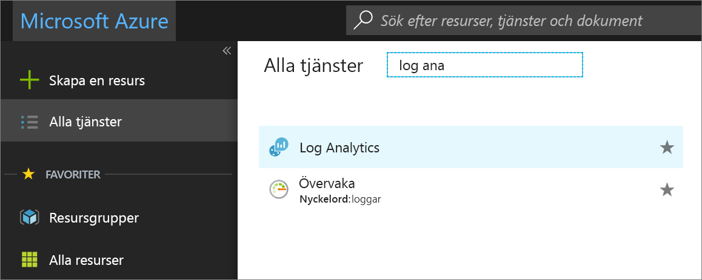
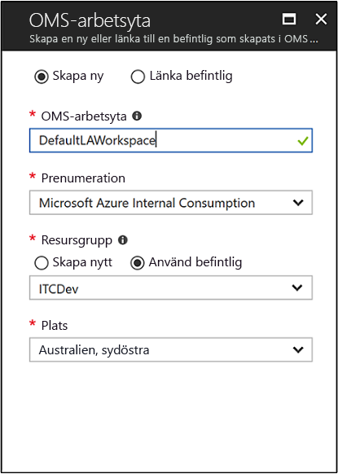
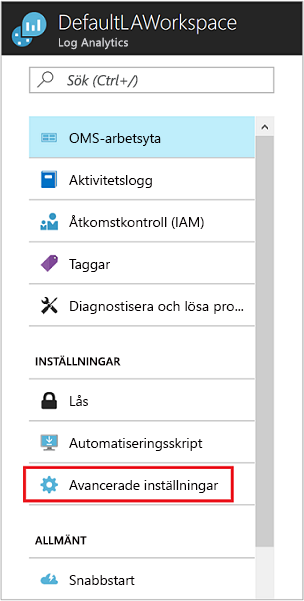
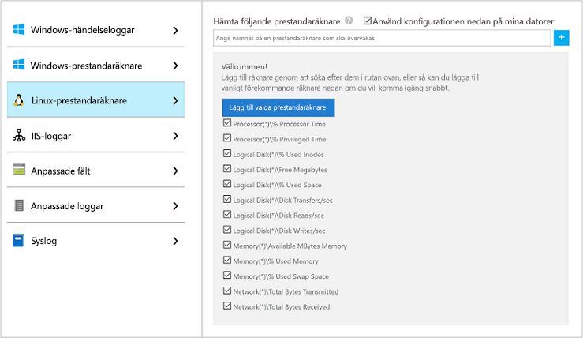
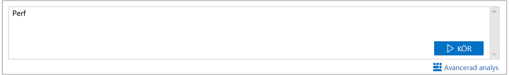

# Samla in data om virtuella datorer i Azure

Med [Azure Log Analytics](../../azure-monitor/log-query/log-query-overview.md) kan du samla in data direkt från virtuella datorer i Azure och från andra resurser i din miljö till en enda lagringsplats för detaljerad analys och korrelation. Den här snabbstarten visar hur du konfigurerar och samlar in data från virtuella Linux- eller Windows-datorer i Azure med några enkla steg.  
 
För den här snabbstarten förutsätts det att du har en befintlig virtuell dator i Azure. Om du inte har det kan du [skapa en virtuell Windows-dator](../../virtual-machines/windows/quick-create-portal.md) eller [skapa en virtuell Linux-dator](../../virtual-machines/linux/quick-create-cli.md) med hjälp av våra snabbstarter för virtuella datorer.

## Logga in på Azure-portalen

Logga in på Azure Portal på [https://portal.azure.com](https://portal.azure.com). 

## Skapa en arbetsyta

1. Välj **Alla tjänster** i Azure-portalen. I listan över resurser skriver du **Log Analytics**. När du börjar skriva filtreras listan baserat på det du skriver. Välj **Log Analytics**.

       

2. Välj **skapa**och välj sedan alternativ för följande objekt:

   * Ange ett namn för den nya **Log Analytics-arbetsytan**, som *DefaultLAWorkspace*.  
   * Välj en **prenumeration** att länka till genom att välja från den listrutan om standardvalet inte är lämpligt.
   * För **Resursgrupp** väljer du en befintlig resursgrupp som innehåller en eller flera virtuella datorer i Azure.  
   * Välj den **plats** där dina virtuella datorer distribueras.  Mer information finns i avsnittet om [tillgängliga regioner för Log Analytics](https://azure.microsoft.com/regions/services/).
   * Om du skapar en arbetsyta i en ny prenumeration som skapats efter 2 april 2018 används prisplanen *Per GB* automatiskt och alternativet för att välja en prisnivå är inte tillgängligt.  Om du skapar en arbetsyta för en befintlig prenumeration som skapats före 2 april eller en prenumeration som var bunden till en befintlig EA-registrering, väljer du önskad prisnivå.  Mer information om de olika nivåerna finns i [prisinformation om Log Analytics](https://azure.microsoft.com/pricing/details/log-analytics/).
  
         

3. När du har angett nödvändig information i fönstret **Log Analytics arbets yta** väljer du **OK**.  

När informationen har verifierats och arbetsytan skapas, kan du spåra förloppet under **Meddelanden** på menyn. 

## Aktivera Log Analytics-tillägget för virtuella datorer

[!INCLUDE [log-analytics-agent-note](../../../includes/log-analytics-agent-note.md)] 

För virtuella Windows- och Linux-datorer som redan har distribuerats i Azure installerar du Log Analytics-agenten med Log Analytics-tillägget för virtuella datorer. Med hjälp av tillägget förenklas installationen och agenten konfigureras automatiskt att skicka data till den Log Analytics-arbetsyta som du anger. Agenten uppgraderas också automatiskt så att du alltid har de senaste funktionerna och korrigeringarna. Kontrollera att den virtuella datorn körs innan du fortsätter, annars misslyckas processen.  

>[!NOTE]
>Log Analytics-agenten för Linux kan inte konfigureras att rapportera till fler än en Log Analytics-arbetsyta. 

1. I Azure Portal väljer du **alla tjänster** som finns i det övre vänstra hörnet. I listan över resurser skriver du **Log Analytics**. När du börjar skriva filtreras listan baserat på det du skriver. Välj **Log Analytics arbets ytor**.

2. Välj *DefaultLAWorkspace* som du skapade tidigare i listan med Log Analytics-arbetsytor.

3. På den vänstra menyn, under arbets ytan data källor, väljer du **virtuella datorer**.  

4. Från listan med **virtuella datorer** väljer du en virtuell dator där du vill installera agenten. Observera att **Log Analytics-anslutningsstatus** för den virtuella datorn anger att den är **Inte ansluten**.

5. Gå till informationen om den virtuella datorn och välj **Anslut**. Agenten installeras och konfigureras för Log Analytics-arbetsytan automatiskt. Den här processen tar några minuter, medan **status** visar **anslutningen**.

6. När du har installerat och anslutit agenten ska **Log Analytics-anslutningsstatus** uppdateras till **Den här arbetsytan**.

## Samla in data om händelser och prestanda

Log Analytics kan samla in händelser från Windows-händelseloggar eller Linux Syslog och prestandaräknare som du anger för analys och rapportering på längre sikt samt vidta åtgärder när ett visst villkor har identifierats. Följ dessa steg om du vill konfigurera insamling av händelser från Windows systemlogg och Linux Syslog och flera vanliga prestandaräknare till att börja med.  

### Insamling av data från virtuella Windows-datorer

1. Välj **Avancerade inställningar**.

    

2. Välj **Data** och sedan **Windows-händelseloggar**.

3. Du kan lägga till en händelselogg genom att skriva namnet på loggen.  Skriv **system** och välj sedan plus tecknet **+** .

4. Kontrollera allvarlighetsgraderna **Fel** och **Varning** i tabellen.

5. Spara konfigurationen genom att välja **Spara** längst upp på sidan.

6. Välj **Windows-prestandadata** för att aktivera insamling av prestandaräknare på en Windows-dator.

7. När du först konfigurerar Windows-prestandaräknare för en ny Log Analytics-arbetsyta har du möjlighet att snabbt skapa flera vanliga räknare. De listas med en kryssruta bredvid varje.

    

    Välj **Lägg till de valda prestanda räknarna**.  De läggs till med en förinställning av provintervall på tio sekunder.
  
8. Spara konfigurationen genom att välja **Spara** längst upp på sidan.

### Insamling av data från virtuella Linux-datorer

1. Välj **Syslog**.  

2. Du kan lägga till en händelselogg genom att skriva namnet på loggen.  Skriv **syslog** och välj sedan plus tecknet **+** .  

3. I tabellen avmarkerar du allvarlighets GRADS **information**, **meddelande** och **fel sökning**. 

4. Spara konfigurationen genom att välja **Spara** längst upp på sidan.

5. Välj **Linux-prestandadata** för att aktivera insamling av prestandaräknare på en Linux-dator. 

6. När du först konfigurerar Linux-prestandaräknare för en ny Log Analytics-arbetsyta har du möjlighet att snabbt skapa flera vanliga räknare. De listas med en kryssruta bredvid varje.

    

    Välj **Använd konfigurationen nedan till mina datorer** och välj sedan **Lägg till de valda prestanda räknarna**.  De läggs till med en förinställning av provintervall på tio sekunder.  

7. Spara konfigurationen genom att välja **Spara** längst upp på sidan.

## Visa data som samlas in

Nu när du har aktiverat insamling av data kan du köra en enkel loggsökning för att se vissa data från de virtuella måldatorerna.  

1. Gå till Azure Portal, navigera till Log Analytics och välj den arbetsyta du skapade tidigare.

2. Välj panelen **loggs ökning** och gå till fönstret loggs ökning, i fältet `Perf` frågetyp och tryck sedan på RETUR eller Välj Sök knappen till höger om fältet fråga.

     

Frågan i följande bild returnerar till exempel 735 prestandaposter.  Ditt resultatet blir mycket mindre.

## Rensa resurser

Ta bort Log Analytics-arbetsytan när den inte längre behövs. Det gör du genom att välja Log Analytics arbets ytan som du skapade tidigare och på resurs sidan väljer du **ta bort**.

## Nästa steg

Nu när du kan samla in funktions- och prestandadata från dina virtuella Windows- eller Linux-datorer kan du enkelt kan börja utforska, analysera och vidta åtgärder på data som du samlar in *utan kostnad*.  

Om du vill lära dig hur du visar och analyserar data kan du fortsätta till självstudiekursen.

> [!div class="nextstepaction"]
> [Visa eller analysera data i Log Analytics](../../azure-monitor/learn/tutorial-viewdata.md)
