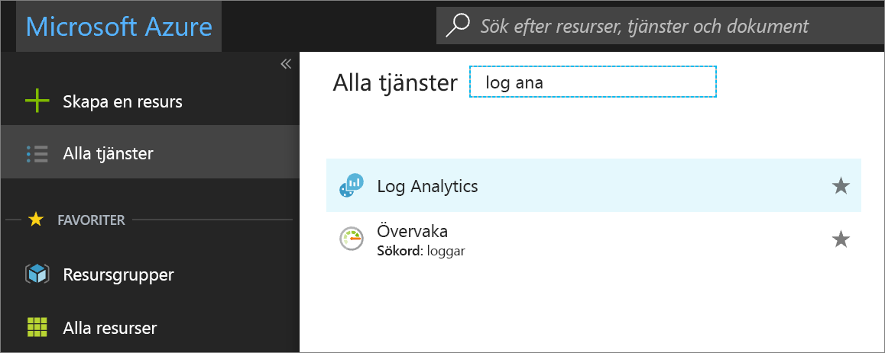
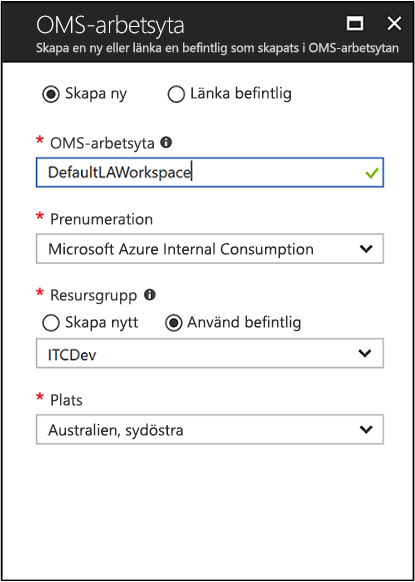
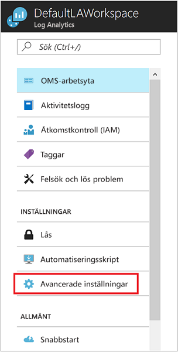
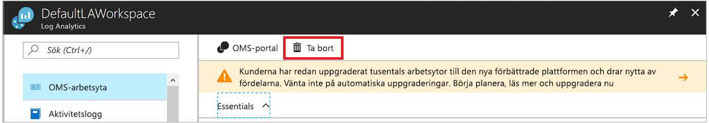

# Konfigurera Log Analytics-agenten för Windows-datorer i en hybridmiljö
[Azure Log Analytics](../../azure-monitor/platform/agent-windows.md) kan samla in data direkt från fysiska eller virtuella Windows-datorer till en enda lagringsplats för detaljerad analys och korrelation. Log Analytics kan samla in data från ett datacenter eller andra moln. Den här snabbstarten visar hur du konfigurerar och samlar in data från Windows-datorer med några enkla steg.  Information om virtuella Azure Windows-datorer finns i [samla in data om Azure virtual machines](../../azure-monitor/learn/quick-collect-azurevm.md).  

Information om konfigurationer som stöds finns i [stöds Windows operativsystem](../../azure-monitor/platform/log-analytics-agent.md#supported-windows-operating-systems) och [nätverk brandväggskonfiguration](../../azure-monitor/platform/log-analytics-agent.md#network-firewall-requirements).
 
Om du inte har en Azure-prenumeration kan du skapa ett [kostnadsfritt konto](https://azure.microsoft.com/free/?WT.mc_id=A261C142F) innan du börjar.

## Logga in på Azure Portal
Logga in på Azure Portal på [https://portal.azure.com](https://portal.azure.com).

## Skapa en arbetsyta
1. Välj **Alla tjänster** i Azure-portalen. I sökrutan anger **Log Analytics**. När du skriver filtreras listan baserat på dina indata. Välj **Log Analytics**:

    
  
2. Välj **skapa**, och ange sedan följande information:

   * Ange ett namn för den nya **Log Analytics-arbetsytan**. Exempelvis **DefaultLAWorkspace**.
   * Välj en **prenumeration** att länka till. Om du inte är standard om den som du vill använda, Välj en annan i listan.
   * För den **resursgrupp**, Välj en befintlig resursgrupp som innehåller en eller flera virtuella Azure-datorer.  
   * Välj den **plats** där dina virtuella datorer distribueras. Här är en lista över [regioner som Log Analytics är tillgängligt](https://azure.microsoft.com/regions/services/).  
   * Om du skapar en arbetsyta i en prenumeration som du skapade när du har den 2 April 2018 arbetsytan använder automatiskt den **Per GB** prisavtal. Du kan inte välja en prisnivå. Om du skapar en arbetsyta i en prenumeration som du skapade innan den 2 April 2018 eller i en prenumeration som är kopplad till en befintlig EA-registrering, väljer du den prisnivå som du vill använda. Se den [Log Analytics-prisinformation](https://azure.microsoft.com/pricing/details/log-analytics/) information om nivåer.

           

3. När du har angett informationen som krävs i den **Log Analytics-arbetsytan** väljer **OK**.  

Även om informationen har verifierats och arbetsytan skapas, du kan spåra förloppet under **meddelanden** på menyn.

## Hämta arbetsytans ID och nyckel
Innan du installerar Microsoft Monitoring Agent för Windows, behöver du arbetsytans ID och nyckel för Log Analytics-arbetsytan. Installationsguiden måste den här informationen till korrekt konfiguration av agenten och se till att den kan kommunicera med Log Analytics.  

1. I det övre vänstra hörnet i Azure Portal, Välj **alla tjänster**. I sökrutan anger **Log Analytics**. När du skriver filtreras listan baserat på dina indata. Välj **Log Analytics**.
2. Välj den arbetsyta som du skapade tidigare i listan med Log Analytics-arbetsytor. (Du kanske har gett den **DefaultLAWorkspace**.)
3. Välj **avancerade inställningar**:

    
  
4. Välj **Anslutna källor** och välj sedan **Windows-servrar**.
5. Kopiera värdena till höger om **arbetsyte-ID** och **primärnyckel**. Klistra in dem i redigeringsprogram du föredrar.

## Installera agenten för Windows
Följande steg installerar och konfigurerar agenten för Log Analytics i Azure och Azure Government. Du ska använda installationsprogram för Microsoft Monitoring Agent-programmet för att installera agenten på datorn.

1. Fortsätter från föregående uppsättningen anvisningar finns på den **Windows-servrar** väljer den **ladda ned Windows Agent** version som du vill hämta. Välj lämplig version för processorarkitekturen på ditt Windows-operativsystem.
2. Kör installationsprogrammet för att installera agenten på datorn.
2. På sidan **Välkommen** klickar du på **Nästa**.
3. På sidan **Licensvillkor** läser du licensen och väljer **Jag accepterar**.
4. På sidan **Målmapp** ändrar du eller behåller standardinstallationsmappen och väljer **Nästa**.
5. På den **installationsalternativ för Agent** , Anslut agenten till Azure Log Analytics och välj sedan **nästa**.
6. På den **Azure Log Analytics** utför dessa steg:
   1. Klistra in den **arbetsyte-ID** och **Arbetsytenyckel (primärnyckel)** som du kopierade tidigare. Om datorn ska rapportera till en Log Analytics-arbetsyta i Azure Government, väljer **Azure US Government** i den **Azure-molnet** lista.  
   2. Om datorn behöver kommunicera via en proxyserver till Log Analytics-tjänsten väljer du **Avancerat** och anger URL och portnummer för proxyservern. Om proxyservern kräver autentisering, ange användarnamn och lösenord för autentisering med proxyservern och välj sedan **nästa**.  
7. Välj **nästa** när du har lagt till konfigurationsinställningarna:

    

8. På sidan **Klar att installera** kontrollerar du valen och väljer sedan **Installera**.
9. På den **konfigurationen har slutförts** väljer **Slutför**.

När installationen och installationen är klar visas Microsoft Monitoring Agent på Kontrollpanelen. Du kan granska konfigurationen och bekräfta att agenten är ansluten till Log Analytics. När du är ansluten, på den **Azure Log Analytics** fliken agenten visar det här meddelandet: **Microsoft Monitoring Agent har anslutits till Microsoft Log Analytics-tjänsten.**   

## Samla in data om händelser och prestanda
Log Analytics kan samla in händelser som du anger från Windows-händelseloggen och prestandaräknare för längre sikt analys och rapportering. Det kan även vidta åtgärder när den identifierar ett visst villkor. Följ dessa steg om du vill konfigurera insamling av händelser från Windows-händelseloggen och flera vanliga prestandaräknare till att börja med.  

1. I det nedre vänstra hörnet i Azure Portal väljer **fler tjänster**. I sökrutan anger **Log Analytics**. När du skriver filtreras listan baserat på dina indata. Välj **Log Analytics**.
2. Välj **avancerade inställningar**:

    
 
3. Välj **Data** och sedan **Windows-händelseloggar**.  
4. Du kan lägga till en händelselogg genom att ange namnet på loggen. Ange **System**, och sedan klicka på plustecknet (**+**).  
5. I tabellen, väljer du den **fel** och **varning** allvarlighetsgrader.
6. Välj **spara** överst på sidan.
7. Välj **Windows-prestandaräknare** för att aktivera insamling av prestandaräknare i en Windows-dator.
8. När du först konfigurerar Windows-prestandaräknare för en ny Log Analytics-arbetsyta, får du alternativet för att snabbt skapa flera vanliga räknare. Varje alternativ visas med en kryssruta bredvid den:

    .
    
    Välj **Lägg till valda prestandaräknare**. Räknarna läggs till och förinställningen med en provintervall på tio sekunder.

9. Välj **spara** överst på sidan.

## Visa insamlade data
Nu när du har aktiverat insamling av data kan vi köra en enkel loggsökning för att se vissa data från måldatorn.  

1. I Azure-portalen, i den valda arbetsytan väljer du den **Loggsökning** panelen.  
2. På den **Loggsökning** fönstret i rutan fråga ange **Perf** och tryck på RETUR eller välj på sökknappen till höger om rutan fråga:
 
    

    Frågan i den här bilden returnerade till exempel 735 prestandaposter:

    

## Rensa resurser
Du kan ta bort agenten från datorn och ta bort Log Analytics-arbetsytan om du inte längre behöver.  

Ta bort agenten genom att utföra följande steg:

1. Öppna Kontrollpanelen.
2. Öppna **Program och funktioner**.
3. I **program och funktioner**väljer **Microsoft Monitoring Agent** och välj sedan **avinstallera**.

Om du vill ta bort Log Analytics-arbetsytan som du skapade tidigare, markerar du det och, på resurssidan väljer **ta bort**:

## Nästa steg
Nu när du samlar in operativa och prestandadata från din Windows-dator kan du enkelt kan börja utforska, analysera och agera på data du samlar in, för *kostnadsfria*.  

Om du vill veta hur du visar och analyserar data kan du fortsätta till självstudien:

> [!div class="nextstepaction"]
> [Visa eller analysera data i Log Analytics](tutorial-viewdata.md)
