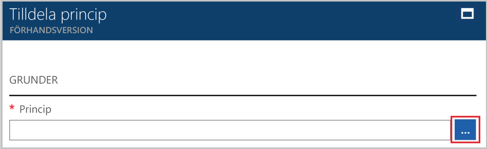
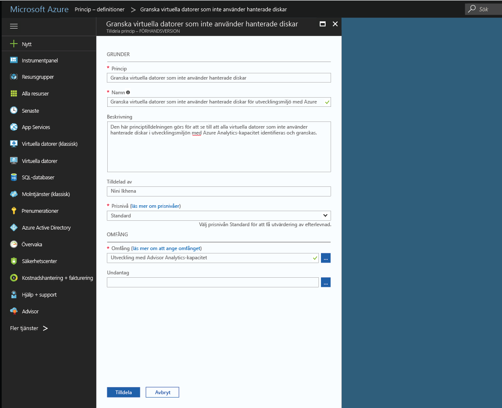

# Skapa en principtilldelning för att identifiera icke-kompatibla resurser i Azure-miljön
Det första steget för att förstå efterlevnad i Azure är att veta hur det ligger till med dina befintliga resurser. Denna snabbstart vägleder dig genom processen för att skapa en principtilldelning för att identifiera virtuella datorer som inte använder hanterade diskar.

I slutet av den här processen kommer du att ha lyckats identifiera virtuella datorer som inte använder hanterade diskar och därför är *icke-kompatibla*.

Om du inte har en Azure-prenumeration kan du skapa ett [kostnadsfritt konto](https://azure.microsoft.com/free/?WT.mc_id=A261C142F) innan du börjar.

## Skapa en principtilldelning

I den här snabbstarten skapar vi en principtilldelning och tilldelar principdefinitionen *Granska virtuella datorer utan Managed Disks*.

1. Välj **Tilldelningar** i det vänstra fönstret på sidan för Azure Policy.
2. Välj **Tilldela princip** längst upp på sidan **Tilldelningar**.

   

3. På sidan **Tilldela princip** klickar du på knappen  bredvid fältet **Princip** för att öppna listan med tillgängliga definitioner.

   

   Azure Policy har inbyggda principdefinitioner som du kan använda. Du kan se inbyggda principdefinitioner som:

   - Framtvinga tagg och dess värde
   - Använd tagg och dess värde
   - Kräv SQL Server Version 12.0

4. Sök igenom principdefinitionerna för att hitta definitionen *Granska virtuella datorer som inte använder hanterade diskar*. Klicka på principen och på **Tilldela**.

   

5. Ange ett **Namn** för visning för principtilldelningen. I det här fallet använder vi *Granska virtuella datorer som inte använder hanterade diskar*. Du kan också lägga till en valfri **Beskrivning**. Beskrivningen innehåller information om hur den här principtilldelningen identifierar alla virtuella datorer som skapas i den här miljön och som inte använder hanterade diskar.
6. Ändra prisnivån till **Standard** för att se till att principen används på befintliga resurser.

   Det finns två prisnivåer i Azure Policy – *Kostnadsfri* och *Standard*. Med den kostnadsfria nivån kan du bara tillämpa principer på framtida resurser, medan Standard gör det möjligt att även tillämpa dem på befintliga resurser för att förstå kompatibilitetsstatusen bättre. Eftersom det är en begränsad förhandsversion har vi ännu inte lanserat någon prissättningsmodell, så du debiteras inte om du väljer *Standard*. Mer information om prissättning finns i [priser för Azure Policy](https://azure.microsoft.com/pricing/details/azure-policy/).

7. Välj vilken **Omfattning** som principen ska användas på.  En omfattning avgör vilka resurser eller grupper med resurser som principtilldelningen används på. Det kan vara allt från en prenumeration till resursgrupper.
8. Välj den prenumeration (eller resursgrupp) du registrerade tidigare. I det här exemplet använder vi prenumerationen **Azure Analytics Capacity Dev**, men dina alternativ varierar.

   

9. Välj **Tilldela**.

Du är nu redo att identifiera icke-kompatibla resurser för att förstå miljöns kompatibilitetsstatus.

## Identifiera icke-kompatibla resurser

Välj **Efterlevnad** i det vänstra fönstret och sök efter den principtilldelning du skapade.

Om det finns några befintliga resurser som inte är kompatibla med denna nya tilldelning visas de på fliken **Icke-kompatibla resurser**.

Om ett villkor utvärderas i de befintliga resurserna och ger resultatet ”sant” för vissa av dem, kommer dessa resurser markeras som att de är icke-kompatibla med principen. Den här tabellen visar hur de olika åtgärder som är tillgängliga idag fungerar med resultatet av tillståndsutvärderingen och kompatibilitetsstatusen för resurserna.

|Resurs  |Om villkoret i principen är  |Åtgärd i principen   |Kompatibilitetsstatus  |
|-----------|---------|---------|---------|
|Finns     |True     |Neka     |Icke-kompatibel |
|Finns     |False    |Neka     |Kompatibel     |
|Finns     |True     |Lägg till   |Icke-kompatibel |
|Finns     |False    |Lägg till   |Kompatibel     |
|Finns     |True     |Granska    |Icke-kompatibel |
|Finns     |False    |Granska    |Icke-kompatibel |

## Rensa resurser

De andra guiderna i den här samlingen bygger på den här snabbstarten. Om du planerar att fortsätta arbeta med efterföljande självstudier ska du inte rensa upp resurserna som du skapade i den här snabbstarten. Om du inte planerar att fortsätta kan du använda stegen nedan för att ta bort alla resurser som har skapats i den här snabbstarten i Azure-portalen.
1. Välj **Tilldelningar** i det vänstra fönstret.
2. Sök efter tilldelningen som du precis skapade.

   

3.  Välj **Ta bort tilldelning**.

## Nästa steg

I den här snabbstarten tilldelade du en principdefinition till en omfattning för att se till att alla resurser i den omfattningen är kompatibla och för att identifiera vilka som inte är det.

Om du vill lära dig mer om att tilldela principer för att se till att **framtida** resurser som skapas är kompatibla kan du gå vidare till självstudien för:

> [!div class="nextstepaction"]
> [Skapa och hantera principer](./create-manage-policy.md)
