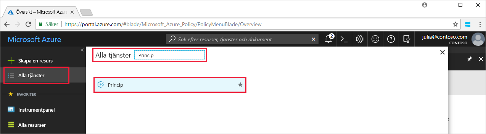
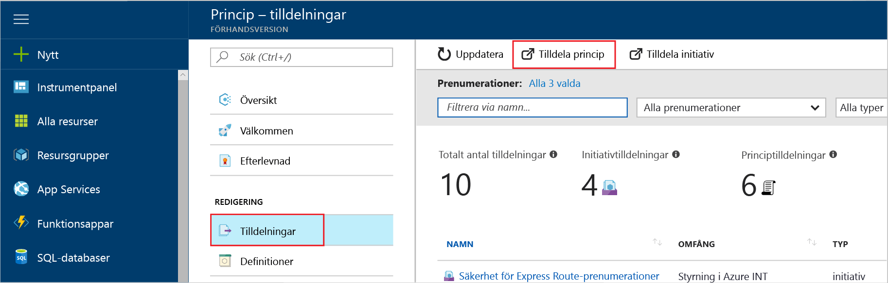

# <a name="create-and-manage-policies-to-enforce-compliance"></a>Skapa och hantera principer för att tvinga kompatibilitet

Förstå hur du skapar och hanterar principer i Azure är viktigt för att vara kompatibel med företagets standarder och servicenivåavtal. I den här kursen lär du dig att använda Azure för att utföra några av de vanliga uppgifter relaterade till att skapa, tilldela och hantera principer för hela organisationen, som:

> [!div class="checklist"]
> * Tilldela en princip för att tillämpa ett villkor för resurser som du skapar i framtiden
> * Skapa och tilldela ett initiativ definitionen för att spåra efterlevnad för flera resurser
> * Lösa en icke-kompatibla eller nekade resurs
> * Implementera en ny princip i en organisation

Om du inte har en Azure-prenumeration kan du skapa ett [kostnadsfritt konto](https://azure.microsoft.com/free/?WT.mc_id=A261C142F) innan du börjar.

## <a name="assign-a-policy"></a>Tilldela en princip

Det första steget i att tillämpa kompatibilitet med Azure princip är att tilldela en principdefinition. En principdefinition definierar under vilka villkor för en princip tillämpas och åtgärd att vidta. I det här exemplet vi tilldela en inbyggd principdefinition som kallas *kräver SQL Server Version 12.0*, för att genomdriva att alla SQL Server-databaser måste vara v12.0 så att det uppfyller villkoret.

1. Starta tjänsten Azure principen i Azure-portalen genom att söka efter och välja **princip** i den vänstra rutan.

   

2. Välj **Tilldelningar** i det vänstra fönstret på sidan för Azure Policy. En tilldelning är en princip som har tilldelats äga rum inom ett specifikt omfång.
3. Välj **Tilldela princip** längst upp på sidan **Tilldelningar**.

   

4. På sidan **Tilldela princip** klickar du på knappen  bredvid fältet **Princip** för att öppna listan med tillgängliga definitioner.

   

5. Välj **kräver SQL Server-Version 12.0**.

   

6. Ange ett **Namn** för visning för principtilldelningen. I det här fallet ska vi använda *kräver SQL Server version 12.0*. Du kan också lägga till en valfri **Beskrivning**. Beskrivningen ger information om hur den här principtilldelning ser alla SQL-servrar som skapas i den här miljön är version 12.0.
7. Ändra prisnivån till **Standard** för att se till att principen används på befintliga resurser.

   Det finns två prisnivåer i Azure Policy – *Kostnadsfri* och *Standard*. Med den kostnadsfria nivån kan du bara tillämpa principer på framtida resurser, medan Standard gör det möjligt att även tillämpa dem på befintliga resurser för att förstå kompatibilitetsstatusen bättre. Eftersom det är en begränsad förhandsversion har vi ännu inte lanserat någon prissättningsmodell, så du debiteras inte om du väljer *Standard*. Mer information om prissättning finns i [priser för Azure Policy](https://acom-milestone-ignite.azurewebsites.net/pricing/details/azure-policy/).

8. Välj den **omfång** -prenumerationen (eller resursgrupp) du tidigare har registrerat. En omfattning avgör vilka resurser eller grupper med resurser som principtilldelningen används på. Det kan vara allt från en prenumeration till resursgrupper.

   Det här exemplet använder vi den här prenumerationen - **Azure Analytics kapacitet Dev**. Din prenumeration varierar.

10. Välj **Tilldela**.

## <a name="implement-a-new-custom-policy"></a>Implementera en ny anpassad princip

Nu när vi har tilldelats principdefinitionen, är det dags att skapa en ny princip för att spara kostnader genom att säkerställa som virtuella datorer som skapades i din miljö inte kan vara i G-serien. På så sätt kan varje gång en användare i organisationen försöker skapa virtuell dator i G-serien begäran kommer hämta nekas.

1. Välj **Definition** under **redigering** i den vänstra rutan.

   

2. Välj **+ principdefinitionen**.
3. Ange följande:

   - Namnet på principdefinitionen - *kräver VM SKU: er mindre än G-serien*
   - Beskrivning av vad principdefinitionen är avsedd att göra – definitionen för den här principen tillämpar att alla virtuella datorer som skapats i denna omfattning har SKU: er mindre än G-serien för att minska kostnaden.
   - Den prenumeration där principdefinitionen kommer live – i det här fallet våra principdefinitionen kommer live **Advisor Analytics kapacitet Dev**. Din prenumerationslista varierar.
   - Kopiera följande json-kod och uppdatera sedan för dina behov med:
      - Principparametrar.
      - Principen regler/villkor, i det här fallet – VM SKU-storleken är lika med G serien
      - Principen effekt, i det här fallet – **neka**.

    Här är hur json ska se ut. Klistra in koden reviderade i Azure-portalen.

    ```json
{
    "policyRule": {
      "if": {
        "allOf": [
          {
            "field": "type",
            "equals": "Microsoft.Compute/virtualMachines"
          },
          {
            "field": "Microsoft.Compute/virtualMachines/sku.name",
            "like": "Standard_G*"
          }
        ]
      },
      "then": {
        "effect": "deny"
      }
    }
}
    ```

    Om du vill visa prover av json-kod, läsa den [mallar för Azure princip](json-samples.md) artikel.

4. Välj **Spara**.

## <a name="create-a-policy-definition-with-rest-api"></a>Skapa en principdefinition med REST API

Du kan skapa en princip med REST API för Principdefinitioner. REST-API kan du skapa och ta bort principdefinitioner och få information om befintliga definitioner.
Använd följande exempel för att skapa en principdefinition:

```
PUT https://management.azure.com/subscriptions/{subscription-id}/providers/Microsoft.authorization/policydefinitions/{policyDefinitionName}?api-version={api-version}

```
Inkludera en begärantext som liknar följande exempel:

```
{
  "properties": {
    "parameters": {
      "allowedLocations": {
        "type": "array",
        "metadata": {
          "description": "The list of locations that can be specified when deploying resources",
          "strongType": "location",
          "displayName": "Allowed locations"
        }
      }
    },
    "displayName": "Allowed locations",
    "description": "This policy enables you to restrict the locations your organization can specify when deploying resources.",
    "policyRule": {
      "if": {
        "not": {
          "field": "location",
          "in": "[parameters('allowedLocations')]"
        }
      },
      "then": {
        "effect": "deny"
      }
    }
  }
}
```

## <a name="create-a-policy-definition-with-powershell"></a>Skapa en principdefinition med PowerShell

Innan du fortsätter med PowerShell-exempel kontrollera att har du installerat den senaste versionen av Azure PowerShell. Principparametrar har lagts till i version 3.6.0. Om du har en tidigare version kan returnera ett felmeddelande om att det inte går att hitta parametern exemplen.

Du kan skapa en princip definition med hjälp av den `New-AzureRmPolicyDefinition` cmdlet.

Om du vill skapa en principdefinition från en fil, skickar du sökvägen till filen. Använd följande exempel för en extern fil:

```
$definition = New-AzureRmPolicyDefinition `
    -Name denyCoolTiering `
    -DisplayName "Deny cool access tiering for storage" `
    -Policy 'https://raw.githubusercontent.com/Azure/azure-policy-samples/master/samples/Storage/storage-account-access-tier/azurepolicy.rules.json'
```

Använd följande exempel för en lokal fil-användning:

```
$definition = New-AzureRmPolicyDefinition `
    -Name denyCoolTiering `
    -Description "Deny cool access tiering for storage" `
    -Policy "c:\policies\coolAccessTier.json"
```

Använd följande exempel för att skapa en principdefinition med en infogad regel:

```
$definition = New-AzureRmPolicyDefinition -Name denyCoolTiering -Description "Deny cool access tiering for storage" -Policy '{
  "if": {
    "allOf": [
      {
        "field": "type",
        "equals": "Microsoft.Storage/storageAccounts"
      },
      {
        "field": "kind",
        "equals": "BlobStorage"
      },
      {
        "not": {
          "field": "Microsoft.Storage/storageAccounts/accessTier",
          "equals": "cool"
        }
      }
    ]
  },
  "then": {
    "effect": "deny"
  }
}'
```

Utdata lagras i en `$definition` -objekt som ska användas vid tilldelning av principer.
I följande exempel skapas en principdefinition som innehåller parametrar:

```
$policy = '{
    "if": {
        "allOf": [
            {
                "field": "type",
                "equals": "Microsoft.Storage/storageAccounts"
            },
            {
                "not": {
                    "field": "location",
                    "in": "[parameters(''allowedLocations'')]"
                }
            }
        ]
    },
    "then": {
        "effect": "Deny"
    }
}'

$parameters = '{
    "allowedLocations": {
        "type": "array",
        "metadata": {
          "description": "The list of locations that can be specified when deploying storage accounts.",
          "strongType": "location",
          "displayName": "Allowed locations"
        }
    }
}'

$definition = New-AzureRmPolicyDefinition -Name storageLocations -Description "Policy to specify locations for storage accounts." -Policy $policy -Parameter $parameters
```

## <a name="view-policy-definitions"></a>Visa principdefinitioner

Om du vill se alla principdefinitioner i din prenumeration, använder du följande kommando:

```
Get-AzureRmPolicyDefinition
```

Den returnerar alla tillgängliga principdefinitioner, inklusive inbyggda principer. Varje princip returneras i följande format:

```
Name               : e56962a6-4747-49cd-b67b-bf8b01975c4c
ResourceId         : /providers/Microsoft.Authorization/policyDefinitions/e56962a6-4747-49cd-b67b-bf8b01975c4c
ResourceName       : e56962a6-4747-49cd-b67b-bf8b01975c4c
ResourceType       : Microsoft.Authorization/policyDefinitions
Properties         : @{displayName=Allowed locations; policyType=BuiltIn; description=This policy enables you to
                     restrict the locations your organization can specify when deploying resources. Use to enforce
                     your geo-compliance requirements.; parameters=; policyRule=}
PolicyDefinitionId : /providers/Microsoft.Authorization/policyDefinitions/e56962a6-4747-49cd-b67b-bf8b01975c4c
```

## <a name="create-a-policy-definition-with-azure-cli"></a>Skapa en principdefinition med Azure CLI

Du kan skapa en principdefinition som använder Azure CLI med kommandot princip definition.
Använd följande exempel för att skapa en principdefinition med en infogad regel:

```
az policy definition create --name denyCoolTiering --description "Deny cool access tiering for storage" --rules '{
  "if": {
    "allOf": [
      {
        "field": "type",
        "equals": "Microsoft.Storage/storageAccounts"
      },
      {
        "field": "kind",
        "equals": "BlobStorage"
      },
      {
        "not": {
          "field": "Microsoft.Storage/storageAccounts/accessTier",
          "equals": "cool"
        }
      }
    ]
  },
  "then": {
    "effect": "deny"
  }
}'
```

## <a name="view-policy-definitions"></a>Visa principdefinitioner

Om du vill se alla principdefinitioner i din prenumeration, använder du följande kommando:

```
az policy definition list
```

Den returnerar alla tillgängliga principdefinitioner, inklusive inbyggda principer. Varje princip returneras i följande format:

```
{                                                            
  "description": "This policy enables you to restrict the locations your organization can specify when deploying resources. Use to enforce your geo-compliance requirements.",                      
  "displayName": "Allowed locations",
  "id": "/providers/Microsoft.Authorization/policyDefinitions/e56962a6-4747-49cd-b67b-bf8b01975c4c",
  "name": "e56962a6-4747-49cd-b67b-bf8b01975c4c",
  "policyRule": {
    "if": {
      "not": {
        "field": "location",
        "in": "[parameters('listOfAllowedLocations')]"
      }
    },
    "then": {
      "effect": "Deny"
    }
  },
  "policyType": "BuiltIn"
}
```

## <a name="create-and-assign-an-initiative-definition"></a>Skapa och tilldela ett initiativ definition

Med en definition av initiativ, kan du gruppera flera principdefinitioner för att uppnå en övergripande målet. Du skapar ett initiativ definition för att säkerställa att resurser inom omfånget för definitionen vara kompatibla med principdefinitioner som utgör initiativ definition.  Finns det [översikt över Azure princip](./azure-policy-introduction.md) mer information om initiativ definitioner.

### <a name="create-an-initiative-definition"></a>Skapa ett initiativ definition

1. Välj **definitioner** under **redigering** i det vänstra fönstret.

   

2. Välj **initiativ Definition** överst på sidan det här alternativet tar dig till den **initiativ Definition** formuläret.
3. Ange namn och beskrivning av initiativet.

   I det här exemplet, vill vi se till att resurser som är kompatibla med principdefinitioner om att få säker, namnet på initiativ vara **få säker**, och beskrivningen är: **har den här initiativ Skapa för att hantera alla principdefinitioner som är associerade med att skydda resurser**.

   

4. Bläddra igenom listan över **tillgängliga definitionerna** och välj den princip definition(s) som du vill lägga till i det initiativet. För vår **få säker** initiativ, Lägg till följande inbyggda principdefinitioner:
   - Kräv SQL Server version 12.0
   - Övervaka oskyddade webbprogram i security center.
   - Övervaka Tillåtande nätverk över i Security Center.
   - Övervaka möjliga app Vitlistning i Security Center.
   - Övervaka okrypterad Virtuella diskar i Security Center.

   

   När du har valt principdefinitioner i listan visas den under **principer och parametrar**, enligt ovan.

5. Välj **Skapa**.

### <a name="assign-an-initiative-definition"></a>Tilldela ett initiativ definition

1. Gå till den **definitioner** fliken **redigering**.
2. Sök efter den **få säker** initiativ definition som du skapade.
3. Välj initiativ definitionen och välj sedan **tilldela**.

   

4. Fyll i den **tilldelning** formuläret genom att ange:
   - namn: få säker tilldelning
   - Beskrivning: initiativ tilldelningen är anpassad för att framtvinga den här gruppen med principdefinitioner i den **Azure Advisor kapacitet Dev** prenumeration
   - prisnivån: Standard
   - omfång som används för tilldelningen: **Azure Advisor kapacitet Dev**

5. Välj **Tilldela**.

## <a name="resolve-a-non-compliant-or-denied-resource"></a>Lösa en icke-kompatibla eller nekade resurs

Följande exempel ovan, efter att principdefinitionen kräver SQL server-version 12.0, skulle en SQL-server som har skapats med en annan version hämta nekas. I det här avsnittet vi gå igenom hur du löser ett nekade försök att skapa en SQLServer på en annan version genom att begära ett undantag.

1. Välj **Tilldelningar** i det vänstra fönstret.
2. Bläddra igenom alla principtilldelningar och starta den *kräver SQL Server version 12.0* tilldelning.
3. Begära ett undantag för resursgrupper som du försöker att skapa SQLServer. I det här fallet vi vill utelämna Microsoft.Sql/servers/databases: *baconandbeer/Cheetos* och *baconandbeer/Chorizo*.

   

   Andra sätt som du kan lösa en nekade resurs är: nå ut till den kontakt som är associerade med principen om du har en stark motivering för behöver SQL-server som skapas och redigeras principen direkt om du har åtkomst till.

4. Välj **Spara**.

I det här avsnittet löst på grund av att skapa en SQLServer med version 12.0, genom att begära ett undantag till resurserna.

## <a name="clean-up-resources"></a>Rensa resurser

Om du vill fortsätta att arbeta med efterföljande självstudiekurser inte rensa upp de resurser som skapades i den här guiden. Om du inte planerar att fortsätta, Använd följande steg för att ta bort tilldelningar eller definitioner skapade ovan:

1. Välj **definitioner** (eller **tilldelningar** om du försöker ta bort en tilldelning) i det vänstra fönstret.
2. Sök efter den nya initiativ eller princip definition (eller tilldelningen) du just skapade.
3. Välj ellipserna i slutet av definition eller tilldelning och **ta bort Definition** (eller **tar bort tilldelningen**).

## <a name="next-steps"></a>Nästa steg

I kursen får gör du har du följande:

> [!div class="checklist"]
> * Tilldelade en princip för att tillämpa ett villkor för resurser som du skapar i framtiden
> * Skapa och tilldela ett initiativ definitionen för att spåra efterlevnad för flera resurser
> * Matcha en icke-kompatibla eller nekade resurs
> * En ny princip implementeras i en organisation

Mer information om strukturerna för principdefinitioner titta på den här artikeln:

> [!div class="nextstepaction"]
> [Azure principstruktur definition](policy-definition.md)
