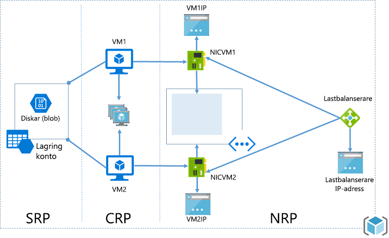
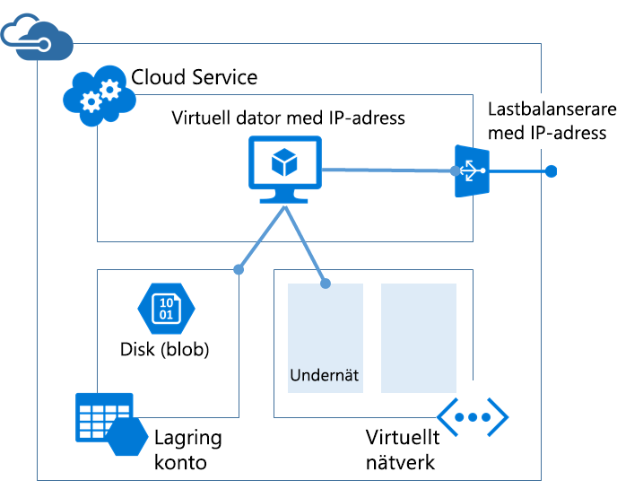

# <a name="azure-resource-manager-vs-classic-deployment-understand-deployment-models-and-the-state-of-your-resources"></a>Azure Resource Manager kontra klassisk distribution: Förstå distributionsmodeller och tillståndet för dina resurser

> [!NOTE]
> Informationen i den här artikeln används bara när du migrerar från den klassiska distributionen till Azure Resource Manager-distributionen.

Artikeln beskriver både Azure Resource Manager och de klassiska distributionsmodellerna. Resource Manager och de klassiska distributionsmodellerna är två olika sätt att distribuera och hantera dina Azure-lösningar. Du arbetar med dem via två olika API-uppsättningar och de distribuerade resurserna kan innehålla viktiga skillnader. De två modellerna är inte kompatibla med varandra. Den här artikeln beskriver dessa skillnader.

Microsoft rekommenderar att du använder Resource Manager för alla nya resurser, för att förenkla distributionen och hanteringen av resurser. Om möjligt rekommenderar Microsoft att du distribuerar om befintliga resurser via Resource Manager.

Om du är nybörjare i Resource Manager kan du läsa den terminologi som definieras i [Översikt över Azure Resource Manager](resource-group-overview.md).

## <a name="history-of-the-deployment-models"></a>Historik för distributionsmodellerna
Azure levererade ursprungligen bara den klassiska distributionsmodellen. I den modellen var varje resurs fristående och det gick inte att gruppera relaterade resurser. I stället var du tvungen att manuellt spåra vilka resurser som fanns i din lösning eller ditt program och sedan komma ihåg att hantera dem på ett samordnat sätt. Om du ville distribuera en lösning var du tvungen att skapa varje resurs individuellt via portalen, eller skapa ett skript som distribuerade alla resurser i rätt ordning. Om du ville ta bort en lösning var du tvungen att ta bort varje resurs separat. Det gick inte att tillämpa och uppdatera principerna för åtkomstkontroll för relaterade resurser på ett enkelt sätt. Slutligen kunde du inte tillämpa taggar på resurser för att märka dem med villkor som hjälpte dig att övervaka dina resurser och hantera faktureringen.

2014 introducerade Azure Resource Manager som lade till konceptet med en resursgrupp. En resursgrupp är en container för resurser som har en gemensam livscykel. Resource Manager-distributionsmodellen ger många fördelar:

* Du kan distribuera, hantera och övervaka alla tjänster för din lösning som en grupp i stället för att hantera tjänsterna separat.
* Du kan distribuera lösningen flera gånger under dess livscykel och vara säker på att dina resurser distribueras på ett konsekvent sätt.
* Du kan tillämpa åtkomstkontroll på alla resurser i resursgruppen och dessa principer tillämpas automatiskt när nya resurser läggs till i resursgruppen.
* Du kan lägga till taggar för resurser och organisera alla logiskt i din prenumeration.
* Du kan använda JSON (JavaScript Object Notation) till att definiera infrastrukturen för lösningen. JSON-filen är känd som en Resource Manager-mall.
* Du kan definiera beroenden mellan resurser så att de distribueras i rätt ordning.

När Resource Manager lades till, lades alla resurser till retroaktivt i standardresursgrupperna. Om du skapar en resurs via klassisk distribution nu skapas resursen automatiskt i en standardresursgrupp för tjänsten, även om du inte angav den resursgruppen vid distributionen. Att bara finnas i en resursgrupp innebär dock inte att resursen har konverterats till Resource Manager-modellen.

## <a name="understand-support-for-the-models"></a>Förstå stödet för modellerna
Det finns tre scenarier att vara medveten om:

1. Cloud Services stöder inte Resource Manager-distributionsmodellen.
2. Virtuella datorer, lagringskonton och virtuella nätverk stöder både Resource Manager och klassiska distributionsmodeller.
3. Alla andra Azure-tjänster stöder Resource Manager.

Om resursen har skapats via klassisk distribution måste du fortsätta att använda den med klassiska åtgärder för virtuella datorer, lagringskonton och virtuella nätverk. Om den virtuella datorn, lagringskontot eller ett virtuellt nätverk har skapats via Resource Manager-distribution, måste du fortsätta att använda Resource Manager-åtgärder. Denna skillnad kan bli förvirrande när prenumerationen innehåller en blandning av resurser som skapats både via Resource Manager och klassisk distribution. Kombinationen av resurser kan ge oväntade resultat eftersom resurserna inte har stöd för samma åtgärder.

I vissa fall kan ett Resource Manager-kommando hämta information om en resurs som skapats via klassisk distribution, eller utföra administrativa åtgärder som att flytta en klassisk resurs till en annan resursgrupp. Men detta behöver inte innebära att typen har stöd för Resource Manager-åtgärder. Anta att exempelvis att du har en resursgrupp med en virtuell dator som har skapats med klassisk distribution. Om du kör följande PowerShell-kommando i Resource Manager:

```powershell
Get-AzureRmResource -ResourceGroupName ExampleGroup -ResourceType Microsoft.ClassicCompute/virtualMachines
```

Returneras den virtuella datorn:

```powershell
Name              : ExampleClassicVM
ResourceId        : /subscriptions/{guid}/resourceGroups/ExampleGroup/providers/Microsoft.ClassicCompute/virtualMachines/ExampleClassicVM
ResourceName      : ExampleClassicVM
ResourceType      : Microsoft.ClassicCompute/virtualMachines
ResourceGroupName : ExampleGroup
Location          : westus
SubscriptionId    : {guid}
```

Men Resource Manager-cmdleten **Get-AzureRmVM** returnerar endast virtuella datorer som har distribuerats via Resource Manager. Följande kommando returnerar inte den virtuella dator som skapades via klassisk distribution.

```powershell
Get-AzureRmVM -ResourceGroupName ExampleGroup
```

Det är bara resurser som har skapats via Resource Manager som har stöd för taggar. Du kan inte använda taggar på klassiska resurser.

## <a name="changes-for-compute-network-and-storage"></a>Ändringar för beräkning, nätverk och lagring
Följande diagram visar resurser för beräkning, nätverk och lagring som har distribuerats via Resource Manager.



Observera följande relationer mellan resurserna:

* Alla resurserna finns i en resursgrupp.
* Den virtuella datorn är beroende av ett specifikt lagringskonto som är definierat i Storage-resursprovidern för lagring av diskarna i bloblagring (krävs).
* Den virtuella datorn refererar till ett specifikt nätverkskort som definierats i Network-resursprovidern (krävs) och en tillgänglighetsuppsättning som definierats i Compute-resursprovidern (valfritt).
* Nätverkskortet refererar till den virtuella datorns tilldelade IP-adress (krävs), undernätet i det virtuella nätverket för den virtuella datorn (krävs) och en nätverkssäkerhetsgrupp (valfritt).
* Undernätet inom ett virtuellt nätverk refererar till en nätverkssäkerhetsgrupp (valfritt).
* Lastbalanserarens instans refererar till serverdelspoolen av IP-adresser som innehåller nätverkskortet för en virtuell dator (valfritt) och refererar till en offentlig eller privat IP-adress för lastbalanseraren (valfritt).

Här följer komponenterna och deras relationer för klassisk distribution:



Den klassiska lösningen för att vara värd för en virtuell dator innehåller:

* En obligatorisk molntjänst som fungerar som en container för värden för den virtuella datorvärden (beräkning). Virtuella datorer tillhandahålls automatiskt med ett nätverkskort och en IP-adress som tilldelats av Azure. Molntjänsten innehåller dessutom en instans för extern instans för lastbalanseraren, en offentlig IP-adress och standardslutpunkter som tillåter fjärrskrivbord och PowerShell-fjärrtrafik för Windows-baserade virtuella datorer och SSH-trafik (Secure Shell) för Linux-baserade virtuella datorer.
* Ett obligatoriskt lagringskonto som lagrar de virtuella hårddiskarna för en virtuell dator, inklusive operativsystem, tillfälliga och extra datadiskar (lagring).
* Ett valfritt virtuellt nätverk som fungerar som en extra container där du kan skapa en undernätsstruktur och tilldela undernätet där den virtuella datorn finns (nätverk).

I följande tabell beskrivs ändringar i hur Compute-, Network- och Storage-resursproviders samverkar:

| Objekt | Klassisk | Resource Manager |
| --- | --- | --- |
| Molntjänst för Virtual Machines |Molntjänst var en container för virtuella datorer som krävde tillgänglighet från plattformen och belastningsutjämning. |Molntjänst är inte längre ett objekt som krävs för att skapa en virtuell dator med den nya modellen. |
| Virtuella nätverk |Ett virtuellt nätverk är valfritt för den virtuella datorn. Om det ingår kan det virtuella nätverket inte distribueras med Resource Manager. |En virtuell dator kräver ett virtuellt nätverk som har distribuerats med Resource Manager. |
| Lagringskonton |Den virtuella datorn kräver ett lagringskonto som lagrar de virtuella hårddiskarna för operativsystem, tillfälliga och extra datadiskar (lagring). |Den virtuella datorn kräver ett lagringskonto för att kunna lagra diskarna i bloblagring. |
| Tillgänglighetsuppsättningar |Tillgänglighet till plattformen indikerades genom att konfigurera samma "AvailabilitySetName" på Virtual Machines. Det maximala antalet feldomäner var 2. |Tillgänglighetsuppsättning är en resurs som exponeras av Microsoft.Compute-providern. Virtuella datorer som kräver hög tillgänglighet måste inkluderas i tillgänglighetsuppsättningen. Det maximala antalet feldomäner är nu 3. |
| Tillhörighetsgrupper |Tillhörighetsgrupper krävdes för virtuella nätverk. Men med introduktionen av regionala virtuella nätverk, krävs det inte längre. |Lite enklare sagt så existerar inte konceptet tillhörighetsgrupper i de API:er som exponeras via Azure Resource Manager. |
| Belastningsutjämning |Skapandet av en molntjänst ger en implicit lastbalanserare för de virtuella datorer som distribueras. |Load Balancer är en resurs som exponeras av Microsoft.Network-providern. Det primära nätverksgränssnittet för Virtual Machines som måste lastbalanseras ska referera till lastbalanseraren. Lastbalanserare kan vara interna eller externa. Lastbalanserarens instans refererar till serverdelspoolen med IP-adresser som innehåller nätverkskortet för en virtuell dator (valfritt) och refererar till en offentlig eller privat IP-adress för lastbalanseraren (valfritt). |
| Virtuell IP-adress |Cloud Services får en standard-VIP (virtuell IP-adress) när en virtuell dator läggs till i en molntjänst. Den virtuella IP-adressen är den adress som är associerad med den implicita lastbalanseraren. |En offentlig IP-adress är en resurs som exponeras av Microsoft.Network-providern. Den offentliga IP-adressen kan vara statisk (reserverad) eller dynamisk. Dynamiska offentliga IP-adresser kan tilldelas till en lastbalanserare. Offentliga IP-adresser kan skyddas med hjälp av säkerhetsgrupper. |
| Reserverad IP-adress |Du kan reservera en IP-adress i Azure och koppla den till en molntjänst för att kontrollera att IP-adressen är fäst. |En offentlig IP-adress kan skapas i statiskt läge och har då samma funktion som en reserverad IP-adress. |
| Offentlig IP-adress (PIP) per VM |Offentliga IP-adresser kan också associeras direkt till en virtuell dator. |En offentlig IP-adress är en resurs som exponeras av Microsoft.Network-providern. Den offentliga IP-adressen kan vara statisk (reserverad) eller dynamisk. |
| Slutpunkter |Inkommande slutpunkter behöver konfigureras på en virtuell dator för att öppna upp anslutningar på vissa portar. Ett vanligt sätt att ansluta till virtuella datorer är genom att konfigurera inkommande slutpunkter. |Inkommande NAT-regler kan konfigureras på lastbalanserare för att uppnå samma funktion som vid aktivering av inkommande slutpunkter på specifika portar för att ansluta till VM:ar. |
| DNS-namn |En molntjänst får ett implicit, globalt-unikt DNS-namn. Till exempel: `mycoffeeshop.cloudapp.net`. |DNS-namn är valfria parametrar som kan anges för en offentlig IP-adressresurs. FQDN har följande format – `<domainlabel>.<region>.cloudapp.azure.com`. |
| Nätverksgränssnitt |Primära och sekundära nätverksgränssnitt och dess egenskaper har definierats som nätverkskonfigurationen för en virtuell dator. |Nätverksgränssnittet är en resurs som exponeras av Microsoft.Network-providern. Livscykeln för nätverksgränssnittet är inte kopplat till en virtuell dator. Det refererar till den virtuella datorns tilldelade IP-adress (krävs), undernätet i det virtuella nätverket för den virtuella datorn (krävs) och en nätverkssäkerhetsgrupp (valfritt). |

Läs om hur du ansluter virtuella nätverk från olika distributionsmodeller i [Ansluta virtuella nätverk från olika distributionsmodeller i portalen](../vpn-gateway/vpn-gateway-connect-different-deployment-models-portal.md).

## <a name="migrate-from-classic-to-resource-manager"></a>Migrera från klassisk distribution till Resource Manager
Om du är redo att migrera dina resurser från den klassiska distributionen till Resource Manager-distribution kan du läsa mer i:

1. [En teknisk djupdykning i plattformsstödd migrering från klassisk distribution till Azure Resource Manager](../virtual-machines/windows/migration-classic-resource-manager-deep-dive.md)
2. [Plattformsstödd migrering av IaaS-resurser från klassisk distribution till Azure Resource Manager](../virtual-machines/windows/migration-classic-resource-manager-overview.md)
3. [Migrera IaaS-resurser från klassisk distribution till Azure Resource Manager med hjälp av Azure PowerShell](../virtual-machines/windows/migration-classic-resource-manager-ps.md)
4. [Migrera IaaS-resurser från klassisk distribution till Azure Resource Manager med hjälp av Azure CLI](../virtual-machines/virtual-machines-linux-cli-migration-classic-resource-manager.md)

## <a name="frequently-asked-questions"></a>Vanliga frågor och svar
**Kan jag skapa en virtuell dator med hjälp av Resource Manager för distribution i ett virtuellt nätverk som skapats med klassisk distribution?**

Konfigurationen stöds inte. Du kan inte använda Resource Manager för att distribuera en virtuell dator till ett virtuellt nätverk som skapats med hjälp av klassisk distribution.

**Kan jag skapa en virtuell dator med Resource Manager från en användaravbildning som skapats med den klassiska distributionsmodellen?**

Konfigurationen stöds inte. Du kan dock kopiera VHD-filer från ett lagringskonto som har skapats med den klassiska distributionsmodellen och lägga till dem i ett nytt konto som skapats med Resource Manager.

**Hur påverkas kvoten för min prenumeration?**

Kvoterna för virtuella datorer, virtuella nätverk och lagringskonton som skapats med Azure Resource Manager är åtskilda från andra kvoter. Varje prenumeration får kvoter för att skapa resurser med de nya API:erna. Du kan läsa mer om de utökade kvoterna [här](../azure-subscription-service-limits.md).

**Kan jag fortsätta att använda mina automatiserade skript för etablering av virtuella datorer, virtuella nätverk, lagringskonton via Resource Managers API:er?**

All automatisering och alla skript som du har skapat kommer att fortsätta fungera för befintliga virtuella datorer och virtuella nätverk som skapats i Azure Service Management-läget. Skripten måste dock uppdateras för att kunna använda det nya schemat och skapa samma resurser i Resource Manager-läget.

**Var hittar jag exempel på Azure Resource Manager-mallar?**

Du hittar en omfattande uppsättning startmallar i [Azure Resource Manager-snabbstartsmallar](https://azure.microsoft.com/documentation/templates/).

## <a name="next-steps"></a>Nästa steg

* Om du vill se hur man skapar mallen som definierar en virtuell dator, ett lagringskonto och ett virtuellt nätverk kan du läsa [Genomgång av en Resource Manager-mall](resource-manager-template-walkthrough.md).
* Kommandon för att distribuera en mall finns i [Distribuera ett program med en Azure Resource Manager-mall](resource-group-template-deploy.md).

