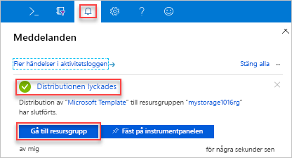
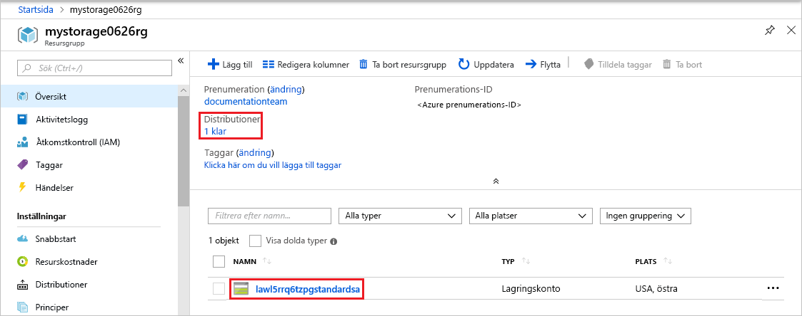

# <a name="quickstart-create-and-deploy-azure-resource-manager-templates-by-using-the-azure-portal"></a>Snabbstart: Skapa och distribuera Azure Resource Manager-mallar med hjälp av Azure-portalen

Lär dig hur du genererar en Resource Manager-mall med hjälp av Azure-portalen samt hur du redigerar och distribuerar mallen från portalen. Resource Manager-mallar är JSON-filer som definierar de resurser du behöver för att distribuera lösningen. En beskrivning av de begrepp som används i samband med distribution och hantering av Azure-lösningar finns i [Översikt över Azure Resource Manager](resource-group-overview.md).


När du har slutfört självstudien kan du distribuera ett Azure Storage-konto. Samma process kan användas till att distribuera andra Azure-resurser.

Om du inte har en Azure-prenumeration kan du [skapa ett kostnadsfritt konto ](https://azure.microsoft.com/free/) innan du börjar.

## <a name="generate-a-template-using-the-portal"></a>Generera en mall med hjälp av portalen

Att skapa en Resource Manager-mall från grunden är inte helt enkelt, i synnerhet om du är ny på Azure-distribution och inte känner till JSON-formatet. Med hjälp av Azure-portalen kan du konfigurera en resurs, till exempel ett Azure Storage-konto. Innan du distribuerar resursen kan du exportera konfigurationen till en Resource Manager-mall. Du kan spara mallen och använda den igen senare.

Många mall för erfarna utvecklare använder den här metoden för att generera mallar när de försöker distribuera Azure-resurser som de inte är bekant med. Mer information om hur du exporterar mallar med hjälp av portalen finns i [exportera resursgrupper till mallar](./manage-resource-groups-portal.md#export-resource-groups-to-templates). Det andra sättet att hitta en fungerande mall är från [Azure-snabbstartmallar](https://azure.microsoft.com/resources/templates/).

1. Logga in på [Azure Portal](https://portal.azure.com).
2. Välj **Skapa en resurs** > **Lagring** > **Lagringskonto – blob, fil, tabell, kö**.

    
3. Ange följande information:

    |Namn|Värde|
    |----|----|
    |**Resursgrupp**|Välj **Skapa ny** och ge resursgruppen ett namn. På skärmbilden är namnet på resursgruppen *mystorage1016rg*. En resursgrupp är en container för Azure-resurser. Med resursgrupper är det enklare att hantera Azure-resurser. |
    |**Namn**|Ge lagringskontot ett unikt namn. Lagringskontonamnet måste vara unikt för alla Azure och den bara innehålla gemena bokstäver och siffror. Namnet måste vara mellan 3 och 24 tecken. Om du får ett felmeddelande om ”lagringskontonamnet” mystorage1016 ”är redan upptagen” kan du prova med att använda  **&lt;ditt namn > storage&lt;dagens datum i MMDD >**, till exempel  **johndolestorage1016**. Mer information finns i [namngivningsregler och begränsningar](/azure/architecture/best-practices/naming-conventions#naming-rules-and-restrictions).|

    Du kan använda standardvärdena för resten av egenskaperna.

    

    > [!NOTE]
    > Vissa av de exporterade mallarna kräver vissa ändringar innan du kan distribuera dem.

4. Välj **Granska + skapa** längst ned på skärmen. Markera inte **skapa** i nästa steg.
5. Välj **Ladda ned en mall för automatisering** längst ned på skärmen. Portalen visar den genererade mallen:

    

    Huvudfönsterrutan visar mallen. Det är en JSON-fil med sex element på den översta nivån – `schema`, `contentVersion`, `parameters`, `variables`, `resources` och `output`. Mer information finns i [Förstå strukturen och syntaxen för Azure Resource Manager-mallar](./resource-group-authoring-templates.md)

    Det finns sex parametrar angivna. En av dem heter **storageAccountName**. Den andra markerade delen på den föregående skärmbilden visar hur den här parametern ska anges i mallen. I nästa avsnitt kan du redigera mallen för att använda ett genererat namn för lagringskontot.

    En Azure-resurs har definierats i mallen. Typen är `Microsoft.Storage/storageAccounts`. Ta en titt på hur resursen definieras och definitionsstruktur.
6. Välj **hämta** högst upp på skärmen. 
7. Öppna den hämta zip-filen och spara **template.json** till datorn. I nästa avsnitt använder du ett malldistributionsverktyg för att redigera mallen.
8. Välj fliken **Parameter** för att se de värden som du angav för parametrarna. Anteckna dessa värden, eftersom du behöver dem i nästa avsnitt när du distribuerar mallen.

    

    Med både mallfilen och parameterfilen kan skapa du en resurs i den här självstudien, ett Azure storage-konto.

## <a name="edit-and-deploy-the-template"></a>Redigera och distribuera mallen

Du kan använda Azure-portalen för att utföra viss grundläggande redigering av mallen. I den här snabbstarten använder du portalverktyget *Malldistribution*. *Malldistribution* används i den här självstudien, vilket innebär att du kan slutföra hela självstudien med ett gränssnitt – Azure-portalen. För redigering av en mer komplex mall bör du överväga att använda [Visual Studio Code](./resource-manager-quickstart-create-templates-use-visual-studio-code.md), som tillhandahåller mer omfattande redigeringsfunktioner.

Azure kräver att varje Azure-tjänst har ett unikt namn. Distributionen kan misslyckas om du anger namnet på ett lagringskonto som redan finns. För att undvika det här problemet ändrar du mallen så att den använder ett mallfunktionsanrop `uniquestring()` för att generera ett unikt lagringskontonamn.

1. I Azure-portalen väljer du **Skapa en resurs**.
2. I **Sök på Marketplace** skriver du **malldistribution** och trycker sedan på **RETUR**.
3. Välj **Malldistribution**.

    
4. Välj **Skapa**.
5. Välj alternativet för att **skapa din egen mall i redigeringsprogrammet**.
6. Välj **Läs in fil** och följ sedan anvisningarna för att läsa in template.json som du laddade ned i det sista avsnittet.
7. Gör följande tre ändringar i mallen:

    

   - Ta bort den **storageAccountName** parameter som visas i föregående skärmbild.
   - Lägg till en variabel som kallas **storageAccountName** som visas i föregående skärmbild:

       ```json
       "storageAccountName": "[concat(uniqueString(subscription().subscriptionId), 'storage')]"
       ```

       Här används två mallfunktioner: `concat()` och `uniqueString()`.
   - Uppdatera namnelementet för resursen **Microsoft.Storage/storageAccounts** för att använda den nyligen definierade variabeln i stället för parametern:

       ```json
       "name": "[variables('storageAccountName')]",
       ```

     Den slutliga mallen bör se ut så här:

     ```json
     {
       "$schema": "https://schema.management.azure.com/schemas/2015-01-01/deploymentTemplate.json#",
       "contentVersion": "1.0.0.0",
       "parameters": {
           "location": {
               "type": "string"
           },
           "accountType": {
               "type": "string"
           },
           "kind": {
               "type": "string"
           },
           "accessTier": {
               "type": "string"
           },
           "supportsHttpsTrafficOnly": {
               "type": "bool"
           }
       },
       "variables": {
           "storageAccountName": "[concat(uniqueString(subscription().subscriptionId), 'storage')]"
       },
       "resources": [
           {
               "name": "[variables('storageAccountName')]",
               "type": "Microsoft.Storage/storageAccounts",
               "apiVersion": "2018-07-01",
               "location": "[parameters('location')]",
               "properties": {
                   "accessTier": "[parameters('accessTier')]",
                   "supportsHttpsTrafficOnly": "[parameters('supportsHttpsTrafficOnly')]"
               },
               "dependsOn": [],
               "sku": {
                   "name": "[parameters('accountType')]"
               },
               "kind": "[parameters('kind')]"
           }
       ],
       "outputs": {}
     }
     ```
8. Välj **Spara**.
9. Ange följande värden:

    |Namn|Värde|
    |----|----|
    |**Resursgrupp**|Välj resursgruppens namn du skapade i det sista avsnittet. |
    |**Plats**|Välj en plats för lagringskontot. Välj till exempel **USA, centrala**. |
    |**Kontotyp**|Ange **Standard_LRS** för den här snabbstarten. |
    |**Kind**|Ange **StorageV2** för den här snabbstarten. |
    |**Åtkomstnivå**|Ange **Frekvent** för den här snabbstarten. |
    |**HTTPS-trafik endast aktiverad**| Välj **true** för den här snabbstarten. |
    |**Jag godkänner villkoren som anges ovan**|(Välj)|

    Här är en skärmbild på en exempeldistribution:

    

10. Välj **Köp**.
11. Välj klockikonen (meddelanden) längst upp på skärmen för att se distributionsstatus. **Distribution pågår** ska nu visas. Vänta tills distributionen är klar.

    

12. Välj **Gå till resursgrupp** i meddelandefönstret. Du bör se en skärm som liknar följande:

    

    Du kan se att distributionen lyckades och att det bara finns ett lagringskonto i resursgruppen. Lagringskontots namn är en unik sträng som genereras av mallen. Mer information om hur du använder Azure-lagringskonton finns i [Snabbstart: Ladda upp, ladda ned och lista blobar med Azure-portalen](../storage/blobs/storage-quickstart-blobs-portal.md).

## <a name="clean-up-resources"></a>Rensa resurser

När Azure-resurserna inte längre behövs rensar du de resurser som du har distribuerat genom att ta bort resursgruppen.

1. I Azure-portalen väljer du **Resursgrupp** på den vänstra menyn.
2. Ange resursgruppens namn i fältet **Filtrera efter namn**.
3. Välj resursgruppens namn.  Du bör se lagringskontot i resursgruppen.
4. Välj **Ta bort resursgrupp** på menyn längst upp.

## <a name="next-steps"></a>Nästa steg

I den här självstudien lärde du dig hur du genererar en mall från Azure-portalen och hur du distribuerar mallen med hjälp av portalen. Den mall som användes i den här snabbstarten är en enkel mall med en Azure-resurs. När mallen är komplex är det enklare att använda Visual Studio Code eller Visual Studio för att utveckla mallen. Nästa snabbstart visar också hur du distribuerar mallar med Azure PowerShell och Azure-kommandoradsgränssnittet (CLI).

> [!div class="nextstepaction"]
> [Skapa mallar med hjälp av Visual Studio Code](./resource-manager-quickstart-create-templates-use-visual-studio-code.md)
