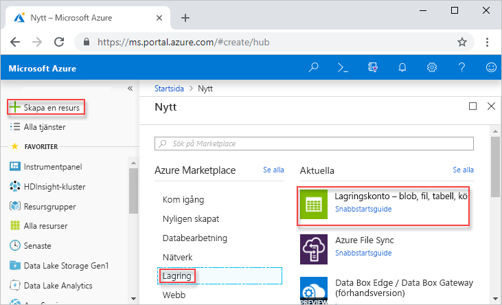
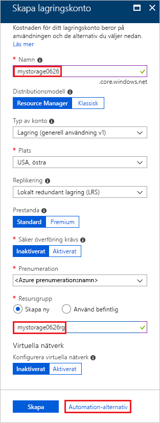
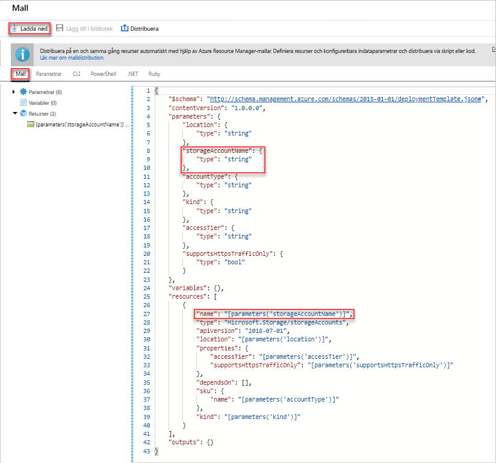
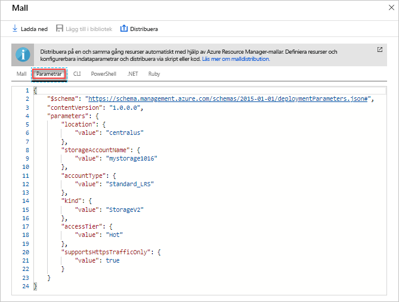
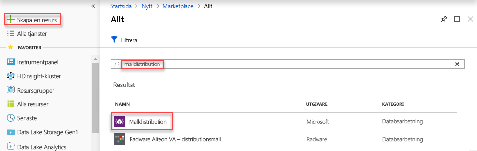
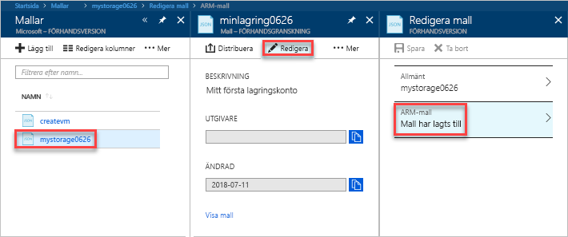
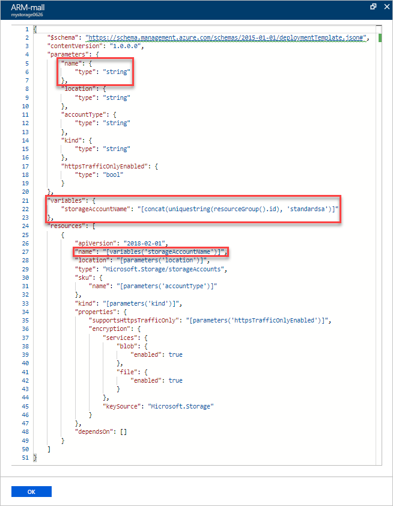
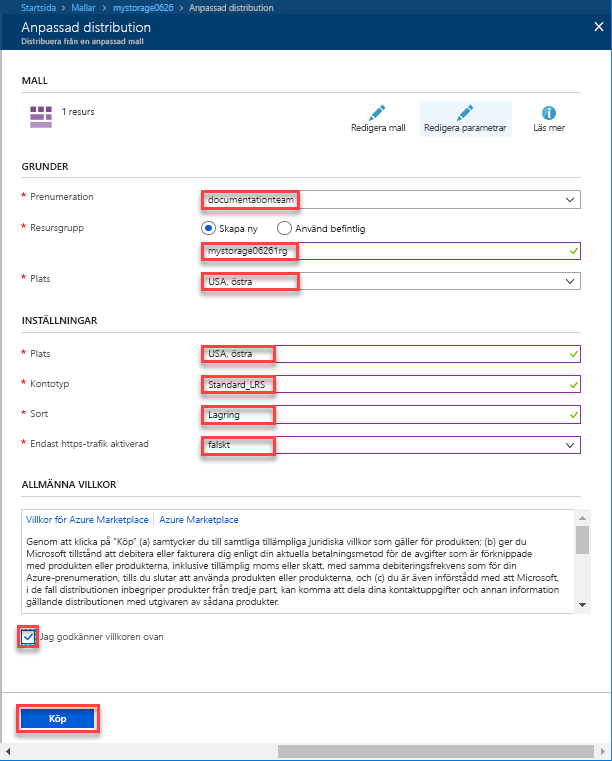

# <a name="quickstart-create-and-deploy-azure-resource-manager-templates-by-using-the-azure-portal"></a>Snabbstart: Skapa och distribuera Azure Resource Manager-mallar med hjälp av Azure-portalen

Lär dig hur du skapar din första Azure Resource Manager-mall genom att generera en med hjälp av Azure-portalen samt hur du redigerar och distribuerar mallen från portalen.

Resource Manager-mallar är JSON-filer som definierar de resurser du behöver för att distribuera lösningen. Du behöver inte alltid börja från början när du vill skapa en mall. I den här självstudien får du lära dig hur du genererar en mall från Azure-portalen. Du kan sedan anpassa mallen och distribuera den.

Anvisningarna i den här självstudien gör att ett Azure Storage-konto skapas. Du kan använda samma process för att skapa andra Azure-resurser.

Om du inte har en Azure-prenumeration kan du [skapa ett kostnadsfritt konto ](https://azure.microsoft.com/free/) innan du börjar.

## <a name="generate-a-template-using-the-portal"></a>Generera en mall med hjälp av portalen

I det här avsnittet skapar du ett lagringskonto med hjälp av Azure-portalen. Innan du distribuerar lagringskontot har du möjligheten att utforska den mall som genereras av portalen baserat på dina konfigurationer. Du kan spara mallen och använda den igen senare.

1. Logga in på [Azure Portal](https://portal.azure.com).
2. Välj **Skapa en resurs** > **Lagring** > **Lagringskonto – blob, fil, tabell, kö**.

    
3. Ange följande information. Se till att välja **Automatiseringsalternativ** i stället för **Skapa** i nästa steg, så du kan se mallen innan den distribueras.

    - **Namn**: Ge lagringskontot ett unikt namn. På skärmbilden är namnet *mystorage0626*.
    - **Resursgrupp**: Skapa en ny Azure-resursgrupp med ett namn som du väljer. På skärmbilden är namnet på resursgruppen *mystorage0626rg*.

    Du kan använda standardvärdena för resten av egenskaperna.

    

    > [!NOTE]
    > Vissa av de exporterade mallarna kräver vissa ändringar innan du kan distribuera dem.

4. Välj **Automatiseringsalternativ** längst ned på skärmen. Portalen visar mallen på fliken **Mall**:

    

    Huvudfönsterrutan visar mallen. Det är en JSON-fil med fyra översta element. Mer information finns i [Förstå strukturen och syntaxen för Azure Resource Manager-mallar](./resource-group-authoring-templates.md)

    Under elementet **Parameter** finns det fem parametrar som definierats. För att se de värden som du anger under distributionen väljer du fliken **Parametrar**.

    

    Dessa värden är dem som du konfigurerade i föregående avsnitt. Med hjälp av både mallen och parameterfilerna kan du skapa ett Azure-lagringskonto.

5. Längst upp på flikarna finns tre menykommandon:

    - **Ladda ned**: Ladda ned mallen och parameterfilerna till din lokala dator.
    - **Lägg till i bibliotek**: Lägg till mallen i biblioteket för återanvändning senare.
    - **Distribuera**: Distribuera Azure-lagringskontot till Azure.

    I den här självstudien använder du alternativet **Lägg till i bibliotek**.

6. Välj **Lägg till i bibliotek**.
7. Ange **Namn** och **Beskrivning**, och välj sedan **Spara**.

> [!NOTE]
> Mallbiblioteksfunktionen är i förhandsversion. De flesta väljer att spara sina mallar på lokal dator eller på en offentlig lagringsplats, till exempel Github.  

## <a name="edit-and-deploy-the-template"></a>Redigera och distribuera mallen

I det här avsnittet öppnar du den sparade mallen från mallbiblioteket, redigerar mallen inifrån portalen och distribuerar den ändrade mallen. För redigering av mer komplex kod bör du överväga att använda Visual Studio Code, som ger bättre redigeringsfunktioner.

1. I Azure-portalen väljer du **Alla tjänster** i den vänstra menyn, anger **mall** i filterrutan och väljer sedan **Template (PREVIEW)** (Mall (FÖRHANDSVERSION)).

    
2. Välj den mall som du sparade i det senaste avsnittet. Det namn som används på skärmbilden är *mystorage0626*.
3. Välj **Redigera** och välj sedan **Mall har lagts till**.

    

4. Lägg till ett element för **variabler** och lägg sedan till en variabel enligt följande skärmbild:

    ```json
    "variables": {
        "storageAccountName": "[concat(uniquestring(resourceGroup().id), 'standardsa')]"
    },
    ```
    

    Två funktioner används här: *concat()* och *uniqueString()*. Funktionen uniqueString() är användbar för att skapa ett unikt namn för en resurs.

5. Ta bort parametern för **namn** som är markerad i föregående skärmbild.
6. Uppdatera namnelementet för resursen **Microsoft.Storage/storageAccounts** för att använda den nyligen definierade variabeln i stället för parametern:

    ```json
    "name": "[variables('storageAccountName')]",
    ```

    Den slutliga mallen bör se ut så här:

    ```json
    {
        "$schema": "https://schema.management.azure.com/schemas/2015-01-01/deploymentTemplate.json#",
        "contentVersion": "1.0.0.0",
        "parameters": {
            "location": {
                "type": "string"
            },
            "accountType": {
                "type": "string"
            },
            "kind": {
                "type": "string"
            },
            "httpsTrafficOnlyEnabled": {
                "type": "bool"
            }
        },
        "variables": {
            "storageAccountName": "[concat(uniquestring(resourceGroup().id), 'standardsa')]"
        },
        "resources": [
            {
                "apiVersion": "2018-02-01",
                "name": "[variables('storageAccountName')]",
                "location": "[parameters('location')]",
                "type": "Microsoft.Storage/storageAccounts",
                "sku": {
                    "name": "[parameters('accountType')]"
                },
                "kind": "[parameters('kind')]",
                "properties": {
                    "supportsHttpsTrafficOnly": "[parameters('httpsTrafficOnlyEnabled')]",
                    "encryption": {
                        "services": {
                            "blob": {
                                "enabled": true
                            },
                            "file": {
                                "enabled": true
                            }
                        },
                        "keySource": "Microsoft.Storage"
                    }
                },
                "dependsOn": []
            }
        ]
    }
    ```
7. Välj **OK** och sedan **Spara** för att spara ändringarna.
8. Välj **Distribuera**.
9. Ange följande värden:

    - **Prenumeration**: Välj din Azure-prenumeration.
    - **Resursgrupp**: Ge resursgruppen ett unikt namn.
    - **Plats**: Välj en plats för resursgruppen.
    - **Plats**: Välj en plats för lagringskontot.  Du kan använda samma plats som för resursgruppen.
    - **Kontotyp**: Ange **Standard_LRS** för den här snabbstarten.
    - **Variant**: Ange **Lagring** för den här snabbstarten.
    - **Https Traffic Only Enabled** (Endast HTTPS-trafik aktiverat).  Välj **false** (falskt) för den här snabbstarten.
    - **Jag godkänner villkoren ovan**: (välj)

    Här är en skärmbild på en exempeldistribution:

    

10. Välj **Köp**.
11. Välj klockikonen (meddelanden) längst upp på skärmen för att se distributionsstatus.

## <a name="clean-up-resources"></a>Rensa resurser

När Azure-resurserna inte längre behövs rensar du de resurser som du har distribuerat genom att ta bort resursgruppen.

1. I Azure-portalen väljer du **Resursgrupp** på den vänstra menyn.
2. Ange resursgruppens namn i fältet **Filtrera efter namn**.
3. Välj resursgruppens namn.  Du bör se lagringskontot i resursgruppen.
4. Välj **Ta bort resursgrupp** på menyn längst upp.

## <a name="next-steps"></a>Nästa steg

I den här självstudien lärde du dig hur du genererar en mall från Azure-portalen och hur du distribuerar mallen med hjälp av portalen. Den mall som användes i den här snabbstarten är en enkel mall med en Azure-resurs. När mallen är komplex är det enklare att använda Visual Studio Code eller Visual Studio för att utveckla mallen.

> [!div class="nextstepaction"]
> [Skapa mallar med hjälp av Visual Studio Code](./resource-manager-quickstart-create-templates-use-visual-studio-code.md)
