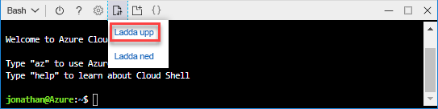
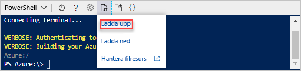

# <a name="quickstart-create-azure-resource-manager-templates-by-using-visual-studio-code"></a>Snabbstart: Skapa Azure Resource Manager-mallar med hjälp av Visual Studio Code

Lär dig hur du använder Visual Studio Code och Azure Resource Manager Tools-tillägget för att skapa och redigera Azure Resource Manager-mallar. Du kan skapa Resource Manager-mallar i Visual Studio Code utan tillägget. Tillägget innehåller dock alternativ för automatisk komplettering som gör det enklare att skapa mallar. En beskrivning av de begrepp som används i samband med distribution och hantering av Azure-lösningar finns i [Översikt över Azure Resource Manager](resource-group-overview.md).

I den här självstudien distribuerar du ett storage-konto:


Om du inte har en Azure-prenumeration kan du [skapa ett kostnadsfritt konto ](https://azure.microsoft.com/free/) innan du börjar.

## <a name="prerequisites"></a>Nödvändiga komponenter

För att kunna följa stegen i den här artikeln behöver du:

- [Visual Studio Code](https://code.visualstudio.com/).
- Resource Manager Tools-tillägget. Följ dessa steg för att installera:

    1. Öppna Visual Studio Code.
    2. Tryck på **CTRL + SKIFT + X** för att öppna fönsterrutan Tillägg
    3. Sök efter **Azure Resource Manager Tools** och välj sedan **Installera**.
    4. Välj **Läs in på nytt** för att slutföra installationen av tillägget.

## <a name="open-a-quickstart-template"></a>Öppna en snabbstartsmall

I stället för att skapa en mall från början öppnar du en mall från [Azure-snabbstartsmallar](https://azure.microsoft.com/resources/templates/). Azure-snabbstartsmallar är en lagringsplats för Resource Manager-mallar.

Den mall som används i den här snabbstarten kallas [Create a standard storage account](https://azure.microsoft.com/resources/templates/101-storage-account-create/) (Skapa ett standardlagringskonto). Mallen definierar en Azure Storage-kontoresurs.

1. Från Visual Studio Code väljer du **Arkiv**>**Öppna fil**.
2. I **Filnamn** klistrar du in följande URL:

    ```url
    https://raw.githubusercontent.com/Azure/azure-quickstart-templates/master/101-storage-account-create/azuredeploy.json
    ```

3. Välj **Öppna** för att öppna filen.
4. Välj **Arkiv**>**Spara som** för att spara filen som **azuredeploy.json** till den lokala datorn.

## <a name="edit-the-template"></a>Redigera mallen

Om du vill veta hur du redigerar en mall med hjälp av Visual Studio Code lägger du till ytterligare ett element i avsnittet `outputs` för att visa lagrings-URI.

1. Lägg till ytterligare utdata i den exporterade mallen:

    ```json
    "storageUri": {
      "type": "string",
      "value": "[reference(variables('storageAccountName')).primaryEndpoints.blob]"
    }
    ```

    När du är klar ser utdataavsnittet ut så här:

    ```json
    "outputs": {
      "storageAccountName": {
        "type": "string",
        "value": "[variables('storageAccountName')]"
      },
      "storageUri": {
        "type": "string",
        "value": "[reference(variables('storageAccountName')).primaryEndpoints.blob]"
      }
    }
    ```

    Om du kopierade och klistrade in koden i Visual Studio Code kan du försöka att skriva elementet **värde** igen för att se IntelliSense-funktionerna för Resource Manager Tools-tillägget.

    

2. Välj **Arkiv** >**Spara** för att spara filen.

## <a name="deploy-the-template"></a>Distribuera mallen

Det finns många metoder för att distribuera mallar. Azure cloudshell används i den här snabbstarten. Cloudshell stöder både Azure CLI och Azure PowerShell. Använd flikväljaren för att välja mellan CLI och PowerShell.

[!INCLUDE [updated-for-az](../../includes/updated-for-az.md)]

1. Logga in på [Azure Cloud Shell](https://shell.azure.com).

2. Välj din miljö genom att välja antingen **PowerShell** eller **Bash**(CLI) i det övre vänstra hörnet.  Du måste starta om gränssnittet när du byter.

    # <a name="clitabcli"></a>[CLI](#tab/CLI)

    

    # <a name="powershelltabpowershell"></a>[PowerShell](#tab/PowerShell)

    

    ---

3. Välj **Ladda upp/ned filer** och välj sedan **Ladda upp**.

    # <a name="clitabcli"></a>[CLI](#tab/CLI)

    
   
    # <a name="powershelltabpowershell"></a>[PowerShell](#tab/PowerShell)
    
    
    
    ---

    Välj den fil som du sparade i föregående avsnitt. Standardnamnet är **azuredeploy.json**. Mallfilen måste vara tillgänglig från gränssnittet.

    Alternativt kan du använda kommandona **ls** och **cat** för att kontrollera att filen laddas upp. 

    # <a name="clitabcli"></a>[CLI](#tab/CLI)

    
   
    # <a name="powershelltabpowershell"></a>[PowerShell](#tab/PowerShell)
    
    
    
    ---
4. Från Cloud Shell kör du följande kommandon. Välj fliken så att du ser PowerShell-koden eller CLI-koden.

    # <a name="clitabcli"></a>[CLI](#tab/CLI)
    ```azurecli
    echo "Enter the Resource Group name:" &&
    read resourceGroupName &&
    echo "Enter the location (i.e. centralus):" &&
    read location &&
    az group create --name $resourceGroupName --location "$location" &&
    az group deployment create --resource-group $resourceGroupName --template-file "$HOME/azuredeploy.json"
    ```
   
    # <a name="powershelltabpowershell"></a>[PowerShell](#tab/PowerShell)
    
    ```azurepowershell
    $resourceGroupName = Read-Host -Prompt "Enter the Resource Group name"
    $location = Read-Host -Prompt "Enter the location (i.e. centralus)"
    
    New-AzResourceGroup -Name $resourceGroupName -Location "$location"
    New-AzResourceGroupDeployment -ResourceGroupName $resourceGroupName -TemplateFile "$HOME/azuredeploy.json"
    ```
    
    ---

    Uppdatera mallfilnamnet om du sparar filen som ett annat namn än **azuredeploy.json**. 

    Följande skärmbild visar ett distributionsexempel:

    # <a name="clitabcli"></a>[CLI](#tab/CLI)

    
   
    # <a name="powershelltabpowershell"></a>[PowerShell](#tab/PowerShell)
    
    
    
    ---

    Lagringskontonamnet och lagrings-URL:en i utdataavsnittet är markerade på skärmbilden. Du behöver lagringskontonamnet i nästa steg.

5. Kör följande CLI- eller PowerShell-kommando för att visa det nyligen skapade lagringskontot:

    # <a name="clitabcli"></a>[CLI](#tab/CLI)
    ```azurecli
    echo "Enter the Resource Group name:" &&
    read resourceGroupName &&
    echo "Enter the Storage Account name:" &&
    read storageAccountName &&
    az storage account show --resource-group $resourceGroupName --name $storageAccountName
    ```
   
    # <a name="powershelltabpowershell"></a>[PowerShell](#tab/PowerShell)
    
    ```azurepowershell
    $resourceGroupName = Read-Host -Prompt "Enter the Resource Group name"
    $storageAccountName = Read-Host -Prompt "Enter the Storage Account name"
    Get-AzStorageAccount -ResourceGroupName $resourceGroupName -Name $storageAccountName
    ```
    
    ---

Mer information om hur du använder Azure-lagringskonton finns i [Snabbstart: Ladda upp, ladda ned och lista blobar med Azure-portalen](../storage/blobs/storage-quickstart-blobs-portal.md).

## <a name="clean-up-resources"></a>Rensa resurser

När Azure-resurserna inte längre behövs rensar du de resurser som du har distribuerat genom att ta bort resursgruppen.

1. Från Azure-portalen väljer du **Resursgrupp** från den vänstra menyn.
2. Ange resursgruppens namn i fältet **Filtrera efter namn**.
3. Välj resursgruppens namn.  Du bör se totalt sex resurser i resursgruppen.
4. Välj **Ta bort resursgrupp** från menyn längst upp.

## <a name="next-steps"></a>Nästa steg

Huvudfokus för den här snabb är att använda Visual Studio Code för att redigera en befintlig mall från snabbstartsmallarna i Azure. Du har även lärt dig att distribuera mallen med hjälp av CLI eller PowerShell från Azure Cloud Shell. Snabbstartsmallarna i Azure kanske inte innehåller exakt det du behöver. Nästa självstudiekurs visar hur du hittar information i mallreferensen så att du kan skapa ett krypterat Azure Storage-konto.

> [!div class="nextstepaction"]
> [Skapa ett krypterat lagringskonto](./resource-manager-tutorial-create-encrypted-storage-accounts.md)
