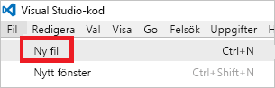
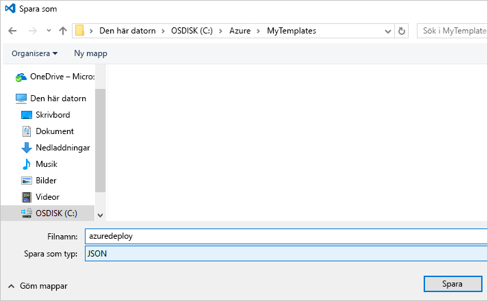

# <a name="use-visual-studio-code-extension-to-create-azure-resource-manager-template"></a>Skapa en Azure Resource Manager-mall med hjälp av Visual Studio Code-tillägget
Den här artikeln beskriver fördelarna med att installera och använda tillägget Azure Resource Manager Tools i Visual Studio Code. Du kan skapa Resource Manager-mallar i VS Code utan tillägget. Tillägget innehåller dock alternativ för automatisk komplettering som gör det enklare att skapa mallar. Tillägget föreslår mallfunktioner, parametrar och variabler som är tillgängliga i mallen.

Du behöver [Visual Studio Code](https://code.visualstudio.com/) för att kunna följa stegen i den här artikeln.

En beskrivning av de begrepp som används i samband med distribution och hantering av Azure-lösningar finns i [Översikt över Azure Resource Manager](resource-group-overview.md).

## <a name="create-the-template"></a>Skapa mallen

Den här artikeln bygger vidare på mallen som du skapade i [Skapa och distribuera din första Azure Resource Manager-mall](resource-manager-create-first-template.md). Om du redan har mallen kan du hoppa över det här avsnittet.

1. Om du behöver skapa mallen startar du VS Code. Välj **Arkiv** > **Ny fil**. 

   

2. Kopiera och klistra in följande JSON-syntax i filen:

   ```json
   {
     "$schema": "http://schema.management.azure.com/schemas/2015-01-01/deploymentTemplate.json#",
     "contentVersion": "1.0.0.0",
     "parameters": {
       "storageSKU": {
         "type": "string",
         "allowedValues": [
           "Standard_LRS",
           "Standard_ZRS",
           "Standard_GRS",
           "Standard_RAGRS",
           "Premium_LRS"
         ],
         "defaultValue": "Standard_LRS",
         "metadata": {
           "description": "The type of replication to use for the storage account."
         }
       },   
       "storageNamePrefix": {
         "type": "string",
         "maxLength": 11,
         "defaultValue": "storage",
         "metadata": {
           "description": "The value to use for starting the storage account name. Use only lowercase letters and numbers."
         }
       }
     },
     "variables": {
       "storageName": "[concat(toLower(parameters('storageNamePrefix')), uniqueString(resourceGroup().id))]"
     },
     "resources": [
       {
         "name": "[variables('storageName')]",
         "type": "Microsoft.Storage/storageAccounts",
         "apiVersion": "2016-01-01",
         "sku": {
           "name": "[parameters('storageSKU')]"
         },
         "kind": "Storage",
         "location": "[resourceGroup().location]",
         "tags": {},
         "properties": {
           "encryption":{
             "services":{
               "blob":{
                 "enabled":true
               }
             },
             "keySource":"Microsoft.Storage"
           }
         }
       }
     ],
     "outputs": {  }
   }
   ```

3. Spara den här filen som **azuredeploy.json** i en lokal mapp.

   

## <a name="install-the-extension"></a>Installera tillägget

1. Välj **Tillägg** i VS Code.

   

2. Sök efter **Azure Resource Manager Tools** och välj **Installera**.

   

3. Slutför installationen av tillägget genom att välja **Läs in igen**.

## <a name="edit-the-template"></a>Redigera mallen

1. Öppna filen azuredeploy.json.

2. Tillägget hämtar alla tillgängliga [mallfunktioner](resource-group-template-functions.md). Det läser också de parametrar och variabler som du har definierat i mallen. Om du vill se hur den här funktionen fungerar lägger du till två värden i outputs-avsnittet. Ersätt outputs-avsnittet i mallen med:

   ```json
   "outputs": { 
       "groupLocation": {
         "type": "string",
         "value": ""
       },
       "storageUri": {
         "type": "string",
         "value": ""
       }
   }
   ```

3. Placera markören mellan citattecknen för värdet i **groupLocation**. Lägg till en inledande vänster hakparentes (`[`). Observera att tillägget genast föreslår tillgängliga mallfunktioner.

   

4. Börja skriva **resourceGroup**. När funktionen `resourceGroup()` visas trycker du på Tabb eller Retur.

   

5. Funktionens syntax fylls i automatiskt. Funktionen [resourceGroup](resource-group-template-functions-resource.md#resourcegroup) stöder inte parametrar. Lägg till en punkt efter högerparentesen. Tillägget visar de egenskaper som är tillgängliga för objektet som returneras av funktionen `resourceGroup()`. Välj `location`.

   

6. Lägg till en avslutande höger hakparentes efter **location**.

   ```json
   "outputs": { 
       "groupLocation": {
         "type": "string",
         "value": "[resourceGroup().location]"
       },
       "storageUri": {
         "type": "string",
         "value": ""
       }
   }
   ```

7. Placera markören mellan citattecknen för **storageUri**. Lägg återigen till en inledande vänster hakparentes. Börja skriva **reference**. När funktionen visas klickar du på Tabb eller Retur.

   

8. Resurs-ID:t eller resursnamnet kan användas som parameter med funktionen [reference](resource-group-template-functions-resource.md#reference). Namnet på lagringskontot finns redan i en variabel. Skriv **var** och tryck sedan på Ctrl+blanksteg. Tillägget föreslår funktionen variables.

   

   Tryck på Tabb eller Retur.

9. Funktionen [variables](resource-group-template-functions-deployment.md#variables) kräver namnet på variabeln. Lägg till ett enkelt citattecken inuti parenteserna. Namnen på variabler som du har definierat i mallen visas automatiskt.

    

10. Välj variabeln **storageName**. Lägg till en avslutande höger hakparentes. Följande exempel visar outputs-avsnittet:

   ```json
   "outputs": { 
       "groupLocation": {
         "type": "string",
         "value": "[resourceGroup().location]"
       },
       "storageUri": {
         "type": "string",
         "value": "[reference(variables('storageName'))]"
       }
   }
   ```

Så här ser den färdiga mallen ut:

```json
{
  "$schema": "http://schema.management.azure.com/schemas/2015-01-01/deploymentTemplate.json#",
  "contentVersion": "1.0.0.0",
  "parameters": {
    "storageSKU": {
      "type": "string",
      "allowedValues": [
        "Standard_LRS",
        "Standard_ZRS",
        "Standard_GRS",
        "Standard_RAGRS",
        "Premium_LRS"
      ],
      "defaultValue": "Standard_LRS",
      "metadata": {
        "description": "The type of replication to use for the storage account."
      }
    },   
    "storageNamePrefix": {
      "type": "string",
      "maxLength": 11,
      "defaultValue": "storage",
      "metadata": {
        "description": "The value to use for starting the storage account name. Use only lowercase letters and numbers."
      }
    }
  },
  "variables": {
    "storageName": "[concat(toLower(parameters('storageNamePrefix')), uniqueString(resourceGroup().id))]"
  },
  "resources": [
    {
      "name": "[variables('storageName')]",
      "type": "Microsoft.Storage/storageAccounts",
      "apiVersion": "2016-01-01",
      "sku": {
        "name": "[parameters('storageSKU')]"
      },
      "kind": "Storage",
      "location": "[resourceGroup().location]",
      "tags": {},
      "properties": {
        "encryption":{
          "services":{
            "blob":{
              "enabled":true
            }
          },
          "keySource":"Microsoft.Storage"
        }
      }
    }
  ],
  "outputs": { 
    "groupLocation": {
      "type": "string",
      "value": "[resourceGroup().location]"
    },
    "storageUri": {
      "type": "string",
      "value": "[reference(variables('storageName'))]"
    }
  }
}
```

## <a name="deploy-template"></a>Distribuera mallen

Nu är det dags att distribuera den här mallen. Du använder PowerShell eller Azure CLI för att skapa en resursgrupp. Sedan distribuerar du ett lagringskonto till resursgruppen.

* Om du använder PowerShell använder du följande kommandon från mappen som innehåller mallen:

   ```powershell
   Login-AzureRmAccount
   
   New-AzureRmResourceGroup -Name examplegroup -Location "South Central US"
   New-AzureRmResourceGroupDeployment -ResourceGroupName examplegroup -TemplateFile azuredeploy.json
   ```

* Om du använder en lokal installation av Azure CLI använder du följande kommandon från mappen som innehåller mallen:

   ```azurecli
   az login

   az group create --name examplegroup --location "South Central US"
   az group deployment create --resource-group examplegroup --template-file azuredeploy.json
   ```

Utdatavärdena returneras när distributionen slutförts.

## <a name="clean-up-resources"></a>Rensa resurser

När de inte längre behövs rensar du de resurser som du har distribuerat genom att ta bort resursgruppen.

Om du använder PowerShell använder du:

```powershell
Remove-AzureRmResourceGroup -Name examplegroup
```

Om du använder Azure CLI använder du:

```azurecli
az group delete --name examplegroup
```

## <a name="next-steps"></a>Nästa steg
* Mer information om strukturen i en mall finns i [Redigera Azure Resource Manager-mallar](resource-group-authoring-templates.md).
* Mer information om egenskaperna för ett lagringskonto finns i [mallreferensen för lagringskonton](/azure/templates/microsoft.storage/storageaccounts).
* Om du vill visa kompletta mallar för många olika typer av lösningar kan du se [Azure-snabbstartsmallar](https://azure.microsoft.com/documentation/templates/).
