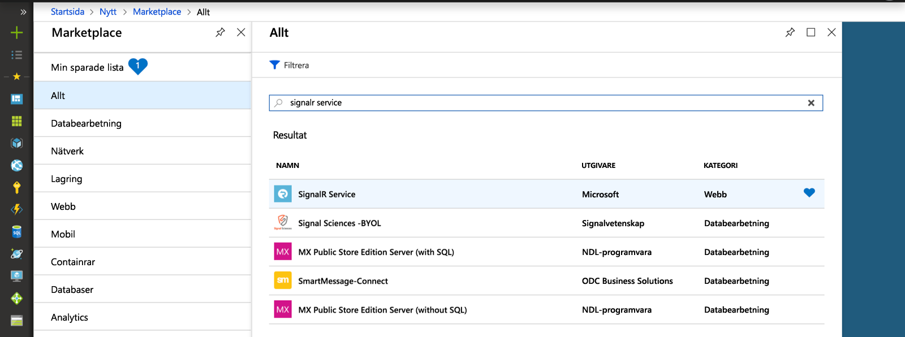
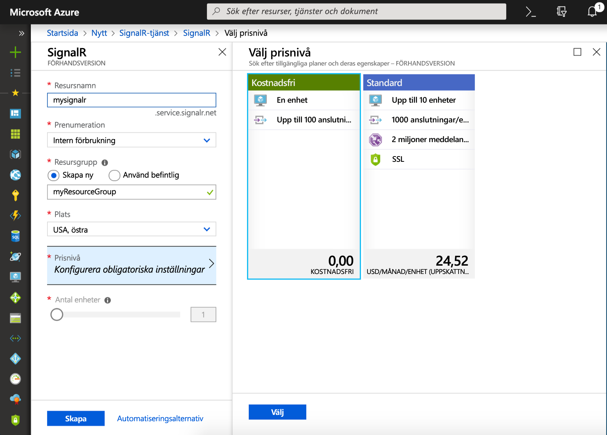

## Skapa en Azure SignalR Service-instans

Din app ansluter till en SignalR Service-instans i Azure.

1. Välj knappen Nytt högst upp till vänster i Azure-portalen. På sidan Nytt skriver du *SignalR Service* i sökrutan och trycker på RETUR.

    

1. Välj **SignalR Service** i sökresultatet och välj sedan **Skapa**.

1. Ange följande inställningar.

    | Inställning      | Föreslaget värde  | Beskrivning                                        |
    | ------------ |  ------- | -------------------------------------------------- |
    | **Resursnamn** | Globalt unikt namn | Namn som identifierar din nya SignalR Service-instans. Giltiga tecken är `a-z`, `0-9` och `-`.  | 
    | **Prenumeration** | Din prenumeration | Prenumerationen som den här nya SignalR Service-instansen har skapats i. | 
    | **[Resursgrupp](../../azure-resource-manager/resource-group-overview.md)** |  myResourceGroup | Namnet på den nya resursgruppen som SignalR Service-instansen ska skapas i. | 
    | **Plats** | Västra USA | Välj en [region](https://azure.microsoft.com/regions/) nära dig. |
    | **prisnivå** | Kostnadsfri | Prova Azure SignalR Service kostnadsfritt. |
    | **Antal enheter** |  Inte tillämpligt | Antal enheter anger hur många anslutningar som SignalR Service-instansen kan acceptera. Det kan bara konfigureras på Standard-nivån. |

    

1. Välj **Skapa** för att börja distribuera SignalR Service-instansen.