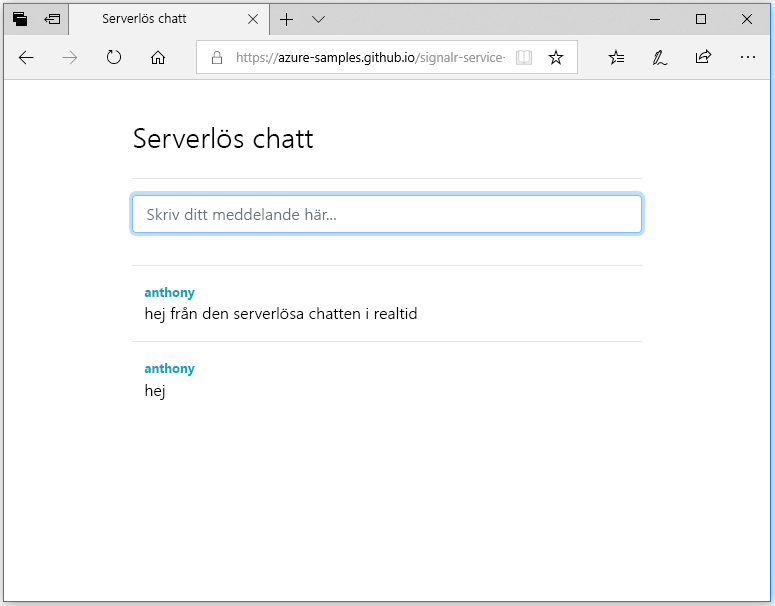

## Köra webbprogrammet

1. Det finns ett exempelwebbprogram med en sida som hanteras på GitHub. Öppna din webbläsare till [https://azure-samples.github.io/signalr-service-quickstart-serverless-chat/demo/chat/](https://azure-samples.github.io/signalr-service-quickstart-serverless-chat/demo/chat/).

    > [!NOTE]
    > Källan för HTML-filen finns på [/docs/demo/chat/index.html](https://github.com/Azure-Samples/signalr-service-quickstart-serverless-chat/blob/master/docs/demo/chat/index.html).

1. När du tillfrågas om funktionsappens bas-URL anger du *http://localhost:7071*.

1. Ange ett användarnamn när du tillfrågas.

1. Webbprogrammet anropar funktionen *GetSignalRInfo* i funktionsappen för att hämta anslutningsinformation för att ansluta till Azure SignalR Service. När anslutningen är klar visas inmatningsrutan för chattmeddelanden.

1. Skriv ett meddelande och tryck på Retur. Programmet skickar meddelandet till funktionen *SendMessage* i Azure Functions-appen, som använder SignalR-utdatabindning för att skicka meddelandet till alla anslutna klienter. Om allt fungerar korrekt bör meddelandet visas i programmet.

    

1. Öppna en till instans av webbprogrammet i ett annat webbläsarfönster. Där ser du att alla meddelanden som skickas visas i alla instanser av programmet.