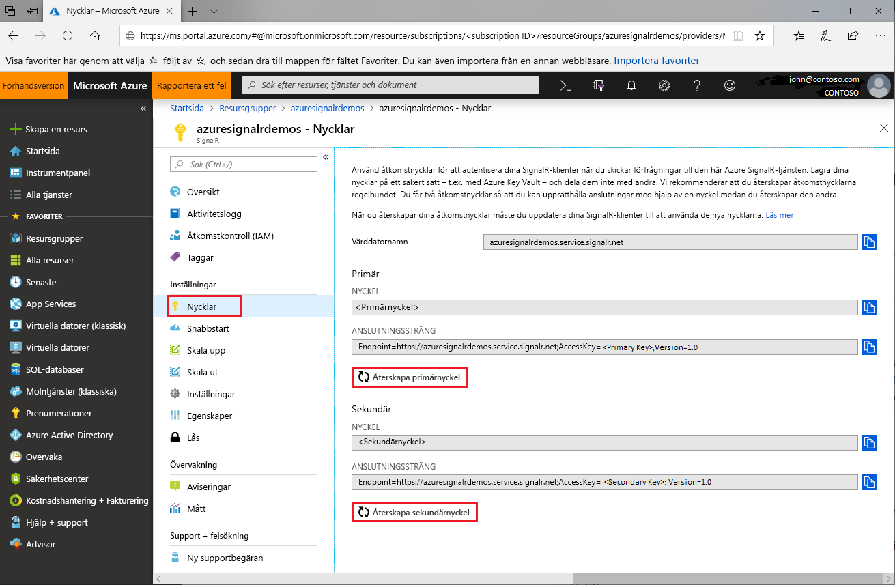

# Rotering av åtkomstnyckel för Azure SignalR Service

Varje Azure SignalR Service-instans har ett par åtkomstnycklar som kallas primärnyckel och sekundärnyckel. De används för att autentisera SignalR-klienter när begäranden görs till tjänsten. Nycklarna associeras med instansens slutpunkts-URL. Skydda dina nycklar och rotera dem regelbundet. Du får två åtkomstnycklar så att du kan upprätthålla anslutningar med en nyckel medan den andra återskapas.

## Varför ska åtkomstnycklar roteras?

Av säkerhets- och efterlevnadsskäl ska åtkomstnycklarna regelbundet roteras.

## Återskapa åtkomstnycklar

1. Gå till [Azure-portalen](https://portal.azure.com/) och logga in med dina autentiseringsuppgifter.

1. Leta upp avsnittet **Nycklar** i Azure SignalR Service-instansen med de nycklar som du vill återskapa.

1. Välj **Nycklar** på navigeringsmenyn.

1. Välj **Återskapa primärnyckel** eller **Återskapa sekundärnyckel**.

   En ny nyckel och motsvarande anslutningssträng skapas och visas.

   

Du kan även återskapa nycklar med hjälp av [Azure CLI](/cli/azure/ext/signalr/signalr/key?view=azure-cli-latest#ext-signalr-az-signalr-key-renew).

## Uppdatera konfigurationer med nya anslutningssträngar

1. Kopiera den nyskapade anslutningssträngen.

1. Uppdatera alla konfigurationer för att använda den nya anslutningssträngen.

1. Starta om programmet vid behov.

## Framtvingad återskapning av åtkomstnyckel

Azure SignalR Service kan framtvinga obligatoriskt återskapande av åtkomstnycklar i vissa situationer. Tjänsten meddelar kunder via e-post och portalmeddelande. Om du får detta meddelande eller om tjänsten inte fungerar på grund av en åtkomstnyckel roterar du nycklarna genom att följa anvisningarna i den här guiden.

## Nästa steg

Rotera åtkomstnycklarna regelbundet som en säkerhetsrutin.

I den här guiden har du lärt att återskapa åtkomstnycklar. Gå vidare till nästkommande självstudiekurser om autentisering med OAuth eller med Azure Functions.

> [!div class="nextstepaction"]
> [Integrera med ASP.NET Core-identitet](./signalr-authenticate-oauth.md)

> [!div class="nextstepaction"]
> [Skapa en serverlös realtidsapp med autentisering](./signalr-authenticate-azure-functions.md)