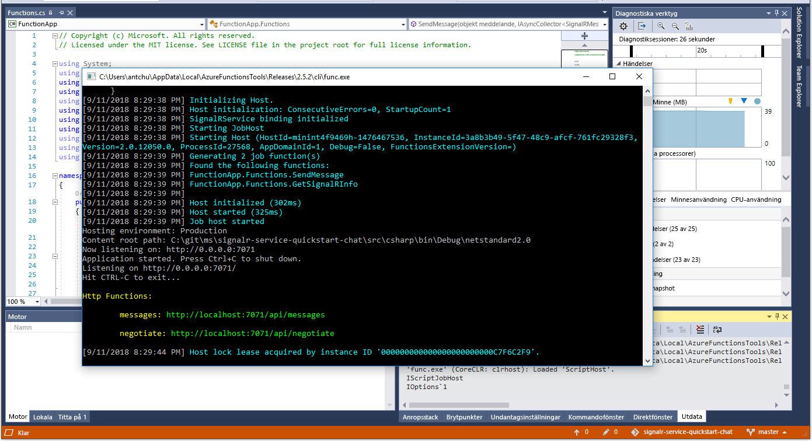

# <a name="quickstart-create-a-chat-room-with-azure-functions-and-signalr-service-using-c"></a>Snabb start: skapa ett chattrum med Azure Functions-och SignalR-tjänsten med hjälp av C\#

Med Azure SignalR Service kan du enkelt lägga till realtidsfunktioner i ditt program. Azure Functions är en serverlös plattform som gör att du kan köra din kod utan att behöva hantera någon infrastruktur. I den här snabbstarten lär du dig hur du använder SignalR Service och Functions för att skapa ett serverlöst realtidschattprogram.

## <a name="prerequisites"></a>Förutsättningar

Om du inte redan har Visual Studio 2019 installerat kan du hämta och använda den **kostnads fria** [versionen av Visual Studio 2019 community](https://www.visualstudio.com/downloads). Se till att du aktiverar **Azure-utveckling** under installationen av Visual Studio.

Du kan också köra den här självstudien på kommando raden (macOS, Windows eller Linux) med hjälp av [Azure Functions Core tools (v2)](https://github.com/Azure/azure-functions-core-tools#installing), [.net Core SDK](https://dotnet.microsoft.com/download)och din favorit kod redigerare.

Om du inte har en Azure-prenumeration kan du [skapa en kostnads fri](https://azure.microsoft.com/free/dotnet) innan du börjar.

Har du problem? Prova [fel söknings guiden](signalr-howto-troubleshoot-guide.md) eller [berätta för oss](https://aka.ms/asrs/qscsharp).

## <a name="log-in-to-azure"></a>Logga in på Azure

Logga in på Azure-portalen på <https://portal.azure.com/> med ditt Azure-konto.

Har du problem? Prova [fel söknings guiden](signalr-howto-troubleshoot-guide.md) eller [berätta för oss](https://aka.ms/asrs/qscsharp).

[!INCLUDE [Create instance](includes/signalr-quickstart-create-instance.md)]

Har du problem? Prova [fel söknings guiden](signalr-howto-troubleshoot-guide.md) eller [berätta för oss](https://aka.ms/asrs/qscsharp).

[!INCLUDE [Clone application](includes/signalr-quickstart-clone-application.md)]

Har du problem? Prova [fel söknings guiden](signalr-howto-troubleshoot-guide.md) eller [berätta för oss](https://aka.ms/asrs/qscsharp).

## <a name="configure-and-run-the-azure-function-app"></a>Konfigurera och köra Azure Functions-appen

1. Starta Visual Studio (eller en annan kod redigerare) och öppna lösningen i mappen *src/Chat/csharp* i den klonade lagrings platsen.

1. I den webbläsare där Azure-portalen är öppnad bekräftar du att den SignalR Service-instans som du distribuerade tidigare skapades korrekt genom att söka efter dess namn i sökrutan längst upp i portalen. Välj instansen för att öppna den.

    

1. Välj **Nycklar** för att visa anslutningssträngarna för SignalR Service-instansen.

1. Markera och kopiera den primära anslutningssträngen.

1. I Visual Studio- **Solution Explorer** byter du namn på *local.settings.sample.js* till *local.settings.js*.

1. I *local.settings.json* klistrar du in anslutningssträngen i värdet för inställningen **AzureSignalRConnectionString**. Spara filen.

1. Öppna *Functions.cs*. Det finns två HTTP-utlösta funktioner i den här funktionsappen:

    - **GetSignalRInfo** – använder den `SignalRConnectionInfo` angivna bindningen för att generera och returnera giltig anslutnings information.
    - **SendMessage** – tar emot ett chattmeddelande i begärandetexten och använder utdatabindningen *SignalR* för att skicka meddelandet till alla anslutna klientprogram.

1. Använd något av följande alternativ för att starta Azure Function-appen lokalt.

    - **Visual Studio**: i *fel söknings* menyn väljer du *Starta fel sökning* för att köra programmet.

        

    - **Kommando rad**: kör följande kommando för att starta funktions värden.

        ```bash
        func start
        ```
Har du problem? Prova [fel söknings guiden](signalr-howto-troubleshoot-guide.md) eller [berätta för oss](https://aka.ms/asrs/qscsharp).

[!INCLUDE [Run web application](includes/signalr-quickstart-run-web-application.md)]

Har du problem? Prova [fel söknings guiden](signalr-howto-troubleshoot-guide.md) eller [berätta för oss](https://aka.ms/asrs/qscsharp).

[!INCLUDE [Cleanup](includes/signalr-quickstart-cleanup.md)]

Har du problem? Prova [fel söknings guiden](signalr-howto-troubleshoot-guide.md) eller [berätta för oss](https://aka.ms/asrs/qscsharp)

## <a name="next-steps"></a>Nästa steg

I den här snabb starten har du skapat och kört ett program i real tid utan server i Visual Studio. Härnäst får du lära dig mer om att utveckla och distribuera Azure Functions med Visual Studio.

> [!div class="nextstepaction"]
> [Utveckla Azure Functions med hjälp av Visual Studio](../azure-functions/functions-develop-vs.md)

