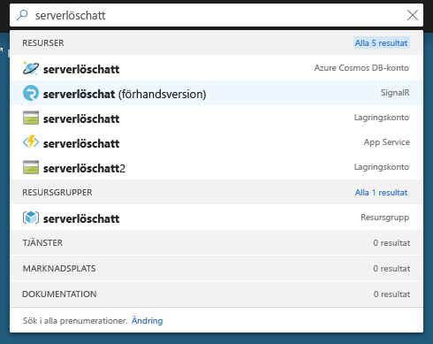
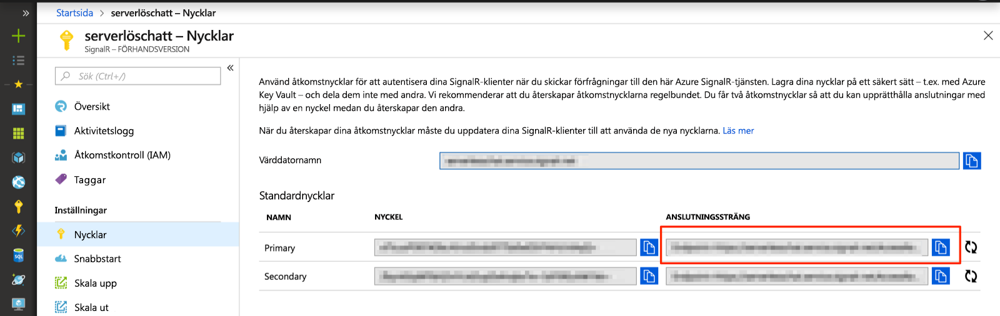

# <a name="quickstart-use-javascript-to-create-a-chat-room-with-azure-functions-and-signalr-service"></a>Snabb start: Använd Java Script för att skapa ett chattrum med Azure Functions-och signaler-tjänsten

Med Azure SignalR service kan du enkelt lägga till real tids funktioner i ditt program och Azure Functions är en plattform utan server som gör att du kan köra din kod utan att behöva hantera någon infrastruktur. I den här snabb starten använder du Java Script för att bygga ett Server lös chatt-program i real tid med hjälp av SignalR service och functions.

## <a name="prerequisites"></a>Förutsättningar

- En kod redigerare, till exempel [Visual Studio Code](https://code.visualstudio.com/)
- Ett Azure-konto med en aktiv prenumeration. [Skapa ett konto kostnads fritt](https://azure.microsoft.com/free/?ref=microsoft.com&utm_source=microsoft.com&utm_medium=docs&utm_campaign=visualstudio).
- [Azure Functions Core tools](https://github.com/Azure/azure-functions-core-tools#installing), version 2 eller senare. Används för att köra Azure Function Apps lokalt.
- [Node.js](https://nodejs.org/en/download/), version 10. x

   > [!NOTE]
   > Exemplen bör fungera tillsammans med andra versioner av Node.js. mer information finns i [dokumentationen för Azure Functions runtime-versioner](../azure-functions/functions-versions.md#languages) .

> [!NOTE]
> Den här snabbstarten kan köras på macOS, Windows eller Linux.

Har du problem? Prova [fel söknings guiden](signalr-howto-troubleshoot-guide.md) eller [berätta för oss](https://aka.ms/asrs/qsjs).

## <a name="log-in-to-azure"></a>Logga in på Azure

Logga in på Azure-portalen på <https://portal.azure.com/> med ditt Azure-konto.

Har du problem? Prova [fel söknings guiden](signalr-howto-troubleshoot-guide.md) eller [berätta för oss](https://aka.ms/asrs/qsjs).

[!INCLUDE [Create instance](includes/signalr-quickstart-create-instance.md)]

Har du problem? Prova [fel söknings guiden](signalr-howto-troubleshoot-guide.md) eller [berätta för oss](https://aka.ms/asrs/qsjs).

[!INCLUDE [Clone application](includes/signalr-quickstart-clone-application.md)]

Har du problem? Prova [fel söknings guiden](signalr-howto-troubleshoot-guide.md) eller [berätta för oss](https://aka.ms/asrs/qsjs).

## <a name="configure-and-run-the-azure-function-app"></a>Konfigurera och köra Azure Functions-appen

1. I den webbläsare där Azure-portalen är öppnad bekräftar du att den SignalR Service-instans som du distribuerade tidigare skapades korrekt genom att söka efter dess namn i sökrutan längst upp i portalen. Välj instansen för att öppna den.

    

1. Välj **Nycklar** för att visa anslutningssträngarna för SignalR Service-instansen.

1. Markera och kopiera den primära anslutningssträngen.

    

1. I kod redigeraren öppnar du mappen *src/Chat/JavaScript* i den klonade lagrings platsen.

1. Byt namn på *local.settings.sample.json* till *local.settings.json*.

1. I **local.settings.json** klistrar du in anslutningssträngen i värdet för inställningen **AzureSignalRConnectionString**. Spara filen.

1. JavaScript-funktioner är ordnade i mappar. Det finns två filer i varje mapp: *function.json* definierar de bindningar som används i funktionen, och *index.js* är brödtexten till funktionen. Det finns två HTTP-utlösta funktioner i den här funktionsappen:

    - **negotiate** (förhandla) – använder indatabindningen *SignalRConnectionInfo* för att skapa och returnera giltig anslutningsinformation.
    - **messages** (meddelanden) – tar emot ett chattmeddelande i begärandetexten och använder utdatabindningen *SignalR* för att skicka meddelandet till alla anslutna klientprogram.

1. I terminalen ser du till att du är i mappen *src/Chat/Java Script* . Kör funktionsappen.

    ```bash
    func start
    ```

    
    
Har du problem? Prova [fel söknings guiden](signalr-howto-troubleshoot-guide.md) eller [berätta för oss](https://aka.ms/asrs/qsjs).

[!INCLUDE [Run web application](includes/signalr-quickstart-run-web-application.md)]

Har du problem? Prova [fel söknings guiden](signalr-howto-troubleshoot-guide.md) eller [berätta för oss](https://aka.ms/asrs/qsjs).

[!INCLUDE [Cleanup](includes/signalr-quickstart-cleanup.md)]

Har du problem? Prova [fel söknings guiden](signalr-howto-troubleshoot-guide.md) eller [berätta för oss](https://aka.ms/asrs/qsjs).

## <a name="next-steps"></a>Nästa steg

I den här snabb starten har du skapat och kört ett program utan server i real tid i VS Code. Som nästa steg ska du lära dig mer om hur du distribuerar Azure Functions via VS Code.

> [!div class="nextstepaction"]
> [Distribuera Azure Functions med VS Code](/azure/developer/javascript/tutorial-vscode-serverless-node-01)

