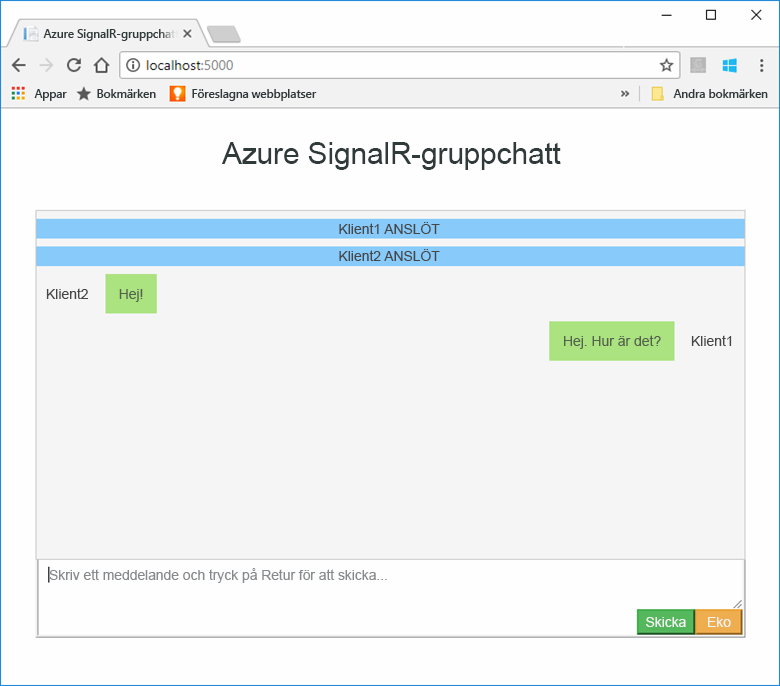
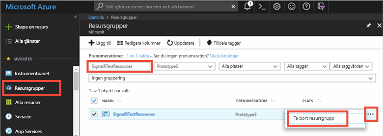

# <a name="quickstart-create-a-chat-room-with-signalr-service"></a>Snabbstart: Skapa ett chattrum med SignalR Service


Azure SignalR Service är en Azure-tjänst som hjälper utvecklare att enkelt skapa webbappar med realtidsfunktioner. Den här tjänsten baseras på [SignalR för ASP.NET Core 2.0](https://docs.microsoft.com/aspnet/core/signalr/introduction).

Den här artikeln visar hur du kommer igång med Azure SignalR Service. I den här snabbstarten kommer du att skapa ett chattprogram med en ASP.NET Core MVC-webbapp. Den här appen skapar en anslutning till din Azure SignalR Service-resurs för att aktivera uppdateringar av innehåll i realtid. Du kommer att vara värd för webbprogrammet lokalt och ansluta med flera webbläsarklienter. Varje klient kommer att kunna skicka innehållsuppdateringar till alla andra klienter. 


Du kan använda valfritt kodredigeringsprogram för att slutföra stegen i den här snabbstarten. [Visual Studio Code](https://code.visualstudio.com/) är dock ett utmärkt alternativ som är tillgängligt på Windows-, macOS- och Linux-plattformar.

Koden för de här självstudierna är tillgänglig för nedladdning på [GitHub-lagringsplatsen för AzureSignalR-exempel](https://github.com/aspnet/AzureSignalR-samples/tree/master/samples/ChatRoom).  Du kan dessutom skapa Azure-resurserna som används i den här snabbstarten med [Skapa ett SignalR Service-skript](scripts/signalr-cli-create-service.md).



[!INCLUDE [quickstarts-free-trial-note](../../includes/quickstarts-free-trial-note.md)]


## <a name="prerequisites"></a>Nödvändiga komponenter

* Installera [.NET Core SDK](https://www.microsoft.com/net/download/windows)
* Ladda ned eller klona [GitHub-lagringsplatsen för AzureSignalR-exempel](https://github.com/aspnet/AzureSignalR-samples). 

## <a name="create-an-azure-signalr-resource"></a>Skapa en Azure SignalR-resurs

[!INCLUDE [azure-signalr-create](../../includes/signalr-create.md)]

## <a name="create-an-aspnet-core-web-app"></a>Skapa en ASP.NET Core-webbapp

I det här avsnittet använder du [.NET Core-kommandoradsgränssnittet (CLI)](https://docs.microsoft.com/dotnet/core/tools/) för att skapa ett nytt ASP.NET Core MVC-webbapp-projekt. Fördelen med att använda .NET Core CLI istället för Visual Studio är att det finns tillgängligt för både Windows-, macOS- och Linux-plattformar. 

1. Skapa en ny mapp för ditt projekt. I den här snabbstarten används mappen *E:\Testing\chattest*.

2. Kör följande kommando i den nya mappen för att skapa ett nytt ASP.NET Core MVC-webbapp-projekt:

        dotnet new mvc


## <a name="add-secret-manager-to-the-project"></a>Lägg till Secret Manager i projektet

I det här avsnittet lägger du till [verktyget Secret Manager](https://docs.microsoft.com/aspnet/core/security/app-secrets) i projektet. Verktyget Secret Manager lagrar känsliga uppgifter för utvecklingsarbete utanför projektträdet. Den här metoden hjälper till att förhindra oavsiktlig delning av apphemligheter i källkoden.

1. Öppna *.csproj*-filen. Lägg till ett `DotNetCliToolReference`-element att inkludera *Microsoft.Extensions.SecretManager.Tools*. Lägg också till ett `UserSecretsId`-elementet enligt nedan och spara filen.

    *chattest.csproj:*

    ```xml
    <Project Sdk="Microsoft.NET.Sdk.Web">
    <PropertyGroup>
        <TargetFramework>netcoreapp2.0</TargetFramework>
        <UserSecretsId>SignalRChatRoomEx</UserSecretsId>
    </PropertyGroup>
    <ItemGroup>
        <PackageReference Include="Microsoft.AspNetCore.All" Version="2.0.0" />
    </ItemGroup>
    <ItemGroup>
        <DotNetCliToolReference Include="Microsoft.VisualStudio.Web.CodeGeneration.Tools" Version="2.0.0" />
        <DotNetCliToolReference Include="Microsoft.Extensions.SecretManager.Tools" Version="2.0.0" />
    </ItemGroup>
    </Project>    
    ```

## <a name="add-azure-signalr-to-the-web-app"></a>Lägg till Azure SignalR till webbappen

1. Lägg till en referens till NuGet-paketet `Microsoft.Azure.SignalR` genom att köra följande kommando:

        dotnet add package Microsoft.Azure.SignalR -v 1.0.0-*

2. Kör följande kommando för att återställa paket för projektet.

        dotnet restore

3. Lägg till en hemlighet med namnet *Azure: SignalR:ConnectionString* till Secret Manager. 

    Den här hemligheten innehåller anslutningssträngen för åtkomst till din SignalR Service-resurs. *Azure: SignalR:ConnectionString* är den konfigurationsnyckel av standardtyp som SignalR letar efter för att upprätta en anslutning. Ersätt värdet i kommandot nedan med anslutningssträngen för din SignalR Service-resurs.

    Det här kommandot måste köras i samma katalog som *.csproj*-filen.

    ```
    dotnet user-secrets set Azure:SignalR:ConnectionString "Endpoint=<Your endpoint>;AccessKey=<Your access key>;"    
    ```

    Secret Manager används endast för testning av webbappen medan den hanteras lokalt. I senare självstudier kommer du att distribuera chattwebbappen till Azure. När webbappen har distribuerats till Azure, använder du en programsinställning istället för att lagra anslutningssträngen med Secret Manager.

    Du får tillgång till den här hemligheten med konfigurations-API:et. Ett kolon (:) fungerar i konfigurationsnamnet med API-konfigurationen på alla plattformar som stöds. Se dokumentationen om [konfiguration efter miljö](https://docs.microsoft.com/aspnet/core/fundamentals/configuration/index?tabs=basicconfiguration&view=aspnetcore-2.0#configuration-by-environment). 


4. Öppna *Startup.cs* och uppdatera `ConfigureServices`-metoden för att använda Azure SignalR Service genom att anropa metoden `services.AddSignalR().AddAzureSignalR()`:

    ```csharp
    public void ConfigureServices(IServiceCollection services)
    {
        services.AddMvc();
        services.AddSignalR().AddAzureSignalR();
    }
    ```

    Istället för att skicka en parameter till `AddAzureSignalR()`, använder den här koden konfigurationsnyckeln av standardtyp, *Azure: SignalR:ConnectionString*, för SignalR Service-resursens anslutningssträng.

5. Uppdatera även `Configure`-metoden i *Startup.cs* genom att ersätta anropet till `app.UseStaticFiles()` med följande kod och spara filen.

    ```csharp
    app.UseFileServer();
    app.UseAzureSignalR(routes =>
    {
        routes.MapHub<Chat>("/chat");
    });
    ```            

### <a name="add-a-hub-class"></a>Lägg till en hubbklass

I SignalR är en hubb en huvudkomponent som exponerar en uppsättning metoder som kan anropas från klienten. I det här avsnittet får du lära dig att definiera en hubbklass med en av två metoder: 

* `Broadcast`: Den här metoden sänder ett meddelande till alla klienter.
* `Echo`: Den här metoden skickar ett meddelande tillbaka till anroparen.

Båda metoderna använder det `Clients`-gränssnitt som tillhandahålls av ASP.NET Core SignalR SDK. Det här gränssnittet ger dig åtkomst till alla anslutna klienter, vilket gör det möjligt att skicka innehåll till dina klienter.

1. Lägg till en ny mapp med namnet *Hubb* i projektkatalogen. Lägg till en ny hubbkodfil med namnet *Chat.cs* i den nya mappen.

2. Lägg till följande kod i *Chat.cs* för att definiera hubbklassen och spara filen. 

    Uppdatera namnområdet för den här klassen om du har använt ett projektnamn som skiljer sig åt från *chattest*.

    ```csharp
    using Microsoft.AspNetCore.SignalR;

    namespace chattest
    {

        public class Chat : Hub
        {
            public void BroadcastMessage(string name, string message)
            {
                Clients.All.SendAsync("broadcastMessage", name, message);
            }

            public void Echo(string name, string message)
            {
                Clients.Client(Context.ConnectionId).SendAsync("echo", name, message + " (echo from server)");
            }
        }
    }
    ```

### <a name="add-the-web-app-client-interface"></a>Lägg till webbappens klientgränssnitt

Klientens användargränssnitt för den här chattrumsappen består av HTML och JavaScript i en fil med namnet *index.html* i katalogen *wwwroot*.

Kopiera filen *index.html* och *css*- och *skript*-mapparna från *wwwroot*-mappen på [lagringsplatsen för exempel ](https://github.com/aspnet/AzureSignalR-samples/tree/master/samples/ChatRoom/wwwroot) till ditt projekts *wwwroot*-mapp.

Huvudkoden för *index.html*: 

```javascript
var connection = new signalR.HubConnectionBuilder()
                            .withUrl('/chat')
                            .build();
bindConnectionMessage(connection);
connection.start()
    .then(function () {
        onConnected(connection);
    })
    .catch(function (error) {
        console.error(error.message);
    });
```    

Koden i *index.html* anropar `HubConnectionBuilder.build()` för att upprätta en HTTP-anslutning till Azure SignalR-resursen.

Om anslutningen lyckas skickas anslutningen till `bindConnectionMessage` som lägger till händelsehanterare för inkommande innehåll som skickas till klienten. 

`HubConnection.start()` startar kommunikationen med hubben. När kommunikation har startat lägger `onConnected()` till knapphändelsehanterarna. Dessa hanterare använder anslutningen för att klientens ska kunna skicka innehållsuppdateringar till alla anslutna klienter.

## <a name="add-a-development-runtime-profile"></a>Lägg till en körningsprofil för utveckling

I det här avsnittet kommer du att lägga till en körningsmiljö för utveckling för ASP.NET Core. Mer information om körningsmiljö för ASP.NET Core finns i [Arbeta med flera miljöer i ASP.NET Core](https://docs.microsoft.com/aspnet/core/fundamentals/environments).

1. Skapa en ny mapp i projektet med namnet *Egenskaper*.

2. Lägg till en ny fil med namnet *launchSettings.json* till mappen med följande innehåll och spara filen.

    ```json
    {
        "profiles" : 
        {
            "ChatRoom": 
            {
                "commandName": "Project",
                "launchBrowser": true,
                "environmentVariables": 
                {
                    "ASPNETCORE_ENVIRONMENT": "Development"
                },
                "applicationUrl": "http://localhost:5000/"
            }
        }
    }
    ```


## <a name="build-and-run-the-app-locally"></a>Skapa och kör appen lokalt

1. För att skapa en appversion med .NET Core CLI, kör du följande kommando i kommandogränssnittet:

        dotnet build

2. När versionen har slutförts, kör du följande kommando för att köra webbappen lokalt:

        dotnet run

    Appen kommer att hanteras lokalt på port 5000 enligt konfigurationen i vår körningsprofil för utveckling:

        E:\Testing\chattest>dotnet run
        Hosting environment: Development
        Content root path: E:\Testing\chattest
        Now listening on: http://localhost:5000
        Application started. Press Ctrl+C to shut down.    

3. Starta två webbläsarfönster och navigera till `http://localhost:5000` i båda webbläsarna. Du uppmanas att ange ditt namn. Ange ett klientnamn för både klienterna och testa att skicka meddelandeinnehåll mellan båda klienterna med **Skicka**-knappen.

    


## <a name="clean-up-resources"></a>Rensa resurser

Om du ska fortsätta till nästa självstudie kan du behålla resurserna som du har skapat i den här självstudien och använda dem igen i nästa självstudie.

Om du är klar med exempelappen för snabbstart kan du ta bort Azure-resurserna som du skapade i snabbstarten för att undvika kostnader. 

> [!IMPORTANT]
> Det går inte att ångra borttagningen av en resursgrupp och resursgruppen och alla resurser i den tas bort permanent. Kontrollera att du inte av misstag tar bort fel resursgrupp eller resurser. Om du har skapat resurserna som värd för det här exemplet i en befintlig resursgrupp som innehåller resurser som du vill behålla, kan du ta bort varje resurs separat från deras respektive blad istället för att ta bort resursgruppen.
> 
> 

Logga in på [Azure Portal](https://portal.azure.com) och klicka på **Resursgrupper**.

Skriv namnet på din resursgrupp i textrutan **Filtrera efter namn...**. Anvisningarna för den här snabbstarten använde en resursgrupp med namnet *SignalRTestResources*. På din resursgrupp i resultatlistan klickar du på **...** och därefter **Ta bort resursgrupp**.

   



Du blir ombedd att bekräfta borttagningen av resursgruppen. Skriv namnet på din resursgrupp för att bekräfta och klicka på **Ta bort**.
   
Efter en liten stund tas resursgruppen och resurser som finns i den bort.


## <a name="next-steps"></a>Nästa steg

I den här snabbstarten har du skapat en ny Azure SignalR Service-resurs och använt den med en ASP.NET Core-webbapp för att skicka innehållsuppdateringar i realtid till flera anslutna klienter. Om du vill veta mer om hur man använder Azure SignalR Service fortsätter du till nästa självstudie som visar hur autentisering går till.

> [!div class="nextstepaction"]
> [Azure SignalR Service-autentisering](./signalr-authenticate-oauth.md)


