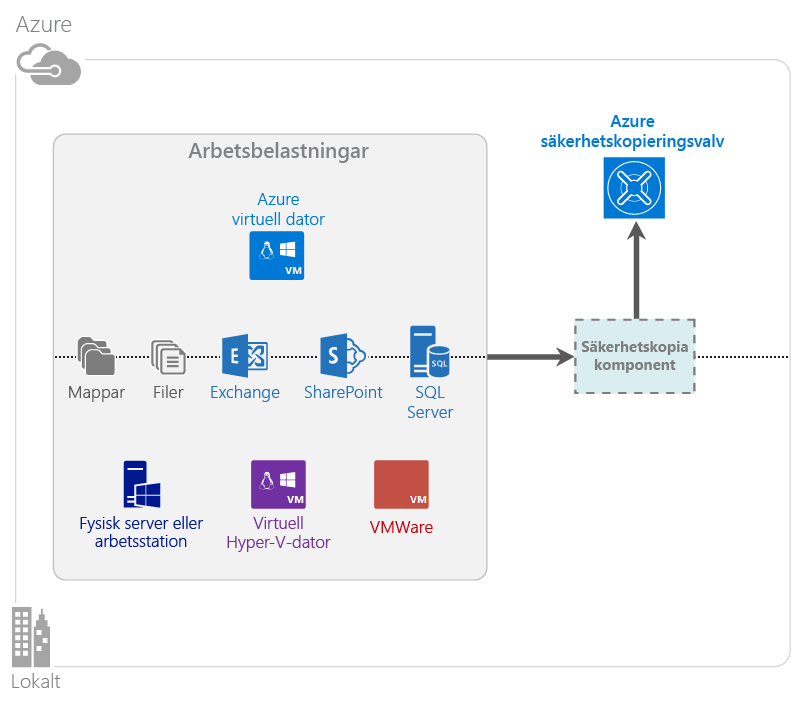

<properties
    pageTitle="Vad är Azure Backup? | Microsoft Azure"
    description="Du kan säkerhetskopiera och återställa data och program från Windows-servrar, Windows-klientdatorer, System Center DPM-servrar och virtuella datorer i Azure med Azure Backup och Recovery Services."
    services="backup"
    documentationCenter=""
    authors="markgalioto"
    manager="cfreeman"
    editor="tysonn"
    keywords="säkerhetskopiering och återställning, återställningstjänster, lösningar för säkerhetskopiering"/>

<tags
    ms.service="backup"
    ms.workload="storage-backup-recovery"
    ms.tgt_pltfrm="na"
    ms.devlang="na"
    ms.topic="get-started-article"
    ms.date="07/21/2016"
    ms.author="jimpark; trinadhk"/>

# Vad är Azure Backup?
Azure Backup är den tjänst som du använder för att säkerhetskopiera och återställa data i Microsoft-molnet. Din befintliga lokala eller externa säkerhetskopieringslösning ersätts av en tillförlitlig och säker molnbaserad lösning med ett konkurrenskraftigt pris. Tjänsten skyddar också tillgångar som körs i molnet. Azure Backup tillhandahåller återställningstjänster som bygger på en förstklassiga infrastruktur som är skalbar och hållbar med hög tillgänglighet.

[Titta på en videoöversikt över Azure Backup](https://azure.microsoft.com/documentation/videos/what-is-azure-backup/)

## Varför ska jag använda Azure Backup?
Traditionella säkerhetskopieringslösningar har utvecklats att behandla molnet som en slutpunkt liknande diskar eller band. Den här metoden är enkelt, men den är också begränsad. Den drar inte full nytta av en underliggande molnplattform och är därför en ineffektiv och dyr lösning.
Azure Backup erbjuder däremot alla fördelar med en kraftfull och prisvärd lösning för säkerhetskopiering i molnet. Här är några av de viktigaste fördelarna med Azure Backup.

| Funktion | Fördelar |
| ------- | ------- |
| Automatisk lagringshantering | Inga investeringar krävs för lokala lagringsenheter. Azure Backup allokerar och hanterar lagringen av säkerhetskopiorna automatiskt och tillämpar en användningsmodell där du betalar baserat på din användning. |
| Obegränsad skalning | Dra nytta av hög tillgänglighet utan att bekymra dig om underhåll och övervakning. Azure Backup använder den underliggande kraften och skalningsmöjligheterna i Azure-molnet, med dess sömlösa funktioner för automatisk skalning. |
| Flera lagringsalternativ | Välj lagring av säkerhetskopior baserat på behov:<li>En lokalt redundant blockblob för lagring är idealiskt för prismedvetna kunder och skyddar fortfarande dina data mot lokala maskinvarufel. <li>Med en blockblob för lagring med geo-replikering har du ytterligare tre kopior i ett parat datacenter. Dessa ytterligare kopior säkerställer att dina säkerhetskopierade data har hög tillgänglighet, även i händelse av haveri på en Azure-plats. |
| Obegränsad dataöverföring | Utgående dataöverföringar (egress) under en återställning från Backup-valvet kostar inget. Ingående datatrafik till Azure är också gratis. Fungerar med importtjänsten om den är tillgänglig. |
| Datakryptering | Datakryptering möjliggör säker överföring och lagring av kunddata i det offentliga molnet. Krypteringslösenfrasen lagras på källan och överförs eller lagras aldrig i Azure. Krypteringsnyckeln krävs för att återställa data och endast kunden har fullständig åtkomst till data i tjänsten. |  
| Programkonsekvent säkerhetskopiering | Med programkonsekvent säkerhetskopiering i Windows krävs inga korrigeringar vid tidpunkten för en återställning, vilket minskar återställningstiden. Detta gör att kunder snabbare kan återgå till körningsläge. |
| Långsiktig kvarhållning | I stället för att betala för externa lösningar för säkerhetskopiering på band kan kunder säkerhetskopiera till Azure, som erbjuder en intressant bandliknande lösning till låg kostnad. |

## Azure Backup-komponenter
Eftersom Backup är en hybridlösning för säkerhetskopiering består tjänsten av flera komponenter som arbetar tillsammans för att aktivera arbetsflöden för säkerhetskopiering och återställning från slutpunkt till slutpunkt.

### Distributionsscenarier

| Komponent | Kan den distribueras i Azure? | Kan den distribuerade lokalt? | Mållagring som stöds|
| --- | --- | --- | --- |
| Azure Backup-agent | 
**Ja**
 
Azure Backup-agenten kan distribueras på virtuella datorer med Windows som körs i Azure.
 | 
**Ja**
 
Backup-agenten kan distribueras på virtuella datorer med Windows Server eller en fysisk dator.
 | 
Azure Backup-valv
 |
| System Center Data Protection Manager (DPM) | 
**Ja**

Lär dig mer om [hur du skyddar arbetsbelastningar i Azure med hjälp av System Center DPM](http://blogs.technet.com/b/dpm/archive/2014/09/02/azure-iaas-workload-protection-using-data-protection-manager.aspx).
 | 
**Ja**
 
Lär dig mer om [hur du skyddar arbetsbelastningar och virtuella datorer i ditt datacenter](https://technet.microsoft.com/library/hh758173.aspx).
 | 
Lokalt ansluten disk,
 
Azure Backup-valvet,
 
band (endast lokalt)
 |
| Azure Backup Server | 
**Ja**

Lär dig mer om [hur du skyddar arbetsbelastningar i Azure med Azure Backup Server](backup-azure-microsoft-azure-backup.md).
 | 
**Ja**
 
Lär dig mer om [hur du skyddar arbetsbelastningar i Azure med Azure Backup Server](backup-azure-microsoft-azure-backup.md).
 | 
Lokalt ansluten disk,
 
Azure Backup-valv
 |
| Azure Backup (VM-tillägg) | 
**Ja**

En del av Azure-infrastrukturen

Specialiserad för [säkerhetskopiering av virtuella Iaas-datorer (Infrastructure as a Service) i Azure](backup-azure-vms-introduction.md).
 | 
**Nej**
 
Använd System Center DPM för att säkerhetskopiera virtuella datorer i datacentret.
 | 
Azure Backup-valv
 |

### Fördelar och begränsningar på komponentnivå

| Komponent | Fördelar | Begränsningar | Återställningsprecision |
| --- | --- | --- | --- |
| Azure Backup-agent (MARS) | <li>Kan säkerhetskopiera filer och mappar på en dator med Windows-operativsystem, både fysiska och virtuella datorer (virtuella datorer kan finnas var som helst lokalt eller i Azure)<li>Ingen separat säkerhetskopieringsserver krävs<li>Använder Azure Backup-valv | <li>Återställning tre gånger om dagen på säkerhetskopie-/filnivå<li>Endast återställning på fil-/mapp-/volymnivå, inte programmedveten<li>Inget stöd för Linux | filer/mappar/volymer |
| System Center Data Protection Manager | <li>Appmedvetna ögonblicksbilder (VSS)<li>Fullständig flexibilitet när du vill skapa säkerhetskopior<li>Återställningsprecision (allt)<li>Kan använda Azure Backup-valv<li>Linux-stöd (om den finns på Hyper-V) | <li>Inget heterogent stöd (säkerhetskopiering av virtuella datorer med VMware, säkerhetskopiering av Oracle-arbetsbelastningar).  | filer/mappar/volymer /virtuella datorer/program |
| Microsoft Azure Backup Server | <li>Appmedvetna ögonblicksbilder (VSS)<li>Fullständig flexibilitet när du vill skapa säkerhetskopior<li>Återställningsprecision (allt)<li>Kan använda Azure Backup-valv<li>Linux-stöd (om den finns på Hyper-V)<li>Kräver inte en System Center-licens | <li>Inget heterogent stöd (säkerhetskopiering av virtuella datorer med VMware, säkerhetskopiering av Oracle-arbetsbelastningar).<li>Kräver alltid en aktiv Azure-prenumeration<li>Inget stöd för säkerhetskopiering på band | filer/mappar/volymer /virtuella datorer/program |
| Säkerhetskopiering av virtuella IaaS-datorer i Azure | <li>Interna säkerhetskopieringar för Windows/Linux<li>Ingen specifik agentinstallation krävs<li>Säkerhetskopiering på infrastrukturnivå utan behov av en infrastruktur för säkerhetskopiering | <li>Återställning på säkerhetskopie-/disknivå en gång om dagen<li>Det går inte att säkerhetskopiera lokalt | Virtuella datorer Alla diskar (med PowerShell) |

## Vilka program och arbetsbelastningar kan säkerhetskopieras?

| Arbetsbelastning | Källdator | Azure Backup-lösning |
| --- | --- |---|
| Filer och mappar | Windows Server | 
[Azure Backup-agent](backup-configure-vault.md),
 
[System Center DPM](backup-azure-dpm-introduction.md) (+ Azure Backup-agenten),
 
[Azure Backup Server](backup-azure-microsoft-azure-backup.md) (Azure Backup-agenten ingår)
  |
| Filer och mappar | Windows-klient | 
[Azure Backup-agent](backup-configure-vault.md),
 
[System Center DPM](backup-azure-dpm-introduction.md) (+ Azure Backup-agenten),
 
[Azure Backup Server](backup-azure-microsoft-azure-backup.md) (Azure Backup-agenten ingår)
  |
| Virtuell Hyper-V-dator (Windows) | Windows Server | 
[System Center DPM](backup-azure-backup-sql.md) (+ Azure Backup-agenten),
 
[Azure Backup Server](backup-azure-microsoft-azure-backup.md) (Azure Backup-agenten ingår)
 |
| Virtuell Hyper-V-dator (Linux) | Windows Server | 
[System Center DPM](backup-azure-backup-sql.md) (+ Azure Backup-agenten),
 
[Azure Backup Server](backup-azure-microsoft-azure-backup.md) (Azure Backup-agenten ingår)
  |
| Microsoft SQL Server | Windows Server | 
[System Center DPM](backup-azure-backup-sql.md) (+ Azure Backup-agenten),
 
[Azure Backup Server](backup-azure-microsoft-azure-backup.md) (Azure Backup-agenten ingår)
  |
| Microsoft SharePoint | Windows Server | 
[System Center DPM](backup-azure-backup-sql.md) (+ Azure Backup-agenten),
 
[Azure Backup Server](backup-azure-microsoft-azure-backup.md) (Azure Backup-agenten ingår)
   |
| Microsoft Exchange |  Windows Server | 
[System Center DPM](backup-azure-backup-sql.md) (+ Azure Backup-agenten),
 
[Azure Backup Server](backup-azure-microsoft-azure-backup.md) (Azure Backup-agenten ingår)
   |
| Virtuella IaaS-datorer i Azure (Windows) | - | [Azure Backup (VM-tillägg)](backup-azure-vms-introduction.md) |
| Virtuella IaaS-datorer i Azure (Linux) | - | [Azure Backup (VM-tillägg)](backup-azure-vms-introduction.md) |

## ARM- och Linux-stöd

| Komponent | ARM-stöd | Linux-stöd (Azure-godkänt) |
| --- | --- | --- |
| Azure Backup-agent (MARS) | Ja | Nej (endast Windows-baserad agent) |
| System Center Data Protection Manager | Ja (agent i gäst) | Endast Hyper-V (inte Azure-VM): Endast filkonsekvent säkerhetskopiering stöds |
| Azure Backup Server (MABS) | Ja (agent i gäst) | Endast Hyper-V (inte Azure-VM): Endast filkonsekvent säkerhetskopiering stöds (samma som DPM) |
| Säkerhetskopiering av virtuella IaaS-datorer i Azure | Ja | Ja |

[AZURE.INCLUDE [learn-about-deployment-models](../../includes/learn-about-deployment-models-include.md)]

## Säkerhetskopiera och återställa virtuella datorer i Premium Storage

Nu skyddar Azure Backup-tjänsten virtuella datorer i Premium Storage.

### Säkerhetskopiera virtuella datorer i Premium Storage

När du säkerhetskopierar virtuella datorer i Premium Storage skapar Backup-tjänsten en tillfällig mellanlagringsplats i Premium Storage-kontot. Mellanlagringsplatsen, som har namnet ”AzureBackup-”, motsvarar den totala datastorleken på premium-diskarna som är kopplade till den virtuella datorn.

>[AZURE.NOTE] Ändra inte mellanlagringsplatsen.

När säkerhetskopieringen är klar tas mellanlagringsplatsen bort. Priset för lagringen som används för mellanlagringsplatsen följer [prissättningen för Premium-lagring](../storage/storage-premium-storage.md#pricing-and-billing).

### Återställa virtuella datorer i Premium Storage

Virtuell dator för Premium Storage VM kan återställas till antingen Premium Storage-lagring eller normal lagring. I en typisk återställningsprocess återställs en återställningspunkt för virtuella datorer i Premium Storage till Premium Storage. Det kan dock vara kostnadseffektivt att återställa en återställningspunkt för virtuella datorer i Premium Storage till standardlagring. Den här typen av återställning kan vara praktisk om du behöver en delmängd av filerna från den virtuella datorn.

## Funktioner
Dessa fem tabeller sammanfattar hur säkerhetskopieringsfunktionerna hanteras i varje komponent.

### Lagring

| Funktion | Azure Backup-agent | System Center DPM | Azure Backup Server | Azure Backup (VM-tillägg) |
| ------- | --- | --- | --- | ---- |
| Azure Backup-valv | ![Ja][green] | ![Ja][green] | ![Ja][green] | ![Ja][green] |
| Disklagring | | ![Ja][green] | ![Ja][green] |  |
| Bandlagring | | ![Ja][green] |  | |
| Komprimering (i säkerhetskopieringsvalv) | ![Ja][green] | ![Ja][green]| ![Ja][green] | |
| Inkrementell säkerhetskopiering | ![Ja][green] | ![Ja][green] | ![Ja][green] | ![Ja][green] |
| Diskdeduplicering | | ![Delvis][yellow] | ![Delvis][yellow]| | |

Backup-valvet är det prioriterade lagringsmålet i alla komponenter. Med System Center DPM och Backup Server kan du också välja att kopiera en lokal disk. Dock kan du endast skriva data till en bandlagringsenhet med System Center DPM.

#### Inkrementell säkerhetskopiering
Alla komponenter stöder inkrementell säkerhetskopiering oavsett mållagring (disk, band eller säkerhetskopieringsvalv). Inkrementell säkerhetskopiering ser till att säkerhetskopieringarna är lagrings- och tidseffektiva genom att endast överföra de ändringar som gjorts sedan den senaste säkerhetskopieringen.

#### Komprimering
Säkerhetskopior komprimeras för att minska lagringsutrymmet som krävs. Den enda komponenten som inte använder komprimering är VM-tillägget. Med VM-tillägget kopieras alla säkerhetskopieringsdata från kundens lagringskonto till säkerhetskopieringsvalvet i samma region utan att de komprimeras. Lagringsutrymmet som används ökar något när ingen komprimering används, men återställningen går snabbare.

#### Deduplicering
Deduplicering stöds för System Center DPM och Backup Server när det [distribueras på en virtuell Hyper-V-dator](http://blogs.technet.com/b/dpm/archive/2015/01/06/deduplication-of-dpm-storage-reduce-dpm-storage-consumption.aspx). Deduplicering utförs på värdnivån med hjälp av Windows Server-deduplicering på virtuella hårddiskar (VHD) som är kopplade till den virtuella datorn som lagringsutrymme för säkerhetskopior.

>[AZURE.WARNING] Deduplicering är inte tillgängligt i Azure för någon av Backup-komponenterna. Om System Center DPM och Backup Server distribueras i Azure går det inte att deduplicera lagringsdiskarna som är kopplade till den virtuella datorn.

### Säkerhet

| Funktion | Azure Backup-agent | System Center DPM | Azure Backup Server | Azure Backup (VM-tillägg) |
| ------- | --- | --- | --- | ---- |
| Nätverkssäkerhet (till Azure) | ![Ja][green] |![Ja][green] | ![Ja][green] | ![Delvis][yellow]|
| Datasäkerhet (i Azure) | ![Ja][green] |![Ja][green] | ![Ja][green] | ![Delvis][yellow]|

All säkerhetskopieringstrafik från dina servrar till Backup-valvet krypteras med hjälp av Advanced Encryption Standard 256. Data skickas via en säker HTTPS-anslutning. Säkerhetskopierade data lagras också i Backup-valvet i krypterad form. Endast kunden har tillgång till lösenfrasen som krävs för att låsa upp dessa data. Microsoft kan aldrig dekryptera säkerhetskopierade data.

>[AZURE.WARNING] Nyckeln som används för att kryptera säkerhetskopierade data finns endast hos kunden. Microsoft sparar ingen kopia i Azure och har inte åtkomst till nyckeln. Om du tappar bort nyckeln kan inte Microsoft återställa dina säkerhetskopierade data.

Säkerhetskopieringen av virtuella datorer i Azure kräver krypteringsinställningar *på* den virtuella datorn. Använd BitLocker på virtuella Windows-datorer och **dm crypt** på virtuella Linux-datorer. Azure Backup krypterar inte automatiskt säkerhetskopieringsdata som finns på den här sökvägen.

### Arbetsbelastningar som stöds

| Funktion | Azure Backup-agent | System Center DPM | Azure Backup Server | Azure Backup (VM-tillägg) |
| ------- | --- | --- | --- | ---- |
| Windows Server-dator – filer och mappar | ![Ja][green] | ![Ja][green] | ![Ja][green] | |
| Windows-klientdator – filer och mappar | ![Ja][green] | ![Ja][green] | ![Ja][green] | |
| Virtuell Hyper-V-dator (Windows) | | ![Ja][green] | ![Ja][green] | |
| Virtuell Hyper-V-dator (Linux) | | ![Ja][green] | ![Ja][green] | |
| Microsoft SQL Server | | ![Ja][green] | ![Ja][green] | |
| Microsoft SharePoint | | ![Ja][green] | ![Ja][green] | |
| Microsoft Exchange  | | ![Ja][green] | ![Ja][green] | |
| Virtuell Azure-dator (Windows) | | | | ![Ja][green] |
| Virtuell Azure-dator (Linux) | | | | ![Ja][green] |

### Nätverk

| Funktion | Azure Backup-agent | System Center DPM | Azure Backup Server | Azure Backup (VM-tillägg) |
| ------- | --- | --- | --- | ---- |
| Nätverkskomprimering (till säkerhetskopieringsservern) | | ![Ja][green] | ![Ja][green] | |
| Nätverkskomprimering (till säkerhetskopieringsvalvet) | ![Ja][green] | ![Ja][green] | ![Ja][green] | |
| Nätverksprotokoll (till säkerhetskopieringsservern) | | TCP | TCP | |
| Nätverksprotokoll (till säkerhetskopieringsvalvet) | HTTPS | HTTPS | HTTPS | HTTPS |

Eftersom VM-tillägget läser data direkt från Azure-lagringskontot i lagringsnätverket behöver du inte optimera den här trafiken. Trafiken sker via det lokala lagringsnätverket i Azure-datacentret så komprimeringsbehovet är litet med avseende på nätverksbandbredden.

Om du säkerhetskopierar data till en sekundär server (DPM eller säkerhetskopieringsserver) kan trafik från den primära servern till säkerhetskopieringsservern komprimeras för att spara bandbredd.

#### Nätverksbegränsningar
Azure Backup-agenten tillhandahåller en funktion för bandbreddsbegränsning som du kan använda för att styra hur nätverksbandbredden används under dataöverföringar. Begränsning kan vara användbart om du behöver säkerhetskopiera data under arbetstid, men inte vill att säkerhetskopieringsprocessen ska störa annan Internettrafik. Begränsningar av dataöverföringar gäller säkerhetskopierings- och återställningsaktiviteter.

### Säkerhetskopiering och kvarhållning

|  | Azure Backup-agent | System Center DPM | Azure Backup Server | Azure Backup (VM-tillägg) |
| --- | --- | --- | --- | --- |
| Säkerhetskopieringsfrekvens (till säkerhetskopieringsvalvet) | Tre säkerhetskopieringar om dagen | Två säkerhetskopieringar om dagen |Två säkerhetskopieringar om dagen | En säkerhetskopiering om dagen |
| Säkerhetskopieringsfrekvens (till disk) | Inte tillämpligt | 
Varje kvart för SQL Server
 
Varje timme för andra arbetsbelastningar
 | 
Varje kvart för SQL Server
 
Varje timme för andra arbetsbelastningar
 |Inte tillämpligt |
| Kvarhållningsalternativ | Varje dag, varje vecka, varje månad, varje år | Varje dag, varje vecka, varje månad, varje år | Varje dag, varje vecka, varje månad, varje år |Varje dag, varje vecka, varje månad, varje år |
| Kvarhållningsperiod | Upp till 99 år | Upp till 99 år | Upp till 99 år | Upp till 99 år |
| Återställningspunkter i Backup-valv | Obegränsat | Obegränsat | Obegränsat | Obegränsat |
| Återställningspunkter på lokal disk | Inte tillämpligt | 64 för filservrar,  448 för programservrar | 64 för filservrar,  448 för programservrar |Inte tillämpligt |
| Återställningspunkter på band | Inte tillämpligt | Obegränsat | Inte tillämpligt | Inte tillämpligt |

## Vad är valvautentiseringsfilen?

Valvautentiseringsfilen är ett certifikat som genereras av portalen för varje säkerhetskopieringsvalv. Portalen överför sedan den offentliga nyckeln till Access Control Service (ACS). Den privata nyckeln tillhandahålls till användaren när autentiseringsuppgifterna laddas ned och anges sedan när datorn registreras. Den privata nyckeln autentiserar datorn för att skicka säkerhetskopierade data till ett identifierat valv i Azure Backup-tjänsten.

Valvautentiseringen används endast under registreringsarbetsflödet. Det är ditt ansvar att se till att valvautentiseringsfilen inte komprometteras. Om den hamnar i händerna på en obehörig användare kan valvautentiseringsfilen användas för att registrera andra datorer mot samma valv. Men eftersom säkerhetskopierade data krypteras med en lösenfras som endast tillhör kunden, kan inte befintliga säkerhetskopierade data komprometteras. För att minimera det här problemet är autentiseringsuppgifterna för valvet konfigurerade så att de bara gäller i 48 timmar. Du kan ladda ned autentiseringsuppgifter för ett säkerhetskopieringsvalv valfritt antal gånger, men endast den senaste filen gäller under arbetsflödesregistreringen.

## Vad är skillnaden mellan Azure Backup och Azure Site Recovery?
Många kunder förväxlar säkerhetskopiering och haveriberedskap. Båda samlar in data och tillhandahåller återställningssemantik, men deras huvudsakliga tillämpning skiljer sig åt.

Azure Backup säkerhetskopierar data lokalt och i molnet. Azure Site Recovery samordnar replikeringen på virtuella datorer och fysiska servrar, redundans och återställning. Båda tjänsterna är viktiga eftersom en haveriberedskapslösning måste skydda dina data, se till att de kan återställas (säkerhetskopiering) *och* säkerställa att arbetsbelastningarna förblir tillgängliga (Site Recovery) i händelse av avbrott.

Följande begrepp hjälper dig att fatta viktiga beslut om säkerhetskopiering och haveriberedskap.

| Begrepp | Information | Säkerhetskopiering | Haveriberedskap |
| ------- | ------- | ------ | ----------------- |
| Mål för återställningspunkt (RPO) | Mängden godtagbar dataförlust om en återställning krävs. | Säkerhetskopieringslösningar har stor variation vad gäller deras godtagbara återställningspunktmål. Säkerhetskopieringar av virtuella datorer har vanligtvis ett återställningspunktmål på en dag, medan säkerhetskopieringar av databaser har återställningspunktmål på så lite som 15 minuter. | Lösningar för haveriberedskap har låga återställningspunktmål. Kopian för haveriberedskap kan ligga några få sekunder eller minuter efter. |
| Mål för återställningstid (RTO) | Hur lång tid det tar att slutföra en återställning. | På grund av det större återställningspunktmålet är mängden data som en säkerhetskopieringslösning behöver bearbeta normalt mycket högre, vilket leder till längre mål för återställningstid. Det kan till exempel ta dagar att återställa data från band, beroende på hur lång tid det tar att överföra bandet från den externa platsen. | Lösningar för haveriberedskap har mindre mål för återställningstid eftersom de är mer synkroniserade med källan. Färre ändringar behöver bearbetas. |
| Kvarhållning | Hur länge data ska lagras. | För scenarier som kräver driftåterställning (datafel, oavsiktlig filborttagning, operativsystemfel osv.) bevaras säkerhetskopierade data vanligtvis i 30 dagar eller mindre. Ur efterlevnadssynvinkel kanske data behöver sparas i flera månader eller till och med år. Säkerhetskopierade data är idealiska för arkivering i dessa fall. | Haveriberedskap kräver endast driftåterställningsdata, som normalt tar några timmar eller upp till en dag. På grund av den detaljerade datainsamlingen i lösningar för haveriberedskap rekommenderar vi inte att haveriberedskapsdata används för långsiktig kvarhållning. |

## Nästa steg

Prova en enkel Azure-säkerhetskopiering. Anvisningar finns i dessa självstudiekurser:

- [Prova Azure Backup](backup-try-azure-backup-in-10-mins.md)
- [Prova Azure VM Backup](backup-azure-vms-first-look.md)

Eftersom dessa självstudiekurser är avsedda att snabbt hjälpa dig att komma igång med säkerhetskopieringen beskriver de endast det mest direkta sättet att säkerhetskopiera data. Här finns mer information om de olika typerna av säkerhetskopiering:

- [Säkerhetskopiera Windows-datorer](backup-configure-vault.md)
- [Säkerhetskopiera programarbetsbelastningar](backup-azure-microsoft-azure-backup.md)
- [Säkerhetskopiera virtuella IaaS-datorer i Azure](backup-azure-vms-prepare.md)

[grön]: ./media/backup-introduction-to-azure-backup/green.png
[gul]: ./media/backup-introduction-to-azure-backup/yellow.png
[red]: ./media/backup-introduction-to-azure-backup/red.png

<!--HONumber=Sep16_HO3-->

